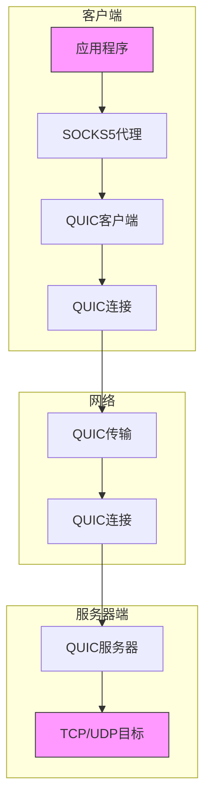
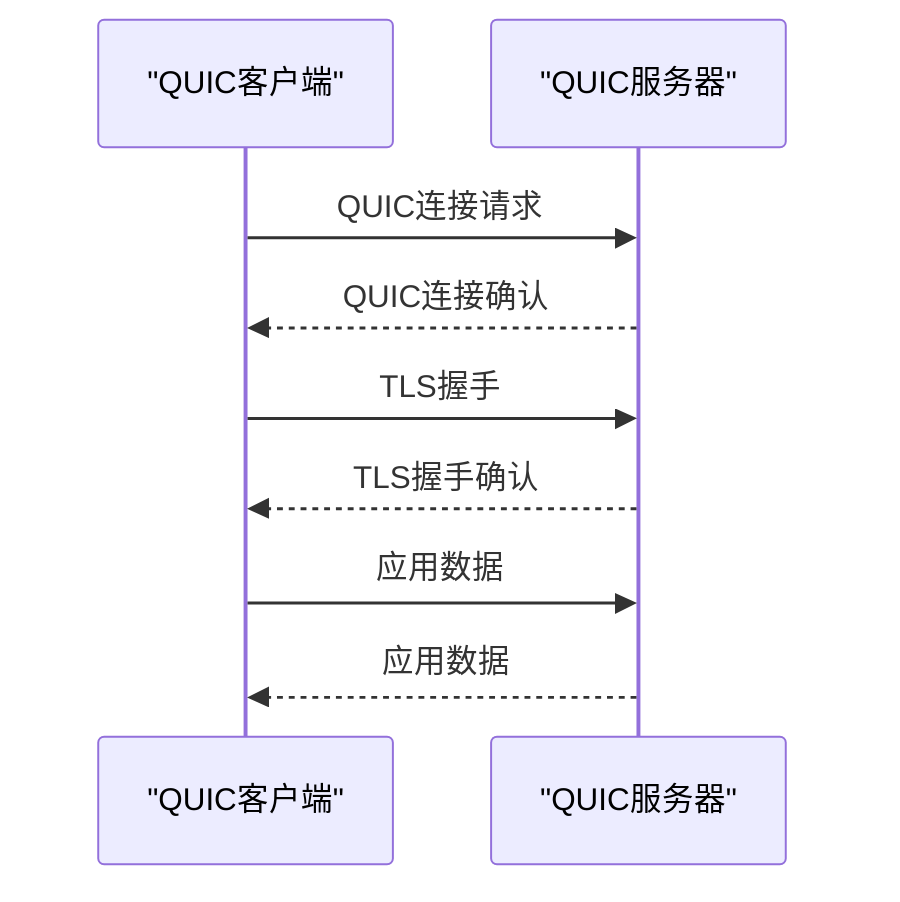
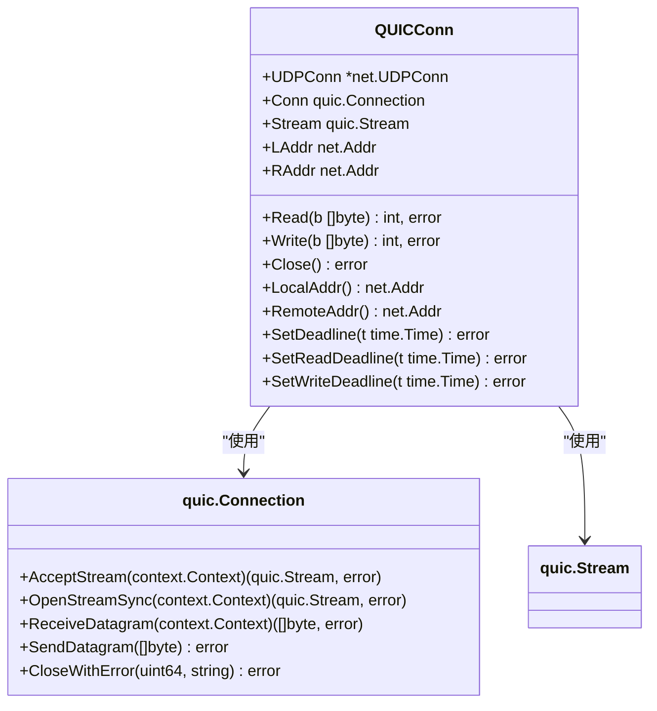
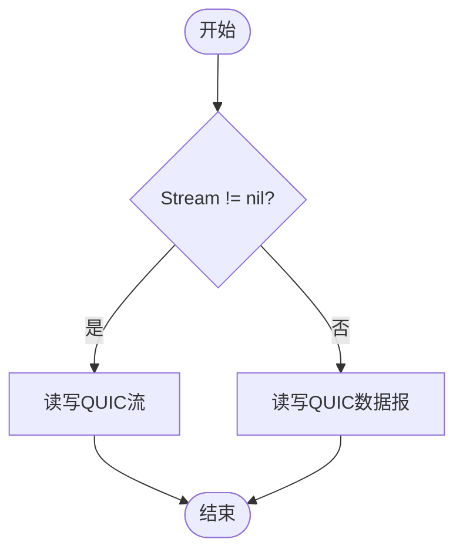

# Brook QUIC 协议

<cite>
**本文档引用文件**   
- [quic.go](file://quic.go)
- [quicserver.go](file://quicserver.go)
- [quicclient.go](file://quicclient.go)
- [streamclient.go](file://streamclient.go)
- [streamserver.go](file://streamserver.go)
- [packetclient.go](file://packetclient.go)
- [packetserver.go](file://packetserver.go)
- [go.mod](file://go.mod)
- [protocol/brook-quicserver-protocol.md](file://protocol/brook-quicserver-protocol.md)
</cite>

## 目录
1. [引言](#引言)
2. [QUIC协议架构](#quic协议架构)
3. [连接建立与认证](#连接建立与认证)
4. [流控制与多路复用](#流控制与多路复用)
5. [数据流与数据报处理](#数据流与数据报处理)
6. [会话密钥派生与加密](#会话密钥派生与加密)
7. [配置参数说明](#配置参数说明)
8. [性能调优建议](#性能调优建议)
9. [错误处理与调试](#错误处理与调试)
10. [结论](#结论)

## 引言

Brook QUIC协议是一种基于QUIC传输层的高效代理机制，利用QUIC协议的内置加密、低延迟和多路复用特性来提升代理性能。该协议通过`quic.go`、`quicserver.go`和`quicclient.go`三个核心文件实现，提供了TCP流和UDP数据报的代理功能。QUIC协议基于UDP，提供了类似TCP的可靠传输，同时避免了队头阻塞问题，并支持0-RTT连接恢复，显著降低了连接建立延迟。本文档详细阐述了Brook QUIC协议的技术细节，包括连接建立、流控制、多路复用、0-RTT恢复等核心特性，以及密码认证和会话密钥派生的过程。

**Section sources**
- [quic.go](file://quic.go#L1-L174)
- [quicserver.go](file://quicserver.go#L1-L277)
- [quicclient.go](file://quicclient.go#L1-L189)

## QUIC协议架构

Brook QUIC协议的架构分为客户端和服务器端两部分，通过QUIC协议实现安全的代理连接。客户端通过`QUICClient`结构体实现，服务器端通过`QUICServer`结构体实现。客户端作为SOCKS5代理服务器，接收本地应用程序的连接请求，然后通过QUIC连接将请求转发到远程服务器。服务器端监听QUIC连接，接收来自客户端的请求，并根据请求类型（TCP或UDP）进行处理。

**Diagram sources**
- [quicclient.go](file://quicclient.go#L29-L39)
- [quicserver.go](file://quicserver.go#L34-L45)

## 连接建立与认证

### QUIC连接建立

QUIC连接的建立由客户端发起，通过`QUICDialTCP`和`QUICDialUDP`函数实现。这两个函数都使用`quic.Dial`方法建立QUIC连接，区别在于`QUICDialTCP`会打开一个QUIC流用于TCP代理，而`QUICDialUDP`则直接使用QUIC数据报功能。连接建立时需要提供TLS配置，用于QUIC连接的加密和身份验证。

**Diagram sources**
- [quic.go](file://quic.go#L26-L99)
- [quic.go](file://quic.go#L56-L99)

### 密码认证

Brook QUIC协议使用密码进行客户端和服务器端的身份认证。密码在`NewQUICServer`和`NewQUICClient`函数中被处理，根据`withoutbrook`参数决定是否对密码进行SHA256哈希处理。如果`withoutbrook`为`true`，则使用原始密码；否则，使用SHA256哈希后的密码。这种设计提供了两种认证模式，增加了协议的灵活性。

**Section sources**
- [quicserver.go](file://quicserver.go#L47-L89)
- [quicclient.go](file://quicclient.go#L41-L89)

## 流控制与多路复用

### 流控制

QUIC协议内置了流控制机制，Brook QUIC协议利用这一特性来管理数据流。在`QUICConn`结构体中，`Stream`字段表示一个QUIC流，用于TCP代理。流控制通过QUIC协议的流控制窗口实现，客户端和服务器端会根据接收窗口的大小来调节数据发送速率，避免网络拥塞。

**Diagram sources**
- [quic.go](file://quic.go#L101-L107)
- [quic.go](file://quic.go#L109-L173)

### 多路复用

QUIC协议支持多路复用，即在同一个QUIC连接上同时传输多个数据流。Brook QUIC协议利用这一特性，可以在一个QUIC连接上同时处理多个TCP连接和UDP数据报。服务器端通过`AcceptStream`方法接受新的QUIC流，每个流对应一个TCP连接。对于UDP数据报，直接使用QUIC数据报功能，无需建立流。

**Section sources**
- [quicserver.go](file://quicserver.go#L125-L176)
- [quic.go](file://quic.go#L43-L47)

## 数据流与数据报处理

### TCP流处理

TCP流处理通过`QUICDialTCP`函数建立QUIC流，然后使用`QUICConn`结构体的`Read`和`Write`方法进行数据读写。`QUICConn`的`Read`和`Write`方法会根据`Stream`字段是否为`nil`来决定是读写QUIC流还是QUIC数据报。对于TCP流，`Stream`字段不为`nil`，因此`Read`和`Write`方法会直接操作QUIC流。

**Section sources**
- [quic.go](file://quic.go#L56-L99)
- [quic.go](file://quic.go#L109-L129)

### UDP数据报处理

UDP数据报处理通过`QUICDialUDP`函数建立QUIC连接，然后使用`QUICConn`结构体的`Read`和`Write`方法进行数据读写。对于UDP数据报，`Stream`字段为`nil`，因此`Read`和`Write`方法会调用`quic.Connection`的`ReceiveDatagram`和`SendDatagram`方法。QUIC数据报的最大长度为1197字节，这是由QUIC协议的MTU限制决定的。

**Diagram sources**
- [quic.go](file://quic.go#L26-L54)
- [quic.go](file://quic.go#L109-L129)

## 会话密钥派生与加密

### 会话密钥派生

Brook QUIC协议使用HKDF（HMAC-based Extract-and-Expand Key Derivation Function）进行会话密钥派生。在`NewStreamClient`和`NewStreamServer`函数中，使用客户端和服务器端的随机数（nonce）以及密码作为输入，通过HKDF生成会话密钥。会话密钥用于AES-GCM加密，确保数据传输的机密性和完整性。

**Section sources**
- [streamclient.go](file://streamclient.go#L47-L143)
- [streamserver.go](file://streamserver.go#L47-L151)

### 加密与解密

数据加密使用AES-GCM（Galois/Counter Mode）算法，这是一种认证加密模式，既能提供机密性，又能提供完整性保护。在`StreamClient`和`StreamServer`结构体中，`ca`和`sa`字段分别表示客户端和服务器端的AES-GCM加密器。数据在发送前使用`Seal`方法进行加密，在接收后使用`Open`方法进行解密。

**Section sources**
- [streamclient.go](file://streamclient.go#L179-L188)
- [streamserver.go](file://streamserver.go#L187-L196)

## 配置参数说明

### QUIC监听配置

QUIC服务器的监听配置通过`NewQUICServer`函数的参数进行设置，包括监听地址、密码、域名、TCP超时时间、UDP超时时间和是否使用Brook协议。监听地址指定服务器监听的IP地址和端口，密码用于客户端和服务器端的身份认证，域名用于TLS证书的验证。

**Section sources**
- [quicserver.go](file://quicserver.go#L47-L89)

### 超时策略

超时策略通过`tcpTimeout`和`udpTimeout`参数进行设置。TCP超时时间用于控制TCP连接的空闲超时，UDP超时时间用于控制UDP数据报的超时。超时时间设置为0表示不启用超时。

**Section sources**
- [quicserver.go](file://quicserver.go#L38-L40)
- [quicclient.go](file://quicclient.go#L35-L36)

### 并发流限制

并发流限制由QUIC协议本身控制，Brook QUIC协议没有额外的并发流限制。QUIC协议的流控制机制会自动调节并发流的数量，避免网络拥塞。

## 性能调优建议

### MTU优化

MTU（Maximum Transmission Unit）优化是提升QUIC性能的重要手段。由于QUIC数据报的最大长度为1197字节，建议将网络MTU设置为1200字节或更大，以避免IP分片。可以通过调整操作系统网络参数来优化MTU。

**Section sources**
- [protocol/brook-quicserver-protocol.md](file://protocol/brook-quicserver-protocol.md#L20-L25)

### 拥塞控制算法选择

QUIC协议支持多种拥塞控制算法，如Cubic、BBR等。建议根据网络环境选择合适的拥塞控制算法。对于高延迟、高丢包的网络环境，建议使用BBR算法；对于低延迟、低丢包的网络环境，建议使用Cubic算法。

## 错误处理与调试

### 错误处理

错误处理通过Go语言的`error`类型实现。在QUIC连接建立、数据读写等操作中，如果发生错误，会返回相应的`error`对象。客户端和服务器端需要检查`error`对象，并根据错误类型进行相应的处理。

**Section sources**
- [quic.go](file://quic.go#L35-L37)
- [quic.go](file://quic.go#L74-L76)

### 调试

调试可以通过日志输出和网络抓包进行。Brook QUIC协议在关键操作中会输出日志，如连接建立、数据读写等。可以通过分析日志来定位问题。此外，可以使用Wireshark等工具进行网络抓包，分析QUIC协议的数据包。

## 结论

Brook QUIC协议是一种基于QUIC传输层的高效代理机制，利用QUIC协议的内置加密、低延迟和多路复用特性来提升代理性能。通过`quic.go`、`quicserver.go`和`quicclient.go`三个核心文件实现，提供了TCP流和UDP数据报的代理功能。QUIC协议基于UDP，提供了类似TCP的可靠传输，同时避免了队头阻塞问题，并支持0-RTT连接恢复，显著降低了连接建立延迟。本文档详细阐述了Brook QUIC协议的技术细节，包括连接建立、流控制、多路复用、0-RTT恢复等核心特性，以及密码认证和会话密钥派生的过程。通过合理的配置和性能调优，可以充分发挥QUIC协议的优势，提供高效、安全的代理服务。