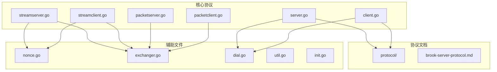
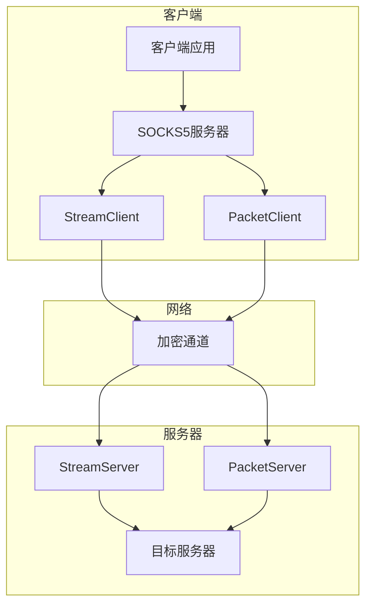
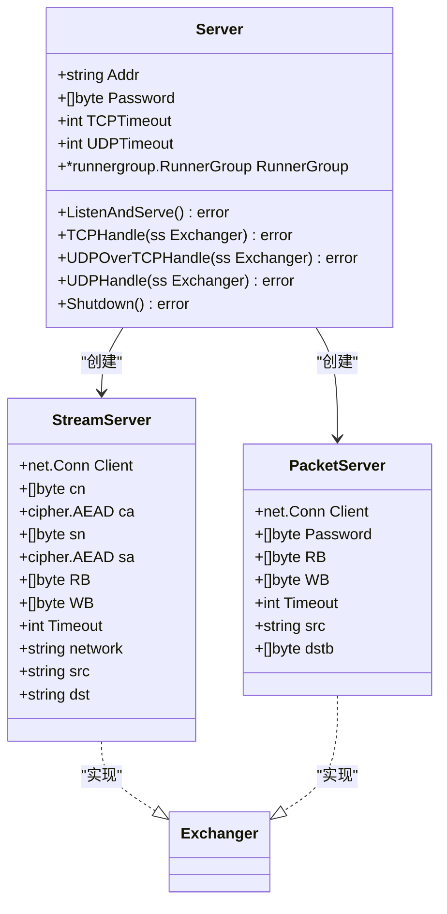
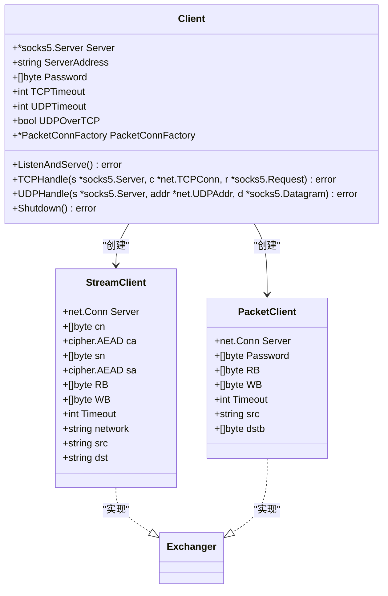
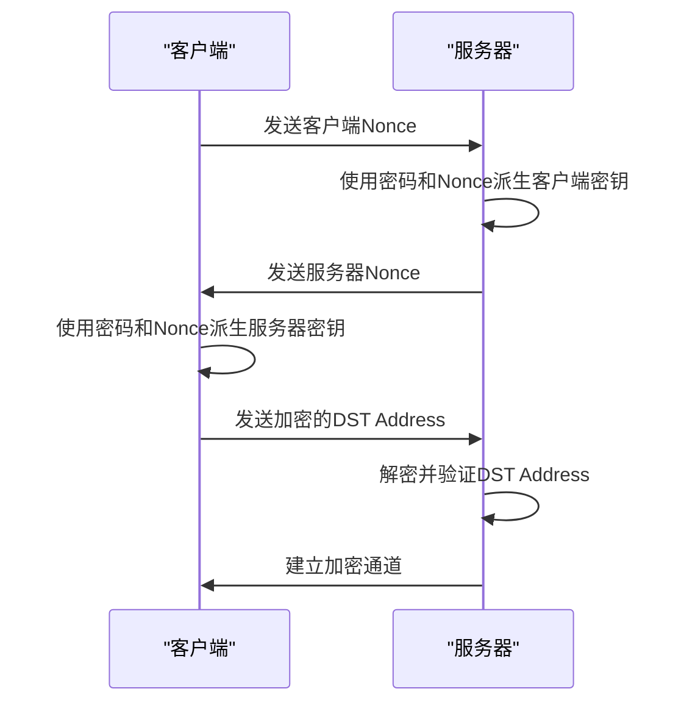
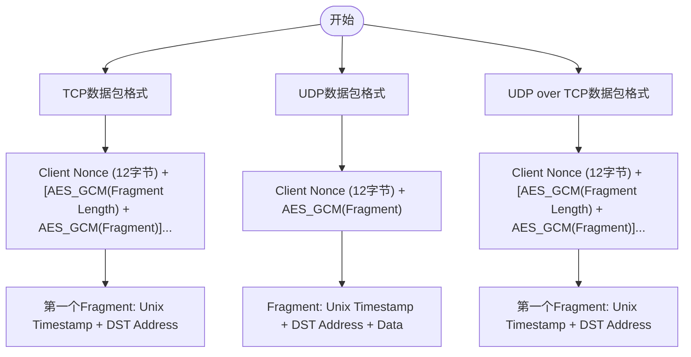
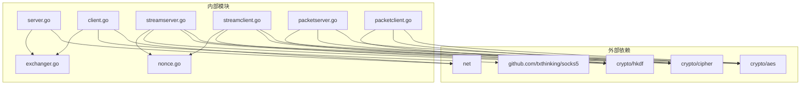

# Brook Server 协议

<cite>
**本文档中引用的文件**   
- [server.go](file://server.go)
- [client.go](file://client.go)
- [streamserver.go](file://streamserver.go)
- [streamclient.go](file://streamclient.go)
- [packetserver.go](file://packetserver.go)
- [packetclient.go](file://packetclient.go)
- [protocol/brook-server-protocol.md](file://protocol/brook-server-protocol.md)
- [nonce.go](file://nonce.go)
- [exchanger.go](file://exchanger.go)
- [dial.go](file://dial.go)
- [util.go](file://util.go)
- [init.go](file://init.go)
</cite>

## 目录
1. [简介](#简介)
2. [项目结构](#项目结构)
3. [核心组件](#核心组件)
4. [架构概述](#架构概述)
5. [详细组件分析](#详细组件分析)
6. [依赖分析](#依赖分析)
7. [性能考虑](#性能考虑)
8. [故障排除指南](#故障排除指南)
9. [结论](#结论)

## 简介
Brook Server 协议是一种安全的网络代理协议，旨在通过加密通道转发TCP和UDP流量。该协议使用密码进行身份验证和密钥协商，确保通信的安全性。客户端和服务器通过握手过程建立安全连接，然后通过加密的数据包交换数据。协议支持多种传输模式，包括TCP、UDP和UDP over TCP，并使用AES-GCM进行数据加密。

## 项目结构
项目结构清晰地分离了核心协议实现、插件系统和文档。核心协议文件位于根目录，包括server.go、client.go以及流和数据包处理相关的文件。协议规范文档位于protocol子目录中，提供了详细的协议说明。



**Diagram sources**
- [server.go](file://server.go)
- [client.go](file://client.go)
- [protocol/brook-server-protocol.md](file://protocol/brook-server-protocol.md)
- [exchanger.go](file://exchanger.go)
- [nonce.go](file://nonce.go)
- [dial.go](file://dial.go)

**Section sources**
- [server.go](file://server.go)
- [client.go](file://client.go)
- [protocol/brook-server-protocol.md](file://protocol/brook-server-protocol.md)

## 核心组件
Brook Server 协议的核心组件包括服务器端、客户端、流处理器和数据包处理器。服务器端负责监听连接并处理客户端请求，客户端负责与远程服务器建立连接并转发流量。流处理器处理TCP流量，数据包处理器处理UDP流量。所有组件都实现了Exchanger接口，确保了一致的交换行为。

**Section sources**
- [server.go](file://server.go#L25-L45)
- [client.go](file://client.go#L24-L32)
- [exchanger.go](file://exchanger.go#L21-L27)

## 架构概述
Brook Server 协议的架构基于客户端-服务器模型，使用加密通道传输数据。客户端首先与服务器建立连接，通过密码进行身份验证。一旦连接建立，客户端和服务器使用AES-GCM加密数据包，并通过nonce机制确保每个数据包的唯一性。协议支持TCP和UDP流量转发，以及UDP over TCP模式，以适应不同的网络环境。



**Diagram sources**
- [client.go](file://client.go)
- [server.go](file://server.go)
- [streamclient.go](file://streamclient.go)
- [streamserver.go](file://streamserver.go)
- [packetclient.go](file://packetclient.go)
- [packetserver.go](file://packetserver.go)

## 详细组件分析

### 服务器组件分析
服务器组件负责监听和处理客户端连接。NewServer函数创建一个新的服务器实例，接受监听地址、密码和超时设置作为参数。ListenAndServe方法启动服务器，分别监听TCP和UDP连接。TCP连接由StreamServer处理，UDP连接由PacketServer处理。



**Diagram sources**
- [server.go](file://server.go#L25-L178)
- [streamserver.go](file://streamserver.go#L33-L243)
- [packetserver.go](file://packetserver.go#L31-L124)

**Section sources**
- [server.go](file://server.go#L33-L45)
- [streamserver.go](file://streamserver.go#L47-L151)
- [packetserver.go](file://packetserver.go#L41-L47)

### 客户端组件分析
客户端组件负责与服务器建立连接并转发流量。NewClient函数创建一个新的客户端实例，接受本地地址、服务器地址、密码和超时设置作为参数。客户端实现SOCKS5服务器接口，接收本地应用的连接请求，并通过加密通道转发到远程服务器。



**Diagram sources**
- [client.go](file://client.go#L24-L144)
- [streamclient.go](file://streamclient.go#L33-L234)
- [packetclient.go](file://packetclient.go#L33-L155)

**Section sources**
- [client.go](file://client.go#L34-L51)
- [streamclient.go](file://streamclient.go#L47-L143)
- [packetclient.go](file://packetclient.go#L43-L49)

### 握手过程分析
Brook Server 协议的握手过程涉及客户端和服务器之间的密钥协商和身份验证。客户端首先生成一个随机的nonce，使用HKDF-SHA256从密码和nonce派生出AES密钥，然后将nonce发送给服务器。服务器使用相同的算法派生出相同的密钥，完成密钥协商。



**Diagram sources**
- [streamclient.go](file://streamclient.go#L58-L102)
- [streamserver.go](file://streamserver.go#L54-L100)
- [init.go](file://init.go#L17-L18)

**Section sources**
- [streamclient.go](file://streamclient.go#L58-L102)
- [streamserver.go](file://streamserver.go#L54-L100)

### 数据封装格式分析
Brook Server 协议的数据封装格式根据传输模式有所不同。对于TCP连接，数据包格式为"Client Nonce + [AES_GCM(Fragment Length) + AES_GCM(Fragment)]..."，其中第一个Fragment包含Unix时间戳和目标地址。对于UDP连接，数据包格式为"Client Nonce + AES_GCM(Fragment)"，其中Fragment包含Unix时间戳、目标地址和数据。



**Diagram sources**
- [protocol/brook-server-protocol.md](file://protocol/brook-server-protocol.md#L34-L127)
- [streamclient.go](file://streamclient.go#L95-L97)
- [packetclient.go](file://packetclient.go#L114-L115)

**Section sources**
- [protocol/brook-server-protocol.md](file://protocol/brook-server-protocol.md#L34-L127)

### 加密机制分析
Brook Server 协议使用AES-256-GCM进行数据加密，提供机密性和完整性保护。密钥通过HKDF-SHA256从用户密码和随机nonce派生，确保每个会话的密钥唯一性。nonce机制防止重放攻击，每个数据包使用递增的nonce值。

```mermaid
classDiagram
class Encryption {
+[]byte Password
+[]byte Nonce
+[]byte Info
+HKDF_SHA256(Password, Nonce, Info) KEY
+AES_GCM(KEY, Nonce, Data) Ciphertext
}
class Nonce {
+[]byte value
+NextNonce() void
}
Encryption --> Nonce : "使用"
Nonce -.-> Encryption : "递增"
```

**Diagram sources**
- [streamserver.go](file://streamserver.go#L59-L77)
- [streamclient.go](file://streamclient.go#L63-L85)
- [nonce.go](file://nonce.go#L19-L23)
- [init.go](file://init.go#L17-L18)

**Section sources**
- [streamserver.go](file://streamserver.go#L59-L77)
- [streamclient.go](file://streamclient.go#L63-L85)
- [nonce.go](file://nonce.go#L19-L23)

## 依赖分析
Brook Server 协议依赖于多个外部包和内部模块。主要依赖包括crypto/aes、crypto/cipher、crypto/hkdf用于加密操作，net包用于网络通信，以及github.com/txthinking/socks5用于SOCKS5协议支持。内部模块之间通过接口进行通信，确保了良好的解耦和可扩展性。



**Diagram sources**
- [go.mod](file://go.mod)
- [server.go](file://server.go#L17-L23)
- [client.go](file://client.go#L17-L22)
- [streamserver.go](file://streamserver.go#L17-L31)
- [streamclient.go](file://streamclient.go#L17-L31)
- [packetserver.go](file://packetserver.go#L17-L29)
- [packetclient.go](file://packetclient.go#L17-L31)

**Section sources**
- [go.mod](file://go.mod)
- [server.go](file://server.go#L17-L23)
- [client.go](file://client.go#L17-L22)

## 性能考虑
Brook Server 协议在设计时考虑了性能优化。通过使用预分配的缓冲区池(x.BP2048, x.BP65507)减少内存分配开销，提高性能。协议支持UDP over TCP模式，可以在UDP被限制的网络环境中使用。超时设置允许用户根据网络条件调整连接行为，避免资源浪费。

**Section sources**
- [streamserver.go](file://streamserver.go#L39-L40)
- [streamclient.go](file://streamclient.go#L39-L40)
- [packetserver.go](file://packetserver.go#L34-L35)
- [packetclient.go](file://packetclient.go#L36-L37)

## 故障排除指南
在使用Brook Server 协议时，可能会遇到连接失败、超时或加密错误等问题。检查密码是否正确，确保服务器地址和端口配置正确，验证网络连接是否正常。对于加密错误，检查nonce是否正确递增，确保客户端和服务器的HKDF Info配置一致。

**Section sources**
- [error.go](file://error.go)
- [log.go](file://log.go)
- [streamserver.go](file://streamserver.go#L89-L91)
- [streamclient.go](file://streamclient.go#L98-L101)

## 结论
Brook Server 协议提供了一个安全、高效的网络代理解决方案。通过密码进行身份验证和密钥协商，使用AES-GCM加密数据，确保通信的安全性。协议支持多种传输模式，适应不同的网络环境。清晰的架构和模块化设计使得协议易于理解和扩展。通过合理配置超时和缓冲区大小，可以在不同性能要求的场景中使用。