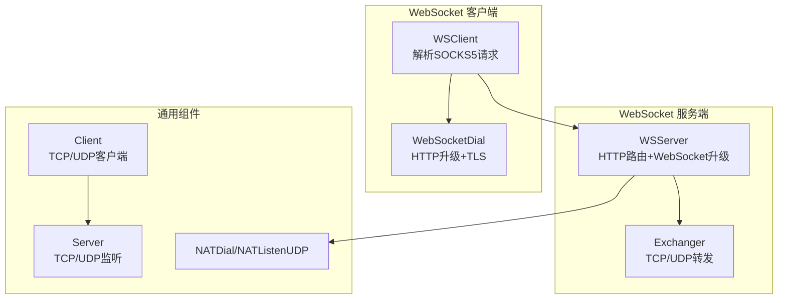
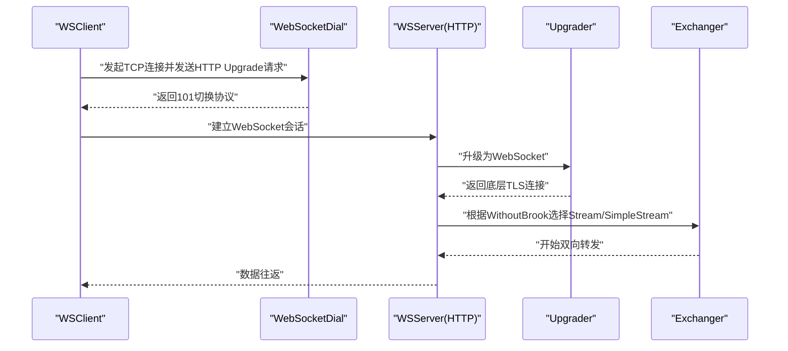
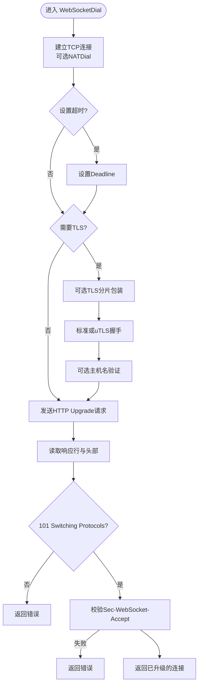
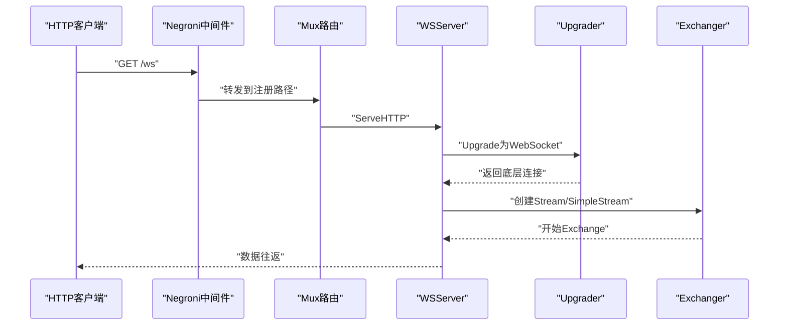
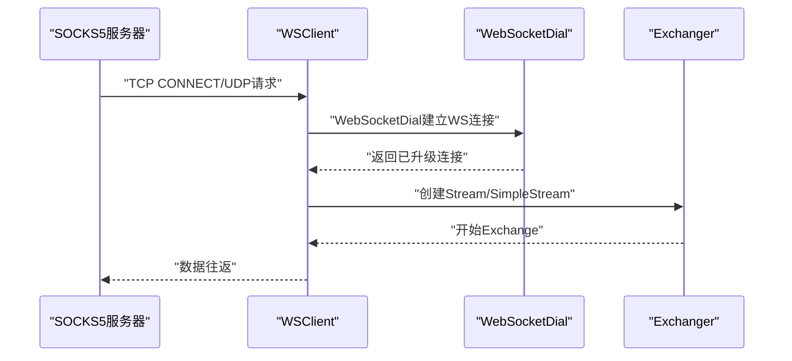
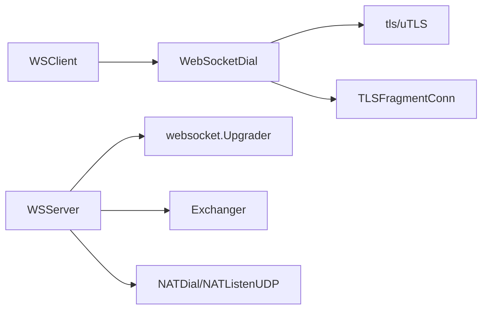

# Brook WebSocket 协议

<cite>
**本文引用的文件列表**
- [websocket.go](file://websocket.go)
- [wsserver.go](file://wsserver.go)
- [wsclient.go](file://wsclient.go)
- [server.go](file://server.go)
- [client.go](file://client.go)
- [brook-wsserver-protocol.md](file://protocol/brook-wsserver-protocol.md)
- [brook-wssserver-protocol.md](file://protocol/brook-wssserver-protocol.md)
- [nat.go](file://nat.go)
</cite>

## 目录
1. [简介](#简介)
2. [项目结构](#项目结构)
3. [核心组件](#核心组件)
4. [架构总览](#架构总览)
5. [详细组件分析](#详细组件分析)
6. [依赖关系分析](#依赖关系分析)
7. [性能考量](#性能考量)
8. [故障排查指南](#故障排查指南)
9. [结论](#结论)
10. [附录：示例与最佳实践](#附录示例与最佳实践)

## 简介
本文件面向希望深入理解 Brook 的 WebSocket 协议实现的读者，重点覆盖两类模式：
- wsserver：基于标准 HTTP 路由与 WebSocket 升级的服务端，支持 TCP/UDP 代理与可选的“无 Brook”模式。
- wsclient：基于 SOCKS5 入口的客户端，通过 WebSocket 连接服务端，支持 TCP 与 UDP（含 UDP over TCP）代理。

文档将从连接升级、帧封装/解封装、心跳与超时、TLS 加密集成、错误恢复策略等方面进行系统化解析，并给出部署与排障建议。

## 项目结构
围绕 WebSocket 的关键文件组织如下：
- websocket.go：通用 WebSocket 客户端握手流程、TLS 分片发送与 HTTP 头协商。
- wsserver.go：WSServer 服务端，负责路由、证书加载、WebSocket 升级、Exchanger 选择与转发。
- wsclient.go：WSClient 客户端，负责 SOCKS5 请求解析、WebSocket 握手、Exchanger 选择与转发。
- server.go、client.go：通用服务端/客户端框架，用于非 WebSocket 模式或 UDP over TCP 场景。
- protocol/brook-wsserver-protocol.md、brook-wssserver-protocol.md：协议规范与 WSServer/WSSServer 的关系说明。
- nat.go：NAT 辅助函数，为 UDP over TCP 提供源/目的地址映射与重用。

图表来源
- [wsclient.go](file://wsclient.go#L84-L179)
- [wsserver.go](file://wsserver.go#L70-L220)
- [websocket.go](file://websocket.go#L37-L171)
- [server.go](file://server.go#L47-L179)
- [client.go](file://client.go#L53-L144)
- [nat.go](file://nat.go#L52-L108)

章节来源
- [wsclient.go](file://wsclient.go#L1-L179)
- [wsserver.go](file://wsserver.go#L1-L220)
- [websocket.go](file://websocket.go#L1-L232)
- [server.go](file://server.go#L1-L179)
- [client.go](file://client.go#L1-L144)
- [nat.go](file://nat.go#L1-L108)

## 核心组件
- WebSocketDial：完成 TCP/TLS 握手、HTTP 升级、校验响应头（状态码与 Sec-WebSocket-Accept），返回已升级的 WebSocket 连接。
- WSServer：基于 Gorilla WebSocket 的 Upgrader，处理 GET 路由、X-Forwarded-For 解析、密码校验、Exchanger 选择与转发。
- WSClient：基于 SOCKS5 的入站代理，根据命令类型（CONNECT/UDP）构造目标地址，调用 WebSocketDial 并建立 Brook Exchanger。
- 协议规范：brook-wsserver-protocol.md 定义了帧封装格式（Nonce、时间戳、DST 地址、分片长度与内容）、最大分片大小与计数器递增规则；brook-wssserver-protocol.md 说明 WSSServer 是在 WSServer 基础上启用 TLS 的 HTTPS 服务。

章节来源
- [websocket.go](file://websocket.go#L37-L171)
- [wsserver.go](file://wsserver.go#L140-L216)
- [wsclient.go](file://wsclient.go#L84-L179)
- [brook-wsserver-protocol.md](file://protocol/brook-wsserver-protocol.md#L1-L96)
- [brook-wssserver-protocol.md](file://protocol/brook-wssserver-protocol.md#L1-L11)

## 架构总览
下图展示 wsserver 与 wsclient 的交互路径，以及与通用 Exchanger 的关系。

图表来源
- [wsclient.go](file://wsclient.go#L88-L135)
- [websocket.go](file://websocket.go#L37-L171)
- [wsserver.go](file://wsserver.go#L140-L216)

## 详细组件分析

### WebSocketDial：连接升级与握手
- 连接建立：根据是否提供 src/dst 参数决定使用普通 Dial 或 NATDial，支持设置超时截止时间。
- TLS 握手：若传入 tls.Config，则可选择标准 tls.Client 或基于 uTLS 的指纹伪装；可选启用 TLS 分片发送（TLSFragmentConn），按随机长度与延迟拆分 TLS 记录，提升指纹对抗能力。
- HTTP 升级：生成随机键值，拼装 GET /path、Host、Upgrade: websocket、Connection: Upgrade、Sec-WebSocket-Key、Sec-WebSocket-Version 等头部，写入后读取响应行与响应头，校验 101 状态码与 Sec-WebSocket-Accept。
- 主机名校验：当未跳过验证时，对 ServerName 进行主机名验证。

图表来源
- [websocket.go](file://websocket.go#L37-L171)

章节来源
- [websocket.go](file://websocket.go#L37-L171)

### WSServer：路由、证书与升级
- 路由与中间件：使用 Gorilla Mux 注册 GET 路径处理器，Negroni 中间件设置 Server 头、异常恢复。
- 证书加载：支持域名自动签发（Let’s Encrypt）、自定义证书对；未提供证书时启动 :80 HTTP-01 验证；提供证书时直接使用。
- WebSocket 升级：Upgrader 设置读写缓冲与跨域策略；升级成功后提取底层连接，解析 X-Forwarded-For 以修正远端地址。
- Exchanger 选择：根据 WithoutBrook 决定使用 StreamServer 或 SimpleStreamServer；随后根据网络类型（tcp/udp）调用对应处理方法。
- TCPHandle/UDPHandle：分别对接远端 TCP 或 UDP（含 NATDial），交由 Exchanger 执行双向交换。

图表来源
- [wsserver.go](file://wsserver.go#L70-L216)

章节来源
- [wsserver.go](file://wsserver.go#L1-L220)

### WSClient：SOCKS5 到 WebSocket 的桥接
- 初始化：解析服务端 URL，确定 Path，默认 “/ws”，根据 scheme 决定是否启用 TLS；根据 WithoutBrook 决定密码派生方式。
- TCPHandle：当收到 CONNECT 请求时，构造目标地址字节串，调用 WebSocketDial 建立 WebSocket 连接，随后创建 Stream/SimpleStream 客户端，发送本地地址信息，再执行双向交换。
- UDPHandle：将 UDP 数据包封装为 Brook 帧，通过 PacketConnFactory 维护会话；若首次到达则创建 PacketConn，否则复用；随后调用 WebSocketDial 建立 WebSocket 连接，创建 Stream/SimpleStream 客户端并交换数据。

图表来源
- [wsclient.go](file://wsclient.go#L88-L179)

章节来源
- [wsclient.go](file://wsclient.go#L1-L179)

### 帧封装与解封装（协议）
- 帧结构：标准 WebSocket 头部之后，包含 Nonce（12 字节）、若干分片（每个分片包含 Big Endian 16 位长度 + 实际数据）。首分片包含 Unix 时间戳（偶数调整）与 DST 地址（ATYP + IP/Domain + PORT）。
- 密钥与认证：使用 HKDF-SHA256 从 Password + Nonce + Info 派生对称密钥，采用 AES-GCM 进行分片加解密与完整性校验。
- 分片大小限制：TCP 路径单分片上限 2048 字节；UDP over TCP 路径首分片 2048，后续分片 65507；其他路径遵循 WebSocket 最大帧大小约束。
- 计数器递增：Nonce 在首次使用后按小端 64 位无符号整型递增，确保每会话唯一性与抗重放。

章节来源
- [brook-wsserver-protocol.md](file://protocol/brook-wsserver-protocol.md#L1-L96)

### 心跳与超时机制
- 超时设置：WebSocketDial 支持设置连接超时；各 Exchanger（如 SimplePacketServer）在读写循环中按需设置 Deadline，避免阻塞。
- 心跳：代码未显式实现 WebSocket Ping/Pong 心跳；实际保活依赖底层 TCP/UDP 超时与应用层空闲检测。建议在业务侧结合 KeepAlive 或定期发送轻量数据维持活跃。
- NAT 与 UDP over TCP：通过 NATDial/NATListenUDP 维持源/目的地址映射，减少 NAT 转换失效导致的丢包。

章节来源
- [websocket.go](file://websocket.go#L37-L171)
- [simplepacketserver.go](file://simplepacketserver.go#L45-L78)
- [nat.go](file://nat.go#L52-L108)

### TLS 加密与指纹伪装
- TLS 集成：WebSocketDial 支持标准 tls.Client 握手与 uTLS 指纹伪装；可选 TLSFragmentConn 对 TLS 记录进行分片与延迟，降低特征暴露。
- 服务端证书：WSServer 支持 Let’s Encrypt 自动签发与自定义证书；未提供证书时先启动 :80 验证，再以 TLS 启动 HTTPS。
- 指纹策略：当使用 Chrome 指纹时，ALPN 可设置为 "http/1.1" 以匹配常见站点行为。

章节来源
- [websocket.go](file://websocket.go#L55-L122)
- [wsserver.go](file://wsserver.go#L97-L138)

### 错误恢复策略
- 握手阶段：HTTP Upgrade 失败或 Accept 校验失败时立即关闭连接并返回错误；TLS 握手中断或主机名验证失败同样快速失败。
- 运行阶段：Exchanger 循环中读写失败即退出；服务端/客户端日志记录错误上下文（来源地址、目标地址等）便于定位。
- NAT 降级：NATDial 在特定系统错误时回退到无源/目的地址绑定的直连，提高可用性。

章节来源
- [websocket.go](file://websocket.go#L132-L171)
- [wsserver.go](file://wsserver.go#L148-L216)
- [client.go](file://client.go#L57-L94)
- [nat.go](file://nat.go#L52-L81)

## 依赖关系分析
- WSClient 依赖 WebSocketDial 完成 WebSocket 握手；依赖 SOCKS5 服务器解析请求。
- WSServer 依赖 Gorilla WebSocket Upgrader 完成协议升级；依赖 Exchanger 实现转发。
- WebSocketDial 依赖 TLS 库与可选 uTLS；可选 TLSFragmentConn 对 TLS 记录进行分片。
- NATDial/NATListenUDP 为 UDP over TCP 提供地址映射与重用。

图表来源
- [wsclient.go](file://wsclient.go#L84-L179)
- [wsserver.go](file://wsserver.go#L140-L216)
- [websocket.go](file://websocket.go#L37-L171)
- [nat.go](file://nat.go#L52-L108)

章节来源
- [wsclient.go](file://wsclient.go#L1-L179)
- [wsserver.go](file://wsserver.go#L1-L220)
- [websocket.go](file://websocket.go#L1-L232)
- [nat.go](file://nat.go#L1-L108)

## 性能考量
- TLS 分片：通过 TLSFragmentConn 将 TLS 记录拆分为随机长度片段并施加微秒级延迟，有助于降低指纹识别风险，但可能增加 CPU 与网络抖动。
- 分片大小：TCP 路径单分片 2048 字节，UDP over TCP 首分片 2048，后续 65507，有利于减少 MTU 相关问题，但需注意内存与带宽开销。
- 超时设置：合理设置 TCP/UDP 超时，避免长时间占用资源；在高并发场景建议缩短超时并配合重试策略。
- NAT 优化：优先使用 NATDial/NATListenUDP 减少端口冲突与重建成本。

[本节为通用指导，不直接分析具体文件]

## 故障排查指南
- 握手失败
  - 现象：返回 101 以外的状态码或 Sec-WebSocket-Accept 校验失败。
  - 排查：确认路径、Host、Key 生成与校验逻辑；检查服务端路由是否正确。
  - 参考
    - [websocket.go](file://websocket.go#L132-L171)
- TLS 握手失败
  - 现象：证书链错误、主机名不匹配、指纹不被接受。
  - 排查：确认证书/私钥、域名、ALPN 设置；必要时启用 uTLS 指纹伪装。
  - 参考
    - [websocket.go](file://websocket.go#L55-L122)
    - [wsserver.go](file://wsserver.go#L97-L138)
- 超时与连接中断
  - 现象：读写操作因超时返回；NAT 转换失效导致丢包。
  - 排查：适当增大超时；检查 NATDial 回退逻辑；关注系统资源限制。
  - 参考
    - [websocket.go](file://websocket.go#L37-L86)
    - [simplepacketserver.go](file://simplepacketserver.go#L45-L78)
    - [nat.go](file://nat.go#L52-L108)
- 路由与路径
  - 现象：访问 404 或未命中 WebSocket 升级。
  - 排查：确认 Mux 路径与服务端初始化参数一致。
  - 参考
    - [wsserver.go](file://wsserver.go#L70-L85)

章节来源
- [websocket.go](file://websocket.go#L37-L171)
- [wsserver.go](file://wsserver.go#L70-L138)
- [simplepacketserver.go](file://simplepacketserver.go#L45-L78)
- [nat.go](file://nat.go#L52-L108)

## 结论
Brook 的 WebSocket 实现以标准 HTTP 升级为基础，结合 TLS 握手与可选指纹伪装，提供安全可靠的代理通道。服务端通过 WSServer 统一处理路由、证书与升级，客户端通过 WSClient 将 SOCKS5 请求桥接至 WebSocket。协议层面采用 AES-GCM 分片与 Nonce 计数器，兼顾安全性与性能。部署时应关注路径配置、证书管理与超时设置，结合 NAT 与分片策略提升稳定性与抗干扰能力。

[本节为总结性内容，不直接分析具体文件]

## 附录：示例与最佳实践

### 客户端与服务端通信示例（不含具体代码）
- 服务端
  - 初始化 WSServer，设置监听地址、密码、域名、路径、超时与 WithoutBrook 标志。
  - 若未提供证书，先启动 :80 验证，再以 TLS 启动 HTTPS。
  - 注册 GET 路由到 /ws，启用 Negroni 中间件。
  - 升级后根据 WithoutBrook 选择 Exchanger 类型，按网络类型调用 TCPHandle/UDPHandle。
  - 参考
    - [wsserver.go](file://wsserver.go#L46-L138)
    - [wsserver.go](file://wsserver.go#L140-L216)
- 客户端
  - 解析服务端 URL，确定 Path 默认 “/ws”，根据 scheme 决定是否启用 TLS。
  - TCP CONNECT：构造目标地址字节串，调用 WebSocketDial 建立连接，创建 Stream/SimpleStream 客户端并交换数据。
  - UDP：通过 PacketConnFactory 维护会话，调用 WebSocketDial 建立连接，创建 Stream/SimpleStream 客户端并交换数据。
  - 参考
    - [wsclient.go](file://wsclient.go#L41-L83)
    - [wsclient.go](file://wsclient.go#L88-L179)

### HTTP 头处理、路径路由与代理链
- HTTP 头：客户端在 Upgrade 请求中设置 Host、Upgrade、Connection、Sec-WebSocket-Key、Sec-WebSocket-Version；服务端校验 101 与 Accept。
- 路径路由：服务端使用 Mux 将 GET /ws 映射到 WSServer，未命中返回 404。
- 代理链：WSClient -> WebSocketDial -> WSServer -> Exchanger -> 远端 TCP/UDP。
- 参考
  - [websocket.go](file://websocket.go#L132-L171)
  - [wsserver.go](file://wsserver.go#L70-L85)
  - [wsserver.go](file://wsserver.go#L140-L216)

### TLS 配置差异（普通 WebSocket vs WSS）
- 普通 WebSocket（ws://）
  - 仅 HTTP 升级，无需证书。
  - 参考
    - [wsserver.go](file://wsserver.go#L70-L96)
- 安全 WebSocket（wss://）
  - 需要证书或自动签发；服务端以 TLS 启动 HTTPS。
  - 客户端根据 URL scheme 自动设置 TLSConfig（含 ServerName、ALPN）。
  - 参考
    - [wsserver.go](file://wsserver.go#L97-L138)
    - [wsclient.go](file://wsclient.go#L74-L82)

### 常见部署问题与解决方案
- 404 未命中路由
  - 检查 Mux 路径与服务端初始化参数一致。
  - 参考
    - [wsserver.go](file://wsserver.go#L70-L85)
- 证书签发失败
  - 确认域名可解析且 :80 可用；检查邮箱与 HostPolicy。
  - 参考
    - [wsserver.go](file://wsserver.go#L97-L138)
- 握手失败或主机名不匹配
  - 校验证书链、域名与 ServerName；必要时启用 uTLS 指纹。
  - 参考
    - [websocket.go](file://websocket.go#L55-L122)
- NAT 转换失效
  - 使用 NATDial/NATListenUDP；关注系统资源限制。
  - 参考
    - [nat.go](file://nat.go#L52-L108)

章节来源
- [wsserver.go](file://wsserver.go#L70-L138)
- [wsclient.go](file://wsclient.go#L74-L82)
- [websocket.go](file://websocket.go#L55-L122)
- [nat.go](file://nat.go#L52-L108)