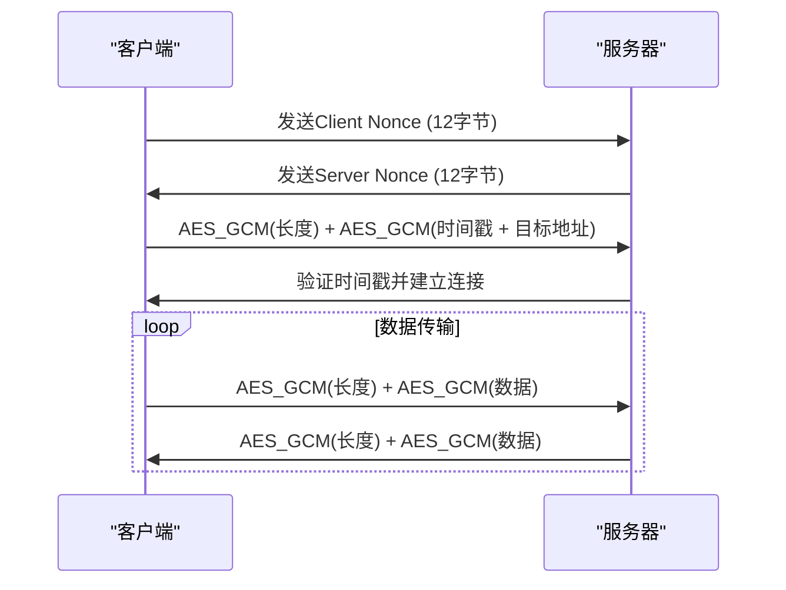
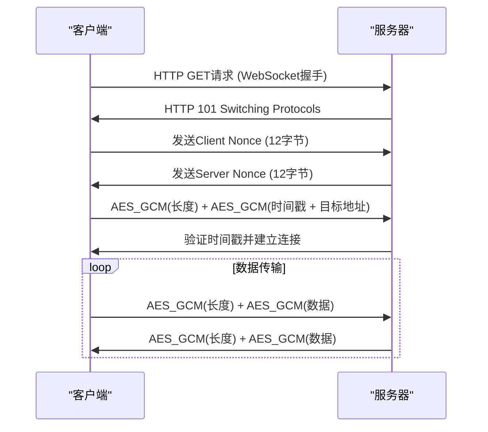
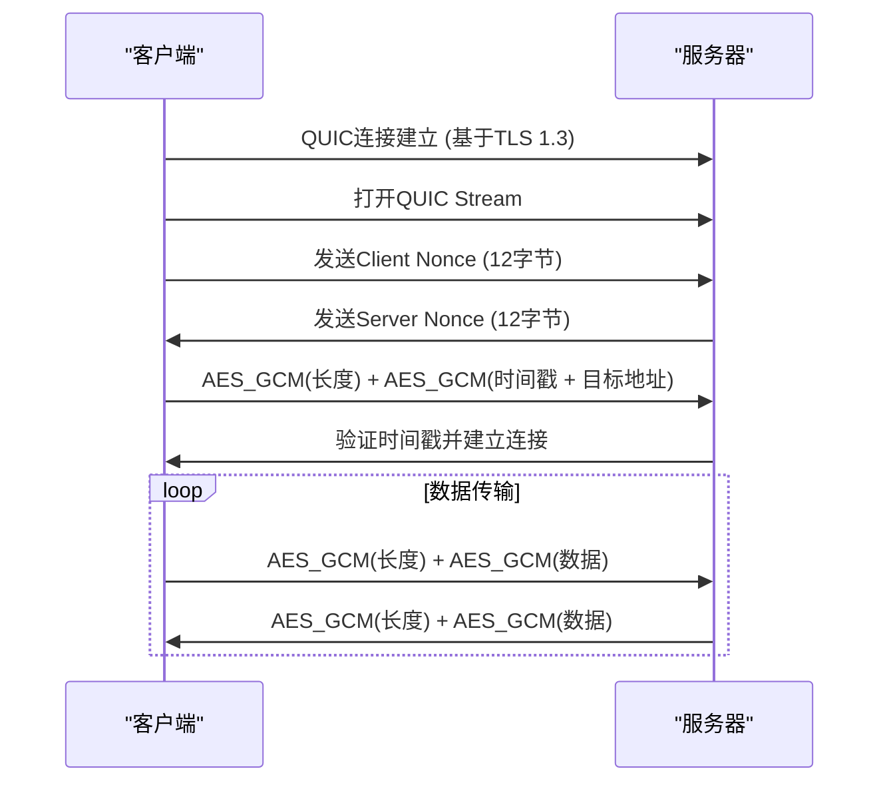

# 协议规范

<cite>
**本文档引用的文件**
- [brook-link-protocol.md](file://protocol/brook-link-protocol.md)
- [brook-server-protocol.md](file://protocol/brook-server-protocol.md)
- [brook-wsserver-protocol.md](file://protocol/brook-wsserver-protocol.md)
- [brook-quicserver-protocol.md](file://protocol/brook-quicserver-protocol.md)
- [brook-wssserver-protocol.md](file://protocol/brook-wssserver-protocol.md)
- [brooklink.go](file://brooklink.go)
- [link.go](file://link.go)
- [server.go](file://server.go)
- [websocket.go](file://websocket.go)
- [wsclient.go](file://wsclient.go)
- [wsserver.go](file://wsserver.go)
- [quic.go](file://quic.go)
- [quicclient.go](file://quicclient.go)
- [quicserver.go](file://quicserver.go)
- [streamclient.go](file://streamclient.go)
- [streamserver.go](file://streamserver.go)
</cite>

## 目录
1. [引言](#引言)
2. [Brook协议链接格式](#brook协议链接格式)
3. [Brook Server协议](#brook-server协议)
4. [WebSocket Server协议](#websocket-server协议)
5. [QUIC Server协议](#quic-server协议)
6. [安全特性](#安全特性)
7. [协议交互时序图](#协议交互时序图)

## 引言
Brook协议是一套用于代理服务的通信协议，支持多种传输方式，包括TCP、UDP、WebSocket和QUIC。本规范详细描述了各种Brook代理协议的技术细节，包括Brook Server、WebSocket Server和QUIC Server的工作机制、数据格式和安全特性。同时，本文档还解释了链接协议（brook link）的结构和生成方法，并提供了协议交互的时序图。

## Brook协议链接格式

Brook协议链接（brook link）是一种标准化的URL格式，用于配置和分享代理服务器连接信息。链接格式遵循特定的结构，包含协议类型、服务器地址和连接参数。

### 链接结构
Brook链接的基本格式如下：
```
brook://KIND?QUERY
```

其中：
- **KIND**: 链接类型，可以是 `server`、`wsserver`、`wssserver`、`socks5` 或 `quicserver`
- **QUERY**: 查询参数，采用key=value格式，所有参数值必须进行URL编码（RFC3986）

### 链接类型
不同的KIND值对应不同的代理服务器类型：
- `server`: 标准Brook服务器
- `wsserver`: WebSocket服务器
- `wssserver`: 带TLS加密的WebSocket服务器
- `socks5`: SOCKS5代理服务器
- `quicserver`: 基于QUIC协议的服务器

### 示例
以下是一个Brook Server链接的示例：
```
brook://server?password=hello&server=1.2.3.4%3A9999
```

**Section sources**
- [brook-link-protocol.md](file://protocol/brook-link-protocol.md)
- [brooklink.go](file://brooklink.go#L34-L147)
- [link.go](file://link.go#L22-L37)

## Brook Server协议

Brook Server协议是Brook代理系统的基础协议，定义了客户端与服务器之间的加密通信机制。该协议支持TCP和UDP两种传输方式，并通过AES-GCM加密确保通信安全。

### 术语定义
- **DST Address**: 目标地址，表示应用程序实际想要请求的地址，包含IP/域名和端口
  ```
  ATYP + IP/Domain + PORT
  ```
  - `ATYP`: 1字节，地址类型
    - 0x01: IPv4
    - 0x03: 域名
    - 0x04: IPv6
  - `IP/Domain`: 4/n/16字节，根据ATYP类型确定
  - `Port`: 2字节，大端序16位无符号整数

- **KEY**: AES密钥，32字节
  - `KEY`: HKDF_SHA256(Password, Nonce, Info)
    - `Password`: 用户定义的密码
    - `Nonce`: 12字节
    - `Info`: [0x62, 0x72, 0x6f, 0x6f, 0x6b]，可通过`brook link --clientHKDFInfo`和`brook link --serverHKDFInfo`覆盖

### TCP连接流程
#### 客户端到服务器
```
Client Nonce + [AES_GCM(Fragment Length) + AES_GCM(Fragment)]...
```
- `Client Nonce`: 12字节，随机生成
  - 非首次使用时，根据小端序64位无符号整数将前8字节加1重新计算
- `Fragment Length`: 大端序16位无符号整数
- `Fragment`: 实际代理数据
  - 第一个Fragment应为：
    ```
    Unix Timestamp + DST Address
    ```
    - `Unix Timestamp`: 如果为奇数，则加1，大端序32位无符号整数

#### 服务器到客户端
```
Server Nonce + [AES_GCM(Fragment Length) + AES_GCM(Fragment)]...
```
- `Server Nonce`: 12字节，随机生成
  - 非首次使用时，根据小端序64位无符号整数将前8字节加1重新计算
- `Fragment Length`: 大端序16位无符号整数
- `Fragment`: 实际代理数据

### UDP连接流程
#### 客户端到服务器
```
Client Nonce + AES_GCM(Fragment)
```
- `Client Nonce`: 12字节，每次随机生成
- `Fragment`:
  ```
  Unix Timestamp + DST Address + Data
  ```
  - `Unix Timestamp`: 大端序32位无符号整数
  - `Data`: 实际代理数据

#### 服务器到客户端
```
Server Nonce + AES_GCM(Fragment)
```
- `Server Nonce`: 12字节，每次随机生成
- `Fragment`:
  ```
  DST Address + Data
  ```
  - `Data`: 实际代理数据

### UDP over TCP
#### 客户端到服务器
```
Client Nonce + [AES_GCM(Fragment Length) + AES_GCM(Fragment)]...
```
- `Client Nonce`: 12字节，随机生成
  - 非首次使用时，根据小端序64位无符号整数将前8字节加1重新计算
- `Fragment Length`: 大端序16位无符号整数
- `Fragment`: 实际代理数据
  - 第一个Fragment应为：
    ```
    Unix Timestamp + DST Address
    ```
    - `Unix Timestamp`: 如果为偶数，则加1，大端序32位无符号整数

#### 服务器到客户端
```
Server Nonce + [AES_GCM(Fragment Length) + AES_GCM(Fragment)]...
```
- `Server Nonce`: 12字节，随机生成
  - 非首次使用时，根据小端序64位无符号整数将前8字节加1重新计算
- `Fragment Length`: 大端序16位无符号整数
- `Fragment`: 实际代理数据

**Section sources**
- [brook-server-protocol.md](file://protocol/brook-server-protocol.md)
- [streamclient.go](file://streamclient.go#L33-L234)
- [streamserver.go](file://streamserver.go#L33-L243)
- [server.go](file://server.go#L25-L179)

## WebSocket Server协议

WebSocket Server协议在标准Brook Server协议的基础上增加了WebSocket传输层，允许通过HTTP/HTTPS端口进行代理通信，提高了穿透防火墙的能力。

### 协议特点
WebSocket Server协议与标准Brook Server协议的主要区别在于传输层：
- 在Brook协议数据前添加标准WebSocket协议头
- 支持通过HTTP/HTTPS端口进行通信
- 可以更好地穿透防火墙和网络限制

### TCP连接流程
#### 客户端到服务器
```
[Standard WebSocket Protocol Header] + Client Nonce + [AES_GCM(Fragment Length) + AES_GCM(Fragment)]...
```
- `Client Nonce`: 12字节，随机生成
  - 非首次使用时，根据小端序64位无符号整数将前8字节加1重新计算
- `Fragment Length`: 大端序16位无符号整数
- `Fragment`: 实际代理数据
  - 第一个Fragment应为：
    ```
    Unix Timestamp + DST Address
    ```
    - `Unix Timestamp`: 如果为奇数，则加1，大端序32位无符号整数

#### 服务器到客户端
```
[Standard WebSocket Protocol Header] + Server Nonce + [AES_GCM(Fragment Length) + AES_GCM(Fragment)]...
```
- `Server Nonce`: 12字节，随机生成
  - 非首次使用时，根据小端序64位无符号整数将前8字节加1重新计算
- `Fragment Length`: 大端序16位无符号整数
- `Fragment`: 实际代理数据

### UDP over TCP
#### 客户端到服务器
```
[Standard WebSocket Protocol Header] + Client Nonce + [AES_GCM(Fragment Length) + AES_GCM(Fragment)]...
```
- `Client Nonce`: 12字节，随机生成
  - 非首次使用时，根据小端序64位无符号整数将前8字节加1重新计算
- `Fragment Length`: 大端序16位无符号整数
- `Fragment`: 实际代理数据
  - 第一个Fragment应为：
    ```
    Unix Timestamp + DST Address
    ```
    - `Unix Timestamp`: 如果为偶数，则加1，大端序32位无符号整数

#### 服务器到客户端
```
[Standard WebSocket Protocol Header] + Server Nonce + [AES_GCM(Fragment Length) + AES_GCM(Fragment)]...
```
- `Server Nonce`: 12字节，随机生成
  - 非首次使用时，根据小端序64位无符号整数将前8字节加1重新计算
- `Fragment Length`: 大端序16位无符号整数
- `Fragment`: 实际代理数据

**Section sources**
- [brook-wsserver-protocol.md](file://protocol/brook-wsserver-protocol.md)
- [websocket.go](file://websocket.go#L37-L232)
- [wsclient.go](file://wsclient.go#L27-L179)
- [wsserver.go](file://wsserver.go#L32-L220)

## QUIC Server协议

QUIC Server协议利用QUIC协议作为传输层，提供更低的连接延迟和更好的网络适应性。QUIC协议基于UDP，但提供了类似TCP的可靠传输特性。

### 协议特点
QUIC Server协议与标准Brook Server协议的主要区别在于传输层：
- 使用QUIC Stream替代TCP
- 使用QUIC Datagram替代UDP
- 提供更快的连接建立速度
- 更好的网络切换适应性

### TCP over QUIC Stream
#### 客户端到服务器
与标准Brook Server协议相同，但使用QUIC Stream替代TCP。

#### 服务器到客户端
与标准Brook Server协议相同，但使用QUIC Stream替代TCP。

### UDP over QUIC Datagram
#### 客户端到服务器
与标准Brook Server协议相同，但使用QUIC Datagram替代UDP。
- 数据报最大长度为1197字节（可能在未来发生变化）

#### 服务器到客户端
与标准Brook Server协议相同，但使用QUIC Datagram替代UDP。
- 数据报最大长度为1197字节（可能在未来发生变化）

**Section sources**
- [brook-quicserver-protocol.md](file://protocol/brook-quicserver-protocol.md)
- [quic.go](file://quic.go#L26-L174)
- [quicclient.go](file://quicclient.go#L29-L189)
- [quicserver.go](file://quicserver.go#L34-L277)

## 安全特性

Brook协议通过多种机制确保通信安全，包括加密、认证和防重放攻击。

### 加密机制
Brook协议使用AES-GCM（Advanced Encryption Standard in Galois/Counter Mode）进行数据加密，提供机密性和完整性保护。

- **AES**: 使用256位密钥
- **GCM模式**: 提供认证加密，防止数据篡改
- **密钥派生**: 使用HKDF-SHA256从密码和Nonce派生密钥

### 认证机制
- **密码认证**: 客户端和服务器通过共享密码进行认证
- **Nonce验证**: 每次连接使用随机Nonce，防止重放攻击
- **时间戳验证**: 在第一个数据包中包含时间戳，服务器验证时间戳的有效性

### 防重放攻击
- **Nonce递增**: 对于长连接，Nonce在首次使用后通过将前8字节加1的方式递增
- **时间戳检查**: 服务器检查时间戳，拒绝过期的请求（超过60秒）
- **随机Nonce**: 对于短连接，每次使用完全随机的Nonce

### TLS支持
对于wssserver和quicserver类型，支持TLS加密：
- **wssserver**: WebSocket + TLS = WSS
- **quicserver**: 基于TLS 1.3的QUIC协议
- 支持自定义CA证书和服务器名称验证

**Section sources**
- [brook-server-protocol.md](file://protocol/brook-server-protocol.md)
- [brook-wsserver-protocol.md](file://protocol/brook-wsserver-protocol.md)
- [brook-quicserver-protocol.md](file://protocol/brook-quicserver-protocol.md)
- [streamclient.go](file://streamclient.go#L47-L143)
- [streamserver.go](file://streamserver.go#L47-L151)

## 协议交互时序图

### Brook Server TCP连接时序图


**Diagram sources**
- [brook-server-protocol.md](file://protocol/brook-server-protocol.md#L34-L58)
- [streamclient.go](file://streamclient.go#L47-L143)
- [streamserver.go](file://streamserver.go#L47-L151)

### WebSocket Server连接时序图


**Diagram sources**
- [brook-wsserver-protocol.md](file://protocol/brook-wsserver-protocol.md#L34-L58)
- [websocket.go](file://websocket.go#L37-L170)
- [wsclient.go](file://wsclient.go#L27-L179)

### QUIC Server连接时序图


**Diagram sources**
- [brook-quicserver-protocol.md](file://protocol/brook-quicserver-protocol.md)
- [quic.go](file://quic.go#L26-L174)
- [quicclient.go](file://quicclient.go#L29-L189)