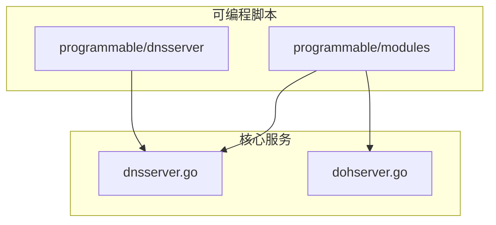
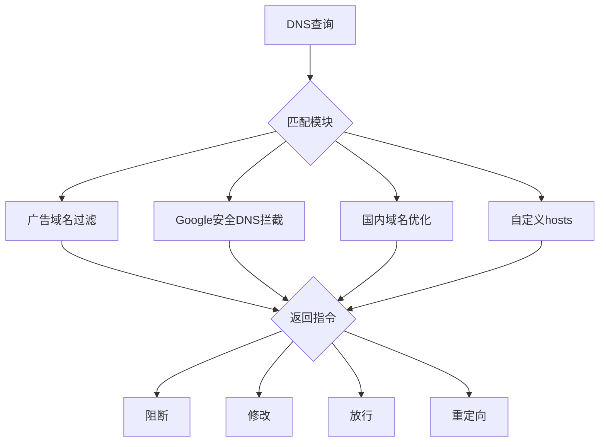
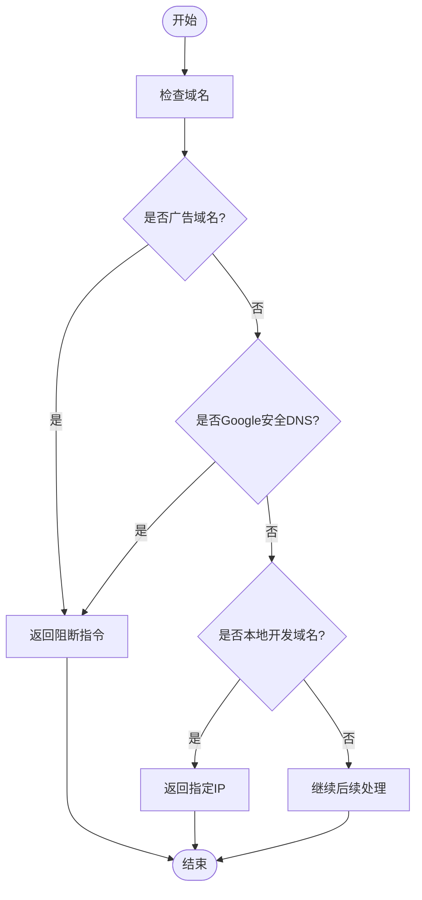
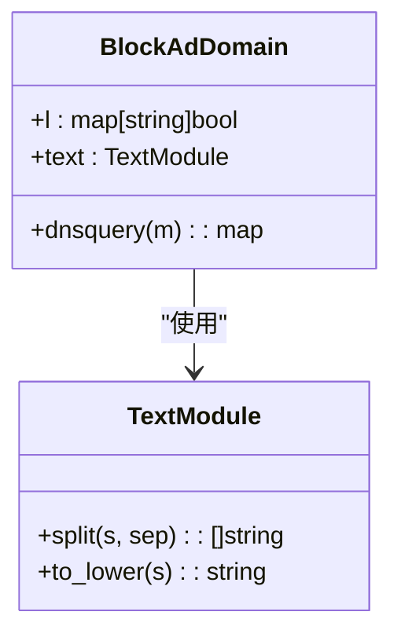
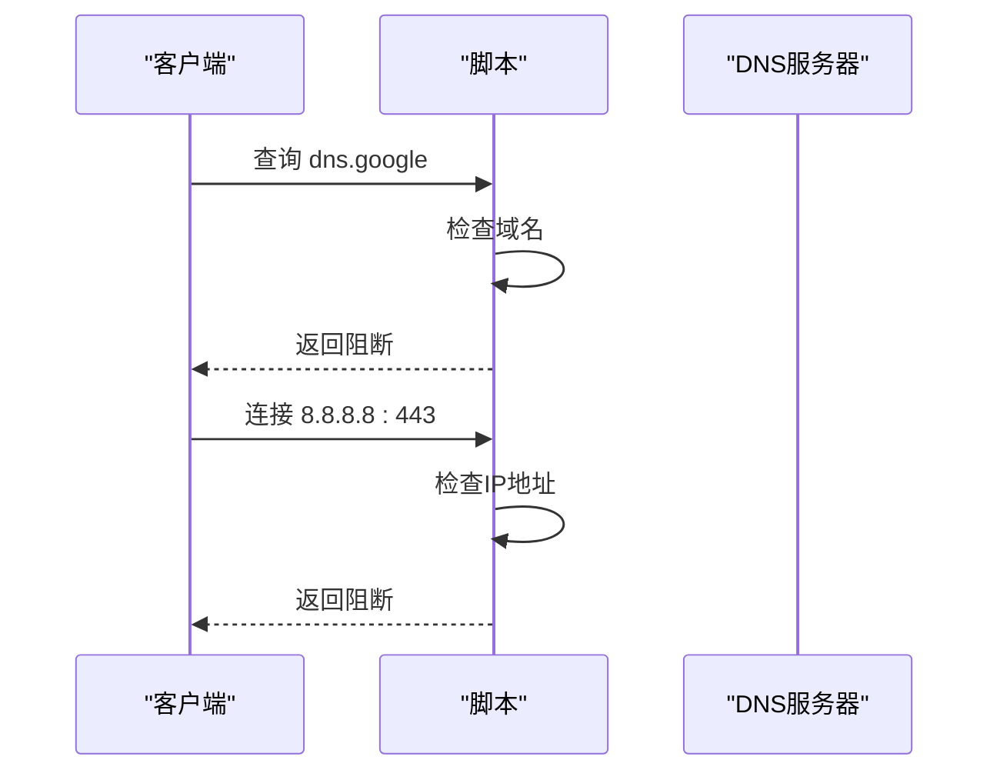
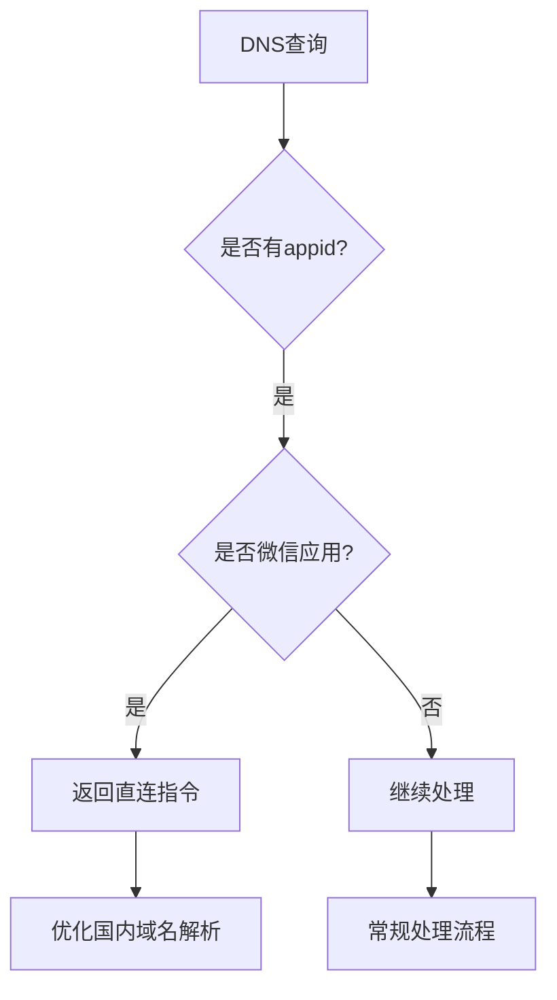
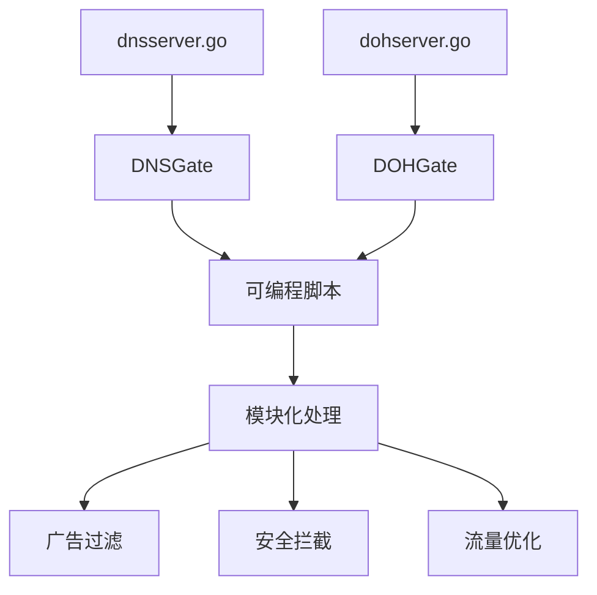

# DNS服务器脚本

<cite>
**本文档引用的文件**
- [dnsserver.go](file://dnsserver.go)
- [dohserver.go](file://dohserver.go)
- [programmable/dnsserver/example.tengo](file://programmable/dnsserver/example.tengo)
- [programmable/modules/block_ad_domain.tengo](file://programmable/modules/block_ad_domain.tengo)
- [programmable/modules/block_google_secure_dns.tengo](file://programmable/modules/block_google_secure_dns.tengo)
- [programmable/modules/blacklist_mode.tengo](file://programmable/modules/blacklist_mode.tengo)
- [programmable/modules/bypass_app.tengo](file://programmable/modules/bypass_app.tengo)
- [programmable/modules/hosts.tengo](file://programmable/modules/hosts.tengo)
- [programmable/modules/redirect_google_cn.tengo](file://programmable/modules/redirect_google_cn.tengo)
- [programmable/modules/response_sample.tengo](file://programmable/modules/response_sample.tengo)
- [programmable/modules/_header.tengo](file://programmable/modules/_header.tengo)
- [programmable/modules/_footer.tengo](file://programmable/modules/_footer.tengo)
</cite>

## 目录
1. [简介](#简介)
2. [项目结构](#项目结构)
3. [核心组件](#核心组件)
4. [架构概述](#架构概述)
5. [详细组件分析](#详细组件分析)
6. [依赖分析](#依赖分析)
7. [性能考虑](#性能考虑)
8. [故障排除指南](#故障排除指南)
9. [结论](#结论)

## 简介
本指南深入解析Brook项目中DNS服务器可编程脚本的工作机制。重点分析`dnsserver`、`dohserver`和`dnsserveroverbrook`服务中脚本如何拦截和处理DNS查询（in_dnsquery）。通过结合`dnsserver.go`的实现，阐述查询响应的生成、修改和阻断逻辑。提供实际案例，如广告域名过滤、国内域名解析优化和特定服务（如Google安全DNS）的拦截。

## 项目结构
Brook项目的DNS可编程脚本主要位于`programmable/dnsserver`和`programmable/modules`目录中。脚本使用Tengo语言编写，通过模块化方式组织，支持在不同场景下灵活组合使用。

**图示来源**
- [dnsserver.go](file://dnsserver.go#L1-L50)
- [dohserver.go](file://dohserver.go#L1-L203)

**本节来源**
- [dnsserver.go](file://dnsserver.go#L1-L50)
- [dohserver.go](file://dohserver.go#L1-L203)

## 核心组件
DNS服务器脚本的核心功能通过`dnsserver.go`和`dohserver.go`中的网关函数实现。`DNSGate`和`DOHGate`变量作为可编程接口，允许脚本在DNS查询处理流程中插入自定义逻辑。脚本通过`in_dnsquery`上下文访问查询信息，并可返回特定指令来控制响应行为。

**本节来源**
- [dnsserver.go](file://dnsserver.go#L24-L49)
- [dohserver.go](file://dohserver.go#L135-L159)

## 架构概述
DNS可编程脚本的架构采用模块化设计，通过`_header.tengo`和`_footer.tengo`提供统一的执行框架。用户编写的模块通过`modules = append(modules, {...})`语法注册，在运行时按顺序执行。当匹配到特定条件时，脚本可返回控制指令，中断后续处理流程。

**图示来源**
- [programmable/modules/_header.tengo](file://programmable/modules/_header.tengo#L1-L2)
- [programmable/modules/_footer.tengo](file://programmable/modules/_footer.tengo#L1-L59)

## 详细组件分析

### DNS查询处理机制
DNS查询处理的核心是`in_dnsquery`上下文对象，它包含域名、查询类型等信息。脚本通过检查这些属性来决定如何处理查询。处理流程按模块注册顺序执行，一旦某个模块返回有效响应，后续模块将被跳过。

#### 查询拦截与处理

**图示来源**
- [programmable/modules/block_ad_domain.tengo](file://programmable/modules/block_ad_domain.tengo#L6-L287)
- [programmable/modules/block_google_secure_dns.tengo](file://programmable/modules/block_google_secure_dns.tengo#L4-L7)
- [programmable/modules/hosts.tengo](file://programmable/modules/hosts.tengo#L3-L11)

**本节来源**
- [programmable/modules/block_ad_domain.tengo](file://programmable/modules/block_ad_domain.tengo#L1-L290)
- [programmable/modules/block_google_secure_dns.tengo](file://programmable/modules/block_google_secure_dns.tengo#L1-L21)

### 实际应用案例

#### 广告域名过滤
广告域名过滤模块通过维护一个域名列表，使用后缀匹配算法高效识别广告域名。脚本将域名按点分割并逆序组合，逐级检查是否存在于黑名单中。

**图示来源**
- [programmable/modules/block_ad_domain.tengo](file://programmable/modules/block_ad_domain.tengo#L3-L287)

#### Google安全DNS拦截
为防止客户端绕过代理使用Google的加密DNS服务，该模块同时拦截`dns.google`域名和其IP地址的连接请求，确保所有DNS查询都经过代理处理。

**图示来源**
- [programmable/modules/block_google_secure_dns.tengo](file://programmable/modules/block_google_secure_dns.tengo#L3-L20)

#### 国内域名解析优化
通过`bypass_app`模块，可以实现特定应用（如微信）的流量直连，避免不必要的代理开销。该模块利用应用程序标识（appid）来识别流量来源。

**图示来源**
- [programmable/modules/bypass_app.tengo](file://programmable/modules/bypass_app.tengo#L3-L49)

## 依赖分析
DNS可编程脚本系统依赖于多个核心组件的协同工作。`dnsserver.go`和`dohserver.go`提供基础的DNS处理能力，而可编程模块则通过统一的接口与这些服务集成。

**图示来源**
- [dnsserver.go](file://dnsserver.go#L24-L49)
- [dohserver.go](file://dohserver.go#L135-L159)

**本节来源**
- [dnsserver.go](file://dnsserver.go#L1-L50)
- [dohserver.go](file://dohserver.go#L1-L203)

## 性能考虑
DNS可编程脚本的设计考虑了性能因素。通过模块化架构，只加载必要的处理逻辑。脚本引擎限制了栈大小（2048），鼓励开发者优化数据结构。对于大型域名列表，建议分割为多个小数组以避免内存问题。

## 故障排除指南
当DNS脚本未按预期工作时，应检查以下方面：确保模块正确注册到`modules`数组中；验证域名匹配逻辑的准确性；检查返回指令的格式是否正确；确认`_header.tengo`和`_footer.tengo`已正确包含。

**本节来源**
- [programmable/modules/_header.tengo](file://programmable/modules/_header.tengo#L1-L2)
- [programmable/modules/_footer.tengo](file://programmable/modules/_footer.tengo#L1-L59)

## 结论
Brook的DNS可编程脚本系统提供了一个强大而灵活的框架，用于定制DNS查询处理逻辑。通过简单的Tengo脚本，用户可以实现复杂的过滤、重定向和优化策略。该系统在`dnsserver`、`dohserver`和`dnsserveroverbrook`服务中保持一致的接口，确保了跨平台的兼容性和可维护性。