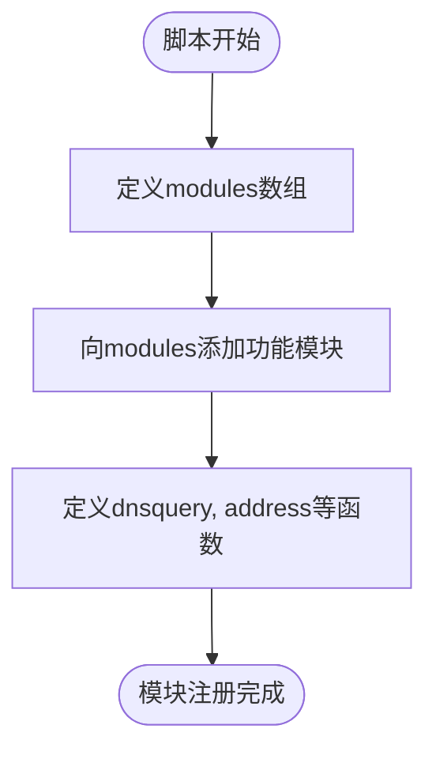
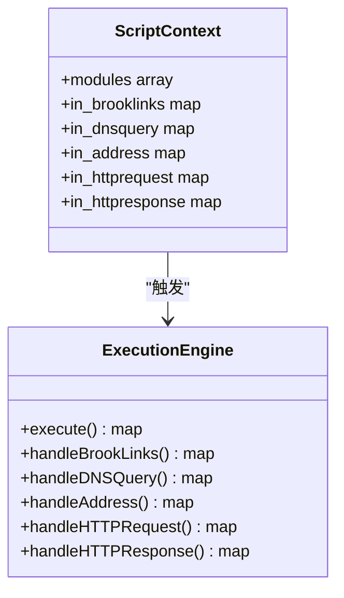
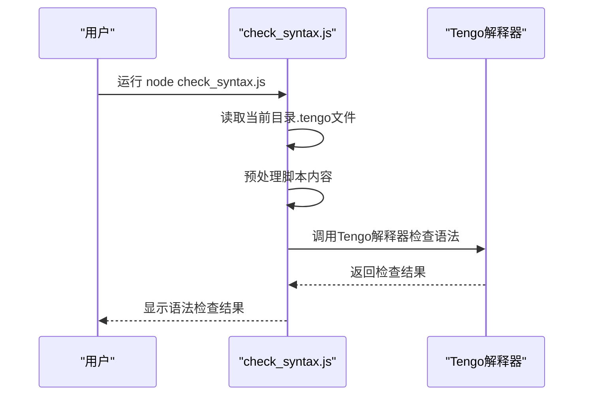
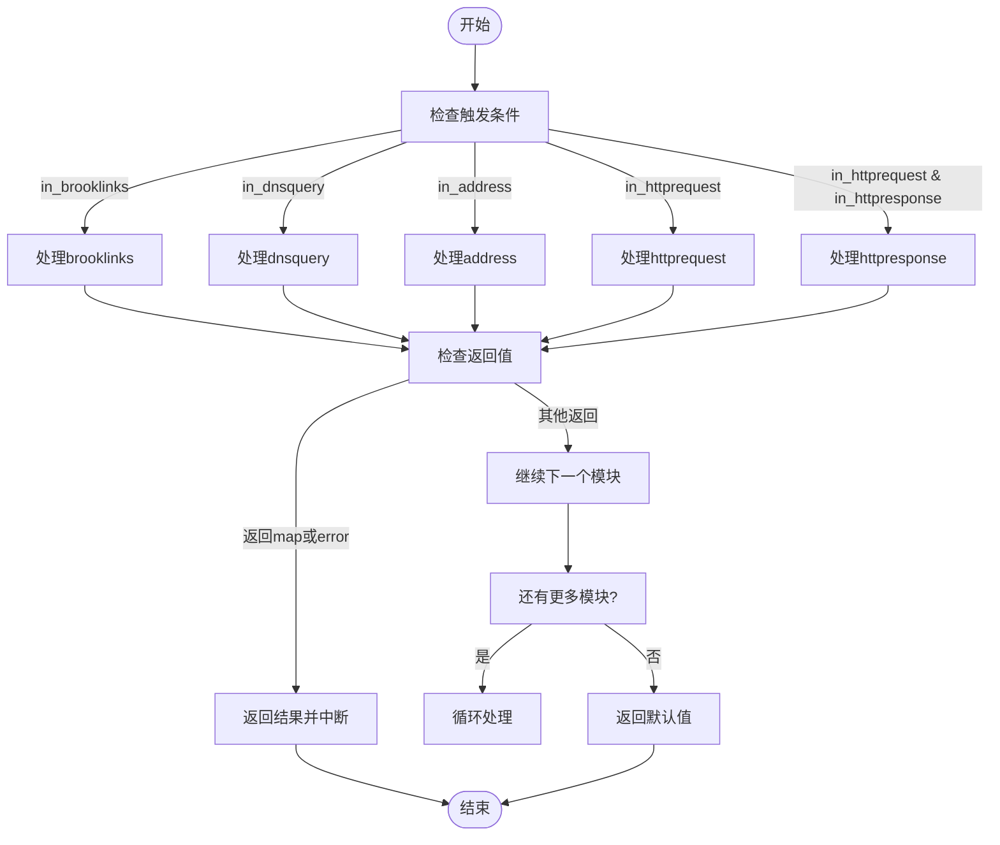

# Tengo脚本基础

<cite>
**本文档中引用的文件**   
- [programmable/modules/_header.tengo](file://programmable/modules/_header.tengo)
- [programmable/modules/_footer.tengo](file://programmable/modules/_footer.tengo)
- [programmable/client/check_syntax.js](file://programmable/client/check_syntax.js)
- [programmable/dnsserver/check_syntax.js](file://programmable/dnsserver/check_syntax.js)
- [programmable/server/check_syntax.js](file://programmable/server/check_syntax.js)
- [programmable/client/example.tengo](file://programmable/client/example.tengo)
- [programmable/modules/bypass_app.tengo](file://programmable/modules/bypass_app.tengo)
- [programmable/modules/block_app.tengo](file://programmable/modules/block_app.tengo)
- [programmable/modules/brooklinks.tengo](file://programmable/modules/brooklinks.tengo)
- [programmable/modules/response_sample.tengo](file://programmable/modules/response_sample.tengo)
- [programmable/modules/hosts.tengo](file://programmable/modules/hosts.tengo)
- [programmable/modules/blacklist_mode.tengo](file://programmable/modules/blacklist_mode.tengo)
- [programmable/modules/readme.md](file://programmable/modules/readme.md)
- [programmable/CLAUDE.md](file://programmable/CLAUDE.md)
</cite>

## 目录
1. [简介](#简介)
2. [Tengo语言基础](#tengo语言基础)
3. [执行上下文与模块注册](#执行上下文与模块注册)
4. [内置变量详解](#内置变量详解)
5. [语法检查工具](#语法检查工具)
6. [执行流程控制](#执行流程控制)
7. [第一个脚本示例](#第一个脚本示例)
8. [最佳实践](#最佳实践)

## 简介
Tengo是一种轻量级、高性能的脚本语言，被集成在brook项目中用于实现可编程的网络代理功能。通过Tengo脚本，用户可以自定义DNS查询处理、地址解析、HTTP请求/响应拦截等行为，实现灵活的网络流量控制策略。本指南将详细介绍Tengo脚本在brook项目中的应用基础。

## Tengo语言基础

### 基本语法
Tengo语言具有简洁直观的语法结构，使用`:=`进行变量声明和赋值，支持函数定义、条件判断、循环等基本编程结构。语法设计注重可读性和易用性，适合网络配置场景下的快速开发。

### 数据类型
Tengo支持多种基本数据类型：
- **字符串**：使用双引号包围的文本
- **数字**：整数和浮点数
- **布尔值**：true和false
- **数组**：有序的值集合，使用方括号定义
- **映射（map）**：键值对集合，使用花括号定义

### 控制结构
Tengo提供标准的控制结构：
- **if语句**：条件判断
- **for循环**：支持传统的for循环和for-in循环遍历集合
- **函数定义**：使用`func`关键字定义函数

### 函数定义
函数通过`func`关键字定义，可以接受参数并返回值。函数是一等公民，可以作为变量赋值、作为参数传递或作为返回值。

**Section sources**
- [programmable/CLAUDE.md](file://programmable/CLAUDE.md#L103-L109)

## 执行上下文与模块注册

### 模块注册机制
在brook项目中，Tengo脚本通过模块化的方式组织功能。所有自定义逻辑都注册到一个名为`modules`的全局数组中，通过`append`函数添加新的功能模块。



**Diagram sources**
- [programmable/modules/_header.tengo](file://programmable/modules/_header.tengo#L1)
- [programmable/modules/bypass_app.tengo](file://programmable/modules/bypass_app.tengo#L4)

### 执行上下文
brook项目为Tengo脚本提供了特定的执行上下文，通过`_header.tengo`和`_footer.tengo`两个文件构建。`_header.tengo`初始化`modules`数组，而`_footer.tengo`包含核心的执行逻辑，根据不同的触发条件调用相应的处理函数。



**Diagram sources**
- [programmable/modules/_header.tengo](file://programmable/modules/_header.tengo#L1)
- [programmable/modules/_footer.tengo](file://programmable/modules/_footer.tengo#L1)

**Section sources**
- [programmable/modules/_header.tengo](file://programmable/modules/_header.tengo#L1)
- [programmable/modules/_footer.tengo](file://programmable/modules/_footer.tengo#L1)

## 内置变量详解

### in_brooklinks
当需要预定义多个brook链接并在运行时选择使用哪一个时触发。处理函数接收一个映射作为参数，可以返回包含多个链接的映射。

**触发条件**：在需要动态选择brook链接的场景下

**Section sources**
- [programmable/modules/brooklinks.tengo](file://programmable/modules/brooklinks.tengo#L6)

### in_dnsquery
当需要拦截和处理DNS查询时触发。处理函数接收`in_dnsquery`映射作为参数，可以根据域名、查询类型等信息进行处理。

**触发条件**：DNS查询发生时

**Section sources**
- [programmable/modules/hosts.tengo](file://programmable/modules/hosts.tengo#L3)
- [programmable/modules/blacklist_mode.tengo](file://programmable/modules/blacklist_mode.tengo#L6)

### in_address
当需要拦截和处理地址解析时触发。处理函数接收`in_address`映射作为参数，可以根据IP地址、域名等信息进行处理。

**触发条件**：地址解析发生时

**Section sources**
- [programmable/client/example.tengo](file://programmable/client/example.tengo#L10)
- [programmable/modules/bypass_app.tengo](file://programmable/modules/bypass_app.tengo#L21)

### in_httprequest
当需要拦截和处理HTTP请求时触发。处理函数接收`in_httprequest`映射作为参数，可以在请求发送前进行修改或拦截。

**触发条件**：HTTP请求发出前，且尚未收到响应时

**Section sources**
- [programmable/client/example.tengo](file://programmable/client/example.tengo#L58)

### in_httpresponse
当需要拦截和处理HTTP响应时触发。处理函数接收`in_httprequest`和`in_httpresponse`两个映射作为参数，可以在响应返回前进行修改。

**触发条件**：收到HTTP响应后

**Section sources**
- [programmable/modules/response_sample.tengo](file://programmable/modules/response_sample.tengo#L20)

## 语法检查工具

### check_syntax.js 使用方法
brook项目提供了`check_syntax.js`工具用于检查Tengo脚本的语法正确性。不同目录下的工具针对不同的使用场景：

- **client/check_syntax.js**：用于客户端脚本检查
- **dnsserver/check_syntax.js**：用于DNS服务器脚本检查  
- **server/check_syntax.js**：用于服务器脚本检查
- **modules/check_syntax.js**：用于模块脚本检查

使用方法：
1. 确保系统已安装Bun运行时
2. 在包含Tengo脚本的目录中运行对应的check_syntax.js文件
3. 工具会自动检查所有.tengo文件的语法



**Diagram sources**
- [programmable/client/check_syntax.js](file://programmable/client/check_syntax.js#L1)
- [programmable/dnsserver/check_syntax.js](file://programmable/dnsserver/check_syntax.js#L1)
- [programmable/server/check_syntax.js](file://programmable/server/check_syntax.js#L1)

**Section sources**
- [programmable/client/check_syntax.js](file://programmable/client/check_syntax.js#L1)
- [programmable/dnsserver/check_syntax.js](file://programmable/dnsserver/check_syntax.js#L1)
- [programmable/server/check_syntax.js](file://programmable/server/check_syntax.js#L1)

## 执行流程控制

### 返回map中断执行
当脚本中的处理函数返回一个映射（map）时，会中断后续模块的执行，并将该映射作为最终结果返回。这通常用于指定特定的处理行为，如绕过代理、阻止连接等。

### 返回error中断执行
当脚本中的处理函数返回一个错误（error）时，同样会中断执行流程，并将错误信息返回。这用于处理异常情况或验证失败的场景。

### 正常执行流程
如果处理函数没有返回map或error，执行将继续到下一个模块，直到所有相关模块都被处理。



**Diagram sources**
- [programmable/modules/_footer.tengo](file://programmable/modules/_footer.tengo#L1)

**Section sources**
- [programmable/modules/_footer.tengo](file://programmable/modules/_footer.tengo#L1)

## 第一个脚本示例

### 创建基础脚本
以下是一个简单的Tengo脚本示例，演示了如何创建一个基本的模块：

```tengo
modules = append(modules, {
    // 定义DNS查询处理函数
    dnsquery: func(m) {
        // 如果查询的是特定域名，则返回自定义IP
        if m.domain == "example.com" {
            return {ip: "192.168.1.100"}
        }
    },
    // 定义地址处理函数
    address: func(m) {
        // 如果是特定IP地址，则绕过代理
        if m.ipaddress == "10.0.0.100" {
            return {bypass: true}
        }
    }
})
```

### 脚本开发步骤
1. 在`programmable/modules/`目录下创建新的.tengo文件
2. 使用`modules = append(modules, {...})`注册新模块
3. 根据需要定义`dnsquery`、`address`、`httprequest`、`httpresponse`等处理函数
4. 使用`check_syntax.js`工具检查语法
5. 在brook中加载并测试脚本

**Section sources**
- [programmable/modules/readme.md](file://programmable/modules/readme.md#L5)
- [programmable/client/example.tengo](file://programmable/client/example.tengo#L6)

## 最佳实践

### 模块化设计
将不同的功能分离到独立的模块中，便于管理和复用。例如，可以将域名黑名单、应用控制、DNS处理等功能分别放在不同的.tengo文件中。

### 错误处理
在脚本中适当添加错误处理逻辑，确保在异常情况下能够优雅地处理，避免脚本崩溃影响整体代理功能。

### 性能考虑
避免在脚本中进行耗时的操作，如复杂的计算或网络请求，以免影响代理性能。对于需要外部数据的场景，考虑使用缓存机制。

### 测试验证
在部署脚本前，使用`check_syntax.js`工具进行语法检查，并在测试环境中验证功能正确性。

**Section sources**
- [programmable/CLAUDE.md](file://programmable/CLAUDE.md#L180-L189)