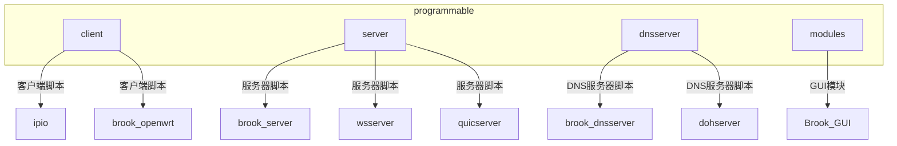
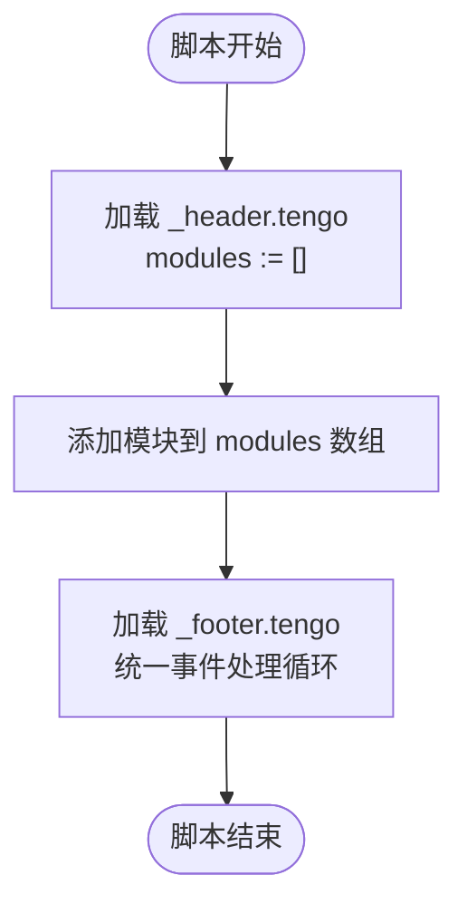
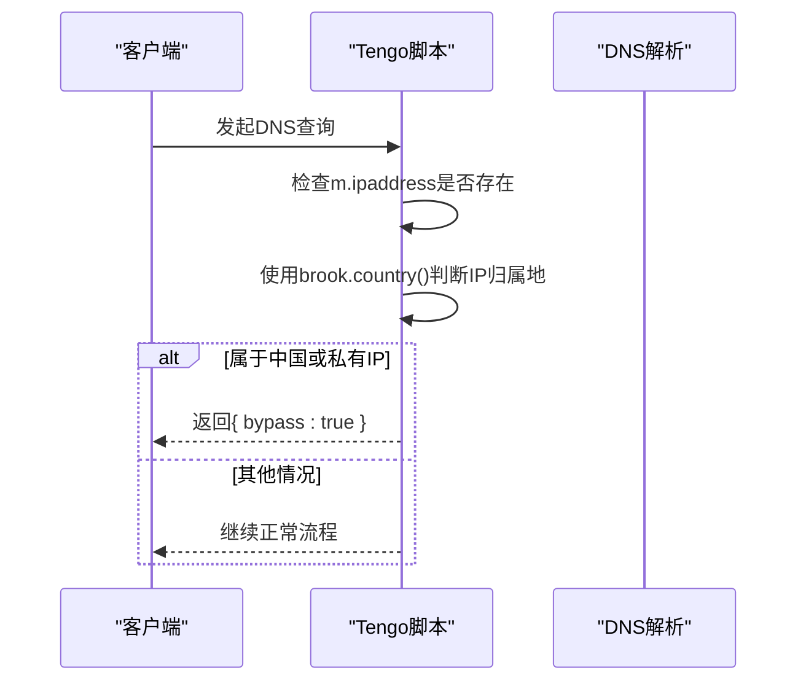

# 可编程模块

<cite>
**本文档引用的文件**
- [programmable/readme.md](file://programmable/readme.md)
- [programmable/client/readme.md](file://programmable/client/readme.md)
- [programmable/server/readme.md](file://programmable/server/readme.md)
- [programmable/dnsserver/readme.md](file://programmable/dnsserver/readme.md)
- [programmable/modules/readme.md](file://programmable/modules/readme.md)
- [programmable/client/example.tengo](file://programmable/client/example.tengo)
- [programmable/server/example.tengo](file://programmable/server/example.tengo)
- [programmable/dnsserver/example.tengo](file://programmable/dnsserver/example.tengo)
- [programmable/modules/_header.tengo](file://programmable/modules/_header.tengo)
- [programmable/modules/_footer.tengo](file://programmable/modules/_footer.tengo)
- [programmable/modules/block_a.tengo](file://programmable/modules/block_a.tengo)
- [programmable/modules/block_aaaa.tengo](file://programmable/modules/block_aaaa.tengo)
- [programmable/modules/bypass_app.tengo](file://programmable/modules/bypass_app.tengo)
- [programmable/modules/blacklist_mode.tengo](file://programmable/modules/blacklist_mode.tengo)
- [programmable/modules/redirect_google_cn.tengo](file://programmable/modules/redirect_google_cn.tengo)
</cite>

## 目录
1. [简介](#简介)
2. [项目结构](#项目结构)
3. [Tengo脚本基础](#tengo脚本基础)
4. [执行环境与模块机制](#执行环境与模块机制)
5. [客户端脚本开发](#客户端脚本开发)
6. [服务器端脚本开发](#服务器端脚本开发)
7. [DNS服务器脚本开发](#dns服务器脚本开发)
8. [常见用例与示例分析](#常见用例与示例分析)
9. [脚本提交与管理](#脚本提交与管理)

## 简介
本指南详细介绍了基于Tengo脚本语言的brook可编程模块功能。通过自定义脚本，用户可以在客户端、服务器和DNS服务器层面实现灵活的网络行为控制，包括流量过滤、域名重定向和应用特定规则等高级功能。文档将结合`programmable`目录下的示例脚本，系统性地讲解各类脚本的开发方法。

## 项目结构
`programmable`目录是brook可编程功能的核心，包含客户端、服务器、DNS服务器和模块四类脚本的示例与模板。每个子目录都提供了`example.tengo`作为开发参考，并包含`check_syntax.js`用于语法检查。



**Diagram sources**
- [programmable/readme.md](file://programmable/readme.md)
- [programmable/client/readme.md](file://programmable/client/readme.md)
- [programmable/server/readme.md](file://programmable/server/readme.md)
- [programmable/dnsserver/readme.md](file://programmable/dnsserver/readme.md)

**Section sources**
- [programmable/readme.md](file://programmable/readme.md)

## Tengo脚本基础
Tengo是一种轻量级脚本语言，专为嵌入式场景设计。在brook中，Tengo脚本用于定义网络流量的处理逻辑。脚本通过`func()`函数定义处理流程，并将结果赋值给`out`变量。脚本支持基本的数据结构（如map、array）、控制流语句和函数调用。

**Section sources**
- [programmable/client/example.tengo](file://programmable/client/example.tengo)
- [programmable/server/example.tengo](file://programmable/server/example.tengo)
- [programmable/dnsserver/example.tengo](file://programmable/dnsserver/example.tengo)

## 执行环境与模块机制
在Brook GUI中，脚本被抽象为模块。系统会自动合并`_header.tengo`和`_footer.tengo`，开发者只需编写核心模块逻辑。`_header.tengo`初始化`modules`数组，而`_footer.tengo`包含统一的执行框架，遍历所有模块并处理不同类型的事件。



**Diagram sources**
- [programmable/modules/_header.tengo](file://programmable/modules/_header.tengo)
- [programmable/modules/_footer.tengo](file://programmable/modules/_footer.tengo)

**Section sources**
- [programmable/modules/readme.md](file://programmable/modules/readme.md)
- [programmable/modules/_header.tengo](file://programmable/modules/_header.tengo)
- [programmable/modules/_footer.tengo](file://programmable/modules/_footer.tengo)

## 客户端脚本开发
客户端脚本适用于ipio和brook.openwrt平台。脚本通过监听`in_dnsquery`、`in_address`、`in_httprequest`和`in_httpresponse`等输入变量来拦截和处理网络事件。例如，可以根据IP地理位置决定是否绕过代理。



**Diagram sources**
- [programmable/client/example.tengo](file://programmable/client/example.tengo)

**Section sources**
- [programmable/client/example.tengo](file://programmable/client/example.tengo)
- [programmable/client/readme.md](file://programmable/client/readme.md)

## 服务器端脚本开发
服务器端脚本用于brook server、wsserver、wssserver和quicserver。脚本可以定义DNS服务器列表、DOH服务器列表，并根据地址信息实施拦截、重定向或限速等策略。例如，可以阻止对特定域名的访问或将流量引导至不同的brook链接。

```mermaid
flowchart TD
A[in_address] --> B{m.ipaddress?}
B --> |是| C[解析IP并判断国家]
C --> D{是否为ZZ或CN?}
D --> |是| E[返回{ block: true }]
D --> |否| F[继续处理]
B --> |否| G{m.domainaddress?}
G --> |是| H[检查域名和端口]
H --> I{是否为特定域名?}
I --> |是| J[返回重定向或拦截指令]
I --> |否| K[继续正常流程]
```

**Diagram sources**
- [programmable/server/example.tengo](file://programmable/server/example.tengo)

**Section sources**
- [programmable/server/example.tengo](file://programmable/server/example.tengo)
- [programmable/server/readme.md](file://programmable/server/readme.md)

## DNS服务器脚本开发
DNS服务器脚本适用于brook dnsserver、dohserver和dnsserveroverbrook。脚本可以拦截DNS查询请求，实现域名拦截、IP重定向或指定使用特定的DOH服务器。例如，可以阻止对360.cn的A记录查询或将特定域名解析引导至Quad9的DOH服务。

```mermaid
flowchart TD
Start([DNS查询]) --> CheckDomain["检查m.domain"]
CheckDomain --> A{是否为360.cn?}
A --> |是| Block["返回{ block: true }"]
A --> |否| B{是否为360.com且类型为A?}
B --> |是| Redirect["返回{ ip: \"1.2.3.4\" }"]
B --> |否| C{是否为http3.ooo?}
C --> |是| DOH["返回{ dohserverkey: \"quad4\" }"]
C --> |否| Pass["继续正常解析"]
```

**Diagram sources**
- [programmable/dnsserver/example.tengo](file://programmable/dnsserver/example.tengo)

**Section sources**
- [programmable/dnsserver/example.tengo](file://programmable/dnsserver/example.tengo)
- [programmable/dnsserver/readme.md](file://programmable/dnsserver/readme.md)

## 常见用例与示例分析
### 流量过滤
通过`block_a.tengo`和`block_aaaa.tengo`模块，可以分别阻止IPv4(A记录)或IPv6(AAAA记录)的DNS查询，适用于不支持相应IP版本的网络环境。

**Section sources**
- [programmable/modules/block_a.tengo](file://programmable/modules/block_a.tengo)
- [programmable/modules/block_aaaa.tengo](file://programmable/modules/block_aaaa.tengo)

### 应用特定规则
`bypass_app.tengo`模块展示了如何根据应用ID（appid）实现微信等应用的直连。脚本同时处理`dnsquery`和`address`事件，确保应用流量完全绕过代理。

**Section sources**
- [programmable/modules/bypass_app.tengo](file://programmable/modules/bypass_app.tengo)

### 黑名单模式
`blacklist_mode.tengo`实现了黑名单模式，仅代理指定域名（如google.com、twitter.com），其余流量直连。通过`text.has_suffix`方法支持子域名匹配。

**Section sources**
- [programmable/modules/blacklist_mode.tengo](file://programmable/modules/blacklist_mode.tengo)

### 域名重定向
`redirect_google_cn.tengo`模块实现了将www.google.cn重定向到www.google.com的功能。脚本结合DNS拦截、MITM（中间人攻击）和HTTP 302重定向，完整处理了从域名解析到HTTP响应的全过程。

**Section sources**
- [programmable/modules/redirect_google_cn.tengo](file://programmable/modules/redirect_google_cn.tengo)

## 脚本提交与管理
用户可以通过修改`gallery.json`文件向Brook脚本库提交自定义脚本。每个脚本需要提供名称、URL、类型（dnsserver/server/module/client）、是否需要安装CA证书、作者信息等元数据。脚本可以存放在项目内的`programmable`目录或其他无CORS限制的位置。

**Section sources**
- [programmable/readme.md](file://programmable/readme.md)