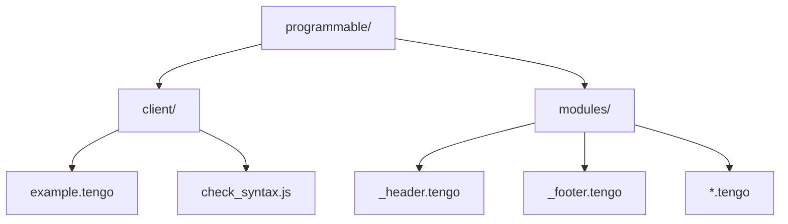
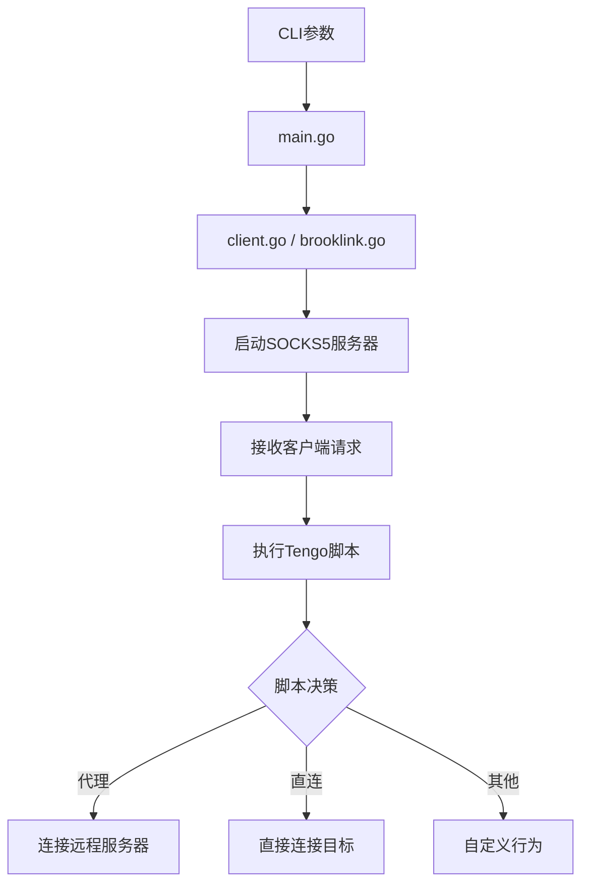
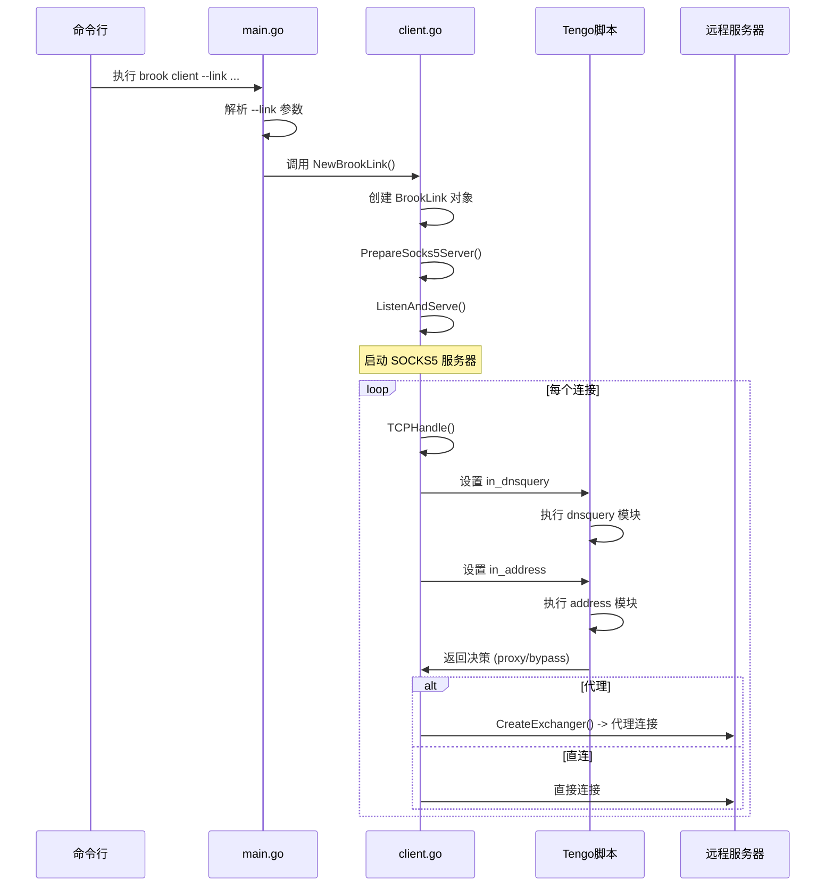
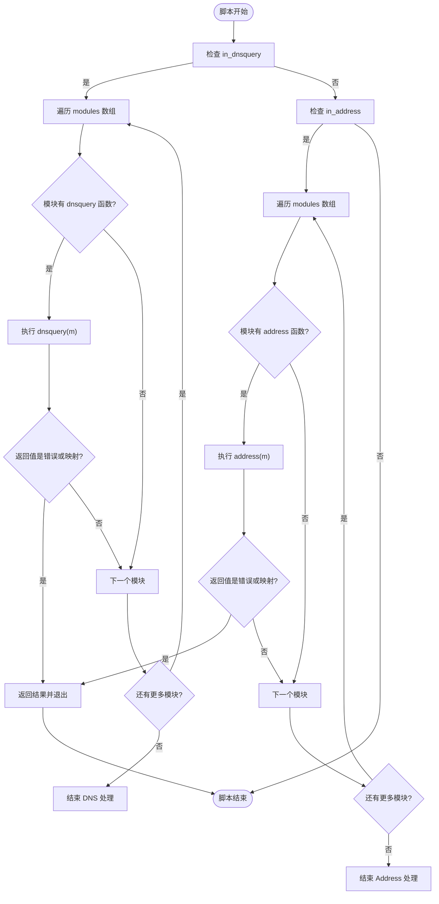

# 客户端脚本

<cite>
**本文档引用文件**   
- [example.tengo](file://programmable/client/example.tengo)
- [main.go](file://cli/brook/main.go)
- [client.go](file://client.go)
- [brooklink.go](file://brooklink.go)
- [readme.md](file://programmable/client/readme.md)
- [_header.tengo](file://programmable/modules/_header.tengo)
- [_footer.tengo](file://programmable/modules/_footer.tengo)
- [check_syntax.js](file://programmable/client/check_syntax.js)
</cite>

## 目录
1. [简介](#简介)
2. [项目结构](#项目结构)
3. [核心组件](#核心组件)
4. [架构概述](#架构概述)
5. [详细组件分析](#详细组件分析)
6. [依赖分析](#依赖分析)
7. [性能考虑](#性能考虑)
8. [故障排除指南](#故障排除指南)
9. [结论](#结论)

## 简介
本指南旨在为brook客户端环境的脚本编写提供全面指导。基于`programmable/client/`目录下的`example.tengo`示例，深入解析客户端脚本的生命周期、可用API及典型应用场景。文档将阐述脚本如何在ipio和brook.openwrt等客户端平台上运行，以及如何通过脚本定制连接行为、流量路由和本地策略。结合`main.go`中的CLI参数解析逻辑，详细说明脚本加载机制，并提供实际用例，如应用层代理规则、本地PAC生成和连接前验证。

## 项目结构
brook项目的可编程模块为客户端提供了强大的脚本定制能力。客户端脚本主要位于`programmable/client/`目录下，通过Tengo脚本语言实现。该目录包含示例脚本`example.tengo`和语法检查工具`check_syntax.js`。`readme.md`文件明确指出，这些脚本专为ipio和brook.openwrt平台设计。



**Diagram sources**
- [readme.md](file://programmable/client/readme.md)
- [example.tengo](file://programmable/client/example.tengo)

**Section sources**
- [readme.md](file://programmable/client/readme.md)
- [example.tengo](file://programmable/client/example.tengo)

## 核心组件
客户端脚本的核心在于其模块化设计和生命周期管理。脚本通过定义一系列模块（`modules`数组）来响应不同的网络事件。`example.tengo`展示了如何创建一个模块，该模块在`dnsquery`和`address`事件中执行逻辑。脚本通过`import("brook")`引入brook API，从而访问`country`、`splithostport`等关键函数。整个脚本的执行由一个主函数`f()`驱动，该函数根据传入的上下文变量（如`in_dnsquery`、`in_address`）来决定执行哪个模块的逻辑。

**Section sources**
- [example.tengo](file://programmable/client/example.tengo)

## 架构概述
brook客户端脚本的架构围绕事件驱动模型构建。当客户端（如`brook client`或`brook wsclient`命令）启动时，它会加载并执行指定的Tengo脚本。脚本的执行环境由`main.go`中的CLI逻辑初始化。`main.go`负责解析命令行参数，并将这些参数传递给底层的`brook`库。`client.go`和`brooklink.go`文件定义了客户端的核心逻辑，包括SOCKS5服务器的创建和与远程brook服务器的连接。脚本本身则作为策略层，介入到连接建立和数据转发的过程中，根据预定义的规则决定流量的走向。



**Diagram sources**
- [main.go](file://cli/brook/main.go)
- [client.go](file://client.go)
- [brooklink.go](file://brooklink.go)

## 详细组件分析

### 客户端脚本生命周期分析
客户端脚本的生命周期始于`main.go`对CLI命令的解析。当用户执行`brook client`或`brook wsclient`等命令时，`main.go`中的`client`或`wsclient`命令的`Action`函数会被调用。该函数首先处理`--link`参数，将其解析为`BrookLink`对象。随后，调用`PrepareSocks5Server`方法，该方法在`brooklink.go`中定义，负责初始化一个SOCKS5服务器。此时，脚本的执行环境被建立。当有新的SOCKS5连接请求到达时，`TCPHandle`或`UDPHandle`函数会被触发，它们会调用`CreateExchanger`来建立与远程服务器的连接。在整个过程中，Tengo脚本通过预定义的钩子（如`dnsquery`、`address`）被调用，以影响连接决策。

#### 对于API组件：


**Diagram sources**
- [main.go](file://cli/brook/main.go)
- [brooklink.go](file://brooklink.go)
- [example.tengo](file://programmable/client/example.tengo)

### 典型应用场景分析
客户端脚本可用于实现多种网络策略。例如，`bypass_geo.tengo`模块通过`brook.country()`函数判断目标IP的地理位置，如果是中国（CN）或私有地址（ZZ），则返回`{ bypass: true }`，指示客户端直接连接，从而实现国内流量直连。`bypass_app.tengo`模块则利用`m.appid`字段识别特定应用（如微信），并根据应用ID决定是否绕过代理。`hosts.tengo`模块可以实现自定义的DNS解析，将特定域名（如`localdev.com`）解析到本地IP。这些模块可以组合使用，通过`_header.tengo`和`_footer.tengo`文件合并成一个完整的脚本，以满足复杂的网络需求。

#### 对于复杂逻辑组件：


**Diagram sources**
- [example.tengo](file://programmable/client/example.tengo)
- [_footer.tengo](file://programmable/modules/_footer.tengo)

**Section sources**
- [example.tengo](file://programmable/client/example.tengo)
- [bypass_geo.tengo](file://programmable/modules/bypass_geo.tengo)
- [bypass_app.tengo](file://programmable/modules/bypass_app.tengo)
- [hosts.tengo](file://programmable/modules/hosts.tengo)

## 依赖分析
客户端脚本的执行依赖于多个层次的组件。最上层是CLI工具`main.go`，它负责命令行交互和参数解析。中间层是`client.go`和`brooklink.go`，它们实现了客户端的核心网络逻辑和SOCKS5协议处理。最底层是Tengo脚本引擎，它在`main.go`的`Before`函数或相关命令的`Action`函数中被初始化。脚本本身依赖于`import("brook")`提供的API，这些API由Go代码暴露给Tengo环境。此外，脚本的语法检查依赖于`check_syntax.js`工具，该工具使用Bun和Tengo CLI来验证脚本的正确性。

```mermaid
graph TD
A[check_syntax.js] --> B[Tengo CLI]
C[main.go] --> D[client.go]
C --> E[brooklink.go]
D --> F[socks5 库]
E --> F
C --> G[Tengo 脚本引擎]
G --> H[example.tengo]
H --> I[import("brook")]
I --> C
```

**Diagram sources**
- [main.go](file://cli/brook/main.go)
- [check_syntax.js](file://programmable/client/check_syntax.js)

**Section sources**
- [main.go](file://cli/brook/main.go)
- [check_syntax.js](file://programmable/client/check_syntax.js)

## 性能考虑
在编写客户端脚本时，应考虑其对整体性能的影响。脚本的执行是同步的，因此复杂的逻辑或长时间的计算会阻塞连接的建立。建议将耗时的操作（如网络请求）最小化。利用`modules`数组的短路特性，将最可能匹配的规则放在前面，可以提高效率。此外，避免在脚本中进行不必要的内存分配。由于脚本运行在沙箱环境中，其资源消耗受到一定限制，但仍需注意编写高效的代码以确保代理的低延迟和高吞吐量。

## 故障排除指南
当客户端脚本出现问题时，可以从以下几个方面进行排查。首先，使用`check_syntax.js`工具检查脚本的语法是否正确。其次，检查`main.go`中CLI参数是否正确传递，特别是`--link`参数中的脚本路径。在运行时，可以通过`--log`参数启用日志记录，观察脚本的执行流程和决策结果。如果脚本逻辑复杂，可以添加临时的`return { bypass: true }`语句来隔离问题模块。确保`import("brook")`成功，并且调用的API函数名和参数正确无误。

**Section sources**
- [check_syntax.js](file://programmable/client/check_syntax.js)
- [main.go](file://cli/brook/main.go)

## 结论
brook的客户端脚本系统提供了一个强大而灵活的平台，用于定制网络代理行为。通过理解`example.tengo`的结构和`main.go`的加载机制，开发者可以创建出满足各种需求的脚本，从简单的PAC规则到复杂的应用层策略。结合`modules`目录下的通用模块，用户可以快速构建出功能丰富的代理配置。掌握这一系统，将极大地提升在ipio和brook.openwrt等平台上的网络管理能力。