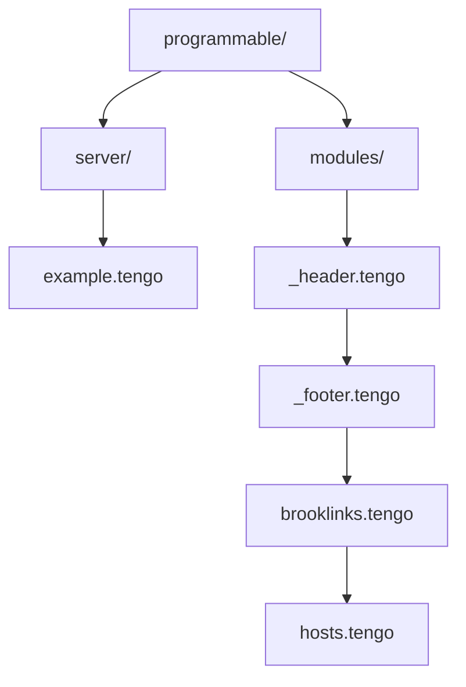
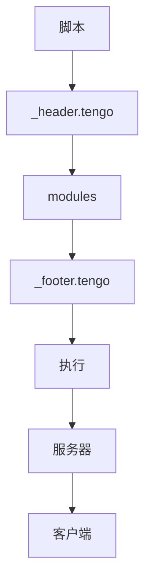
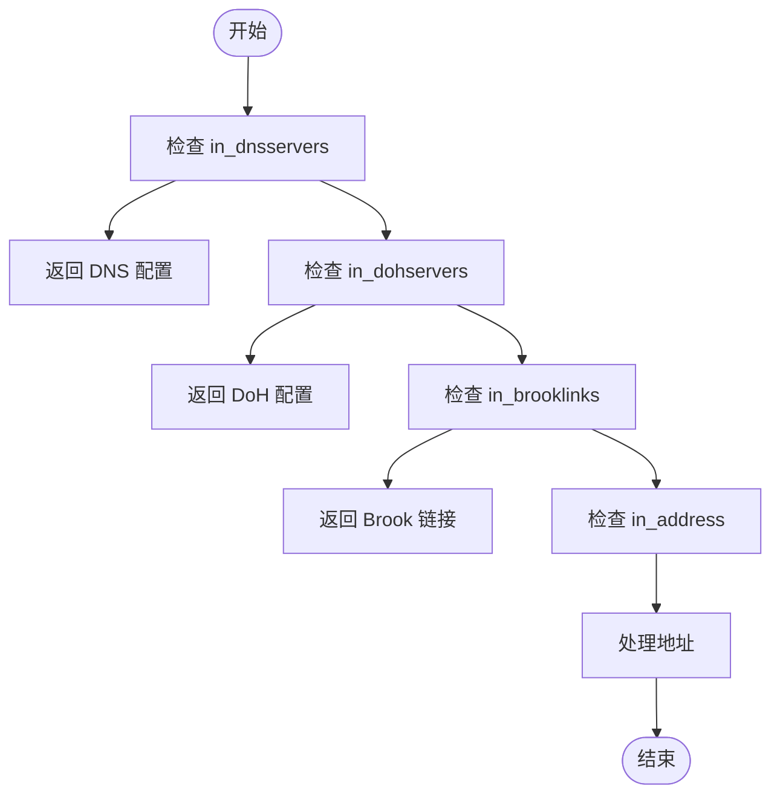
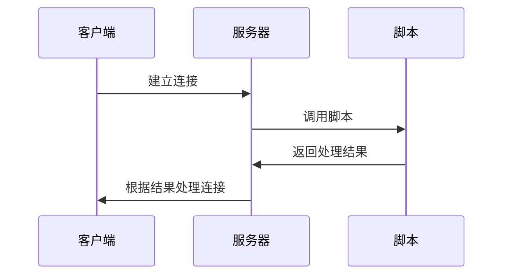
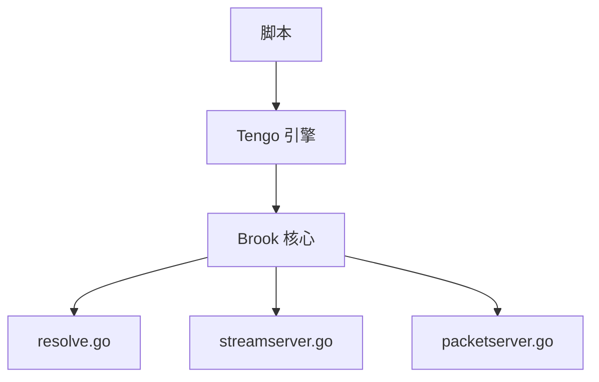

# 服务器端脚本

<cite>
**本文档引用的文件**
- [example.tengo](file://programmable/server/example.tengo)
- [server.go](file://server.go)
- [wsserver.go](file://wsserver.go)
- [quicserver.go](file://quicserver.go)
- [streamserver.go](file://streamserver.go)
- [packetserver.go](file://packetserver.go)
- [resolve.go](file://resolve.go)
- [_header.tengo](file://programmable/modules/_header.tengo)
- [_footer.tengo](file://programmable/modules/_footer.tengo)
- [brooklinks.tengo](file://programmable/modules/brooklinks.tengo)
- [hosts.tengo](file://programmable/modules/hosts.tengo)
- [CLAUDE.md](file://programmable/CLAUDE.md)
- [readme.md](file://programmable/readme.md)
</cite>

## 目录
1. [简介](#简介)
2. [项目结构](#项目结构)
3. [核心组件](#核心组件)
4. [架构概述](#架构概述)
5. [详细组件分析](#详细组件分析)
6. [依赖分析](#依赖分析)
7. [性能考虑](#性能考虑)
8. [故障排除指南](#故障排除指南)
9. [结论](#结论)

## 简介
本文档详细介绍了 Brook 项目中的服务器端可编程脚本系统。该系统允许用户通过 Tengo 脚本语言自定义服务器行为，包括连接控制、地址解析和流量转发等功能。文档重点分析了 `example.tengo` 脚本在 `brook server`、`wsserver`、`wssserver` 和 `quicserver` 等服务模式下的运行机制，以及脚本与服务器主逻辑的集成方式。

## 项目结构
Brook 项目的可编程模块位于 `programmable/` 目录下，其中 `server/` 子目录包含了服务器端脚本的相关文件。这些脚本可以被 `brook server`、`wsserver`、`wssserver` 和 `quicserver` 等服务模式加载和执行。

**图示来源**
- [example.tengo](file://programmable/server/example.tengo)
- [_header.tengo](file://programmable/modules/_header.tengo)
- [_footer.tengo](file://programmable/modules/_footer.tengo)

## 核心组件
服务器端脚本系统的核心组件包括脚本执行环境、服务器逻辑和数据交换机制。`example.tengo` 脚本定义了在不同输入条件下的处理逻辑，如 DNS 服务器配置、DoH 服务器配置、Brook 链接和地址解析等。

**组件来源**
- [example.tengo](file://programmable/server/example.tengo)
- [CLAUDE.md](file://programmable/CLAUDE.md)

## 架构概述
服务器端脚本的执行架构基于 Tengo 脚本语言，通过 `_header.tengo` 和 `_footer.tengo` 文件构建模块化执行环境。脚本在服务器启动时加载，并在处理客户端请求时根据输入条件执行相应的逻辑。

**图示来源**
- [_header.tengo](file://programmable/modules/_header.tengo)
- [_footer.tengo](file://programmable/modules/_footer.tengo)
- [example.tengo](file://programmable/server/example.tengo)

## 详细组件分析
### 脚本执行机制
服务器端脚本通过 `f := func()` 定义处理函数，根据不同的输入条件（如 `in_dnsservers`、`in_dohservers`、`in_brooklinks` 和 `in_address`）返回相应的配置或处理结果。脚本使用 `brook` 模块提供的函数进行地址解析和国家代码查询。

#### 脚本逻辑分析

**图示来源**
- [example.tengo](file://programmable/server/example.tengo)

### 服务器集成
服务器端脚本与 `server.go`、`wsserver.go` 和 `quicserver.go` 等文件中的服务器逻辑集成。脚本在处理客户端连接时被调用，根据脚本返回的结果决定是否允许连接、重定向流量或应用其他处理规则。

#### 服务器处理流程

**图示来源**
- [server.go](file://server.go)
- [wsserver.go](file://wsserver.go)
- [quicserver.go](file://quicserver.go)

## 依赖分析
服务器端脚本系统依赖于 Tengo 脚本引擎和 Brook 核心库。脚本通过 `import` 语句引入 `brook` 模块，使用其提供的函数进行网络操作和数据处理。

**图示来源**
- [resolve.go](file://resolve.go)
- [streamserver.go](file://streamserver.go)
- [packetserver.go](file://packetserver.go)

## 性能考虑
服务器端脚本的执行性能受脚本复杂度和 Tengo 引擎优化程度的影响。建议在脚本中避免复杂的循环和递归操作，以确保服务器的高并发处理能力。

## 故障排除指南
当服务器端脚本出现问题时，可以通过检查脚本语法、验证输入条件和调试执行流程来定位问题。使用 `check_syntax.js` 工具可以验证脚本的语法正确性。

**故障排除来源**
- [check_syntax.js](file://programmable/server/check_syntax.js)
- [example.tengo](file://programmable/server/example.tengo)

## 结论
Brook 的服务器端可编程脚本系统为用户提供了强大的自定义能力，通过简单的 Tengo 脚本即可实现复杂的网络行为控制。该系统在 `brook server`、`wsserver`、`wssserver` 和 `quicserver` 等服务模式下均能有效运行，为网络代理和转发提供了灵活的解决方案。