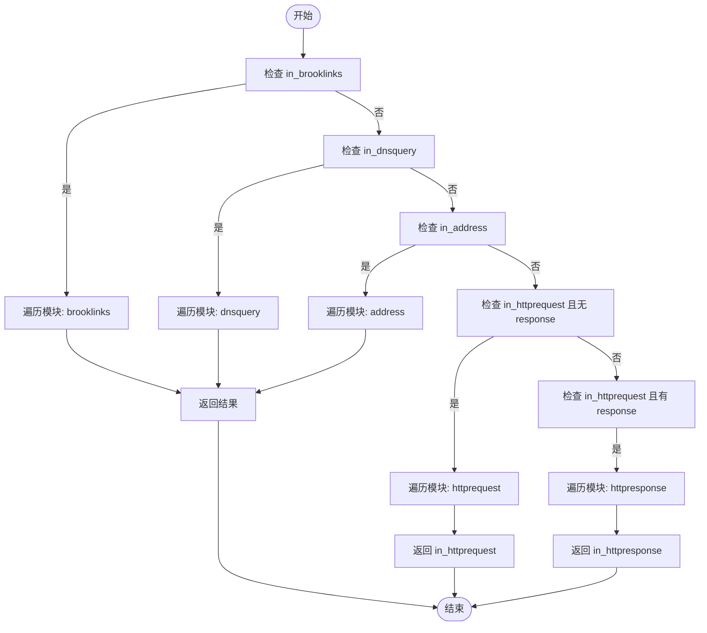

# 脚本模块库

<cite>
**本文档引用的文件**  
- [block_ad_domain.tengo](file://programmable/modules/block_ad_domain.tengo)
- [bypass_geo.tengo](file://programmable/modules/bypass_geo.tengo)
- [redirect_google_cn.tengo](file://programmable/modules/redirect_google_cn.tengo)
- [brooklinks.tengo](file://programmable/modules/brooklinks.tengo)
- [block_a.tengo](file://programmable/modules/block_a.tengo)
- [block_aaaa.tengo](file://programmable/modules/block_aaaa.tengo)
- [block_app.tengo](file://programmable/modules/block_app.tengo)
- [allow_app.tengo](file://programmable/modules/allow_app.tengo)
- [blacklist_mode.tengo](file://programmable/modules/blacklist_mode.tengo)
- [hosts.tengo](file://programmable/modules/hosts.tengo)
- [_header.tengo](file://programmable/modules/_header.tengo)
- [_footer.tengo](file://programmable/modules/_footer.tengo)
- [gallery.json](file://programmable/gallery.json)
- [readme.md](file://programmable/readme.md)
- [modules/readme.md](file://programmable/modules/readme.md)
</cite>

## 目录
1. [简介](#简介)
2. [脚本模块设计与实现](#脚本模块设计与实现)
3. [模块注册与执行链构建](#模块注册与执行链构建)
4. [提交脚本至Brook脚本库](#提交脚本至brook脚本库)
5. [模块组合实践指南](#模块组合实践指南)
6. [结论](#结论)

## 简介
Brook脚本模块库为用户提供了一套灵活的网络流量控制机制，通过Tengo脚本语言实现可编程的代理行为。本系统支持多种功能模块，涵盖DNS查询拦截、地址处理、HTTP请求/响应修改等场景，允许用户根据需求定制网络策略。模块化设计使得功能扩展变得简单高效，开发者可以轻松创建并共享自定义模块。

## 脚本模块设计与实现

### 广告域名拦截模块 (block_ad_domain.tengo)
该模块通过维护一个广告域名列表，对DNS查询进行实时匹配和拦截。当检测到请求的域名或其子域属于已知广告域名时，返回阻断指令，阻止后续解析过程。实现中采用字典数据结构存储域名，利用字符串分割和逐级匹配算法确保通配符效果。

**模块特点**：
- 支持多级域名匹配
- 内置大量主流广告域名
- 可扩展性强，便于添加新规则

**Section sources**
- [block_ad_domain.tengo](file://programmable/modules/block_ad_domain.tengo#L1-L290)

### 地理位置绕过模块 (bypass_geo.tengo)
此模块用于识别并绕过特定地理区域的IP地址流量。通过调用内置的地理定位功能，判断目标IP所属国家代码，若为本地（CN）或私有地址（ZZ），则标记为直连，避免经过代理处理。

**核心逻辑**：
- 提取IP地址并解析主机端口
- 查询IP归属国家
- 根据国家代码决定是否绕过代理

**Section sources**
- [bypass_geo.tengo](file://programmable/modules/bypass_geo.tengo#L1-L19)

### Google中国重定向模块 (redirect_google_cn.tengo)
该模块实现将对www.google.cn的访问重定向至www.google.com的功能。通过组合DNS拦截、地址处理和HTTP请求修改三个阶段的操作，确保用户能够无缝访问国际版Google服务。

**处理流程**：
1. DNS阶段：拦截www.google.cn的查询请求
2. 地址阶段：识别HTTP/HTTPS连接并启用中间人（MITM）模式
3. HTTP请求阶段：发送302重定向响应

**特别说明**：该模块需要安装CA证书以支持HTTPS解密。

**Section sources**
- [redirect_google_cn.tengo](file://programmable/modules/redirect_google_cn.tengo#L1-L42)

### 预定义Brook链接模块 (brooklinks.tengo)
该模块允许在运行前预定义多个Brook服务器链接，并通过键值选择实际连接的目标。适用于需要动态切换代理服务器的场景。

**使用方式**：
```tengo
return {
    "key_a": "brook://...",
    "key_b": "brook://..."
}
```

**Section sources**
- [brooklinks.tengo](file://programmable/modules/brooklinks.tengo#L1-L14)

### IPv4/IPv6协议控制模块
#### A记录拦截模块 (block_a.tengo)
用于在不支持IPv4的环境中阻止A记录解析请求，防止IPv4流量产生。

**触发条件**：DNS查询类型为"A"

**Section sources**
- [block_a.tengo](file://programmable/modules/block_a.tengo#L1-L10)

#### AAAA记录拦截模块 (block_aaaa.tengo)
用于在不支持IPv6的环境中阻止AAAA记录解析请求，确保流量仅通过IPv4传输。

**触发条件**：DNS查询类型为"AAAA"

**Section sources**
- [block_aaaa.tengo](file://programmable/modules/block_aaaa.tengo#L1-L12)

### 应用程序流量控制模块
#### 应用拦截模块 (block_app.tengo)
阻止指定应用程序的网络访问。通过识别应用ID（macOS沙盒模式下的bundle id或其他平台的完整路径）来实施控制。

**适用场景**：禁止特定应用联网

**Section sources**
- [block_app.tengo](file://programmable/modules/block_app.tengo#L1-L18)

#### 应用白名单模块 (allow_app.tengo)
仅允许指定应用程序访问网络，其他所有应用均被阻止。实现严格的网络访问控制策略。

**注意**：macOS版本需启用App模式

**Section sources**
- [allow_app.tengo](file://programmable/modules/allow_app.tengo#L1-L19)

### 黑名单模式模块 (blacklist_mode.tengo)
实现反向代理逻辑，仅对指定域名列表进行代理，其余流量全部直连。与传统的白名单模式相反，更适合需要最小化代理范围的场景。

**匹配规则**：
- 精确匹配域名
- 支持子域匹配（通过后缀检查）

**Section sources**
- [blacklist_mode.tengo](file://programmable/modules/blacklist_mode.tengo#L1-L25)

### 自定义Hosts模块 (hosts.tengo)
提供类似系统hosts文件的功能，将特定域名解析到指定IP地址。支持IPv4（A记录）和IPv6（AAAA记录）的自定义映射。

**典型用途**：本地开发环境域名映射

**Section sources**
- [hosts.tengo](file://programmable/modules/hosts.tengo#L1-L14)

## 模块注册与执行链构建

### 模块数组注册机制
所有功能模块通过`modules`数组进行注册。每个模块以对象形式添加到数组中，包含一个或多个处理函数，对应不同的网络事件类型。

```tengo
modules = append(modules, {
    dnsquery: func(m) { ... },
    address: func(m) { ... },
    httprequest: func(request) { ... },
    httpresponse: func(request, response) { ... }
})
```

**支持的事件类型**：
- `brooklinks`: 定义预设链接
- `dnsquery`: 处理DNS查询
- `address`: 处理地址连接
- `httprequest`: 处理HTTP请求
- `httpresponse`: 处理HTTP响应

### 执行链构建原理
系统通过`_header.tengo`和`_footer.tengo`两个核心文件构建完整的执行环境。

#### 头部文件 (_header.tengo)
初始化模块数组：
```tengo
modules := []
```

**Section sources**
- [_header.tengo](file://programmable/modules/_header.tengo#L1-L2)

#### 尾部文件 (_footer.tengo)
定义执行函数，按顺序遍历所有注册模块，并根据当前上下文调用相应的处理函数：



**关键特性**：
- 事件驱动的执行流程
- 模块间短路机制（一旦返回错误或映射即终止）
- 按注册顺序执行

**Section sources**
- [_footer.tengo](file://programmable/modules/_footer.tengo#L1-L59)

## 提交脚本至Brook脚本库

### gallery.json结构解析
脚本库的元数据通过`gallery.json`文件统一管理，采用JSON数组格式存储每个脚本的信息。

**字段说明**：
| 字段 | 类型 | 说明 |
|------|------|------|
| name | 字符串 | 脚本或模块名称 |
| url | 字符串 | 脚本文件URL（需无CORS限制） |
| kind | 字符串 | 类型：dnsserver/server/module/client |
| ca | 布尔值 | 是否需要安装CA证书 |
| author | 字符串 | 作者名称 |
| author_url | 字符串 | 作者主页链接 |

**Section sources**
- [gallery.json](file://programmable/gallery.json#L1-L221)
- [readme.md](file://programmable/readme.md#L1-L20)

### 分类（kind）选择指南
- `dnsserver`: 适用于brook dnsserver、dohserver、dnsserveroverbrook
- `server`: 适用于brook server、wsserver、wssserver、quicserver
- `module`: Brook GUI客户端使用的模块
- `client`: 适用于ipio和brook.openwrt的脚本

### 提交流程
1. 准备脚本文件并托管至可公开访问的URL
2. 编辑`gallery.json`文件，添加新的对象条目
3. 填写完整的元数据信息
4. 提交Pull Request至项目仓库

**最佳实践**：
- 使用清晰的命名规范
- 提供详细的中文注释
- 确保脚本稳定性与安全性
- 标注是否需要CA证书

## 模块组合实践指南

### 组合原则
- **顺序敏感性**：模块执行顺序影响最终结果
- **功能互补**：不同模块可协同完成复杂任务
- **避免冲突**：注意模块间的逻辑矛盾

### 典型组合示例

#### 安全浏览组合
```tengo
cat _header.tengo > secure.tengo
cat block_ad_domain.tengo >> secure.tengo
cat block_aaaa.tengo >> secure.tengo
cat bypass_geo.tengo >> secure.tengo
cat _footer.tengo >> secure.tengo
```
**功能**：广告拦截 + IPv6限制 + 本地流量直连

#### 开发调试组合
```tengo
cat _header.tengo > dev.tengo
cat hosts.tengo >> dev.tengo
cat redirect_google_cn.tengo >> dev.tengo
cat packet_capture.tengo >> dev.tengo
cat _footer.tengo >> dev.tengo
```
**功能**：本地域名映射 + Google重定向 + 数据包捕获

#### 应用管控组合
```tengo
cat _header.tengo > appcontrol.tengo
cat allow_app.tengo >> appcontrol.tengo
cat block_app.tengo >> appcontrol.tengo
cat _footer.tengo >> appcontrol.tengo
```
**功能**：精细化应用网络权限控制

### 组合策略建议
1. **基础功能优先**：先加载通用处理模块
2. **特定规则靠后**：具体业务逻辑放在后面
3. **性能考量**：避免过多正则匹配操作
4. **测试验证**：组合后充分测试各种场景

## 结论
Brook脚本模块库提供了一个强大而灵活的网络流量控制框架。通过理解模块设计原理、掌握注册机制、熟悉提交流程，并合理组合使用各类模块，用户可以构建出满足各种复杂需求的代理策略。该系统不仅提升了网络管理的自动化水平，也为开发者提供了广阔的创新空间。