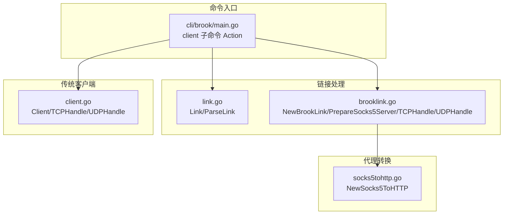
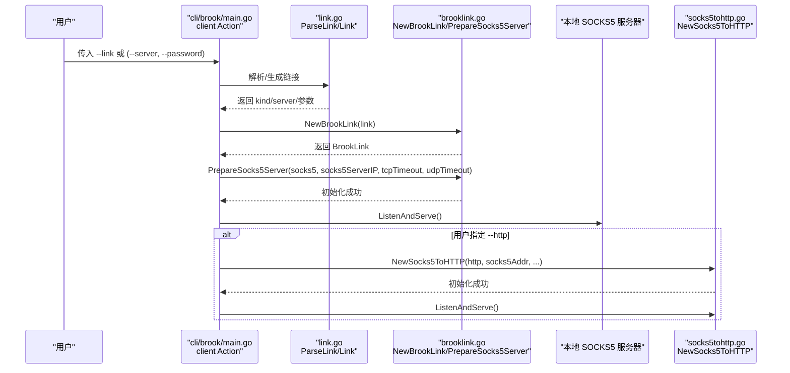
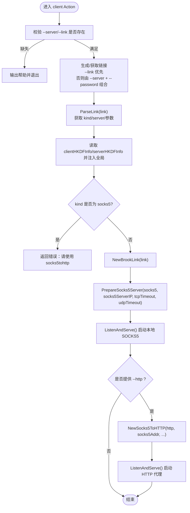
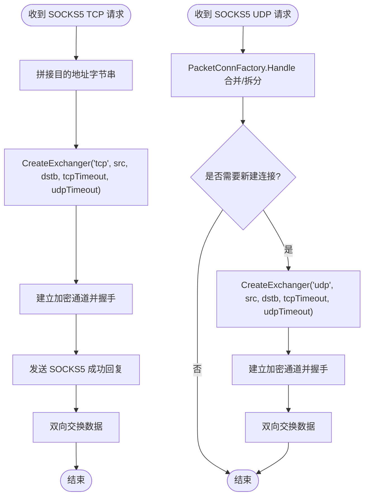
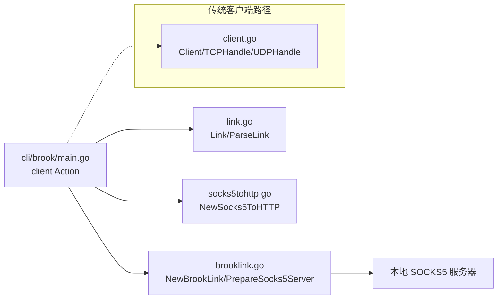

# client 命令

<cite>
**本文引用的文件列表**
- [cli/brook/main.go](file://cli/brook/main.go)
- [brooklink.go](file://brooklink.go)
- [link.go](file://link.go)
- [socks5tohttp.go](file://socks5tohttp.go)
- [client.go](file://client.go)
</cite>

## 目录
1. [简介](#简介)
2. [项目结构](#项目结构)
3. [核心组件](#核心组件)
4. [架构总览](#架构总览)
5. [详细组件分析](#详细组件分析)
6. [依赖关系分析](#依赖关系分析)
7. [性能考量](#性能考量)
8. [故障排查指南](#故障排查指南)
9. [结论](#结论)
10. [附录：配置示例与常见场景](#附录配置示例与常见场景)

## 简介
本文件面向使用 Brook 的用户与开发者，系统性解析命令行子命令“client”的实现机制与使用方法。重点围绕以下目标展开：
- 基于 Action 函数与 NewBrookLink 的协作，说明如何创建并启动一个 SOCKS5 本地代理，同时与 Brook 服务器建立加密通道。
- 深入解释关键参数：--server、--password、--link、--socks5、--http 的作用与优先级。
- 解析 link 参数的生成与解析流程，明确其在 client 命令中的优先级与处理逻辑。
- 说明客户端如何处理 TCP 和 UDP 流量，如何通过 PrepareSocks5Server 设置本地 SOCKS5 代理，以及如何将 SOCKS5 流量转换为 HTTP 代理（NewSocks5ToHTTP）。
- 提供配置示例与常见使用场景，帮助快速上手。

## 项目结构
client 命令位于命令入口文件中，实际的连接与代理逻辑由多个核心模块协同完成：
- 命令入口与参数解析：cli/brook/main.go 中的 client 子命令 Action。
- 链接生成与解析：link.go 的 Link 与 ParseLink。
- Brook 链接封装与代理：brooklink.go 的 NewBrookLink 与相关方法。
- SOCKS5 到 HTTP 代理转换：socks5tohttp.go 的 NewSocks5ToHTTP。
- 传统客户端（非 Brook 链接）：client.go 的 Client 结构与处理逻辑。

图表来源
- [cli/brook/main.go](file://cli/brook/main.go#L403-L527)
- [link.go](file://link.go#L22-L37)
- [brooklink.go](file://brooklink.go#L54-L147)
- [socks5tohttp.go](file://socks5tohttp.go#L41-L61)
- [client.go](file://client.go#L34-L144)

章节来源
- [cli/brook/main.go](file://cli/brook/main.go#L403-L527)

## 核心组件
- client 子命令 Action：负责解析参数、生成或解析链接、准备本地 SOCKS5 代理、可选地开启 HTTP 代理转换，并启动运行时循环。
- NewBrookLink：解析链接，构造 BrookLink 对象，决定底层传输（TCP/UDP），并根据 kind 选择不同的连接方式（如 server、wsserver、wssserver、quicserver）。
- PrepareSocks5Server：初始化本地 SOCKS5 服务器，设置 TCP/UDP 超时与 UDP over TCP 等选项。
- TCPHandle/UDPHandle：处理来自本地 SOCKS5 客户端的请求，建立到远端服务器的加密通道并进行数据交换。
- NewSocks5ToHTTP：将本地 SOCKS5 代理转换为 HTTP 代理监听，便于某些仅支持 HTTP 的应用使用。

章节来源
- [cli/brook/main.go](file://cli/brook/main.go#L455-L526)
- [brooklink.go](file://brooklink.go#L279-L375)
- [socks5tohttp.go](file://socks5tohttp.go#L41-L61)
- [client.go](file://client.go#L53-L144)

## 架构总览
client 命令的整体工作流如下：
- 解析参数：优先使用 --link；若未提供，则由 --server 与 --password 组合生成链接。
- 解析链接：调用 ParseLink 获取 kind、server、参数集合。
- 创建 BrookLink：NewBrookLink 根据 kind 与参数构造连接配置。
- 准备本地 SOCKS5：PrepareSocks5Server 初始化本地 SOCKS5 服务器。
- 启动监听：ListenAndServe 接收本地 SOCKS5 请求。
- 可选：启动 HTTP 代理转换：NewSocks5ToHTTP 将 SOCKS5 流量转换为 HTTP。

图表来源
- [cli/brook/main.go](file://cli/brook/main.go#L455-L526)
- [link.go](file://link.go#L22-L37)
- [brooklink.go](file://brooklink.go#L54-L147)
- [socks5tohttp.go](file://socks5tohttp.go#L41-L61)

## 详细组件分析

### client 子命令 Action 的执行流程
- 参数校验：要求至少提供 --server 或 --link；若两者都为空则输出帮助。
- 链接生成优先级：
  - 若提供 --server 且未提供 --link，则使用 Link(kind, server, v) 生成链接；
  - 若提供 --link，则直接使用该链接。
- 解析链接：ParseLink(link) 获取 kind、server、参数集合。
- HKDF 信息注入：从链接参数中读取 clientHKDFInfo 与 serverHKDFInfo 并写入全局配置。
- 类型保护：若 kind 为 socks5，直接报错提示用户改用 socks5tohttp。
- 创建与准备：NewBrookLink(link) 构造对象，PrepareSocks5Server(socks5, socks5ServerIP, ...) 初始化本地 SOCKS5。
- 启动监听：ListenAndServe() 开始接收本地连接。
- 可选 HTTP 转换：若提供 --http，则创建并启动 NewSocks5ToHTTP(http, socks5Addr, ...)。

图表来源
- [cli/brook/main.go](file://cli/brook/main.go#L455-L526)

章节来源
- [cli/brook/main.go](file://cli/brook/main.go#L455-L526)

### NewBrookLink 的链接解析与传输选择
- 解析阶段：ParseLink(link) 返回 kind、server、参数集合。
- 不同 kind 的处理：
  - server：直接使用 server 作为地址。
  - socks5/wsserver/wssserver/quicserver：解析 URL，提取 host/path/address 等；根据 kind 设置 TLS 配置、指纹与分片参数等。
- 密码处理：wsserver/wssserver/quicserver 在 withoutBrookProtocol=true 时使用 SHA256(password)。
- 返回 BrookLink：包含 Kind、Address、Host、Path、Password、TLS 配置、分片参数等字段。

章节来源
- [brooklink.go](file://brooklink.go#L54-L147)
- [link.go](file://link.go#L22-L37)

### PrepareSocks5Server 与本地 SOCKS5 代理
- Raise 系统资源限制：提升文件描述符与缓冲区等。
- 初始化 SOCKS5 服务器：NewClassicServer(addr, ip, "", "", tcpTimeout, udpTimeout)。
- 初始化 UDP 包工厂：NewPacketConnFactory，用于 UDP 数据包的合并与转发。
- 设置超时：保存 tcpTimeout 与 udpTimeout 以供后续处理使用。

章节来源
- [brooklink.go](file://brooklink.go#L279-L308)

### TCP/UDP 处理流程（TCPHandle/UDPHandle）
- TCP：
  - CmdConnect：建立到远端服务器的加密通道（NewStreamClient），发送目的地址信息，成功后双向交换数据。
- UDP：
  - 使用 PacketConnFactory.Handle 合并/拆分 UDP 包，必要时通过 NATDial 建立 UDP 或 UDP-over-TCP 通道，再通过 NewPacketClient 或 NewStreamClient 进行数据交换。
- UDP over TCP：当服务器支持 UDP over TCP 时，通过 NATDial 建立 TCP 连接承载 UDP 报文。

图表来源
- [brooklink.go](file://brooklink.go#L314-L370)
- [client.go](file://client.go#L57-L139)

章节来源
- [brooklink.go](file://brooklink.go#L149-L277)
- [client.go](file://client.go#L57-L139)

### SOCKS5 到 HTTP 代理转换（NewSocks5ToHTTP）
- 功能：将本地 SOCKS5 代理转换为 HTTP 代理监听，便于仅支持 HTTP 的应用使用。
- 关键点：
  - 通过 golang.org/x/net/proxy.SOCKS5 建立到本地 SOCKS5 的拨号器。
  - 解析 HTTP 请求首行，识别 CONNECT 或普通 GET/POST 等方法。
  - 对 CONNECT：向客户端返回“连接已建立”，随后双向转发数据。
  - 对非 CONNECT：将原始请求写入到远端 TCP 连接，再将响应回传给客户端。
- 超时控制：对客户端与远端连接分别设置 deadline。

章节来源
- [socks5tohttp.go](file://socks5tohttp.go#L41-L191)

## 依赖关系分析
- 命令入口依赖：
  - link.go：生成与解析链接。
  - brooklink.go：创建 BrookLink 并处理本地 SOCKS5 与远端通信。
  - socks5tohttp.go：可选的 HTTP 代理转换。
- 传统客户端（非 Brook 链接）：
  - client.go：提供基于 socks5 库的本地 SOCKS5 服务器与 TCP/UDP 处理逻辑，适用于非 Brook 链接场景。

图表来源
- [cli/brook/main.go](file://cli/brook/main.go#L455-L526)
- [link.go](file://link.go#L22-L37)
- [brooklink.go](file://brooklink.go#L54-L147)
- [socks5tohttp.go](file://socks5tohttp.go#L41-L61)
- [client.go](file://client.go#L34-L144)

章节来源
- [cli/brook/main.go](file://cli/brook/main.go#L455-L526)
- [link.go](file://link.go#L22-L37)
- [brooklink.go](file://brooklink.go#L54-L147)
- [socks5tohttp.go](file://socks5tohttp.go#L41-L61)
- [client.go](file://client.go#L34-L144)

## 性能考量
- 系统资源限制：PrepareSocks5Server 会尝试提升系统限制（如文件描述符、UDP 接收缓冲区），以改善高并发下的稳定性。
- UDP over TCP：当服务器支持 UDP over TCP 时，可避免 UDP 封装问题，但会增加 TCP 握手与拥塞控制开销。
- QUIC 场景：在 quicserver 下，可能需要调整内核参数以提升 UDP 缓冲区大小。
- 超时设置：合理设置 tcpTimeout 与 udpTimeout，避免长时间占用连接导致资源泄漏。
- HTTP 转换：NewSocks5ToHTTP 会对每个连接设置 deadline，建议根据网络状况调整。

章节来源
- [brooklink.go](file://brooklink.go#L279-L308)

## 故障排查指南
- “从 socks5 再创建 socks5”错误：当 --link 的 kind 为 socks5 时，client 会拒绝并提示改用 socks5tohttp。
- 仅提供端口的 socks5 监听地址：UDP 需要明确的 IP，仅端口会导致错误。请显式设置 socks5ServerIP 或使用可解析的监听地址。
- 链接格式错误：确保 --link 符合 Brook 链接规范，或使用 --server 与 --password 正确组合生成。
- TLS/证书问题：对于 wssserver/quicserver，若证书不受信或指纹不匹配，需正确配置 insecure、ca、tlsfingerprint 等参数。
- UDP 丢包或延迟：尝试启用 UDP over TCP（udpovertcp），或调整系统 UDP 缓冲区大小。

章节来源
- [cli/brook/main.go](file://cli/brook/main.go#L492-L494)
- [cli/brook/main.go](file://cli/brook/main.go#L476-L481)
- [brooklink.go](file://brooklink.go#L86-L131)

## 结论
client 命令通过“链接优先”的设计，将用户输入统一为 Brook 链接，从而在不同传输协议（server、wsserver、wssserver、quicserver）之间保持一致的代理体验。其核心在于：
- 链接解析与传输选择：NewBrookLink 根据 kind 与参数选择合适的底层连接方式。
- 本地 SOCKS5 代理：PrepareSocks5Server 初始化本地代理，TCPHandle/UDPHandle 负责与远端加密通道的数据交换。
- HTTP 代理转换：NewSocks5ToHTTP 为仅支持 HTTP 的应用提供兼容能力。
- 参数优先级：--link 优先于 --server/--password 组合，确保用户可直接复用现有链接。

## 附录：配置示例与常见场景
- 仅使用链接
  - 使用 --link 直接启动 client，无需 --server 与 --password。
- 通过 --server 与 --password 生成链接
  - 当未提供 --link 时，client 会将 --server 与 --password 组合为链接（kind 依据 server 前缀自动判断）。
- 指定本地 SOCKS5 监听地址与 IP
  - --socks5 指定监听地址；--socks5ServerIP 指定用于 UDP 的服务器 IP（在某些网络环境下必须显式指定）。
- 启用 HTTP 代理转换
  - --http 指定 HTTP 代理监听地址，client 将把本地 SOCKS5 流量转换为 HTTP 代理。
- UDP over TCP
  - 在 server 场景下，可通过链接参数启用 udpovertcp，以解决部分网络环境下的 UDP 限制。
- QUIC 场景
  - 在 quicserver 场景下，可能需要设置 udpoverstream 以提升 UDP 性能与稳定性。

章节来源
- [cli/brook/main.go](file://cli/brook/main.go#L455-L526)
- [link.go](file://link.go#L22-L37)
- [brooklink.go](file://brooklink.go#L149-L277)
- [socks5tohttp.go](file://socks5tohttp.go#L41-L61)