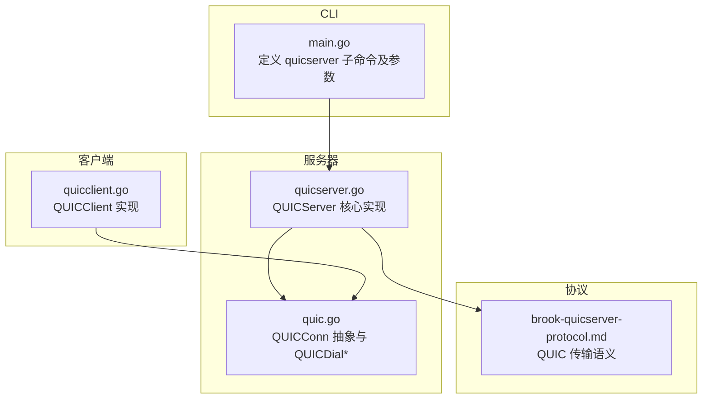
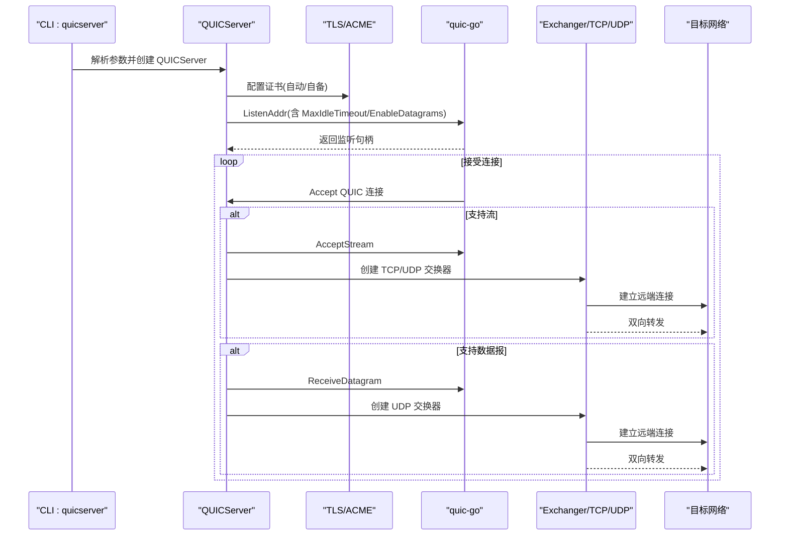
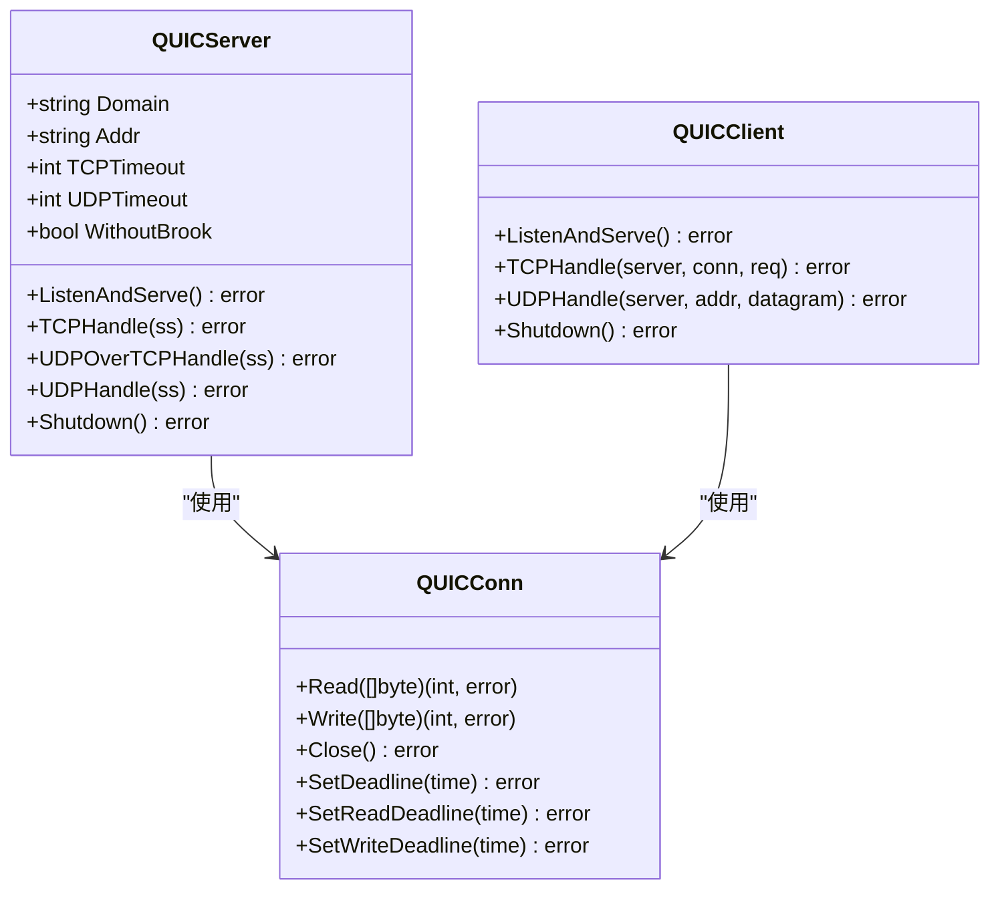

# quicserver 命令

<cite>
**本文引用的文件**
- [cli/brook/main.go](file://cli/brook/main.go)
- [quicserver.go](file://quicserver.go)
- [quic.go](file://quic.go)
- [quicclient.go](file://quicclient.go)
- [protocol/brook-quicserver-protocol.md](file://protocol/brook-quicserver-protocol.md)
- [OPENSOURCELICENSES](file://OPENSOURCELICENSES)
</cite>

## 目录
1. [简介](#简介)
2. [项目结构](#项目结构)
3. [核心组件](#核心组件)
4. [架构总览](#架构总览)
5. [详细组件分析](#详细组件分析)
6. [依赖关系分析](#依赖关系分析)
7. [性能与鲁棒性](#性能与鲁棒性)
8. [故障排查指南](#故障排查指南)
9. [结论](#结论)
10. [附录：启动示例与兼容性](#附录启动示例与兼容性)

## 简介
本文件面向“quicserver”命令，系统化阐述基于 QUIC 协议的代理服务器实现。该命令通过 quic-go 库在单端口上同时承载 TCP 流与 UDP 数据报，提供低时延、抗丢包的代理能力，并支持可选的“无 Brook 协议封装”模式以适配更广泛的客户端生态。文档将结合命令参数、QUIC 连接建立流程、数据流处理逻辑、与 quic-go 的集成方式，以及在高丢包网络下的性能优势进行深入解析，并给出启动示例与兼容性说明。

## 项目结构
- 命令入口位于 CLI 主程序中，定义了 quicserver 子命令及其参数。
- 服务器核心实现在 QUICServer 类型中，负责监听、证书管理、连接接受、流与数据报处理。
- QUIC 会话抽象通过 QUICConn 将 QUIC 连接与 QUIC 流/数据报统一为 net.Conn 接口，便于上层复用现有交换器（Exchanger）。
- 客户端侧有对应的 QUICClient 实现，用于验证与兼容性测试。

图表来源
- [cli/brook/main.go](file://cli/brook/main.go#L1044-L1184)
- [quicserver.go](file://quicserver.go#L1-L277)
- [quic.go](file://quic.go#L1-L174)
- [quicclient.go](file://quicclient.go#L1-L189)
- [protocol/brook-quicserver-protocol.md](file://protocol/brook-quicserver-protocol.md#L1-L25)

章节来源
- [cli/brook/main.go](file://cli/brook/main.go#L1044-L1184)

## 核心组件
- QUICServer：服务器主体，负责：
  - 初始化系统资源与 UDP 缓冲区
  - 选择密码派生策略（是否启用 Brook 协议封装）
  - TLS 配置与证书管理（自动签发或自备证书）
  - 监听地址与超时设置
  - 接受 QUIC 连接，分别处理 QUIC 流（TCP over QUIC）与 QUIC 数据报（UDP over QUIC）
- QUICConn：将 QUIC 连接、流、数据报统一封装为 net.Conn，供上层 Exchanger 使用
- QUICDial*：客户端侧拨号函数，创建 QUIC 连接并返回 QUICConn
- 协议文档：明确 QUIC 上的 TCP/UDP 传输语义与最大数据报限制

章节来源
- [quicserver.go](file://quicserver.go#L34-L89)
- [quicserver.go](file://quicserver.go#L92-L236)
- [quic.go](file://quic.go#L26-L99)
- [quic.go](file://quic.go#L101-L174)
- [protocol/brook-quicserver-protocol.md](file://protocol/brook-quicserver-protocol.md#L1-L25)

## 架构总览
下图展示 quicserver 启动后的主要组件交互与数据路径。

图表来源
- [quicserver.go](file://quicserver.go#L92-L236)
- [quic.go](file://quic.go#L26-L99)

## 详细组件分析

### 命令定义与参数
- 子命令名称：quicserver
- 关键参数：
  - --domainaddress：形如 domain.com:443，用于 TLS SNI 与 ACME 自动签发域名白名单
  - --password/-p：服务器密码，作为密钥材料或派生输入
  - --cert/--certkey：自备证书与私钥文件路径（绝对路径）
  - --withoutBrookProtocol：禁用 Brook 协议封装，使用简单加密（SHA256）
  - --tcpTimeout：TCP 超时（秒）
  - --udpTimeout：UDP 超时（秒）
  - --blockDomainList/--blockCIDR4List/--blockCIDR6List/--blockGeoIP：全局阻断列表（同 CLI 全局参数）
  - --example：输出最小使用示例
- 行为要点：
  - 必须提供 --domainaddress 与 --password
  - 若提供 --cert 或 --certkey，需为绝对路径
  - 支持全局阻断列表与更新周期
  - 证书未提供时，自动通过 ACME 在 80 端口处理挑战

章节来源
- [cli/brook/main.go](file://cli/brook/main.go#L1044-L1184)

### QUICServer 初始化与资源提升
- 系统资源提升：
  - Linux：尝试增大 UDP 接收缓冲上限
  - macOS：尝试增大套接字最大缓冲
- 密码派生策略：
  - 默认：直接使用明文密码
  - withoutBrookProtocol：对密码进行 SHA256 派生
- UDP 工厂选择：
  - 默认：PacketServerConnFactory（带 Brook 协议封装）
  - withoutBrookProtocol：SimplePacketServerConnFactory（简化封装）

章节来源
- [quicserver.go](file://quicserver.go#L47-L90)

### TLS 与证书管理
- 证书来源优先级：
  - 若提供 --cert 与 --certkey，则加载自备证书
  - 否则启用 autocert 管理器，仅允许指定域名，自动处理 HTTP-01 挑战
- TLS 配置：
  - NextProtos 设置为 h3
  - ServerName 指定为 --domainaddress 中的域名
- HTTP-01 辅助：
  - 启动一个临时 HTTP 服务器监听 :80，用于 ACME 挑战

章节来源
- [quicserver.go](file://quicserver.go#L92-L118)
- [quicserver.go](file://quicserver.go#L119-L122)

### 连接接受与多路复用
- 监听配置：
  - MaxIdleTimeout 来自 --udpTimeout
  - EnableDatagrams 开启，允许 UDP over QUIC 数据报
- 连接接受：
  - Accept QUIC 连接
  - 并发处理：
    - 流：AcceptStream -> 创建 TCP/UDP 交换器 -> 建立远端连接 -> 双向转发
    - 数据报：ReceiveDatagram -> 通过工厂解包/打包 -> 建立远端连接 -> 双向转发
- 保活与探测：
  - 启动后短暂拨号一次，确保握手与路径可达性

章节来源
- [quicserver.go](file://quicserver.go#L119-L177)
- [quicserver.go](file://quicserver.go#L177-L236)

### QUICConn 抽象与数据路径
- QUICConn 将 QUIC 连接与流/数据报统一为 net.Conn：
  - Read：若存在流则从流读取；否则从数据报读取
  - Write：若存在流则写入流；否则发送数据报
  - Close：关闭流、连接与底层 UDP
  - SetDeadline/SetReadDeadline/SetWriteDeadline：优先使用流级 deadline，否则由 QUIC 配置控制空闲超时
- 该抽象使得上层 Exchanger 可以透明地在 TCP/UDP 场景下工作

章节来源
- [quic.go](file://quic.go#L101-L174)

### 协议与最大数据报限制
- QUIC 上的 TCP/UDP 传输语义与常规 brook 协议一致，区别在于：
  - TCP：通过 QUIC 流承载
  - UDP：通过 QUIC 数据报承载
- 当前 quic-go 的数据报最大长度限制为 1197 字节，未来可能依据 RFC9221 变化

章节来源
- [protocol/brook-quicserver-protocol.md](file://protocol/brook-quicserver-protocol.md#L1-L25)

### 与 quic-go 的集成
- 依赖版本与许可证信息见开源许可文件
- 服务器侧：
  - 使用 quic-go 的 ListenAddr、Accept、AcceptStream、ReceiveDatagram、SendDatagram
  - 通过 quic.Config 控制空闲超时与数据报能力
- 客户端侧：
  - 使用 QUICDialTCP/QUICDialUDP 创建 QUIC 连接并返回 QUICConn
  - 通过 TLS 配置与 NextProtos=h3 协商

章节来源
- [quicserver.go](file://quicserver.go#L119-L177)
- [quic.go](file://quic.go#L26-L99)
- [OPENSOURCELICENSES](file://OPENSOURCELICENSES#L911-L936)

## 依赖关系分析

图表来源
- [quicserver.go](file://quicserver.go#L34-L89)
- [quicserver.go](file://quicserver.go#L92-L236)
- [quic.go](file://quic.go#L101-L174)
- [quicclient.go](file://quicclient.go#L29-L89)

章节来源
- [quicserver.go](file://quicserver.go#L34-L89)
- [quic.go](file://quic.go#L101-L174)
- [quicclient.go](file://quicclient.go#L29-L89)

## 性能与鲁棒性
- 多路复用与低延迟：
  - QUIC 流与数据报在同一连接内复用，减少握手与建连开销
  - 服务器并发处理流与数据报，降低队头阻塞影响
- 空闲超时与保活：
  - MaxIdleTimeout 由 --udpTimeout 控制，避免长时间空闲连接占用资源
  - 启动后主动拨号一次，有助于路径验证与 NAT 映射保持
- UDP 最大数据报限制：
  - 当前限制为 1197 字节，超出将被拒绝或需要拆分
  - 对于大 UDP 包，建议客户端使用“UDP over Stream”模式（参见链接生成工具的 udpoverstream 参数）
- 高丢包网络下的优势：
  - QUIC 基于 UDP，具备拥塞控制与重传机制，相比 TCP 更适合高丢包场景
  - 服务器端默认启用数据报能力，便于 UDP 业务直通
- 系统资源优化：
  - 启动时尝试提升 UDP 接收缓冲上限，改善高吞吐 UDP 场景表现

章节来源
- [quicserver.go](file://quicserver.go#L119-L177)
- [quicserver.go](file://quicserver.go#L47-L90)
- [protocol/brook-quicserver-protocol.md](file://protocol/brook-quicserver-protocol.md#L1-L25)
- [cli/brook/main.go](file://cli/brook/main.go#L1543-L1654)

## 故障排查指南
- 证书问题
  - 若未提供 --cert/--certkey，服务器将尝试自动签发。请确保域名已解析到服务器 IP，且 80 端口可访问
  - 如需自签证书，请提供绝对路径的 --cert 与 --certkey
- 参数校验
  - 必须提供 --domainaddress 与 --password
  - 阻断列表与 PID 文件等全局参数需满足绝对路径要求
- UDP 超长数据报
  - 当客户端发送的 UDP 数据报超过 1197 字节时会被拒绝
  - 建议在生成链接时开启“UDP over Stream”选项，或在客户端侧进行分片
- 日志与调试
  - 可通过 CLI 全局日志开关与标签参数辅助定位问题
  - 服务器端错误会记录到日志，包含源地址与目标地址信息

章节来源
- [cli/brook/main.go](file://cli/brook/main.go#L1044-L1184)
- [quicserver.go](file://quicserver.go#L177-L236)
- [protocol/brook-quicserver-protocol.md](file://protocol/brook-quicserver-protocol.md#L1-L25)

## 结论
quicserver 命令通过 quic-go 在同一端口上高效承载 TCP 流与 UDP 数据报，结合 TLS/ACME 证书管理与系统资源优化，在低时延与高丢包环境下提供稳定可靠的代理服务。其参数设计与协议语义与现有 brook 生态保持一致，便于与既有工具链协同使用。对于大 UDP 包场景，建议配合“UDP over Stream”模式以规避数据报大小限制。

## 附录：启动示例与兼容性

- 启动示例
  - 使用自动证书：brook quicserver --domainaddress domain.com:9999 --password hello
  - 使用自备证书：brook quicserver --domainaddress domain.com:443 --password hello --cert /abs/path/cert.pem --certkey /abs/path/certkey.pem
  - 禁用 Brook 协议封装：brook quicserver --domainaddress domain.com:443 --password hello --withoutBrookProtocol
  - 指定超时：brook quicserver --domainaddress domain.com:443 --password hello --tcpTimeout 30 --udpTimeout 60

- 与其他 QUIC 客户端的兼容性
  - 服务器支持标准 h3 协议，可与遵循 quic-go 的客户端互通
  - 对于大 UDP 包，建议客户端使用“UDP over Stream”模式（参见链接生成工具的 udpoverstream 参数）
  - 若客户端不支持数据报，可使用 withoutBrookProtocol 模式，但需确保客户端侧同样启用相应封装

章节来源
- [cli/brook/main.go](file://cli/brook/main.go#L1044-L1184)
- [cli/brook/main.go](file://cli/brook/main.go#L1543-L1654)
- [protocol/brook-quicserver-protocol.md](file://protocol/brook-quicserver-protocol.md#L1-L25)