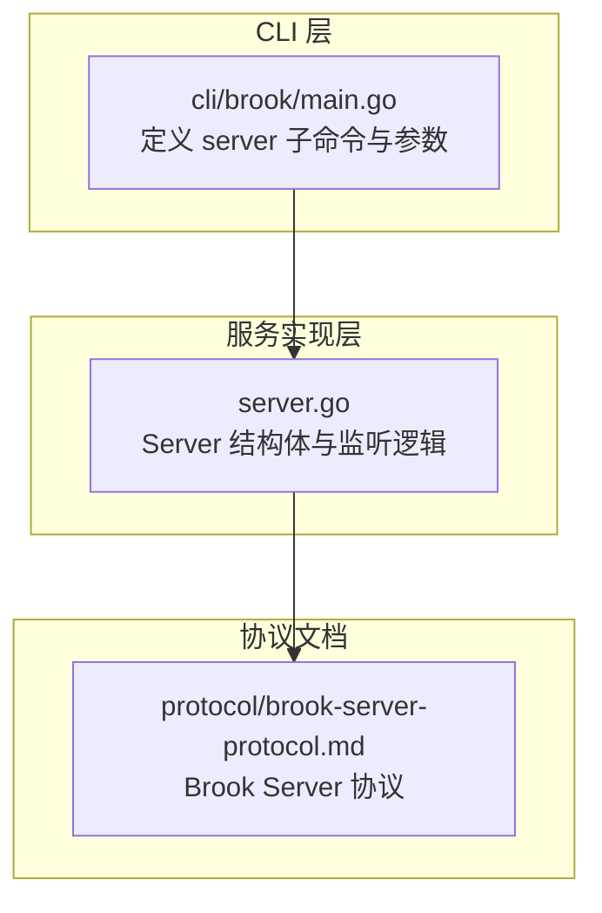
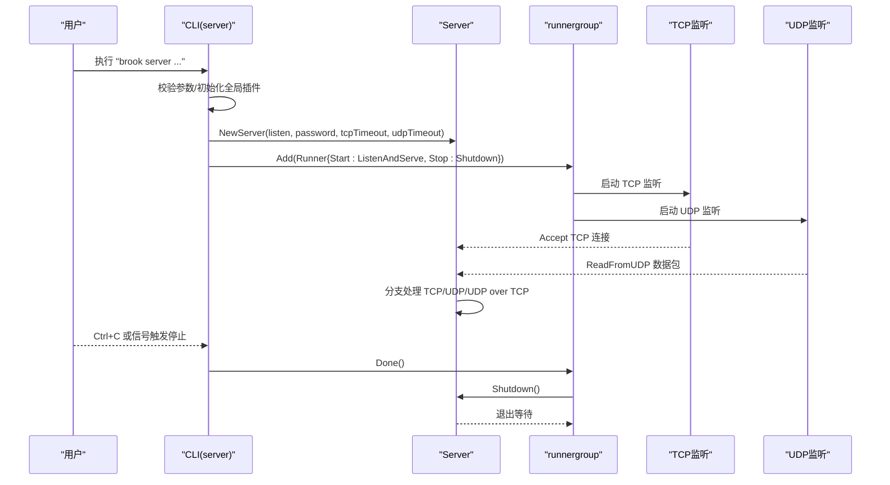
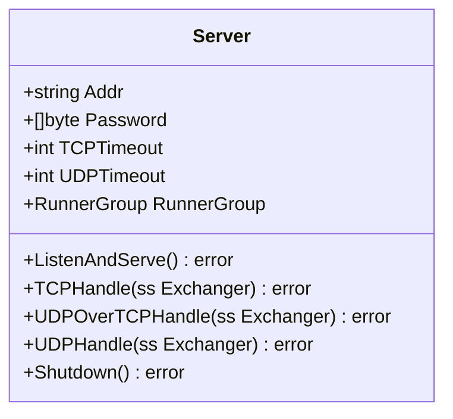
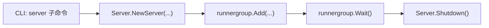

# server 命令

<cite>
**本文引用的文件列表**
- [cli/brook/main.go](file://cli/brook/main.go)
- [server.go](file://server.go)
- [brook-server-protocol.md](file://protocol/brook-server-protocol.md)
- [README.md](file://README.md)
</cite>

## 目录
1. [简介](#简介)
2. [项目结构](#项目结构)
3. [核心组件](#核心组件)
4. [架构总览](#架构总览)
5. [详细组件分析](#详细组件分析)
6. [依赖关系分析](#依赖关系分析)
7. [性能考量](#性能考量)
8. [故障排查指南](#故障排查指南)
9. [结论](#结论)
10. [附录](#附录)

## 简介
本文件系统化梳理 brook 的 server 命令，说明其如何启动一个同时支持 TCP 和 UDP 的 Brook 服务器。内容覆盖：
- 命令行参数详解：--listen、--password、--tcpTimeout、--udpTimeout 等
- 全局参数对日志、监控、网络控制的影响
- 启动与生命周期管理（通过 runnergroup）
- 与 Brook Server 协议的关系
- 与客户端命令的配合使用方式

## 项目结构
server 命令由 CLI 层与服务实现层组成：
- CLI 层负责解析参数、初始化全局插件（日志、pprof、监控、网络控制等），并创建与启动 Server 实例
- 服务实现层负责监听 TCP/UDP、处理连接、转发数据流，并通过 runnergroup 统一生命周期管理

图表来源
- [cli/brook/main.go](file://cli/brook/main.go#L296-L401)
- [server.go](file://server.go#L25-L179)
- [brook-server-protocol.md](file://protocol/brook-server-protocol.md#L1-L127)

章节来源
- [cli/brook/main.go](file://cli/brook/main.go#L296-L401)
- [server.go](file://server.go#L25-L179)

## 核心组件
- server 子命令：解析参数并创建 Server 实例，加入 runnergroup 生命周期管理
- Server 结构体：封装监听地址、密码、超时、runnergroup 等
- 协议规范：定义 TCP/UDP/UDP over TCP 的数据帧格式与密钥派生

章节来源
- [cli/brook/main.go](file://cli/brook/main.go#L296-L401)
- [server.go](file://server.go#L25-L179)
- [brook-server-protocol.md](file://protocol/brook-server-protocol.md#L1-L127)

## 架构总览
server 命令的执行流程如下：
- CLI 解析参数，必要时初始化全局插件（日志、pprof、监控、网络控制）
- 创建 Server 实例并注册到 runnergroup
- runnergroup 并发启动 TCP/UDP 监听任务
- 连接到来后，分别进入 TCP/UDP/UDP over TCP 处理路径
- 通过 Shutdown 触发 runnergroup 停止，优雅关闭

图表来源
- [cli/brook/main.go](file://cli/brook/main.go#L352-L401)
- [server.go](file://server.go#L47-L138)

## 详细组件分析

### CLI 参数与行为
- 子命令名称与用法
  - 名称："server"
  - 用法："Start a brook server that supports tcp and udp"
- 关键参数
  - --listen/-l：监听地址，如 ":9999"
  - --password/-p：服务器密码
  - --tcpTimeout：TCP 超时（秒），默认 0 表示不超时
  - --udpTimeout：UDP 超时（秒），默认 60
  - --example：输出最小使用示例
  - 旧版块过滤参数（未来版本将移至全局）：--blockDomainList、--blockCIDR4List、--blockCIDR6List、--blockGeoIP、--updateListInterval
- 参数校验与帮助
  - 若未提供 --listen 或 --password，则显示子命令帮助
  - 对于旧版块过滤参数，要求绝对路径或远程 URL
- 全局参数影响（在 Before 钩子中生效）
  - --log：启用日志，支持 "console" 或绝对路径；可设置标签
  - --pprof：启用 pprof HTTP 服务
  - --prometheus/--prometheusPath：启用 Prometheus 指标导出
  - --dialWithDNS/--dialWithDNSPrefer：强制域名解析策略
  - --dialWithIP4/--dialWithIP6：强制出站 IPv4/IPv6
  - --dialWithNIC：强制出站网卡
  - --dialWithSocks5 及其认证与超时：强制通过 SOCKS5 出站
  - --blockDomainList/--blockCIDR4List/--blockCIDR6List/--blockGeoIP 及更新间隔：启用阻断列表
  - --pid：写入进程 PID 文件

章节来源
- [cli/brook/main.go](file://cli/brook/main.go#L296-L401)
- [cli/brook/main.go](file://cli/brook/main.go#L164-L295)

### Server 实现与生命周期
- 结构体字段
  - Addr：监听地址
  - Password：密码字节切片
  - TCPTimeout/UDPTimeout：超时秒数
  - RunnerGroup：runnergroup.RunnerGroup
- 初始化
  - NewServer：设置字段并创建 runnergroup
  - 启动前尝试提升系统限制
- 监听与处理
  - ListenAndServe：同时启动 TCP 与 UDP 监听
    - TCP：Accept 后为每个连接创建 StreamServer，按网络类型分派到 TCPHandle 或 UDPOverTCPHandle
    - UDP：使用 PacketServerConnFactory 将报文解包为连接对象，再交由 UDPHandle
  - TCPHandle：建立到目标地址的 TCP 连接并双向交换
  - UDPOverTCPHandle/UDPHandle：通过 NATDial 建立 UDP 连接并交换
- 生命周期管理
  - runnergroup.Runner.Start：调用 ListenAndServe
  - runnergroup.Runner.Stop：调用 Shutdown，内部触发 runnergroup.Done，使 Wait 返回

图表来源
- [server.go](file://server.go#L25-L179)

章节来源
- [server.go](file://server.go#L25-L179)

### 协议关系与数据流
- Brook Server 协议定义了客户端与服务器之间的加密与帧格式，包括：
  - TCP 客户端/服务器帧格式
  - UDP 客户端/服务器帧格式
  - UDP over TCP 客户端/服务器帧格式
  - 密钥派生（HKDF-SHA256）与 AES-GCM 加解密
- server 命令在实现上会根据网络类型选择对应处理函数：
  - TCP：TCPHandle
  - UDP over TCP：UDPOverTCPHandle
  - UDP：UDPHandle

章节来源
- [brook-server-protocol.md](file://protocol/brook-server-protocol.md#L1-L127)
- [server.go](file://server.go#L140-L174)

### 使用示例与最佳实践
- 最小示例
  - 参考 README 中的示例命令
- 常见组合
  - 启用日志：--log console 或 --log /absolute/path.log
  - 启用 pprof：--pprof :6060
  - 启用 Prometheus：--prometheus :7070 --prometheusPath /metrics
  - 强制出站策略：--dialWithSocks5 127.0.0.1:1080、--dialWithIP4 192.168.1.100、--dialWithNIC eth0
  - 阻断策略：--blockDomainList /etc/brook/block_domains.txt、--blockCIDR4List /etc/brook/cidr4.txt、--blockCIDR6List /etc/brook/cidr6.txt、--blockGeoIP US,CN
- 与客户端配合
  - 客户端通过 --server 或 --link 指向服务器地址与密码
  - 客户端可开启本地 SOCKS5/HTTP 代理，作为转发入口

章节来源
- [README.md](file://README.md#L1-L44)
- [cli/brook/main.go](file://cli/brook/main.go#L403-L549)

## 依赖关系分析
- CLI 与 Server 的耦合
  - CLI 仅负责参数解析与实例创建，Server 内部完成监听与处理
- runnergroup 的作用
  - 统一管理多个 Runner 的启动与停止，确保优雅退出
- 插件与全局参数
  - 日志、pprof、Prometheus、网络控制等在 Before 钩子中注入，影响后续所有 Runner

图表来源
- [cli/brook/main.go](file://cli/brook/main.go#L352-L401)
- [server.go](file://server.go#L176-L179)

章节来源
- [cli/brook/main.go](file://cli/brook/main.go#L164-L295)
- [server.go](file://server.go#L47-L138)

## 性能考量
- 超时设置
  - --tcpTimeout 与 --udpTimeout 影响连接空闲与 NAT 保活，建议根据网络环境合理设置
- 系统资源
  - 启动前尝试提升系统限制，有助于提高并发与连接上限
- 监控与诊断
  - 启用 --pprof 与 --prometheus 可辅助定位性能瓶颈与指标观测

## 故障排查指南
- 常见错误与提示
  - 缺少 --listen 或 --password：显示子命令帮助
  - 旧版块过滤参数路径非法：要求绝对路径或远程 URL
  - 全局参数路径非法：--log、--pid 等需绝对路径
  - SOCKS5 UDP 服务器需要明确 IP：仅端口无法满足
- 排查步骤
  - 检查监听地址是否被占用
  - 校验密码一致性
  - 查看日志输出位置与权限
  - 使用 --pprof 抓取堆栈与性能数据
  - 检查网络控制参数是否符合预期（DNS/IP/NIC/SOCKS5）

章节来源
- [cli/brook/main.go](file://cli/brook/main.go#L352-L401)
- [cli/brook/main.go](file://cli/brook/main.go#L164-L295)

## 结论
server 命令通过清晰的参数设计与统一的 runnergroup 生命周期管理，提供了稳定可靠的 TCP/UDP 服务器能力。结合全局参数，可在日志、监控、网络控制等方面灵活扩展。配合客户端命令，可快速构建跨平台的代理链路。

## 附录
- 相关命令参考
  - README 提供最小示例与安装指引
  - 客户端命令与链接生成用于与 server 建立连接

章节来源
- [README.md](file://README.md#L1-L44)