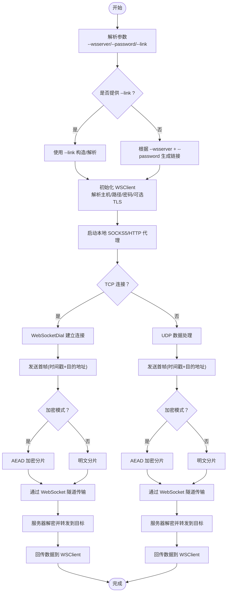

# wsclient 命令

<cite>
**本文引用的文件**
- [cli/brook/main.go](file://cli/brook/main.go)
- [wsclient.go](file://wsclient.go)
- [websocket.go](file://websocket.go)
- [streamclient.go](file://streamclient.go)
- [simplestreamclient.go](file://simplestreamclient.go)
- [wsserver.go](file://wsserver.go)
- [protocol/brook-wsserver-protocol.md](file://protocol/brook-wsserver-protocol.md)
- [protocol/brook-wssserver-protocol.md](file://protocol/brook-wssserver-protocol.md)
- [link.go](file://link.go)
</cite>

## 目录
1. [简介](#简介)
2. [项目结构](#项目结构)
3. [核心组件](#核心组件)
4. [架构总览](#架构总览)
5. [详细组件分析](#详细组件分析)
6. [依赖关系分析](#依赖关系分析)
7. [性能考量](#性能考量)
8. [故障排查指南](#故障排查指南)
9. [结论](#结论)
10. [附录：完整使用示例](#附录完整使用示例)

## 简介
本指南面向希望使用 wsclient 命令作为 WebSocket 客户端的用户，系统性讲解其如何连接到 wsserver 或 wssserver，建立 WebSocket 隧道，并将本地 SOCKS5/HTTP 流量封装为 WebSocket 帧进行传输。文档重点说明：
- 连接参数 --wsserver、--password、--link 的区别与使用优先级
- 如何通过 --socks5 和 --http 在本地创建代理服务
- wsclient 如何将本地流量封装进 WebSocket 帧并通过隧道传输
- 与 wsserver 协作的完整示例及在网络受限场景下的优势

## 项目结构
wsclient 命令位于 CLI 入口中，实际的 WebSocket 客户端实现位于核心库中，协议规范在 protocol 文档中定义。

图表来源
- [cli/brook/main.go](file://cli/brook/main.go#L648-L771)
- [wsclient.go](file://wsclient.go#L1-L179)
- [websocket.go](file://websocket.go#L1-L232)
- [streamclient.go](file://streamclient.go#L1-L234)
- [simplestreamclient.go](file://simplestreamclient.go#L1-L165)
- [wsserver.go](file://wsserver.go#L1-L200)
- [protocol/brook-wsserver-protocol.md](file://protocol/brook-wsserver-protocol.md#L1-L96)
- [protocol/brook-wssserver-protocol.md](file://protocol/brook-wssserver-protocol.md#L1-L11)

章节来源
- [cli/brook/main.go](file://cli/brook/main.go#L648-L771)

## 核心组件
- wsclient 子命令：负责解析参数、构建链接、启动本地 SOCKS5/HTTP 代理，并通过 WebSocket 与服务器建立隧道。
- WSClient：封装了 WebSocket 握手、密码处理、TCP/UDP 代理逻辑。
- WebSocketDial：完成 TCP 拨号、可选 TLS 握手、WebSocket 升级、可选 TLS 分片。
- 加密/无加密流客户端：将应用数据按协议封装为 WebSocket 帧（含 AEAD 加密或明文）。
- WSServer：接收来自 wsclient 的 WebSocket 连接，解密并转发至目标地址。

章节来源
- [wsclient.go](file://wsclient.go#L1-L179)
- [websocket.go](file://websocket.go#L1-L232)
- [streamclient.go](file://streamclient.go#L1-L234)
- [simplestreamclient.go](file://simplestreamclient.go#L1-L165)
- [wsserver.go](file://wsserver.go#L1-L200)

## 架构总览
wsclient 与 wsserver 的交互流程如下：

图表来源
- [wsclient.go](file://wsclient.go#L88-L174)
- [websocket.go](file://websocket.go#L37-L171)
- [wsserver.go](file://wsserver.go#L148-L191)
- [protocol/brook-wsserver-protocol.md](file://protocol/brook-wsserver-protocol.md#L34-L96)

## 详细组件分析

### 参数与使用优先级
- --wsserver：指定要连接的 WebSocket 服务器地址（ws:// 或 wss://），若未显式指定路径，默认使用 /ws。
- --password：与服务器约定的密码，用于派生密钥或直接使用 SHA256（取决于是否启用 withoutBrook）。
- --link：brook 链接字符串，包含 kind=server 与查询参数。当提供 --link 时，会忽略 --wsserver 与 --password 的单独设置。
- 使用优先级：当同时提供 --link 与 --wsserver/--password 时，以 --link 为准；若仅提供 --wsserver，则必须同时提供 --password。

章节来源
- [cli/brook/main.go](file://cli/brook/main.go#L657-L707)
- [link.go](file://link.go#L22-L38)

### 本地代理服务
- --socks5：本地监听地址，如 127.0.0.1:1080，WSClient 启动后在此暴露 SOCKS5 代理。
- --socks5ServerIP：当本地监听 IP 与 UDP 要求的源 IP 不一致时，可显式指定服务器 IP。
- --http：本地监听地址，如 127.0.0.1:8080，WSClient 可将 SOCKS5 流量转换为 HTTP 代理。

章节来源
- [cli/brook/main.go](file://cli/brook/main.go#L657-L707)

### WebSocket 隧道建立与握手
- WSClient 在初始化时解析 --wsserver 地址，提取主机与路径，必要时设置 TLS 配置（wss 情况下）。
- TCP 请求时，WSClient 通过 WebSocketDial 建立连接并执行 WebSocket 升级；UDP 通过 PacketConnFactory 复用连接。
- WebSocketDial 支持可选 TLS 握手与 ALPN，支持对 ClientHello 进行分片发送（用于规避特定检测）。

章节来源
- [wsclient.go](file://wsclient.go#L41-L82)
- [websocket.go](file://websocket.go#L37-L171)

### 数据封装与传输
- TCP：WSClient 在首次帧中携带“Unix 时间戳 + 目的地址”，随后按固定长度分片并使用 AEAD 加密（默认模式）或明文（withoutBrook）。
- UDP：WSClient 将 UDP 数据按最大长度分片，同样支持加密或明文。
- 服务器端 WSServer 接收后解密并转发到目标地址，再将响应回传给 WSClient。

章节来源
- [wsclient.go](file://wsclient.go#L88-L174)
- [streamclient.go](file://streamclient.go#L47-L143)
- [simplestreamclient.go](file://simplestreamclient.go#L38-L141)
- [protocol/brook-wsserver-protocol.md](file://protocol/brook-wsserver-protocol.md#L34-L96)

### 与 wsserver 协作的完整流程

图表来源
- [cli/brook/main.go](file://cli/brook/main.go#L657-L771)
- [wsclient.go](file://wsclient.go#L88-L174)
- [websocket.go](file://websocket.go#L37-L171)
- [streamclient.go](file://streamclient.go#L47-L143)
- [simplestreamclient.go](file://simplestreamclient.go#L38-L141)
- [wsserver.go](file://wsserver.go#L148-L191)

## 依赖关系分析
- WSClient 依赖：
  - socks5.Server：提供本地 SOCKS5 代理能力
  - WebSocketDial：建立 WebSocket 连接
  - 加密/无加密流客户端：封装数据帧
  - link：生成/解析 brook 链接
- WebSocketDial 依赖：
  - DialTCP/NATDial：底层 TCP 拨号
  - tls/utls：可选 TLS 握手与指纹伪装
  - 分片器：对 ClientHello 进行分片发送
- WSServer 依赖：
  - gorilla/websocket：WebSocket 升级
  - 加密/无加密流服务端：解密与转发

图表来源
- [wsclient.go](file://wsclient.go#L1-L179)
- [websocket.go](file://websocket.go#L1-L232)
- [streamclient.go](file://streamclient.go#L1-L234)
- [simplestreamclient.go](file://simplestreamclient.go#L1-L165)
- [wsserver.go](file://wsserver.go#L1-L200)
- [link.go](file://link.go#L22-L38)

章节来源
- [wsclient.go](file://wsclient.go#L1-L179)
- [websocket.go](file://websocket.go#L1-L232)
- [wsserver.go](file://wsserver.go#L1-L200)

## 性能考量
- 分片与延迟：WebSocketDial 支持对 ClientHello 进行分片与延迟发送，有助于绕过特定检测，但可能增加握手时延。
- 缓冲区大小：协议规范限制单帧最大长度，WSClient 与 WSServer 在 TCP/UDP 模式下分别采用不同缓冲策略，避免内存峰值过高。
- 超时控制：WSClient/WSServer 支持 TCP/UDP 超时配置，建议在受限网络中适当调大超时值以提升稳定性。

[本节为通用指导，不涉及具体文件分析]

## 故障排查指南
- 无法连接 wsserver：
  - 检查 --wsserver 是否包含端口且路径正确（默认 /ws）
  - 若为 wss，确认证书链与主机名验证通过
- 握手失败：
  - 查看 WebSocketDial 的错误输出，确认 101 Switching Protocols 成功
  - 若使用 TLS 分片，检查分片参数格式
- 代理不可用：
  - 确认 --socks5 与 --http 监听地址未被占用
  - 检查防火墙/安全组放通情况
- 传输异常：
  - 查看协议规范中对首帧时间戳与目的地址的要求
  - 确认 --password 与服务器一致，或使用 withoutBrook 模式时双方均开启

章节来源
- [websocket.go](file://websocket.go#L134-L171)
- [protocol/brook-wsserver-protocol.md](file://protocol/brook-wsserver-protocol.md#L34-L96)

## 结论
wsclient 通过标准 WebSocket 协议与 wsserver 建立隧道，将本地 SOCKS5/HTTP 流量封装为加密或明文帧进行传输。其优势在于：
- 利用 HTTP/WebSocket 明通道穿透网络限制
- 提供灵活的参数组合（--wsserver/--password/--link），满足不同部署场景
- 支持 TLS 握手与指纹伪装，增强抗阻断能力
- 通过 withoutBrook 模式降低加密开销，适合高吞吐场景

[本节为总结性内容，不涉及具体文件分析]

## 附录：完整使用示例

- 示例一：使用 --wsserver 与 --password
  - 启动本地 SOCKS5 代理，连接到 wsserver
  - 命令要点：提供 --wsserver 与 --password，或使用 --link
  - 参考参数位置：[cli/brook/main.go](file://cli/brook/main.go#L657-L707)

- 示例二：使用 --link
  - 通过 brook link 生成的链接直接启动 wsclient
  - 参考链接构造/解析：[link.go](file://link.go#L22-L38)

- 示例三：启用 withoutBrook
  - 当服务器端也启用 withoutBrook 时，客户端可使用明文模式
  - 参考协议规范：[protocol/brook-wsserver-protocol.md](file://protocol/brook-wsserver-protocol.md#L34-L96)

- 示例四：在受限网络中使用 wssserver
  - 服务器端使用 wssserver（HTTPS + WebSocket），客户端通过 wss 连接
  - 参考协议简述：[protocol/brook-wssserver-protocol.md](file://protocol/brook-wssserver-protocol.md#L1-L11)

章节来源
- [cli/brook/main.go](file://cli/brook/main.go#L657-L771)
- [link.go](file://link.go#L22-L38)
- [protocol/brook-wsserver-protocol.md](file://protocol/brook-wsserver-protocol.md#L1-L96)
- [protocol/brook-wssserver-protocol.md](file://protocol/brook-wssserver-protocol.md#L1-L11)