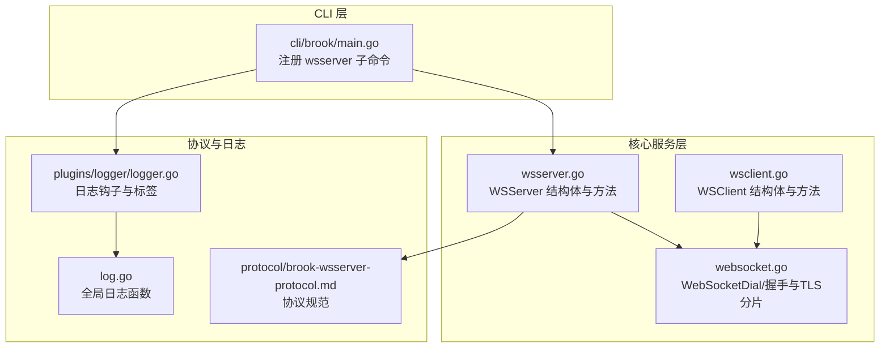
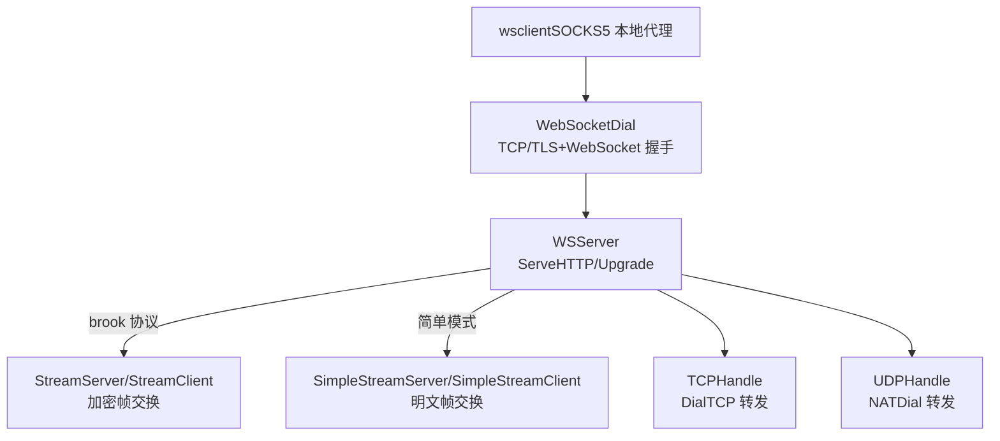
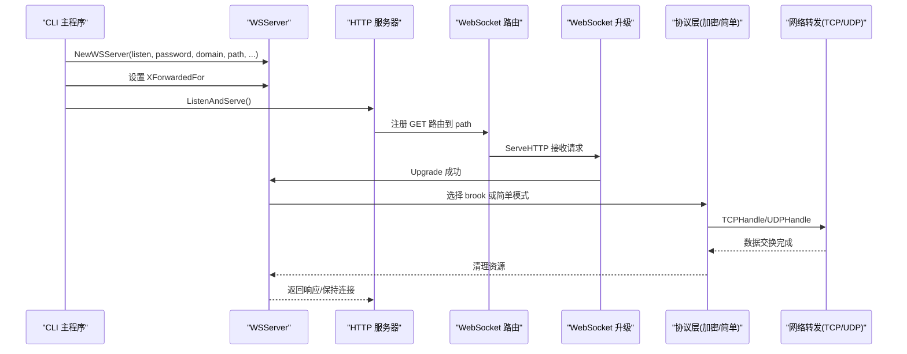
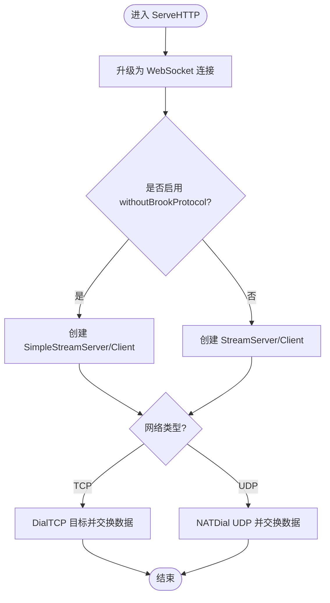
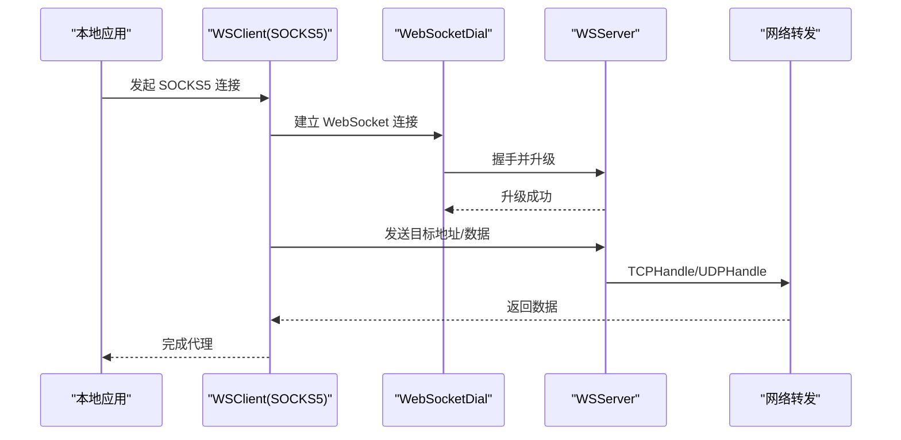
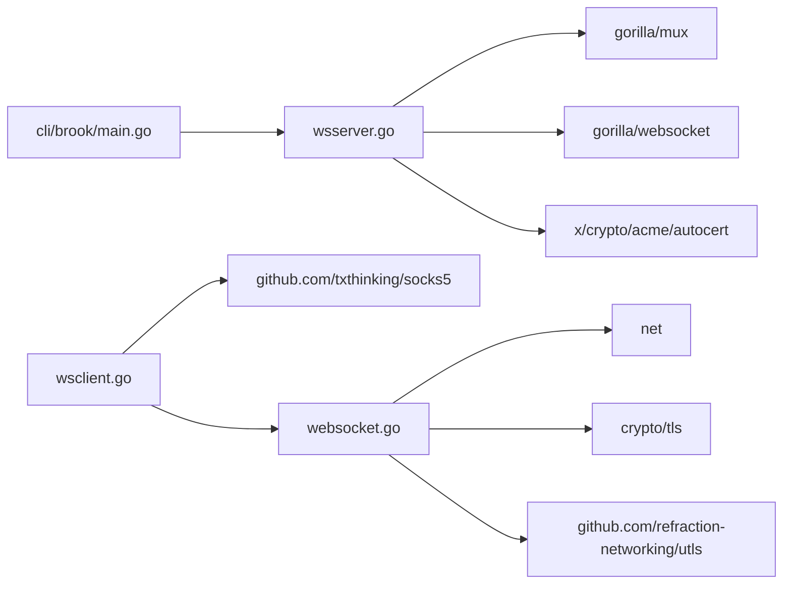

# wsserver 命令

<cite>
**本文引用的文件列表**
- [cli/brook/main.go](file://cli/brook/main.go)
- [wsserver.go](file://wsserver.go)
- [wsclient.go](file://wsclient.go)
- [websocket.go](file://websocket.go)
- [protocol/brook-wsserver-protocol.md](file://protocol/brook-wsserver-protocol.md)
- [brooklink.go](file://brooklink.go)
- [log.go](file://log.go)
- [plugins/logger/logger.go](file://plugins/logger/logger.go)
</cite>

## 目录
1. [简介](#简介)
2. [项目结构](#项目结构)
3. [核心组件](#核心组件)
4. [架构总览](#架构总览)
5. [详细组件分析](#详细组件分析)
6. [依赖关系分析](#依赖关系分析)
7. [性能考量](#性能考量)
8. [故障排查指南](#故障排查指南)
9. [结论](#结论)
10. [附录](#附录)

## 简介
本文件系统化阐述 wsserver 命令的工作原理，包括其如何同时启动标准 HTTP 服务器与 WebSocket 服务器，参数含义（特别是 --listen、--password、--path、--withoutBrookProtocol），以及与 wsclient 的协作流程。文档还解释了 --xForwardedFor 对日志记录中“来源地址”的影响，并给出安全使用建议。

## 项目结构
wsserver 命令位于 CLI 层，通过子命令定义参数与行为；实际的服务器逻辑在核心包中实现，包含：
- CLI 定义：在主程序中注册 wsserver 子命令，解析参数并构造服务实例
- 服务器实现：WSServer 类型负责 HTTP 路由、WebSocket 握手、协议编解码与转发
- 客户端实现：WSClient 作为 SOCKS5 本地代理，连接到 wsserver 的 WebSocket 端点
- WebSocket 连接：封装底层 TCP/TLS 与 WebSocket 握手细节
- 协议规范：brook-wsserver-protocol.md 描述了加密与帧格式
- 日志系统：支持替换日志中的来源地址（受 X-Forwarded-For 影响）

图表来源
- [cli/brook/main.go](file://cli/brook/main.go#L528-L646)
- [wsserver.go](file://wsserver.go#L32-L220)
- [wsclient.go](file://wsclient.go#L1-L179)
- [websocket.go](file://websocket.go#L37-L171)
- [protocol/brook-wsserver-protocol.md](file://protocol/brook-wsserver-protocol.md#L1-L96)
- [plugins/logger/logger.go](file://plugins/logger/logger.go#L1-L115)
- [log.go](file://log.go#L1-L22)

章节来源
- [cli/brook/main.go](file://cli/brook/main.go#L528-L646)

## 核心组件
- WSServer：封装 HTTP 服务器、WebSocket 路由、握手升级、协议选择（brook 或简单模式）、TCP/UDP 转发与关闭
- WSClient：本地 SOCKS5 代理，连接 wsserver 的 WebSocket 端点，按需启用 brook 协议或简单模式
- WebSocketDial：封装 TCP/TLS 连接与 WebSocket 握手，支持可选的 TLS 分片
- 协议规范：定义 brook 协议的数据帧、密钥派生与加解密方式
- 日志系统：全局日志函数与插件日志器，支持替换来源地址（当启用 --xForwardedFor）

章节来源
- [wsserver.go](file://wsserver.go#L32-L220)
- [wsclient.go](file://wsclient.go#L1-L179)
- [websocket.go](file://websocket.go#L37-L171)
- [protocol/brook-wsserver-protocol.md](file://protocol/brook-wsserver-protocol.md#L1-L96)
- [plugins/logger/logger.go](file://plugins/logger/logger.go#L1-L115)
- [log.go](file://log.go#L1-L22)

## 架构总览
wsserver 同时提供：
- 标准 HTTP 服务器：用于承载 WebSocket 路由与静态资源（如需要）
- WebSocket 服务器：在指定路径上监听并升级 HTTP 请求为 WebSocket 连接
- 协议层：根据是否启用 --withoutBrookProtocol 决定使用 brook 加密协议或简单模式
- 客户端协作：wsclient 以 SOCKS5 本地代理形式连接 wsserver，转发 TCP/UDP 流量

图表来源
- [wsclient.go](file://wsclient.go#L84-L179)
- [websocket.go](file://websocket.go#L37-L171)
- [wsserver.go](file://wsserver.go#L140-L216)
- [protocol/brook-wsserver-protocol.md](file://protocol/brook-wsserver-protocol.md#L1-L96)

## 详细组件分析

### 命令定义与参数说明
- --listen/-l：监听地址，例如 ":80" 或 ":443"
- --password/-p：服务器密码，用于派生密钥与身份校验
- --path：WebSocket URL 路径，默认 "/ws"
- --withoutBrookProtocol：禁用 brook 协议，使用简单模式（密码经 SHA256 处理后作为密钥）
- --tcpTimeout/--udpTimeout：TCP/UDP 超时秒数
- --block*：阻断域名/CIDR/地理规则（全局选项亦可）
- --xForwardedFor：启用后，日志中的来源地址将尝试从 X-Forwarded-For 头部替换（注意该值可能被伪造）
- --example：输出最小示例用法

章节来源
- [cli/brook/main.go](file://cli/brook/main.go#L528-L646)
- [wsserver.go](file://wsserver.go#L46-L68)

### 参数详解与作用
- --listen
  - 指定 HTTP 服务器监听地址，如 ":80" 或 ":443"
  - 若未设置 --domainaddress（wssserver 场景），则直接启动 HTTP 服务器
- --password
  - 作为 brook 协议的密钥材料；若启用 --withoutBrookProtocol，则密码经 SHA256 处理后作为密钥
- --path
  - 定义 WebSocket 的 URL 路径，客户端默认使用 "/ws"，可通过 --wsserver 指定完整 ws://host:port/path
  - 服务器在路由中绑定该路径，仅对该路径进行 WebSocket 升级
- --withoutBrookProtocol
  - 关闭 brook 协议加密，使用简单模式；适合与不支持 brook 协议的客户端配合
- --xForwardedFor
  - 当启用时，日志记录的来源地址会尝试从 X-Forwarded-For 头部提取真实客户端 IP（注意该值可能被伪造）

章节来源
- [cli/brook/main.go](file://cli/brook/main.go#L528-L646)
- [wsserver.go](file://wsserver.go#L46-L68)
- [wsserver.go](file://wsserver.go#L148-L191)

### 启动流程与控制流
wsserver 子命令执行流程如下：

图表来源
- [cli/brook/main.go](file://cli/brook/main.go#L632-L645)
- [wsserver.go](file://wsserver.go#L70-L138)
- [wsserver.go](file://wsserver.go#L148-L216)

### WebSocket 握手与数据帧处理
- 握手阶段
  - 服务器在指定路径上接收 GET 请求，调用升级器将其升级为 WebSocket 连接
  - 升级成功后，根据 --withoutBrookProtocol 选择协议层
- 协议层
  - brook 协议：使用 HKDF 派生密钥，采用 AES-GCM 分片加密，首帧包含时间戳与目标地址
  - 简单模式：密码经 SHA256 处理后作为密钥，按固定帧格式传输
- 转发逻辑
  - TCP：通过 DialTCP 连接目标地址，双向交换数据
  - UDP：通过 NATDial 建立 UDP over TCP 通道，实现 UDP 转发

图表来源
- [wsserver.go](file://wsserver.go#L148-L216)
- [protocol/brook-wsserver-protocol.md](file://protocol/brook-wsserver-protocol.md#L1-L96)

章节来源
- [wsserver.go](file://wsserver.go#L140-L216)
- [protocol/brook-wsserver-protocol.md](file://protocol/brook-wsserver-protocol.md#L1-L96)

### 与 wsclient 的协作
- wsclient 作为本地 SOCKS5 代理，监听本地端口
- 连接建立时，wsclient 通过 WebSocketDial 建立到 wsserver 的 WebSocket 连接
- 根据 --withoutBrookProtocol 选择 brook 或简单模式
- TCP：发送目标地址信息，建立双向数据交换
- UDP：通过 PacketConnFactory 管理 UDP 会话，复用 WebSocket 连接进行转发

图表来源
- [wsclient.go](file://wsclient.go#L84-L179)
- [websocket.go](file://websocket.go#L37-L171)
- [wsserver.go](file://wsserver.go#L148-L216)

章节来源
- [wsclient.go](file://wsclient.go#L1-L179)
- [websocket.go](file://websocket.go#L37-L171)
- [wsserver.go](file://wsserver.go#L148-L216)

### 日志与 --xForwardedFor
- 日志系统通过全局日志函数输出错误与统计信息
- 当启用 --xForwardedFor 时，服务器在记录来源地址时会优先使用 X-Forwarded-For 头部的第一个 IP（若合法）
- 注意：X-Forwarded-For 可能被伪造，仅作参考；生产环境建议结合其他鉴权与审计手段

章节来源
- [wsserver.go](file://wsserver.go#L148-L191)
- [plugins/logger/logger.go](file://plugins/logger/logger.go#L1-L115)
- [log.go](file://log.go#L1-L22)

## 依赖关系分析
- CLI 依赖核心包创建 WSServer 实例并启动 HTTP 服务器
- WSServer 依赖 gorilla/mux 提供路由，gorilla/websocket 执行升级，x/crypto/acme/autocert 支持自动证书
- WSClient 依赖 socks5 库提供本地 SOCKS5 代理能力
- WebSocketDial 依赖 net、tls、utls 实现 TCP/TLS 连接与握手，支持 TLS 分片

图表来源
- [cli/brook/main.go](file://cli/brook/main.go#L528-L646)
- [wsserver.go](file://wsserver.go#L1-L45)
- [wsclient.go](file://wsclient.go#L1-L39)
- [websocket.go](file://websocket.go#L1-L36)

章节来源
- [cli/brook/main.go](file://cli/brook/main.go#L528-L646)
- [wsserver.go](file://wsserver.go#L1-L45)
- [wsclient.go](file://wsclient.go#L1-L39)
- [websocket.go](file://websocket.go#L1-L36)

## 性能考量
- 连接与超时
  - HTTP 服务器设置读写超时与空闲超时，避免资源占用
  - TCP/UDP 超时参数可按网络状况调整
- 缓冲区大小
  - WebSocket 升级器读写缓冲区为 65507 字节，满足大多数场景
- TLS 分片
  - WebSocketDial 支持 TLS 分片，有助于规避特定网络设备的特征检测
- 并发模型
  - 服务器在每次握手后为每个连接独立处理，建议结合负载均衡与限流策略

章节来源
- [wsserver.go](file://wsserver.go#L70-L138)
- [wsserver.go](file://wsserver.go#L140-L146)
- [websocket.go](file://websocket.go#L173-L232)

## 故障排查指南
- 握手失败
  - 检查 --path 是否与客户端一致（默认 "/ws"）
  - 确认 WebSocketDial 的主机名与证书匹配（wss 场景）
- 认证问题
  - 确认 --password 与客户端一致
  - 若启用 --withoutBrookProtocol，确保客户端同样使用简单模式
- 来源地址异常
  - 启用 --xForwardedFor 后，日志中的来源地址可能来自代理链路，存在伪造风险
- 超时与丢包
  - 调整 --tcpTimeout/--udpTimeout
  - 检查网络质量与防火墙策略

章节来源
- [wsserver.go](file://wsserver.go#L148-L191)
- [wsclient.go](file://wsclient.go#L84-L179)
- [websocket.go](file://websocket.go#L37-L171)

## 结论
wsserver 命令通过在同一进程内同时运行 HTTP 与 WebSocket 服务，实现了对传统 HTTP 环境下的 WebSocket 代理能力。其参数设计清晰，支持 brook 协议与简单模式两种数据帧格式，并与 wsclient 协同完成 TCP/UDP 代理。--xForwardedFor 可增强日志来源的真实性，但需注意其可伪造性。结合合理的超时与并发策略，可在复杂网络环境中稳定运行。

## 附录

### 参数速查表
- --listen/-l：监听地址（如 ":80"）
- --password/-p：服务器密码
- --path：WebSocket 路径（默认 "/ws"）
- --withoutBrookProtocol：禁用 brook 协议，使用简单模式
- --tcpTimeout/--udpTimeout：超时秒数
- --xForwardedFor：启用后日志来源地址尝试从 X-Forwarded-For 替换

章节来源
- [cli/brook/main.go](file://cli/brook/main.go#L528-L646)
- [wsserver.go](file://wsserver.go#L46-L68)

### 协议要点（摘要）
- brook 协议使用 HKDF 派生密钥，AES-GCM 分片加密，首帧包含时间戳与目标地址
- 简单模式使用 SHA256 处理后的密码作为密钥，按固定帧格式传输

章节来源
- [protocol/brook-wsserver-protocol.md](file://protocol/brook-wsserver-protocol.md#L1-L96)