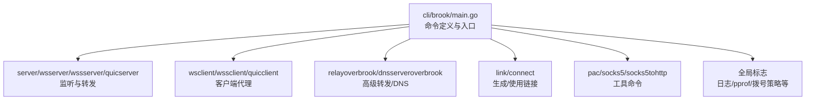
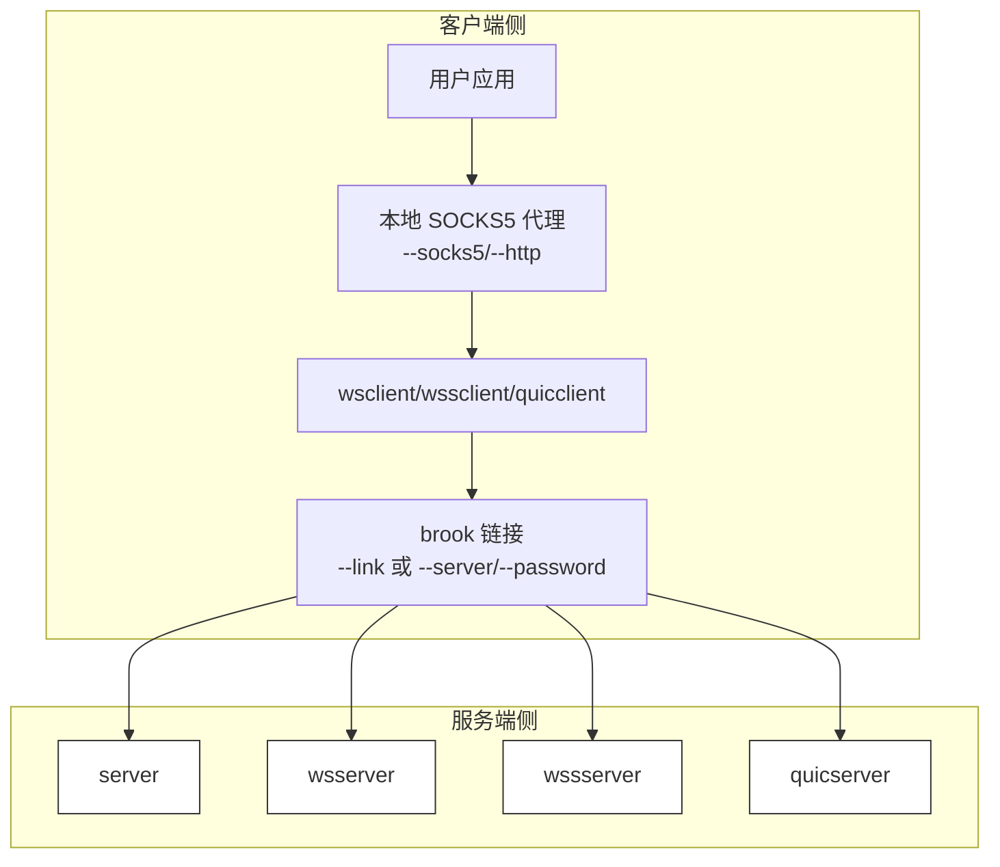
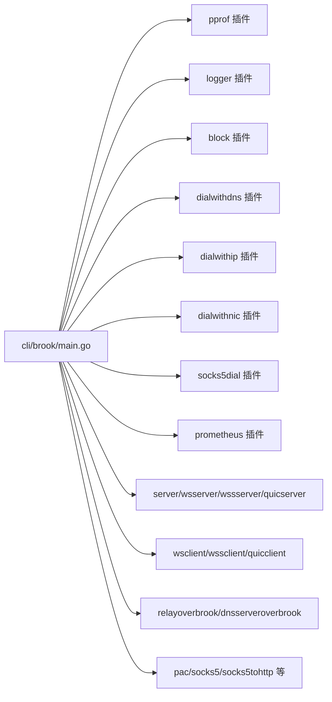

# 命令参考

<cite>
**本文引用的文件**
- [cli/brook/main.go](file://cli/brook/main.go)
- [README.md](file://README.md)
- [quicserver.go](file://quicserver.go)
- [quicclient.go](file://quicclient.go)
</cite>

## 目录
1. [简介](#简介)
2. [项目结构](#项目结构)
3. [核心组件](#核心组件)
4. [架构总览](#架构总览)
5. [详细命令说明](#详细命令说明)
6. [依赖关系分析](#依赖关系分析)
7. [性能与使用建议](#性能与使用建议)
8. [故障排查指南](#故障排查指南)
9. [结论](#结论)

## 简介
本文件是 Brook CLI 工具的命令参考文档，基于仓库中 urfave/cli 的配置，系统化梳理所有命令的用途、参数、典型用法与实现要点。重点覆盖服务端与客户端两大类命令：server、wsserver、wssserver、quicserver 以及对应的 wsclient、wssclient、quicclient；同时包含 relayoverbrook、dnsserveroverbrook 等高级转发与 DNS 能力；并补充 link、connect、pac、socks5、socks5tohttp 等实用工具命令。文档旨在帮助用户理解不同代理模式的区别，并根据网络环境与需求选择合适的命令组合。

## 项目结构
- 命令入口位于 cli/brook/main.go，通过 urfave/cli 定义全局标志与子命令。
- README.md 提供基本安装与入门示例。
- 协议与实现细节在各功能模块中体现，如 QUIC 服务器/客户端在 quicserver.go、quicclient.go 中实现。

图表来源
- [cli/brook/main.go](file://cli/brook/main.go#L51-L120)
- [cli/brook/main.go](file://cli/brook/main.go#L296-L1183)
- [cli/brook/main.go](file://cli/brook/main.go#L1185-L1290)
- [cli/brook/main.go](file://cli/brook/main.go#L1292-L1540)
- [cli/brook/main.go](file://cli/brook/main.go#L1541-L1794)
- [cli/brook/main.go](file://cli/brook/main.go#L1796-L2433)
- [cli/brook/main.go](file://cli/brook/main.go#L2435-L2961)

章节来源
- [cli/brook/main.go](file://cli/brook/main.go#L51-L120)
- [README.md](file://README.md#L1-L44)

## 核心组件
- 全局标志（全局生效，影响所有命令）
  - 日志与调试：--log、--pprof、--tag
  - 拨号策略：--dialWithDNS、--dialWithDNSPrefer、--dialWithIP4、--dialWithIP6、--dialWithNIC、--dialWithSocks5 及其超时参数
  - 指标监控：--prometheus、--prometheusPath
  - HKDF 信息：--clientHKDFInfo、--serverHKDFInfo
  - 阻断列表：--blockDomainList、--blockCIDR4List、--blockCIDR6List、--blockGeoIP、--blockListUpdateInterval
  - 进程控制：--pid
- 子命令
  - 服务端：server、wsserver、wssserver、quicserver
  - 客户端：wsclient、wssclient、quicclient
  - 高级转发：relayoverbrook、dnsserveroverbrook
  - 工具：link、connect、pac、socks5、socks5tohttp、dnsclient、dohclient、dhcpserver、pac、testsocks5、testbrook、echoserver、echoclient、ipcountry、completion、mdpage、manpage

章节来源
- [cli/brook/main.go](file://cli/brook/main.go#L66-L163)
- [cli/brook/main.go](file://cli/brook/main.go#L296-L2911)

## 架构总览
下图展示命令与核心组件的关系，以及典型“客户端 -> 代理 -> 服务器”的数据通路。

图表来源
- [cli/brook/main.go](file://cli/brook/main.go#L403-L526)
- [cli/brook/main.go](file://cli/brook/main.go#L648-L771)
- [cli/brook/main.go](file://cli/brook/main.go#L1045-L1183)
- [cli/brook/main.go](file://cli/brook/main.go#L1185-L1290)

## 详细命令说明

### server（TCP/UDP 通用代理）
- 功能：启动支持 TCP/UDP 的标准代理服务端。
- 关键参数：
  - --listen/-l：监听地址，如 :9999
  - --password/-p：服务端密码
  - --tcpTimeout：TCP 超时（秒）
  - --udpTimeout：UDP 超时（秒）
  - --example：打印最小示例
- 使用场景：最基础的 Brook 代理服务端，适合直连网络或内网穿透场景。
- 实现要点：内部创建服务实例并加入运行组，统一处理 TCP/UDP 流量转发。

章节来源
- [cli/brook/main.go](file://cli/brook/main.go#L296-L402)

### client（TCP/UDP 客户端，可开启本地 SOCKS5/HTTP）
- 功能：启动客户端，支持 TCP/UDP，并可本地暴露 SOCKS5/HTTP 代理。
- 关键参数：
  - --server/-s：服务端地址，如 1.2.3.4:9999
  - --password/-p：服务端密码
  - --link：brook 链接（优先于 server/password）
  - --socks5：本地 SOCKS5 监听地址，默认 127.0.0.1:1080
  - --socks5ServerIP：当本地监听 IP 与远端不一致时指定
  - --http：本地 HTTP 代理监听地址（可选）
  - --tcpTimeout/--udpTimeout：超时
  - --example：打印最小示例
- 使用场景：在本地机器上以 SOCKS5/HTTP 形式访问远端 server。
- 实现要点：解析链接或拼装链接，准备本地 SOCKS5 服务，必要时启动 HTTP 转换器。

章节来源
- [cli/brook/main.go](file://cli/brook/main.go#L403-L526)

### wsserver（基于 WebSocket 的 HTTP+WS 服务端）
- 功能：同时开启标准 HTTP 与 WebSocket 服务，适配防火墙与 CDN。
- 关键参数：
  - --listen/-l：监听地址，如 :80
  - --password/-p：服务端密码
  - --path：WebSocket 路径，默认 /ws
  - --withoutBrookProtocol：数据不使用 Brook 协议加密
  - --tcpTimeout/--udpTimeout：超时
  - --xForwardedFor：日志中替换来源字段（可能被伪造）
  - --example：打印最小示例
- 使用场景：需要通过 HTTP/WS 通道穿越限制性网络。
- 实现要点：创建 WSServer 并设置 X-Forwarded-For 标记，支持无协议加密模式。

章节来源
- [cli/brook/main.go](file://cli/brook/main.go#L528-L646)

### wsclient（基于 WebSocket 的客户端）
- 功能：连接 wsserver，本地暴露 SOCKS5/HTTP 代理。
- 关键参数：
  - --wsserver/-s：wsserver 地址，如 ws://1.2.3.4:80，若无路径默认 /ws
  - --password/-p：wsserver 密码
  - --link：brook 链接（优先于 wsserver/password）
  - --socks5：本地 SOCKS5 监听地址
  - --socks5ServerIP：当本地监听 IP 与远端不一致时指定
  - --http：本地 HTTP 代理监听地址（可选）
  - --tcpTimeout/--udpTimeout：超时
  - --example：打印最小示例
- 使用场景：在受限网络环境下通过 WebSocket 通道建立代理。
- 实现要点：解析链接，准备本地 SOCKS5 服务，必要时启动 HTTP 转换器。

章节来源
- [cli/brook/main.go](file://cli/brook/main.go#L648-L771)

### wssserver（基于 HTTPS 的 WebSocket 服务端）
- 功能：同时开启 HTTPS 与 WebSocket 服务，支持自动签发证书。
- 关键参数：
  - --domainaddress：域名:端口，如 domain.com:443；若自动签发需域名解析到服务器且开放 80 端口
  - --password/-p：服务端密码
  - --cert/--certkey：证书与私钥绝对路径；为空则自动签发
  - --path：WebSocket 路径，默认 /ws
  - --withoutBrookProtocol：数据不使用 Brook 协议加密
  - --tcpTimeout/--udpTimeout：超时
  - --example：打印最小示例
- 使用场景：需要通过 HTTPS/WebSocket 通道穿越严格网络。
- 实现要点：创建 WSServer 并加载证书，支持无协议加密模式。

章节来源
- [cli/brook/main.go](file://cli/brook/main.go#L773-L918)

### quicserver（基于 QUIC 的服务端）
- 功能：启动支持 TCP/UDP 的 QUIC 服务端。
- 关键参数：
  - --domainaddress：域名:端口，如 domain.com:443；可自动签发证书
  - --password/-p：服务端密码
  - --cert/--certkey：证书与私钥绝对路径；为空则自动签发
  - --withoutBrookProtocol：数据不使用 Brook 协议加密
  - --tcpTimeout/--udpTimeout：超时
  - --example：打印最小示例
- 使用场景：需要利用 QUIC 的低延迟与抗丢包特性。
- 实现要点：创建 QUICServer，按 withoutBrookProtocol 决定是否启用 Brook 协议封装；支持自动提升系统 UDP 缓冲区。

章节来源
- [cli/brook/main.go](file://cli/brook/main.go#L1045-L1183)
- [quicserver.go](file://quicserver.go#L47-L90)
- [quicserver.go](file://quicserver.go#L238-L276)

### quicclient（基于 QUIC 的客户端）
- 功能：连接 quicserver，本地暴露 SOCKS5/HTTP 代理。
- 关键参数：
  - --link：brook 链接（优先）
  - --socks5：本地 SOCKS5 监听地址
  - --socks5ServerIP：当本地监听 IP 与远端不一致时指定
  - --http：本地 HTTP 代理监听地址（可选）
  - --tcpTimeout/--udpTimeout：超时
  - --example：打印最小示例
- 使用场景：在受限网络环境下通过 QUIC 通道建立代理。
- 实现要点：解析链接，准备本地 SOCKS5 服务，必要时启动 HTTP 转换器；TCP 采用 QUIC 拨号，UDP 通过 UDP Association。

章节来源
- [cli/brook/main.go](file://cli/brook/main.go#L1185-L1290)
- [quicclient.go](file://quicclient.go#L91-L142)

### relayoverbrook（基于 Brook 的中继）
- 功能：在本地监听一个地址，将流量转发到目标地址，中间经由 server/wsserver/wssserver/quicserver。
- 关键参数：
  - --server/-s：server/wsserver/wssserver/quicserver 地址
  - --password/-p：密码
  - --link：brook 链接（优先于 server/password）
  - --from/-f/-l：本地监听地址，如 :9999
  - --to/-t：目标地址，如 1.2.3.4:9999
  - --tcpTimeout/--udpTimeout：超时
  - --example：打印最小示例
- 使用场景：将任意本地服务透明转发至远端，或做端口映射。
- 实现要点：根据 server 类型自动推断协议，创建 RelayOverBrook 实例并启动监听。

章节来源
- [cli/brook/main.go](file://cli/brook/main.go#L1292-L1397)

### dnsserveroverbrook（基于 Brook 的 DNS 服务器）
- 功能：在本地运行 DNS 服务器，将未命中列表的查询转发至上游 DNS，或通过 Brook 通道转发至远端 DNS。
- 关键参数：
  - --server/-s：server/wsserver/wssserver/quicserver 地址
  - --password/-p：密码
  - --link：brook 链接（优先于 server/password）
  - --listen/-l：本地 DNS 监听地址，如 127.0.0.1:53
  - --dns：上游 DNS，如 8.8.8.8:53 或 DOH
  - --dnsForBypass：绕过列表使用的 DNS
  - --bypassDomainList：绕过域名列表（支持 http(s)/本地绝对路径）
  - --blockDomainList：阻断域名列表（支持 http(s)/本地绝对路径）
  - --disableA/--disableAAAA：禁用 A/AAAA 查询
  - --tcpTimeout/--udpTimeout：超时
  - --example：打印最小示例
- 使用场景：在本地提供可控的 DNS 服务，支持白名单/黑名单与绕过策略。
- 实现要点：构建 TheDNS 插件（如启用），创建 RelayOverBrook 并标记为 DNS 模式。

章节来源
- [cli/brook/main.go](file://cli/brook/main.go#L1399-L1540)

### link（生成 Brook 链接）
- 功能：根据目标类型生成 brook 链接，便于跨平台/跨设备共享。
- 关键参数：
  - --server/-s：支持 server、wsserver、wssserver、socks5、quicserver
  - --password/-p：密码
  - --username/-u：socks5 认证用户名
  - --name：给服务器命名
  - --udpovertcp：server 下 UDP over TCP
  - --udpoverstream：quicserver 下 UDP over Stream（推荐）
  - --address：wsserver/wssserver/quicserver 指定地址而非解析主机
  - --insecure：wssserver/quicserver 不校验证书链与主机名
  - --withoutBrookProtocol：wsserver/wssserver/quicserver 数据不使用 Brook 协议加密
  - --ca：wssserver/quicserver 指定 CA
  - --tlsfingerprint：wssserver TLS 指纹（如 chrome）
  - --clientHKDFInfo/--serverHKDFInfo：HKDF 信息
  - --fragment：wssserver 分片 ClientHello 参数
  - --token：用户身份令牌（GUI/tun2brook 支持）
  - --example：打印最小示例
- 使用场景：生成链接后，其他设备可通过 --link 直接连接，无需重复输入地址与密码。
- 实现要点：根据 server 类型构造链接参数，输出完整链接字符串。

章节来源
- [cli/brook/main.go](file://cli/brook/main.go#L1541-L1688)

### connect（直接使用链接启动客户端）
- 功能：通过 --link 启动客户端，本地暴露 SOCKS5/HTTP 代理。
- 关键参数：
  - --link/-l：brook 链接
  - --socks5：本地 SOCKS5 监听地址
  - --socks5ServerIP：当本地监听 IP 与远端不一致时指定
  - --http：本地 HTTP 代理监听地址（可选）
  - --tcpTimeout/--udpTimeout：超时
  - --example：打印最小示例
- 使用场景：快速启动客户端，无需手动拼装 server/password。
- 实现要点：解析链接，准备本地 SOCKS5 服务，必要时启动 HTTP 转换器。

章节来源
- [cli/brook/main.go](file://cli/brook/main.go#L1689-L1794)

### 工具命令（pac/socks5/socks5tohttp 等）
- pac：运行 PAC 服务器或导出 PAC 文件
- socks5：运行标准 SOCKS5 服务器（支持 TCP/UDP）
- socks5tohttp：将 SOCKS5 代理转换为 HTTP 代理
- dnsclient/dohclient：发送 DNS 查询
- dhcpserver：运行 DHCP 服务器（多接口设备需 Linux）
- testsocks5/testbrook：测试代理连通性
- echoserver/echoclient：回显路由的 TCP/UDP 地址
- ipcountry：查询 IP 所属国家
- completion/mdpage/manpage：生成补全/文档页面

章节来源
- [cli/brook/main.go](file://cli/brook/main.go#L1796-L2961)

## 依赖关系分析
- 命令与核心模块的耦合
  - server/wsserver/wssserver/quicserver 依赖底层传输实现（TCP/UDP/WS/QUIC），并在 Action 中创建对应服务实例。
  - wsclient/wssclient/quicclient 依赖链接解析与本地 SOCKS5/HTTP 服务，Action 中准备本地代理并启动。
  - relayoverbrook/dnsserveroverbrook 依赖 Brook 链接与转发器，Action 中根据链接类型推断协议并启动。
  - 全局标志通过 Before 钩子注入拨号策略、日志、指标、阻断列表等能力。
- 外部依赖
  - pprof、logger、block、dialwithdns、dialwithip、dialwithnic、socks5dial、prometheus 等插件在 Before 中初始化并注入全局拨号/解析逻辑。

图表来源
- [cli/brook/main.go](file://cli/brook/main.go#L164-L295)
- [cli/brook/main.go](file://cli/brook/main.go#L296-L2911)

章节来源
- [cli/brook/main.go](file://cli/brook/main.go#L164-L295)

## 性能与使用建议
- 选择合适的协议
  - server：最通用，适合直连或内网穿透。
  - wsserver/wssserver：适合需要 HTTP/HTTPS 通道穿越的场景。
  - quicserver：适合对延迟敏感、需要抗丢包的场景。
- UDP over TCP vs UDP over Stream
  - server 的 UDP over TCP 用于兼容性；quicserver 的 UDP over Stream 更适合小报文与高吞吐。
- 拨号策略
  - 在复杂网络环境下，使用 --dialWithDNS/--dialWithIP4/--dialWithIP6/--dialWithNIC/--dialWithSocks5 控制出口 IP 与解析路径，有助于解决 NAT/路由问题。
- 日志与指标
  - 使用 --log 输出到文件或控制台，结合 --tag 为进程打标签；--pprof 开启性能分析；--prometheus/--prometheusPath 开启指标导出。
- 阻断与绕过
  - 通过 --blockDomainList/--blockCIDR4List/--blockCIDR6List/--blockGeoIP 精细化控制访问范围；配合 dnsserveroverbrook 的绕过/阻断列表实现更细粒度的 DNS 控制。

[本节为通用建议，不直接分析具体文件]

## 故障排查指南
- 常见错误与提示
  - 缺少必要参数：多数命令在缺少关键参数时会显示帮助或返回错误。
  - 绝对路径要求：--log、--pid、--cert、--certkey、--cache、--blockDomainList 等参数必须为绝对路径。
  - 链接格式：--link 必须为合法的 brook 链接；socks5 链接不可再作为源链接创建新的 socks5。
  - 证书与域名：wssserver/quicserver 自动签发需域名解析到服务器且开放 80 端口。
  - QUIC UDP over Stream：在 quicserver 上建议使用 --udpoverstream。
- 排查步骤
  - 使用 testsocks5/testbrook 快速验证连通性与 UDP/TCP 行为。
  - 通过 completion 生成补全脚本，避免参数拼写错误。
  - 使用 pac/dnsserveroverbrook 验证 DNS 解析与转发路径。
  - 结合 --log 与 --pprof 定位性能瓶颈。

章节来源
- [cli/brook/main.go](file://cli/brook/main.go#L164-L295)
- [cli/brook/main.go](file://cli/brook/main.go#L2554-L2624)

## 结论
本命令参考文档系统梳理了 Brook CLI 的全部命令及其参数、典型用法与实现要点。通过理解 server、wsserver、wssserver、quicserver 与对应客户端之间的差异，用户可以依据网络环境与性能需求选择最优方案。配合全局拨号策略、日志与指标工具，可实现从开发调试到生产部署的全链路可观测与可控。