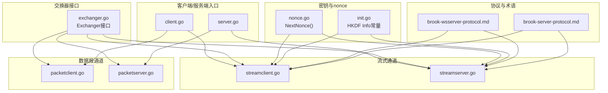
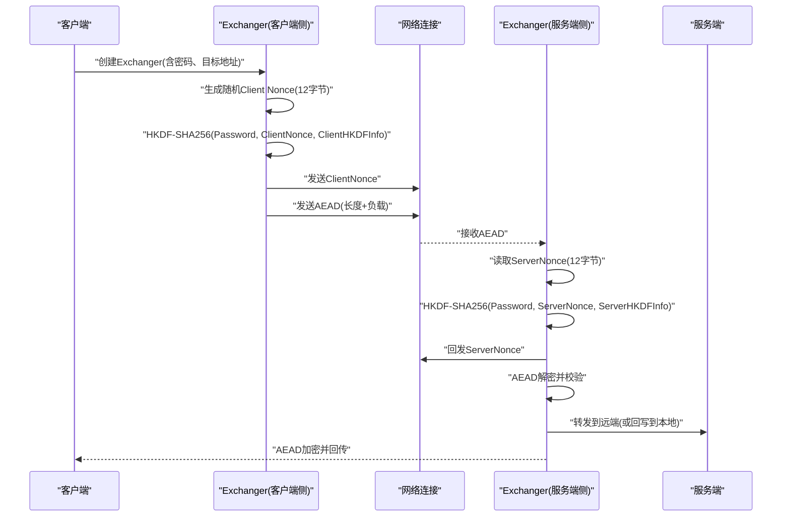
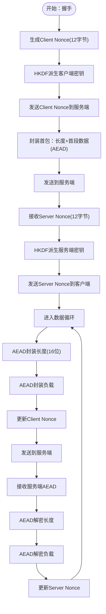
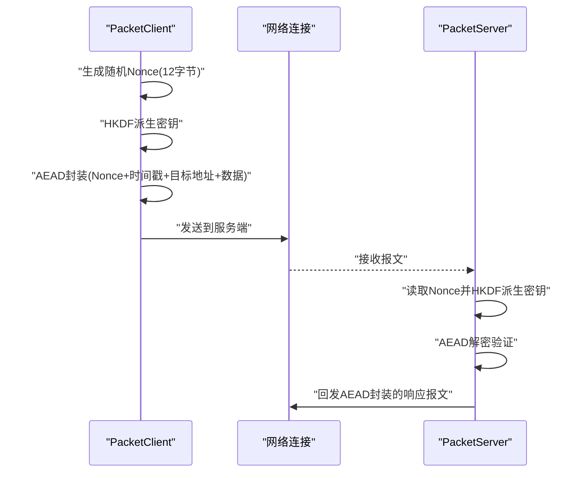
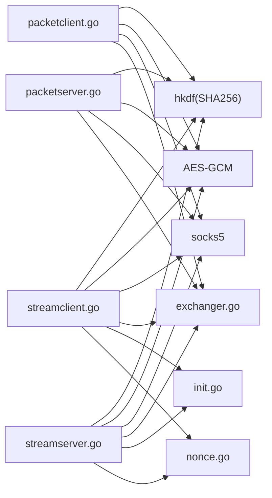

# 加密机制

<cite>
**本文引用的文件**
- [server.go](file://server.go)
- [client.go](file://client.go)
- [nonce.go](file://nonce.go)
- [init.go](file://init.go)
- [streamclient.go](file://streamclient.go)
- [streamserver.go](file://streamserver.go)
- [packetclient.go](file://packetclient.go)
- [packetserver.go](file://packetserver.go)
- [exchanger.go](file://exchanger.go)
- [brook-server-protocol.md](file://protocol/brook-server-protocol.md)
- [brook-wsserver-protocol.md](file://protocol/brook-wsserver-protocol.md)
</cite>

## 目录
1. [简介](#简介)
2. [项目结构](#项目结构)
3. [核心组件](#核心组件)
4. [架构总览](#架构总览)
5. [详细组件分析](#详细组件分析)
6. [依赖关系分析](#依赖关系分析)
7. [性能考量](#性能考量)
8. [故障排查指南](#故障排查指南)
9. [结论](#结论)

## 简介
本文件系统性解析brook在传输层采用的加密与密钥派生机制，重点覆盖：
- AES-GCM认证加密的使用方式与数据帧格式
- HKDF-SHA256密钥派生流程及Info参数的作用
- 在server.go与client.go中如何通过Stream/Packet通道完成数据的加密封装与解密验证
- nonce.go中非重复数（nonce）的生成与递增策略，如何有效防止重放攻击
- 结合协议文档说明机密性与完整性的保障方式

## 项目结构
围绕加密与密钥派生的关键文件组织如下：
- 协议与术语：brook-server-protocol.md、brook-wsserver-protocol.md
- 密钥与nonce：init.go、nonce.go
- 交换器接口：exchanger.go
- 客户端与服务端入口：client.go、server.go
- 流式加密通道：streamclient.go、streamserver.go
- 数据报加密通道：packetclient.go、packetserver.go

图表来源
- [brook-server-protocol.md](file://protocol/brook-server-protocol.md#L1-L127)
- [brook-wsserver-protocol.md](file://protocol/brook-wsserver-protocol.md#L1-L96)
- [init.go](file://init.go#L1-L21)
- [nonce.go](file://nonce.go#L1-L24)
- [exchanger.go](file://exchanger.go#L1-L40)
- [client.go](file://client.go#L1-L144)
- [server.go](file://server.go#L1-L179)
- [streamclient.go](file://streamclient.go#L1-L234)
- [streamserver.go](file://streamserver.go#L1-L243)
- [packetclient.go](file://packetclient.go#L1-L155)
- [packetserver.go](file://packetserver.go#L1-L124)

章节来源
- [client.go](file://client.go#L1-L144)
- [server.go](file://server.go#L1-L179)
- [exchanger.go](file://exchanger.go#L1-L40)

## 核心组件
- Exchanger接口：统一抽象了“本地连接↔远端连接”的双向数据交换，便于在不同传输模式（TCP/UDP、UDP over TCP、WebSocket等）下复用相同的加解密逻辑。
- StreamClient/StreamServer：面向流式传输（TCP/UDP over TCP），负责握手阶段的nonce与密钥派生，以及后续数据帧的AEAD封装与验证。
- PacketClient/PacketServer：面向数据报传输（UDP），负责每包独立nonce与密钥派生，以及数据报整体的AEAD封装与验证。
- HKDF Info：由init.go定义，作为HKDF的Info参数，确保同一密码在不同方向（客户端/服务端）派生出不同的密钥材料。
- Nonce管理：nonce.go提供NextNonce函数，按Little Endian前8字节递增，避免重复使用相同nonce导致的AEAD安全问题。

章节来源
- [exchanger.go](file://exchanger.go#L1-L40)
- [init.go](file://init.go#L1-L21)
- [nonce.go](file://nonce.go#L1-L24)

## 架构总览
下图展示了从客户端到服务端的数据路径，以及在每个阶段如何进行密钥派生与AEAD加解密。

图表来源
- [streamclient.go](file://streamclient.go#L47-L143)
- [streamserver.go](file://streamserver.go#L47-L151)
- [init.go](file://init.go#L15-L21)
- [nonce.go](file://nonce.go#L19-L23)

## 详细组件分析

### AES-GCM与HKDF密钥派生
- 密钥材料来源：HKDF-SHA256(Password, Nonce, Info)，其中Info来自init.go的常量，分别用于客户端与服务端方向。
- 密钥长度：32字节，对应AES-256；结合GCM模式提供机密性与完整性保护。
- 非对称密钥：客户端与服务端各自持有不同的Nonce，因此HKDF派生出不同的会话密钥，满足双向通信场景。

章节来源
- [init.go](file://init.go#L15-L21)
- [brook-server-protocol.md](file://protocol/brook-server-protocol.md#L24-L32)
- [brook-wsserver-protocol.md](file://protocol/brook-wsserver-protocol.md#L24-L32)

### StreamClient/StreamServer：流式通道的加解密
- 握手阶段
  - 客户端生成随机Client Nonce（12字节），通过HKDF派生对称密钥，使用GCM封装“长度+首包内容”后发送给服务端。
  - 服务端生成随机Server Nonce（12字节），通过HKDF派生对称密钥，使用GCM封装“长度+首包内容”后回发给客户端。
- 数据传输阶段
  - 每个片段包含两部分：先长度（Big Endian 16位），再负载（原始应用数据）。
  - 使用AEAD对长度与负载分别进行密封，随后更新nonce（NextNonce）以保证不重复使用。
- 时间戳与方向控制
  - 首包中包含Unix时间戳，客户端根据网络类型（TCP/UDP over TCP）调整其奇偶性，服务端据此判断网络类型并设置超时策略。

图表来源
- [streamclient.go](file://streamclient.go#L47-L143)
- [streamserver.go](file://streamserver.go#L47-L151)
- [nonce.go](file://nonce.go#L19-L23)

章节来源
- [streamclient.go](file://streamclient.go#L47-L208)
- [streamserver.go](file://streamserver.go#L47-L217)
- [brook-server-protocol.md](file://protocol/brook-server-protocol.md#L34-L64)

### PacketClient/PacketServer：数据报通道的加解密
- 每个数据报独立处理，包含：
  - 12字节随机Nonce
  - AEAD封装的完整报文（含时间戳、目标地址、应用数据）
- 解密时先派生密钥，再对整个报文进行AEAD Open，成功后再解析目标地址与数据部分。

图表来源
- [packetclient.go](file://packetclient.go#L43-L137)
- [packetserver.go](file://packetserver.go#L41-L106)

章节来源
- [packetclient.go](file://packetclient.go#L43-L137)
- [packetserver.go](file://packetserver.go#L41-L106)
- [brook-server-protocol.md](file://protocol/brook-server-protocol.md#L65-L96)

### Nonce递增与重放防护
- 递增规则：NextNonce对nonce的前8字节按Little Endian无符号整型加1，确保每次使用都唯一。
- 作用：
  - 防止AEAD重复使用相同(nonce, key)对导致的安全性崩溃
  - 与协议中的“每片段两次AEAD操作”配合，进一步降低重放风险
- 服务端对首包时间戳进行有效期检查，超过阈值直接拒绝，减少重放窗口

章节来源
- [nonce.go](file://nonce.go#L19-L23)
- [streamclient.go](file://streamclient.go#L179-L208)
- [streamserver.go](file://streamserver.go#L78-L91)

### 在server.go与client.go中的集成
- 客户端
  - TCP：通过NewStreamClient建立流式通道，随后调用Exchanger.Exchange进行双向转发。
  - UDP：通过NewPacketClient建立数据报通道，或在UDP over TCP模式下通过NewStreamClient处理。
- 服务端
  - TCP/UDP：通过NewStreamServer/NewPacketServer建立通道，随后调用Exchanger.Exchange进行转发。
  - 超时与错误日志：在握手与数据阶段均设置超时并记录错误，提升健壮性。

章节来源
- [client.go](file://client.go#L53-L140)
- [server.go](file://server.go#L47-L179)
- [exchanger.go](file://exchanger.go#L21-L40)

## 依赖关系分析
- 组件耦合
  - StreamClient/StreamServer依赖HKDF与AES-GCM库，以及Exchanger接口抽象，保持良好的内聚性。
  - PacketClient/PacketServer同样依赖HKDF与AES-GCM，但每包独立nonce，耦合度较低。
- 外部依赖
  - golang.org/x/crypto/hkdf：标准HKDF实现
  - crypto/aes与crypto/cipher：AES与GCM模式
  - github.com/txthinking/socks5：SOCKS5地址编码/解析
- 可能的循环依赖
  - 当前文件未见循环导入；Exchanger接口位于独立文件，避免了循环引用。

图表来源
- [streamclient.go](file://streamclient.go#L1-L234)
- [streamserver.go](file://streamserver.go#L1-L243)
- [packetclient.go](file://packetclient.go#L1-L155)
- [packetserver.go](file://packetserver.go#L1-L124)
- [exchanger.go](file://exchanger.go#L1-L40)
- [init.go](file://init.go#L1-L21)
- [nonce.go](file://nonce.go#L1-L24)

## 性能考量
- HKDF成本：每条连接仅在握手阶段执行一次HKDF，后续仅进行AEAD操作，开销可忽略。
- AEAD批量：流式通道中长度与负载分两次AEAD，但单次调用开销较小；数据报通道每包独立AEAD，适合低延迟场景。
- 内存池：各通道使用缓冲区池（BP12/BP32/BP2048/BP65507）减少GC压力，提高吞吐。
- 超时与背压：通过SetDeadline在读写阶段设置超时，避免长时间阻塞。

## 故障排查指南
- AEAD解密失败
  - 检查HKDF Info是否一致（客户端/服务端方向不同）
  - 确认Nonce未被重复使用或越界
  - 核对首包时间戳是否过期
- 连接超时
  - 检查客户端/服务端超时配置是否合理
  - 确认网络链路质量与防火墙策略
- 协议不匹配
  - 确认客户端与服务端使用的协议版本一致（TCP/UDP/UDP over TCP/WebSocket）

章节来源
- [streamclient.go](file://streamclient.go#L179-L208)
- [streamserver.go](file://streamserver.go#L78-L91)
- [init.go](file://init.go#L15-L21)

## 结论
brook通过HKDF-SHA256将用户密码与双方随机Nonce派生为独立的AES-GCM密钥，结合严格的nonce递增策略与首包时间戳校验，有效保障了通信的机密性与完整性。在server.go与client.go中，通过Exchanger接口抽象，将加解密逻辑与传输层解耦，实现了对TCP、UDP、UDP over TCP以及WebSocket等多种场景的一致支持。nonce.go中的递增机制与协议层面的重放防护共同构成了完整的抗重放体系。