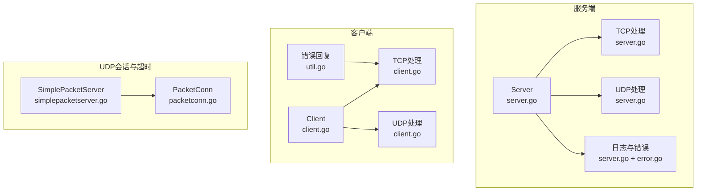
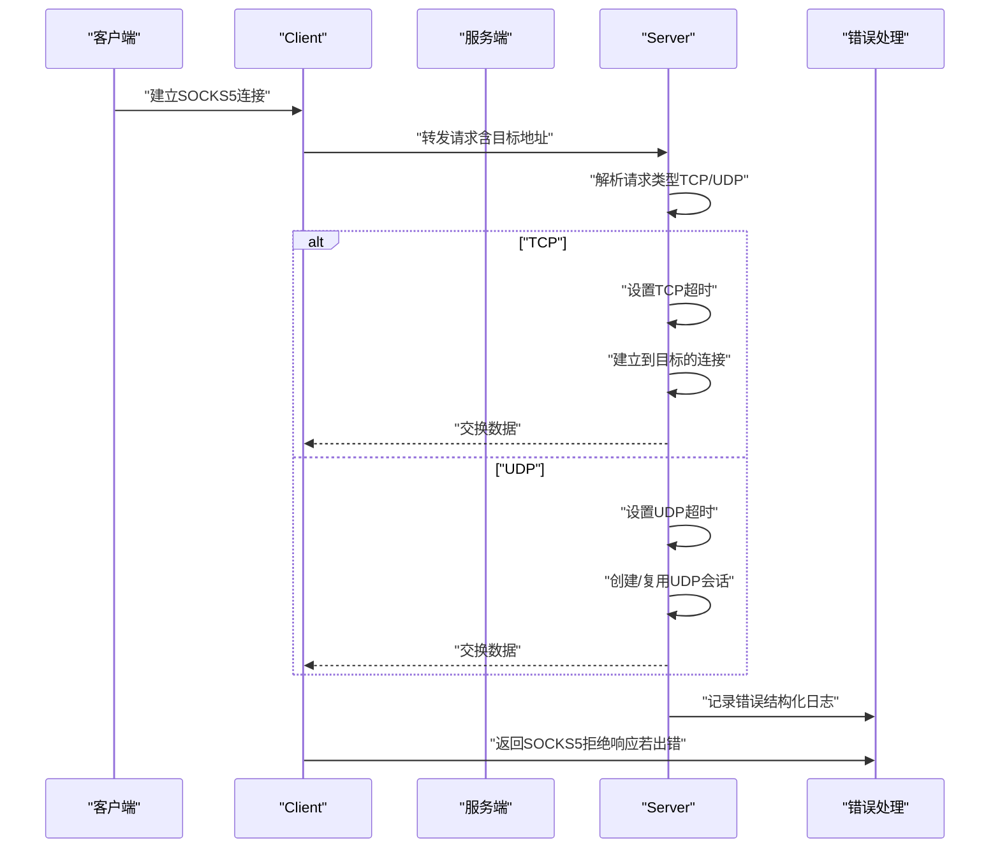
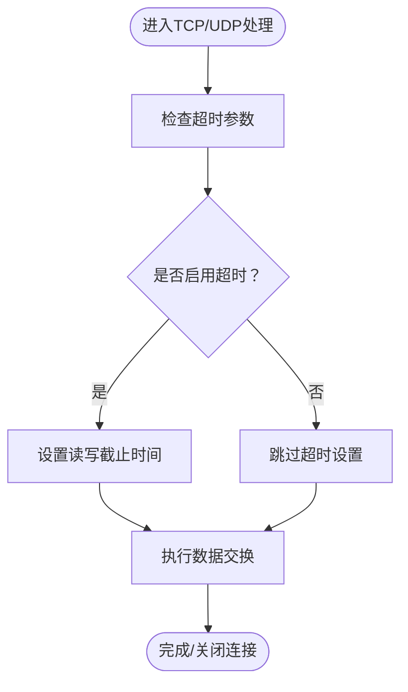
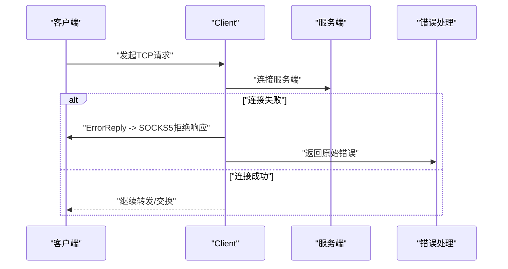
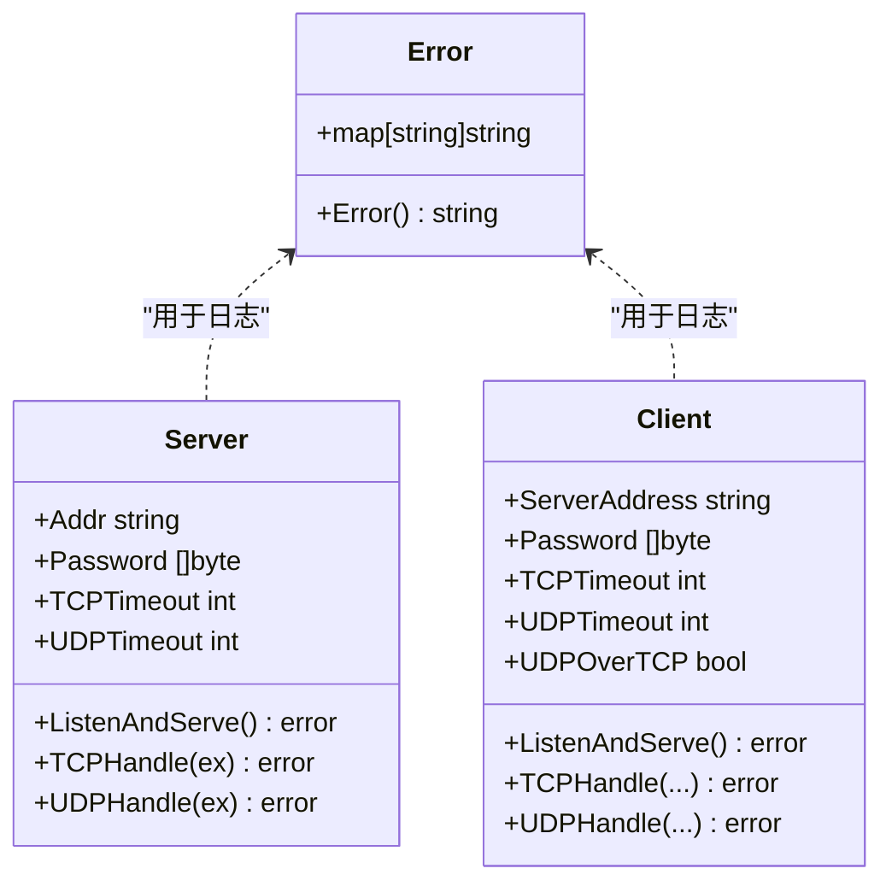
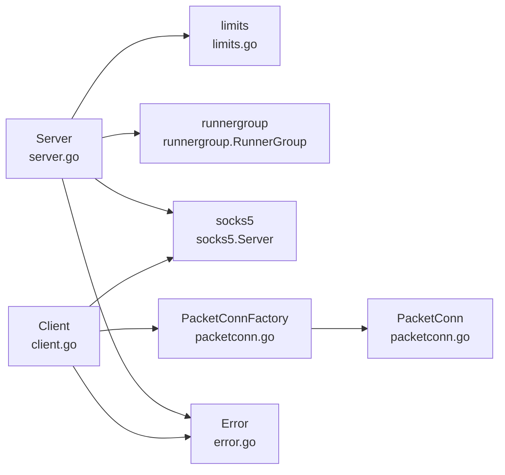

# 安全配置

<cite>
**本文引用的文件**
- [server.go](file://server.go)
- [client.go](file://client.go)
- [error.go](file://error.go)
- [util.go](file://util.go)
- [simplepacketserver.go](file://simplepacketserver.go)
- [packetconn.go](file://packetconn.go)
- [SECURITY.md](file://SECURITY.md)
- [brook-server-protocol.md](file://protocol/brook-server-protocol.md)
- [core/CLAUDE.md](file://core/CLAUDE.md)
</cite>

## 目录
1. [简介](#简介)
2. [项目结构](#项目结构)
3. [核心组件](#核心组件)
4. [架构总览](#架构总览)
5. [详细组件分析](#详细组件分析)
6. [依赖关系分析](#依赖关系分析)
7. [性能与安全特性](#性能与安全特性)
8. [故障排查指南](#故障排查指南)
9. [结论](#结论)

## 简介
本指南聚焦于brook在安全配置方面的最佳实践，围绕以下目标展开：
- 基于server.go与client.go中的TCPTimeout、UDPTimeout等参数，说明如何通过合理的超时设置抵御资源耗尽类攻击（如慢连接、空闲连接占用）。
- 结合error.go中自定义错误类型Error的实现，解释如何通过结构化日志与安全的错误返回策略，避免敏感信息泄露。
- 提供可操作的配置建议与排障方法，帮助在生产环境中稳定运行。

## 项目结构
与安全配置直接相关的核心文件包括：
- 服务端与客户端入口：server.go、client.go
- 错误类型与错误回复：error.go、util.go
- UDP会话与超时控制：simplepacketserver.go、packetconn.go
- 安全策略与协议说明：SECURITY.md、brook-server-protocol.md、core/CLAUDE.md

图表来源
- [server.go](file://server.go#L1-L179)
- [client.go](file://client.go#L1-L144)
- [simplepacketserver.go](file://simplepacketserver.go#L1-L96)
- [packetconn.go](file://packetconn.go#L1-L164)
- [error.go](file://error.go#L1-L28)
- [util.go](file://util.go#L1-L101)

章节来源
- [server.go](file://server.go#L1-L179)
- [client.go](file://client.go#L1-L144)

## 核心组件
- Server（服务端）
  - 关键字段：Addr、Password、TCPTimeout、UDPTimeout、RunnerGroup
  - 行为：监听TCP与UDP，按请求类型分派到TCP或UDP处理流程，并在各阶段使用超时控制
- Client（客户端）
  - 关键字段：Server、ServerAddress、Password、TCPTimeout、UDPTimeout、UDPOverTCP、PacketConnFactory
  - 行为：作为本地SOCKS5代理，将请求转发至远端brook服务器；对错误进行统一回复
- Error（自定义错误）
  - 类型：map[string]string，实现Error接口，序列化为JSON字符串
- util.ErrorReply
  - 将错误转换为SOCKS5拒绝响应并返回原始错误，避免泄露内部细节
- SimplePacketServer/PacketConn
  - 面向UDP的双向通道，支持超时控制与连接生命周期管理

章节来源
- [server.go](file://server.go#L25-L45)
- [client.go](file://client.go#L24-L51)
- [error.go](file://error.go#L19-L27)
- [util.go](file://util.go#L28-L39)
- [simplepacketserver.go](file://simplepacketserver.go#L25-L43)
- [packetconn.go](file://packetconn.go#L26-L56)

## 架构总览
服务端与客户端通过SOCKS5协议交互，服务端根据请求类型选择TCP或UDP路径；客户端负责将本地请求转发到服务端，并在必要时回写SOCKS5响应。

图表来源
- [server.go](file://server.go#L47-L138)
- [client.go](file://client.go#L57-L139)
- [util.go](file://util.go#L28-L39)
- [error.go](file://error.go#L19-L27)

## 详细组件分析

### 服务端超时与资源保护（TCP/UDP）
- TCP超时（TCPTimeout）
  - 在服务端Accept新连接后，构造流式交换器时传入TCPTimeout；后续在TCP路径的数据交换中，读写双方均可能设置截止时间，防止长时间占用资源。
  - 参考路径：[server.go](file://server.go#L63-L74)，[simplepacketserver.go](file://simplepacketserver.go#L45-L77)
- UDP超时（UDPTimeout）
  - 服务端在UDP路径上，通过PacketConnFactory创建会话时传入UDPTimeout；PacketConn在Read侧使用定时器触发超时错误，避免会话长期挂起。
  - 参考路径：[server.go](file://server.go#L108-L118)，[packetconn.go](file://packetconn.go#L89-L105)
- 连接限制与系统资源
  - 服务端启动时尝试提升系统限制，失败时记录警告，避免因资源不足导致拒绝服务。
  - 参考路径：[server.go](file://server.go#L33-L45)

图表来源
- [server.go](file://server.go#L63-L81)
- [simplepacketserver.go](file://simplepacketserver.go#L45-L77)
- [packetconn.go](file://packetconn.go#L89-L105)

章节来源
- [server.go](file://server.go#L33-L45)
- [server.go](file://server.go#L63-L81)
- [simplepacketserver.go](file://simplepacketserver.go#L45-L77)
- [packetconn.go](file://packetconn.go#L89-L105)

### 客户端错误处理与安全返回
- ErrorReply
  - 当客户端在建立到服务端的连接或转发过程中发生错误时，生成SOCKS5“连接被拒”响应，同时返回原始错误，避免泄露内部细节。
  - 参考路径：[util.go](file://util.go#L28-L39)
- 客户端UDP路径的错误处理
  - 在UDPOverTCP或直连UDP两种模式下，若创建会话或交换失败，直接返回错误，由上层逻辑决定是否需要发送拒绝响应。
  - 参考路径：[client.go](file://client.go#L96-L139)

图表来源
- [client.go](file://client.go#L57-L94)
- [util.go](file://util.go#L28-L39)

章节来源
- [client.go](file://client.go#L57-L94)
- [util.go](file://util.go#L28-L39)

### 自定义错误类型与日志安全
- Error类型
  - 采用map[string]string结构，实现Error接口，序列化为JSON字符串，便于结构化日志记录与检索。
  - 参考路径：[error.go](file://error.go#L19-L27)
- 日志记录与敏感信息保护
  - 服务端在关键错误点记录结构化日志（包含来源、目的、错误信息），但不直接暴露内部实现细节；客户端通过ErrorReply返回通用拒绝响应，避免将内部错误透传给用户。
  - 参考路径：[server.go](file://server.go#L63-L81)，[server.go](file://server.go#L112-L129)，[client.go](file://client.go#L57-L94)

图表来源
- [error.go](file://error.go#L19-L27)
- [server.go](file://server.go#L25-L45)
- [client.go](file://client.go#L24-L51)

章节来源
- [error.go](file://error.go#L19-L27)
- [server.go](file://server.go#L63-L81)
- [server.go](file://server.go#L112-L129)
- [client.go](file://client.go#L57-L94)

## 依赖关系分析
- Server依赖limits库以提升系统限制，降低资源限制导致的异常风险。
- Client依赖socks5库提供SOCKS5服务端能力，并通过ErrorReply进行错误响应。
- UDP路径依赖PacketConnFactory与PacketConn实现会话复用与超时控制。
- 协议层面，brook-server-protocol.md定义了密钥派生与地址格式，有助于理解安全边界与数据结构。

图表来源
- [server.go](file://server.go#L17-L23)
- [client.go](file://client.go#L17-L23)
- [packetconn.go](file://packetconn.go#L26-L56)
- [error.go](file://error.go#L19-L27)

章节来源
- [server.go](file://server.go#L17-L23)
- [client.go](file://client.go#L17-L23)
- [packetconn.go](file://packetconn.go#L26-L56)
- [brook-server-protocol.md](file://protocol/brook-server-protocol.md#L1-L32)

## 性能与安全特性
- 超时控制
  - TCP路径：在服务端与客户端的连接建立与数据交换阶段均可设置截止时间，防止长连接占用资源。
  - UDP路径：通过PacketConn的定时器实现读侧超时，避免会话无限等待。
- 连接限制
  - 启动时尝试提升系统限制，失败时记录警告，便于运维监控资源瓶颈。
- 错误与日志
  - 使用结构化日志Error，便于审计与告警；客户端通过ErrorReply返回通用拒绝响应，避免敏感信息泄露。
- 协议与密钥
  - 协议文档明确了密钥派生与地址格式，有助于在边界处进行安全校验与防护。

章节来源
- [server.go](file://server.go#L33-L45)
- [simplepacketserver.go](file://simplepacketserver.go#L45-L77)
- [packetconn.go](file://packetconn.go#L89-L105)
- [util.go](file://util.go#L28-L39)
- [core/CLAUDE.md](file://core/CLAUDE.md#L187-L225)
- [brook-server-protocol.md](file://protocol/brook-server-protocol.md#L1-L32)

## 故障排查指南
- 现象：连接缓慢或资源占用高
  - 排查要点：确认TCPTimeout与UDPTimeout是否合理；检查是否存在未设置截止时间的长连接。
  - 参考路径：[server.go](file://server.go#L63-L81)，[simplepacketserver.go](file://simplepacketserver.go#L45-L77)，[packetconn.go](file://packetconn.go#L89-L105)
- 现象：UDP会话堆积或内存增长
  - 排查要点：确认UDP超时是否生效；检查PacketConnFactory是否正确清理会话。
  - 参考路径：[server.go](file://server.go#L108-L129)，[packetconn.go](file://packetconn.go#L38-L56)
- 现象：错误信息泄露或日志中出现敏感内容
  - 排查要点：确保使用Error类型进行日志记录；客户端使用ErrorReply返回通用拒绝响应。
  - 参考路径：[error.go](file://error.go#L19-L27)，[util.go](file://util.go#L28-L39)
- 报告漏洞
  - 参考安全策略文档，按指引提交漏洞报告与POC。
  - 参考路径：[SECURITY.md](file://SECURITY.md#L1-L8)

章节来源
- [server.go](file://server.go#L63-L81)
- [simplepacketserver.go](file://simplepacketserver.go#L45-L77)
- [packetconn.go](file://packetconn.go#L38-L56)
- [error.go](file://error.go#L19-L27)
- [util.go](file://util.go#L28-L39)
- [SECURITY.md](file://SECURITY.md#L1-L8)

## 结论
- 超时设置是抵御资源耗尽攻击的关键手段：在TCP与UDP路径均应启用并合理配置超时，避免连接长期占用。
- 错误处理与日志安全同样重要：使用结构化日志与通用错误回复，避免敏感信息外泄。
- 生产部署建议：
  - 明确TCPTimeout与UDPTimeout阈值，结合业务流量特征与硬件资源评估。
  - 对系统限制进行监控与告警，确保limits提升成功。
  - 在日志中仅记录必要的上下文信息，避免记录敏感字段。
  - 遵循安全策略，及时报告潜在漏洞。