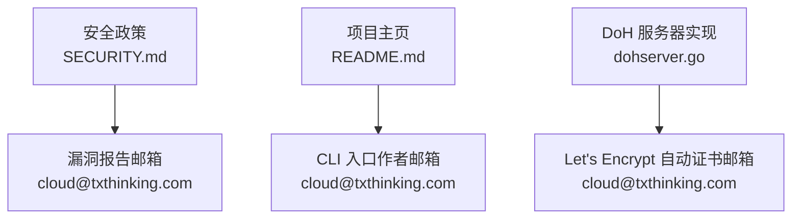
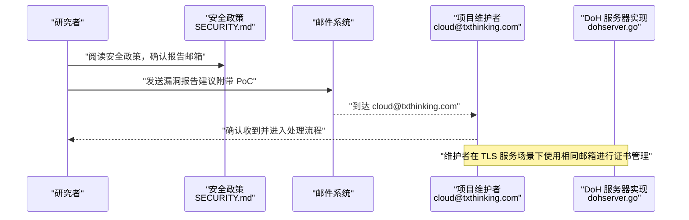
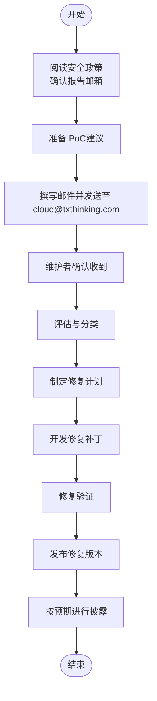
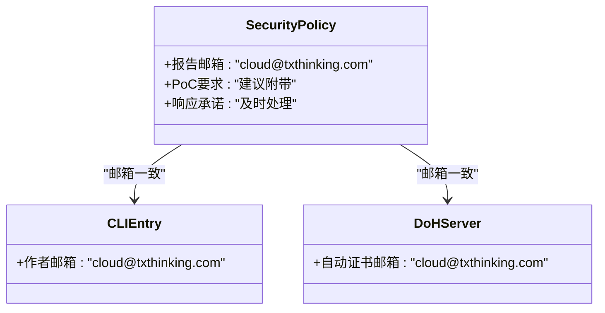
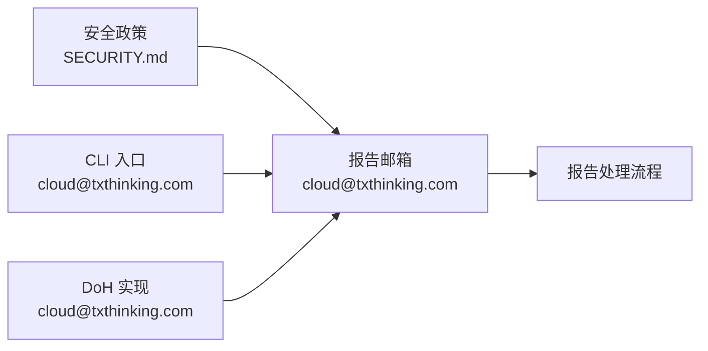

# 漏洞管理

<cite>
**本文引用的文件**
- [SECURITY.md](file://SECURITY.md)
- [README.md](file://README.md)
- [cli/brook/main.go](file://cli/brook/main.go)
- [dohserver.go](file://dohserver.go)
</cite>

## 目录
1. [简介](#简介)
2. [项目结构与入口](#项目结构与入口)
3. [核心组件与职责](#核心组件与职责)
4. [架构总览](#架构总览)
5. [详细组件分析](#详细组件分析)
6. [依赖关系分析](#依赖关系分析)
7. [性能与安全注意事项](#性能与安全注意事项)
8. [故障排查指南](#故障排查指南)
9. [结论](#结论)

## 简介
本文件基于仓库中的安全策略文档，系统化梳理并说明 Brook 项目的漏洞报告流程、响应机制与披露预期。重点包括：
- 如何通过指定邮箱进行漏洞报告
- 建议的 PoC 提交方式
- 项目对漏洞的及时响应承诺
- 预期的披露时间线与修复验证流程

为便于理解，本文在不直接展示代码内容的前提下，通过“章节来源”与“图示来源”定位到仓库中的实际文件与行号，帮助读者快速定位到官方政策与实现细节。

## 项目结构与入口
- 安全政策入口：SECURITY.md 明确了漏洞报告渠道与处理承诺。
- 项目主页与联系方式：README.md 提供项目信息与相关链接；CLI 入口文件中也包含联系邮箱字段，体现项目维护者联系方式的一致性。
- 与证书自动签发相关的邮箱字段：dohserver.go 中的 Let’s Encrypt 自动证书管理器使用了联系邮箱，体现了项目在 TLS 服务场景下的安全实践。

**图示来源**
- [SECURITY.md](file://SECURITY.md#L1-L8)
- [README.md](file://README.md#L1-L44)
- [cli/brook/main.go](file://cli/brook/main.go#L55-L65)
- [dohserver.go](file://dohserver.go#L90-L110)

**章节来源**
- [SECURITY.md](file://SECURITY.md#L1-L8)
- [README.md](file://README.md#L1-L44)
- [cli/brook/main.go](file://cli/brook/main.go#L55-L65)
- [dohserver.go](file://dohserver.go#L90-L110)

## 核心组件与职责
- 漏洞报告接收与处理
  - 报告渠道：通过邮件发送至 cloud@txthinking.com。
  - PoC 要求：建议直接附带 PoC，以便快速复现与验证。
  - 响应承诺：承诺对所有安全漏洞进行“及时处理”。

- 项目维护者联系方式一致性
  - CLI 入口作者信息中包含 cloud@txthinking.com。
  - DoH 服务器实现中，Let’s Encrypt 自动证书管理器使用相同邮箱，确保证书申请与维护流程的统一性。

**章节来源**
- [SECURITY.md](file://SECURITY.md#L1-L8)
- [cli/brook/main.go](file://cli/brook/main.go#L55-L65)
- [dohserver.go](file://dohserver.go#L90-L110)

## 架构总览
下图展示了从发现漏洞到响应处理的关键交互路径，以及与项目维护者联系方式的关联：

**图示来源**
- [SECURITY.md](file://SECURITY.md#L1-L8)
- [dohserver.go](file://dohserver.go#L90-L110)

## 详细组件分析

### 漏洞报告流程
- 报告入口
  - 使用 SECURITY.md 中提供的邮箱地址进行报告。
  - 建议在报告中直接包含 PoC，以提升复现效率与处理速度。
- 响应承诺
  - SECURITY.md 明确承诺对所有安全漏洞进行“及时处理”，体现项目对安全问题的重视与快速响应态度。

**章节来源**
- [SECURITY.md](file://SECURITY.md#L1-L8)

### 与项目维护者联系方式的一致性
- CLI 入口作者信息中包含 cloud@txthinking.com，确保报告渠道与项目作者信息一致。
- DoH 服务器实现中，Let’s Encrypt 自动证书管理器同样使用该邮箱，保证 TLS 服务场景下的联系人一致性。

**图示来源**
- [SECURITY.md](file://SECURITY.md#L1-L8)
- [cli/brook/main.go](file://cli/brook/main.go#L55-L65)
- [dohserver.go](file://dohserver.go#L90-L110)

**章节来源**
- [cli/brook/main.go](file://cli/brook/main.go#L55-L65)
- [dohserver.go](file://dohserver.go#L90-L110)

## 依赖关系分析
- 报告渠道依赖
  - SECURITY.md 是漏洞报告的权威依据，定义了邮箱与处理承诺。
  - CLI 入口与 DoH 服务器实现中均出现相同的联系邮箱，形成跨模块的一致性。
- 处理流程依赖
  - PoC 的可获得性直接影响评估与修复的前置成本。
  - 维护者对“及时处理”的承诺是处理流程的约束条件。

**图示来源**
- [SECURITY.md](file://SECURITY.md#L1-L8)
- [cli/brook/main.go](file://cli/brook/main.go#L55-L65)
- [dohserver.go](file://dohserver.go#L90-L110)

**章节来源**
- [SECURITY.md](file://SECURITY.md#L1-L8)
- [cli/brook/main.go](file://cli/brook/main.go#L55-L65)
- [dohserver.go](file://dohserver.go#L90-L110)

## 性能与安全注意事项
- 本节为通用指导，不直接分析具体文件。
- 在提交 PoC 时，建议遵循最小化原则，仅包含必要信息，避免泄露敏感数据。
- 若涉及 TLS 证书相关问题，可参考 DoH 服务器实现中的自动证书流程，了解项目在证书管理方面的实践。

## 故障排查指南
- 报告未被确认
  - 确认收件人是否为 cloud@txthinking.com。
  - 若长时间未收到回复，可再次发送邮件或通过其他渠道进行跟进。
- PoC 提交问题
  - 确保 PoC 可复现且具备清晰的环境说明。
  - 提供受影响版本范围与最小复现步骤，有助于加速评估。
- 修复验证
  - 修复完成后，建议在受支持版本上进行回归测试，确保问题已解决且未引入新问题。

## 结论
- Brook 项目的漏洞报告流程以 SECURITY.md 为依据，明确报告邮箱与处理承诺。
- 通过 CLI 入口与 DoH 服务器实现中的联系邮箱一致性，确保报告渠道与项目维护者信息统一。
- 建议在报告中附带 PoC，以提升处理效率；项目承诺对所有安全漏洞进行“及时处理”。
- 预期的披露时间线与修复验证流程应以维护者的实际处理节奏为准，但项目承诺将尽快完成修复与发布。