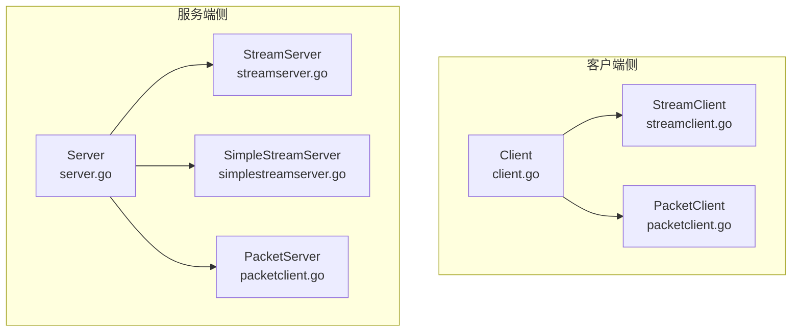
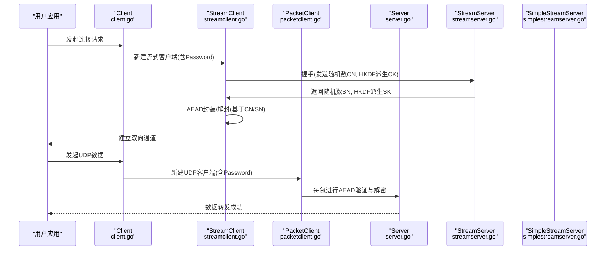
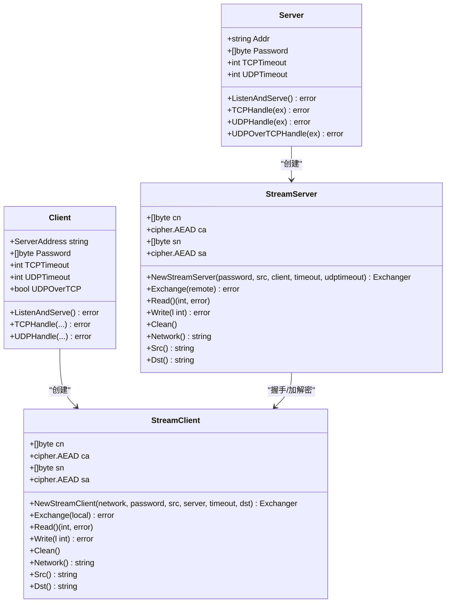
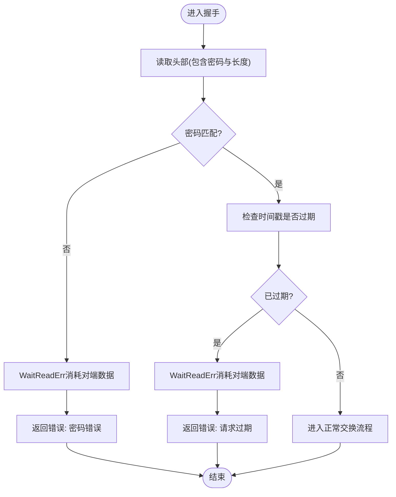
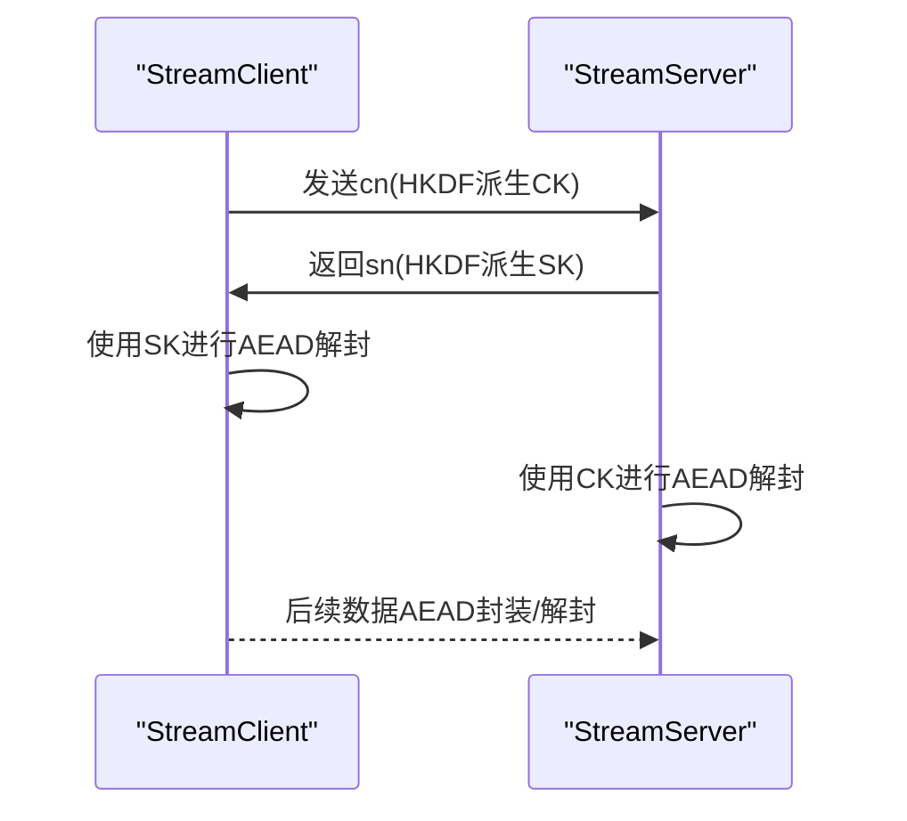
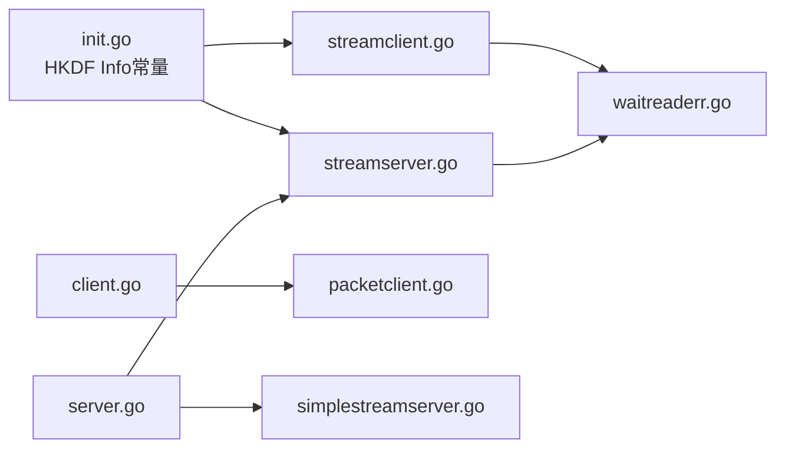

# 认证方式

<cite>
**本文引用的文件列表**
- [server.go](file://server.go)
- [client.go](file://client.go)
- [streamserver.go](file://streamserver.go)
- [streamclient.go](file://streamclient.go)
- [simplestreamserver.go](file://simplestreamserver.go)
- [packetclient.go](file://packetclient.go)
- [init.go](file://init.go)
- [waitreaderr.go](file://waitreaderr.go)
- [util.go](file://util.go)
</cite>

## 目录
1. [简介](#简介)
2. [项目结构](#项目结构)
3. [核心组件](#核心组件)
4. [架构总览](#架构总览)
5. [详细组件分析](#详细组件分析)
6. [依赖关系分析](#依赖关系分析)
7. [性能考量](#性能考量)
8. [故障排查指南](#故障排查指南)
9. [结论](#结论)

## 简介
本文件聚焦于brook的认证机制，围绕server.go中的Password字段与client.go中的Password字段如何协同工作，完成客户端与服务器的身份验证。文档将从以下维度展开：
- Password字段在内存中的存储方式与生命周期
- 密码比较与密钥派生（HKDF）过程
- 认证流程的执行路径与异常处理
- 防暴力破解与安全特性（如过期请求、等待读取消耗等）
- 结合具体源码路径说明关键实现位置

## 项目结构
与认证直接相关的核心文件包括：
- 服务端入口与监听：server.go
- 客户端入口与SOCKS5代理：client.go
- 流式认证与加解密：streamserver.go、streamclient.go
- 简易流式认证（快速校验）：simplestreamserver.go
- UDP数据包认证与加解密：packetclient.go
- HKDF信息常量：init.go
- 错误处理辅助：waitreaderr.go、util.go

图表来源
- [server.go](file://server.go#L47-L138)
- [client.go](file://client.go#L34-L140)
- [streamserver.go](file://streamserver.go#L47-L151)
- [streamclient.go](file://streamclient.go#L47-L143)
- [simplestreamserver.go](file://simplestreamserver.go#L39-L86)
- [packetclient.go](file://packetclient.go#L43-L136)

章节来源
- [server.go](file://server.go#L47-L138)
- [client.go](file://client.go#L34-L140)

## 核心组件
- Server.Password（[]byte）：服务端在构造时接收密码字符串并转换为字节数组，作为后续认证与密钥派生的输入。
- Client.Password（[]byte）：客户端在构造时接收密码字符串并转换为字节数组，用于与服务端进行密钥协商与认证。
- HKDF信息常量：ClientHKDFInfo、ServerHKDFInfo，确保双方使用一致的上下文信息进行密钥派生。
- WaitReadErr：在认证失败或异常情况下，持续从连接中读取以消耗对端发送的数据，降低暴力破解效率。
- ErrorReply：在SOCKS5代理场景下，当认证或连接建立失败时返回拒绝响应并传递错误。

章节来源
- [server.go](file://server.go#L25-L45)
- [client.go](file://client.go#L24-L51)
- [init.go](file://init.go#L17-L18)
- [waitreaderr.go](file://waitreaderr.go#L19-L26)
- [util.go](file://util.go#L28-L39)

## 架构总览
认证流程分为两类：
- 流式认证（TCP/UDP over TCP）：通过StreamClient/StreamServer完成握手、密钥派生与加解密。
- 简易流式认证（快速校验）：通过SimpleStreamServer在握手阶段直接比较Password字节，快速拒绝错误密码。
- UDP数据包认证：通过PacketClient在每个数据包上进行AEAD验证与解密。

图表来源
- [client.go](file://client.go#L57-L94)
- [streamclient.go](file://streamclient.go#L47-L143)
- [streamserver.go](file://streamserver.go#L47-L151)
- [simplestreamserver.go](file://simplestreamserver.go#L39-L86)
- [packetclient.go](file://packetclient.go#L43-L136)
- [server.go](file://server.go#L47-L138)

## 详细组件分析

### 组件A：Server.Password与Client.Password的协同
- 存储方式：两者均以[]byte形式保存密码，避免重复转换开销；在构造函数中由字符串转为[]byte。
- 协同点：
  - 客户端在握手前使用HKDF根据Password与本地随机数生成会话密钥CK，并发送给服务端。
  - 服务端收到客户端随机数后，使用相同HKDF派生SK，并向客户端回发自身随机数。
  - 双方随后使用各自的随机数与HKDF派生的密钥进行AEAD加解密，实现认证与保密通信。
- 异常处理：若密码不匹配，服务端在握手阶段拒绝并调用WaitReadErr消耗对端数据；客户端在握手失败时返回错误。

图表来源
- [server.go](file://server.go#L25-L45)
- [client.go](file://client.go#L24-L51)
- [streamserver.go](file://streamserver.go#L33-L151)
- [streamclient.go](file://streamclient.go#L33-L143)

章节来源
- [server.go](file://server.go#L25-L45)
- [client.go](file://client.go#L24-L51)
- [streamserver.go](file://streamserver.go#L47-L151)
- [streamclient.go](file://streamclient.go#L47-L143)

### 组件B：简易流式认证（快速校验）
- 快速路径：服务端在握手初期直接读取固定长度的头部，比较其中的Password字节是否与期望一致。
- 安全性：若不一致，立即返回错误并调用WaitReadErr消耗对端数据，降低暴力破解效率。
- 时间戳校验：对请求时间戳进行检查，超过有效期则拒绝。

图表来源
- [simplestreamserver.go](file://simplestreamserver.go#L39-L86)
- [waitreaderr.go](file://waitreaderr.go#L19-L26)

章节来源
- [simplestreamserver.go](file://simplestreamserver.go#L39-L86)
- [waitreaderr.go](file://waitreaderr.go#L19-L26)

### 组件C：流式认证与密钥派生（HKDF/AES-GCM）
- HKDF上下文：双方使用固定的ClientHKDFInfo与ServerHKDFInfo作为HKDF的info参数，保证一致性。
- 握手流程：
  - 客户端生成随机数cn，使用HKDF派生CK并发送给服务端。
  - 服务端收到cn后，使用HKDF派生SK并回发随机数sn给客户端。
  - 客户端收到sn后，使用HKDF派生SA并准备AEAD加解密。
- AEAD加解密：双方使用各自的随机数与派生的密钥进行密封/打开，实现认证与保密。

图表来源
- [streamclient.go](file://streamclient.go#L47-L143)
- [streamserver.go](file://streamserver.go#L47-L151)
- [init.go](file://init.go#L17-L18)

章节来源
- [streamclient.go](file://streamclient.go#L47-L143)
- [streamserver.go](file://streamserver.go#L47-L151)
- [init.go](file://init.go#L17-L18)

### 组件D：UDP数据包认证与异常处理
- 每个UDP数据包在发送前使用HKDF派生密钥并进行AEAD密封；接收端同样使用HKDF派生密钥并进行AEAD打开。
- 若AEAD打开失败或数据过小，记录日志并终止该方向的读取循环。
- 在SOCKS5 UDP场景下，客户端通过PacketClient与服务端建立认证通道，随后进行数据转发。

章节来源
- [packetclient.go](file://packetclient.go#L43-L136)
- [client.go](file://client.go#L96-L139)

## 依赖关系分析
- Server与Client均依赖HKDF信息常量，确保两端一致的密钥派生上下文。
- Server在Accept后根据网络类型选择不同的处理器（TCP/UDP over TCP/UDP），并在失败时记录日志。
- WaitReadErr在多个认证失败路径被调用，形成“慢速拒绝”策略，降低暴力破解成功率。
- ErrorReply在SOCKS5代理失败时返回标准拒绝响应，便于上层感知。

图表来源
- [init.go](file://init.go#L17-L18)
- [streamclient.go](file://streamclient.go#L47-L143)
- [streamserver.go](file://streamserver.go#L47-L151)
- [waitreaderr.go](file://waitreaderr.go#L19-L26)
- [client.go](file://client.go#L96-L139)
- [packetclient.go](file://packetclient.go#L43-L136)
- [server.go](file://server.go#L47-L138)
- [simplestreamserver.go](file://simplestreamserver.go#L39-L86)

章节来源
- [init.go](file://init.go#L17-L18)
- [waitreaderr.go](file://waitreaderr.go#L19-L26)
- [util.go](file://util.go#L28-L39)

## 性能考量
- 内存管理：各组件使用缓冲池（BP12/BP2048/BP65507）管理临时缓冲区，减少GC压力。
- 加解密成本：HKDF与AES-GCM在握手阶段一次性完成，后续数据仅进行AEAD操作，开销较低。
- 超时控制：通过SetDeadline设置读写超时，避免长时间阻塞。
- UDP路径：UDP over TCP与UDP直连路径分别优化了缓冲区大小与处理逻辑。

章节来源
- [streamserver.go](file://streamserver.go#L153-L243)
- [streamclient.go](file://streamclient.go#L145-L234)
- [simplestreamserver.go](file://simplestreamserver.go#L88-L181)
- [packetclient.go](file://packetclient.go#L51-L136)

## 故障排查指南
- 密码错误
  - 现象：握手阶段即被拒绝，服务端返回错误并调用WaitReadErr消耗对端数据。
  - 排查要点：确认Server.Password与Client.Password一致；检查HKDF上下文是否被修改。
  - 参考路径：[simplestreamserver.go](file://simplestreamserver.go#L51-L54)、[streamserver.go](file://streamserver.go#L203-L206)、[waitreaderr.go](file://waitreaderr.go#L19-L26)
- 请求过期
  - 现象：握手阶段因时间戳过期而拒绝。
  - 排查要点：检查系统时间同步；确认握手时间窗口（默认60秒）。
  - 参考路径：[simplestreamserver.go](file://simplestreamserver.go#L65-L70)、[streamserver.go](file://streamserver.go#L85-L91)
- AEAD解封失败
  - 现象：UDP数据包接收端无法打开，记录日志并终止读取。
  - 排查要点：核对HKDF info与密码一致性；检查网络丢包或篡改。
  - 参考路径：[packetclient.go](file://packetclient.go#L80-L93)
- SOCKS5代理失败
  - 现象：ErrorReply返回连接被拒。
  - 排查要点：检查目标地址与端口；确认服务端未拒绝该来源。
  - 参考路径：[util.go](file://util.go#L28-L39)、[client.go](file://client.go#L57-L94)

章节来源
- [simplestreamserver.go](file://simplestreamserver.go#L51-L70)
- [streamserver.go](file://streamserver.go#L85-L91)
- [packetclient.go](file://packetclient.go#L80-L93)
- [util.go](file://util.go#L28-L39)
- [client.go](file://client.go#L57-L94)

## 结论
brook的认证机制通过Server.Password与Client.Password在握手阶段协同完成，采用HKDF派生密钥并以AES-GCM进行AEAD加解密，既保证了身份认证，又提供了机密性与完整性保护。配合WaitReadErr的“慢速拒绝”策略与请求过期检查，有效提升了抗暴力破解能力。整体设计在功能正确性、安全性与性能之间取得平衡，适合在多种网络环境下稳定运行。