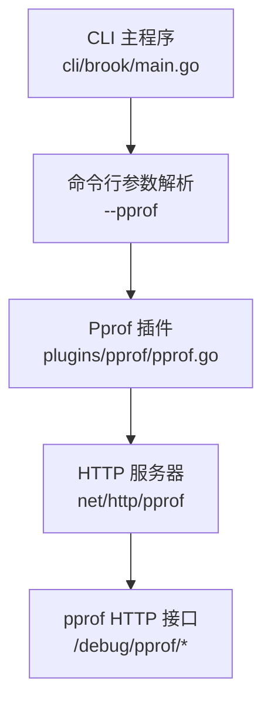
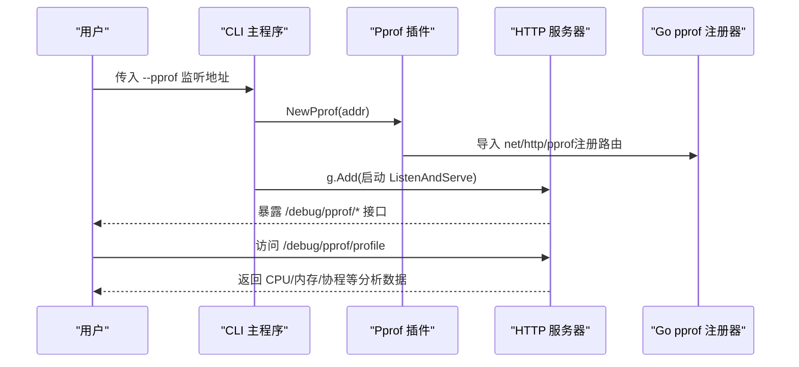
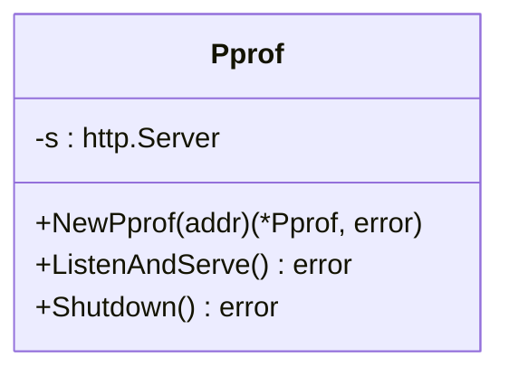
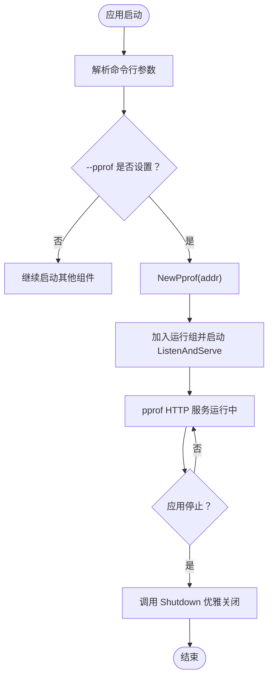
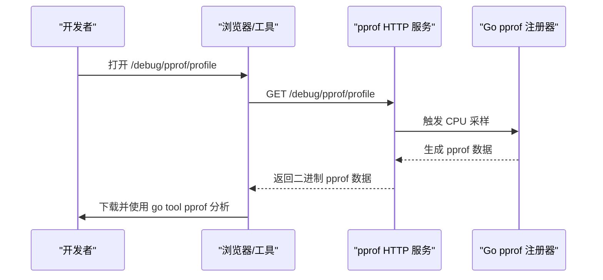
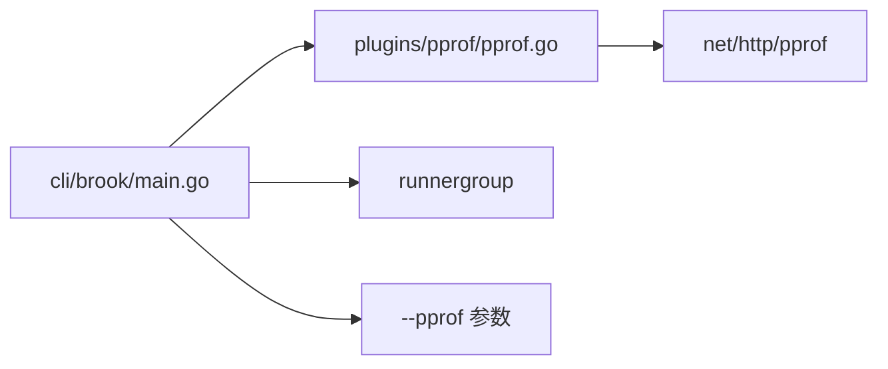

# 性能分析插件

<cite>
**本文引用的文件**
- [plugins/pprof/pprof.go](file://plugins/pprof/pprof.go)
- [plugins/pprof/readme.md](file://plugins/pprof/readme.md)
- [plugins/CLAUDE.md](file://plugins/CLAUDE.md)
- [cli/brook/main.go](file://cli/brook/main.go)
- [README.md](file://README.md)
</cite>

## 目录
1. [简介](#简介)
2. [项目结构](#项目结构)
3. [核心组件](#核心组件)
4. [架构总览](#架构总览)
5. [详细组件分析](#详细组件分析)
6. [依赖关系分析](#依赖关系分析)
7. [性能考量](#性能考量)
8. [故障排查指南](#故障排查指南)
9. [结论](#结论)
10. [附录](#附录)

## 简介
本插件通过启用 Go 原生的 net/http/pprof HTTP 服务器，为运行中的进程提供 CPU、内存、goroutine 等性能数据采集与分析能力。启用后，会在指定监听地址上暴露一组 HTTP 接口，用于触发采样、下载分析数据或查看实时状态。该插件以最小侵入方式集成到 CLI 启动流程中，仅在传入相应参数时启动 pprof HTTP 服务，并随应用生命周期优雅关闭。

## 项目结构
- 插件位于 plugins/pprof，包含插件实现与简要说明。
- CLI 主程序在 cli/brook/main.go 中定义了 --pprof 参数，并在 Before 钩子中按需创建并启动 pprof 服务。
- 插件系统文档在 plugins/CLAUDE.md 中对 pprof 的职责与用法进行了概述。
- README.md 提供项目基本介绍与使用入口。

图表来源
- [cli/brook/main.go](file://cli/brook/main.go#L66-L71)
- [cli/brook/main.go](file://cli/brook/main.go#L175-L188)
- [plugins/pprof/pprof.go](file://plugins/pprof/pprof.go#L17-L21)

章节来源
- [plugins/pprof/pprof.go](file://plugins/pprof/pprof.go#L17-L21)
- [plugins/pprof/readme.md](file://plugins/pprof/readme.md#L1-L2)
- [plugins/CLAUDE.md](file://plugins/CLAUDE.md#L23-L29)
- [cli/brook/main.go](file://cli/brook/main.go#L66-L71)
- [cli/brook/main.go](file://cli/brook/main.go#L175-L188)
- [README.md](file://README.md#L1-L10)

## 核心组件
- pprof 插件实现
  - 通过导入 net/http/pprof 包，自动向默认路由注册 pprof 相关 HTTP 处理器。
  - 提供 NewPprof(addr)、ListenAndServe()、Shutdown() 方法，封装一个轻量级 HTTP 服务器实例。
- CLI 集成
  - 定义 --pprof 字符串参数，用于指定 pprof HTTP 服务器监听地址。
  - 在 Before 钩子中，若参数非空则创建 Pprof 实例并加入运行组，随应用启动与停止自动管理生命周期。

章节来源
- [plugins/pprof/pprof.go](file://plugins/pprof/pprof.go#L17-L21)
- [plugins/pprof/pprof.go](file://plugins/pprof/pprof.go#L27-L42)
- [cli/brook/main.go](file://cli/brook/main.go#L66-L71)
- [cli/brook/main.go](file://cli/brook/main.go#L175-L188)

## 架构总览
pprof 插件在启动时仅负责启动一个 HTTP 服务器，实际的 pprof 接口由 Go 标准库 net/http/pprof 注册。CLI 通过命令行参数控制是否启用该服务，并将其纳入统一的生命周期管理。

图表来源
- [cli/brook/main.go](file://cli/brook/main.go#L66-L71)
- [cli/brook/main.go](file://cli/brook/main.go#L175-L188)
- [plugins/pprof/pprof.go](file://plugins/pprof/pprof.go#L17-L21)
- [plugins/pprof/pprof.go](file://plugins/pprof/pprof.go#L36-L42)

## 详细组件分析

### 组件一：Pprof 插件类图
该插件以最小结构提供 HTTP 服务器封装，核心是通过导入 net/http/pprof 来注册 pprof 路由。

图表来源
- [plugins/pprof/pprof.go](file://plugins/pprof/pprof.go#L23-L42)

章节来源
- [plugins/pprof/pprof.go](file://plugins/pprof/pprof.go#L23-L42)

### 组件二：CLI 参数与生命周期集成
- 参数定义：--pprof 字符串，用于设置 pprof HTTP 服务器监听地址。
- 生命周期：在 Before 钩子中判断参数是否为空，非空则创建 Pprof 实例并加入运行组；Stop 钩子中调用 Shutdown 优雅关闭。

图表来源
- [cli/brook/main.go](file://cli/brook/main.go#L66-L71)
- [cli/brook/main.go](file://cli/brook/main.go#L175-L188)
- [plugins/pprof/pprof.go](file://plugins/pprof/pprof.go#L36-L42)

章节来源
- [cli/brook/main.go](file://cli/brook/main.go#L66-L71)
- [cli/brook/main.go](file://cli/brook/main.go#L175-L188)
- [plugins/CLAUDE.md](file://plugins/CLAUDE.md#L23-L29)

### 组件三：pprof HTTP 接口与采集要点
- 启用方式：通过 --pprof 指定监听地址（例如 :6060）即可启动 pprof HTTP 服务。
- 接口范围：Go 标准库 net/http/pprof 会注册 /debug/pprof/* 下的一系列端点，典型包括但不限于：
  - /debug/pprof/profile：触发 CPU 采样并返回 pprof 数据，常用于 CPU 性能分析。
  - /debug/pprof/heap：触发堆内存采样并返回 pprof 数据，常用于内存泄漏与分配热点分析。
  - /debug/pprof/goroutine：触发 goroutine 采样并返回 pprof 数据，常用于协程阻塞与泄漏分析。
  - /debug/pprof/block：触发阻塞事件采样并返回 pprof 数据，常用于阻塞热点分析。
  - /debug/pprof/contention：触发竞争事件采样并返回 pprof 数据，常用于竞争条件分析。
  - /debug/pprof/cmdline：返回进程启动命令行参数。
  - /debug/pprof/symbol：符号查询接口。
  - /debug/pprof/trace：触发跟踪采样并返回 pprof 数据，常用于延迟与调度分析。
- 采集流程（概念示意）：
  - 使用浏览器或 curl 访问对应端点，触发采样并下载数据。
  - 将下载的数据交给 go tool pprof 工具进行可视化与分析。

图表来源
- [plugins/pprof/pprof.go](file://plugins/pprof/pprof.go#L17-L21)

章节来源
- [plugins/pprof/pprof.go](file://plugins/pprof/pprof.go#L17-L21)
- [plugins/CLAUDE.md](file://plugins/CLAUDE.md#L54-L58)

## 依赖关系分析
- 插件依赖
  - 导入 net/http/pprof：用于注册 pprof 相关路由处理器。
  - 使用 net/http/http.Server：封装 HTTP 服务器生命周期。
- CLI 依赖
  - 引入 pprof 插件包：在启动前按参数创建实例。
  - 使用 runnergroup：将 pprof 服务纳入统一的并发与生命周期管理。
- 文档与说明
  - plugins/CLAUDE.md 对 pprof 的职责与用途进行了简要说明。
  - plugins/pprof/readme.md 对插件启用方式做了简要提示。

图表来源
- [cli/brook/main.go](file://cli/brook/main.go#L40-L46)
- [cli/brook/main.go](file://cli/brook/main.go#L66-L71)
- [cli/brook/main.go](file://cli/brook/main.go#L175-L188)
- [plugins/pprof/pprof.go](file://plugins/pprof/pprof.go#L17-L21)

章节来源
- [cli/brook/main.go](file://cli/brook/main.go#L40-L46)
- [cli/brook/main.go](file://cli/brook/main.go#L66-L71)
- [cli/brook/main.go](file://cli/brook/main.go#L175-L188)
- [plugins/pprof/pprof.go](file://plugins/pprof/pprof.go#L17-L21)
- [plugins/CLAUDE.md](file://plugins/CLAUDE.md#L23-L29)

## 性能考量
- 启动成本：pprof 服务是一个轻量级 HTTP 服务器，仅在传参启用时创建，对正常运行时性能影响极小。
- 采样开销：CPU/内存/阻塞/竞争等采样会带来一定开销，建议在定位问题期间开启，问题解决后及时关闭。
- 端口占用：请确保 --pprof 指定的监听地址未被其他服务占用，避免启动失败。
- 资源释放：通过 Shutdown 优雅关闭，避免资源泄露。

## 故障排查指南
- 无法启动 pprof 服务
  - 检查 --pprof 参数格式是否正确（例如 :6060）。
  - 确认监听端口未被占用。
  - 查看 CLI 输出的错误信息，确认是否在 Before 钩子阶段创建 Pprof 实例成功。
- 无法访问 /debug/pprof/*
  - 确认 pprof HTTP 服务已成功启动且监听地址可达。
  - 若部署在公网，请参考“安全使用建议”章节，避免直接暴露敏感端点。
- 采样数据异常
  - CPU/内存采样需持续一段时间才能获得稳定结果，建议在高负载场景下进行。
  - 使用 go tool pprof 时确保数据文件完整，避免中途中断导致数据损坏。

章节来源
- [cli/brook/main.go](file://cli/brook/main.go#L66-L71)
- [cli/brook/main.go](file://cli/brook/main.go#L175-L188)
- [plugins/pprof/pprof.go](file://plugins/pprof/pprof.go#L36-L42)

## 结论
pprof 插件通过极少的代码实现了对 Go 原生 pprof 能力的无缝接入，结合 CLI 的参数与生命周期管理，使得性能分析能力可以按需启用与关闭。配合标准的 pprof HTTP 接口，开发者可以在本地或受控环境下快速采集 CPU、内存、goroutine 等关键指标，辅助定位性能瓶颈与问题根因。

## 附录

### A. 启用与使用步骤
- 启用方式
  - 在启动命令中添加 --pprof 监听地址，例如 --pprof :6060。
- 访问接口
  - 在浏览器中打开 http://localhost:6060/debug/pprof/，查看可用端点列表。
  - 根据需求访问 /debug/pprof/profile、/debug/pprof/heap、/debug/pprof/goroutine 等端点进行采样。
- 数据分析
  - 将下载的 pprof 数据交给 go tool pprof 进行可视化与分析。

章节来源
- [cli/brook/main.go](file://cli/brook/main.go#L66-L71)
- [plugins/pprof/pprof.go](file://plugins/pprof/pprof.go#L17-L21)
- [README.md](file://README.md#L1-L10)

### B. 安全使用建议
- 仅在内网或受控环境暴露 pprof 端点，避免直接暴露到公网。
- 如需在公网使用，务必采取严格的访问控制措施，例如：
  - 限制来源 IP 或使用反向代理进行鉴权。
  - 使用强密码或双向 TLS 认证。
  - 为 pprof 路径设置随机且难以猜测的路径，降低被扫描风险。
- 采样期间注意控制时间与频率，避免对线上业务造成额外压力。
- 问题解决后及时关闭 pprof 服务，减少潜在攻击面。

章节来源
- [plugins/CLAUDE.md](file://plugins/CLAUDE.md#L43-L47)
- [plugins/CLAUDE.md](file://plugins/CLAUDE.md#L81-L97)