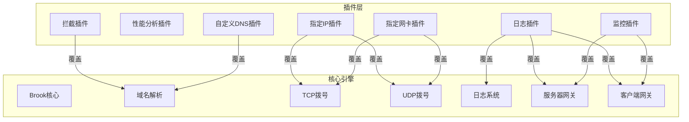
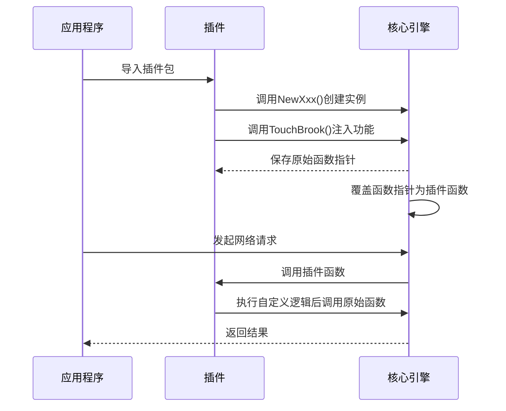

# 插件系统

<cite>
**本文档中引用的文件**  
- [plugins/readme.md](file://plugins/readme.md)
- [plugins/logger/logger.go](file://plugins/logger/logger.go)
- [plugins/logger/logger_unix.go](file://plugins/logger/logger_unix.go)
- [plugins/logger/logger_windows.go](file://plugins/logger/logger_windows.go)
- [plugins/pprof/pprof.go](file://plugins/pprof/pprof.go)
- [plugins/prometheus/prometheus.go](file://plugins/prometheus/prometheus.go)
- [plugins/block/block.go](file://plugins/block/block.go)
- [plugins/dialwithdns/dialwithdns.go](file://plugins/dialwithdns/dialwithdns.go)
- [plugins/dialwithip/dialwithip.go](file://plugins/dialwithip/dialwithip.go)
- [plugins/dialwithnic/dialwithnic.go](file://plugins/dialwithnic/dialwithnic.go)
- [core/CLAUDE.md](file://core/CLAUDE.md)
</cite>

## 目录
1. [简介](#简介)
2. [插件系统架构](#插件系统架构)
3. [核心插件详解](#核心插件详解)
   - [日志插件 (logger)](#日志插件-logger)
   - [性能分析插件 (pprof)](#性能分析插件-pprof)
   - [监控插件 (prometheus)](#监控插件-prometheus)
   - [拦截插件 (block)](#拦截插件-block)
   - [自定义DNS解析插件 (dialwithdns)](#自定义dns解析插件-dialwithdns)
   - [指定IP拨号插件 (dialwithip)](#指定ip拨号插件-dialwithip)
   - [指定网卡拨号插件 (dialwithnic)](#指定网卡拨号插件-dialwithnic)
4. [插件集成机制](#插件集成机制)
5. [配置示例](#配置示例)
6. [总结](#总结)

## 简介

Brook插件系统提供了一种灵活的扩展机制，允许用户通过导入插件包来增强核心功能。插件通过覆盖公共函数变量的方式与核心引擎集成，实现功能扩展。每个插件都设计为独立的模块，可以单独启用或禁用，不影响主程序的运行。

插件系统的核心理念是"简单即强大"，开发者只需实现特定接口并调用`TouchBrook()`方法即可完成功能注入。这种设计使得插件开发变得极为简单，同时保持了系统的高性能和低耦合特性。

**插件系统特点**：
- **非侵入式集成**：通过函数指针替换实现功能扩展
- **热插拔支持**：部分插件支持运行时动态启用
- **配置灵活**：每个插件提供丰富的配置选项
- **模块化设计**：各插件相互独立，易于维护

## 插件系统架构



**图示说明**：插件通过覆盖核心引擎中的函数指针来实现功能扩展。每个插件根据其功能需求，选择性地覆盖一个或多个核心函数。

**Diagram sources**
- [plugins/logger/logger.go](file://plugins/logger/logger.go#L76-L132)
- [plugins/block/block.go](file://plugins/block/block.go#L137-L182)
- [plugins/dialwithdns/dialwithdns.go](file://plugins/dialwithdns/dialwithdns.go#L121-L144)
- [plugins/dialwithip/dialwithip.go](file://plugins/dialwithip/dialwithip.go#L47-L98)
- [plugins/dialwithnic/dialwithnic.go](file://plugins/dialwithnic/dialwithnic.go#L67-L124)
- [plugins/prometheus/prometheus.go](file://plugins/prometheus/prometheus.go#L50-L92)

**Section sources**
- [plugins/readme.md](file://plugins/readme.md#L1-L2)
- [core/CLAUDE.md](file://core/CLAUDE.md)

## 核心插件详解

### 日志插件 (logger)

日志插件提供灵活的日志记录功能，支持控制台输出和文件记录两种模式。该插件通过覆盖核心日志函数来捕获所有系统事件。

**主要功能**：
- 支持控制台和文件两种日志输出方式
- 可添加自定义标签进行日志分类
- Unix系统支持SIGUSR1信号触发日志轮转
- 记录服务器和客户端的网络交换信息

**配置参数**：
- `tags`：自定义标签映射，用于日志分类
- `file`：日志文件路径，"console"表示输出到控制台

**使用场景**：
- 系统调试和问题排查
- 网络流量审计
- 安全监控和日志分析

**Section sources**
- [plugins/logger/logger.go](file://plugins/logger/logger.go#L15-L134)
- [plugins/logger/logger_unix.go](file://plugins/logger/logger_unix.go#L1-L22)

### 性能分析插件 (pprof)

性能分析插件集成了Go语言的pprof工具，提供详细的性能分析功能。通过HTTP接口暴露pprof服务，便于开发者进行性能调优。

**主要功能**：
- 启用Go语言内置的pprof性能分析工具
- 通过HTTP服务提供性能数据接口
- 支持CPU、内存、goroutine等多维度分析

**配置参数**：
- `addr`：pprof服务监听地址

**使用场景**：
- 系统性能瓶颈分析
- 内存泄漏检测
- Goroutine泄漏排查
- CPU使用率优化

**Section sources**
- [plugins/pprof/pprof.go](file://plugins/pprof/pprof.go#L15-L43)

### 监控插件 (prometheus)

监控插件将系统指标导出到Prometheus监控系统，实现对Brook服务的全面监控。该插件通过注册Prometheus计数器来收集网络流量数据。

**主要功能**：
- 将网络交换数据作为Prometheus指标暴露
- 支持自定义标签进行数据维度划分
- 提供标准的Prometheus HTTP接口
- 自动统计目标地址的访问次数

**配置参数**：
- `addr`：HTTP服务监听地址
- `path`：指标暴露路径
- `tags`：自定义标签用于指标分类

**使用场景**：
- 生产环境服务监控
- 流量趋势分析
- 异常行为检测
- SLA指标跟踪

**Section sources**
- [plugins/prometheus/prometheus.go](file://plugins/prometheus/prometheus.go#L15-L93)

### 拦截插件 (block)

拦截插件在服务端实现目标地址拦截功能，支持域名和IP地址两种拦截方式。对于域名拦截，会先解析IP再进行二次检查。

**主要功能**：
- 支持域名列表拦截
- 支持IPv4和IPv6 CIDR地址段拦截
- 支持GeoIP地理位置拦截
- 内置缓存机制提高性能
- 支持定期更新拦截列表

**配置参数**：
- `domainList`：域名拦截列表文件路径
- `cidr4List`：IPv4 CIDR拦截列表文件路径
- `cidr6List`：IPv6 CIDR拦截列表文件路径
- `geoIP`：GeoIP规则列表
- `update`：列表更新间隔（秒）

**使用场景**：
- 内容过滤和审查
- 恶意域名拦截
- 地理位置访问控制
- 网络安全防护

**Section sources**
- [plugins/block/block.go](file://plugins/block/block.go#L15-L183)

### 自定义DNS解析插件 (dialwithdns)

自定义DNS解析插件允许使用指定的DNS服务器或DoH服务进行域名解析，替代本地DNS解析。

**主要功能**：
- 支持传统DNS服务器解析
- 支持DoH（DNS over HTTPS）解析
- 可指定优先解析IPv4(A记录)或IPv6(AAAA记录)
- 兼容SOCKS5协议的域名解析

**配置参数**：
- `dns`：DNS服务器地址，支持https://前缀的DoH服务
- `prefer`：优先解析类型，"A"或"AAAA"

**使用场景**：
- 绕过本地DNS污染
- 实现DNS分流
- 提高解析安全性
- 访问特定网络区域

**Section sources**
- [plugins/dialwithdns/dialwithdns.go](file://plugins/dialwithdns/dialwithdns.go#L15-L145)

### 指定IP拨号插件 (dialwithip)

指定IP拨号插件允许在建立连接时使用指定的源IP地址，实现多IP出口的流量管理。

**主要功能**：
- 支持指定IPv4源地址
- 支持指定IPv6源地址
- 自动根据目标地址IP版本选择源IP
- 兼容SOCKS5协议的拨号

**配置参数**：
- `ip4`：指定的IPv4地址
- `ip6`：指定的IPv6地址

**使用场景**：
- 多线路出口选择
- IP地址池管理
- 源地址策略路由
- 负载均衡

**Section sources**
- [plugins/dialwithip/dialwithip.go](file://plugins/dialwithip/dialwithip.go#L15-L99)

### 指定网卡拨号插件 (dialwithnic)

指定网卡拨号插件允许通过指定的网络接口进行连接，实现基于网卡的流量控制。

**主要功能**：
- 支持通过指定网卡名称进行拨号
- 自动获取网卡的公网IP地址
- 支持IPv4和IPv6地址选择
- 兼容SOCKS5协议的拨号

**配置参数**：
- `nic`：网络接口名称

**使用场景**：
- 多网卡环境下的流量分配
- 特定物理线路使用
- 网络隔离和安全策略
- 带宽管理

**Section sources**
- [plugins/dialwithnic/dialwithnic.go](file://plugins/dialwithnic/dialwithnic.go#L15-L125)

## 插件集成机制

Brook插件系统采用函数指针覆盖的机制实现功能扩展。核心思想是通过修改全局函数变量来注入自定义逻辑，而无需修改核心代码。



**集成步骤**：
1. **导入插件包**：在应用程序中导入所需的插件包
2. **创建插件实例**：调用插件的`NewXxx()`构造函数
3. **注入功能**：调用插件的`TouchBrook()`方法完成集成
4. **使用功能**：插件功能自动生效，无需额外调用

**技术特点**：
- **无侵入性**：不修改核心代码即可扩展功能
- **链式调用**：插件可保留原始函数指针，实现功能增强而非完全替换
- **运行时生效**：功能注入在运行时完成，支持动态加载
- **低性能开销**：仅增加一次函数调用开销

**Section sources**
- [plugins/readme.md](file://plugins/readme.md#L1-L2)
- [plugins/logger/logger.go](file://plugins/logger/logger.go#L76-L132)
- [plugins/block/block.go](file://plugins/block/block.go#L137-L182)

## 配置示例

### 启用日志插件
```go
import _ "github.com/txthinking/brook/plugins/logger"

// 创建日志插件实例
logger, err := logger.NewLogger(map[string]string{"service": "brook"}, "brook.log")
if err != nil {
    log.Fatal(err)
}
// 注入功能
logger.TouchBrook()
```

### 启用性能分析
```go
import _ "github.com/txthinking/brook/plugins/pprof"

// 创建pprof插件实例
pprof, err := pprof.NewPprof(":6060")
if err != nil {
    log.Fatal(err)
}
// 启动pprof服务
go pprof.ListenAndServe()
```

### 启用监控插件
```go
import _ "github.com/txthinking/brook/plugins/prometheus"

// 创建Prometheus插件实例
prometheus := prometheus.NewPrometheus(":9090", "/metrics", map[string]string{"instance": "brook-server"})
// 注入功能
prometheus.TouchBrook()
// 启动HTTP服务
go prometheus.ListenAndServe()
```

### 启用拦截功能
```go
import _ "github.com/txthinking/brook/plugins/block"

// 创建拦截插件实例
block, err := block.NewBlock("block_domains.txt", "block_cidr4.txt", "block_cidr6.txt", []string{"CN"}, 300)
if err != nil {
    log.Fatal(err)
}
// 注入功能
block.TouchBrook()
```

### 组合使用多个插件
```go
// 按顺序启用多个插件
// 注意：后启用的插件可能会覆盖先启用插件的功能

// 1. 启用日志记录
logger, _ := logger.NewLogger(map[string]string{"env": "production"}, "access.log")
logger.TouchBrook()

// 2. 启用监控
prometheus := prometheus.NewPrometheus(":9090", "/metrics", map[string]string{"job": "brook"})
prometheus.TouchBrook()

// 3. 启用内容过滤
block, _ := block.NewBlock("ad_domains.txt", "", "", nil, 0)
block.TouchBrook()
```

**Section sources**
- [plugins/logger/logger.go](file://plugins/logger/logger.go#L39-L48)
- [plugins/pprof/pprof.go](file://plugins/pprof/pprof.go#L27-L34)
- [plugins/prometheus/prometheus.go](file://plugins/prometheus/prometheus.go#L32-L40)
- [plugins/block/block.go](file://plugins/block/block.go#L43-L82)

## 总结

Brook插件系统通过简洁而强大的设计，实现了核心功能的灵活扩展。该系统采用函数指针覆盖机制，使得插件能够无缝集成到核心引擎中，同时保持了低耦合和高性能的特点。

各个内置插件针对不同的使用场景提供了专门的功能：
- **logger** 插件满足了系统日志记录和审计需求
- **pprof** 插件为性能调优提供了专业工具
- **prometheus** 插件实现了现代化的监控集成
- **block** 插件提供了强大的内容过滤能力
- **dialwithdns/dialwithip/dialwithnic** 插件组实现了精细的网络连接控制

插件系统的最大优势在于其简单性：开发者只需实现`TouchBrook()`方法即可完成功能注入，无需理解复杂的框架机制。这种设计降低了插件开发门槛，促进了生态系统的繁荣。

通过合理组合使用这些插件，用户可以根据具体需求构建出功能丰富、性能优越的网络代理服务。