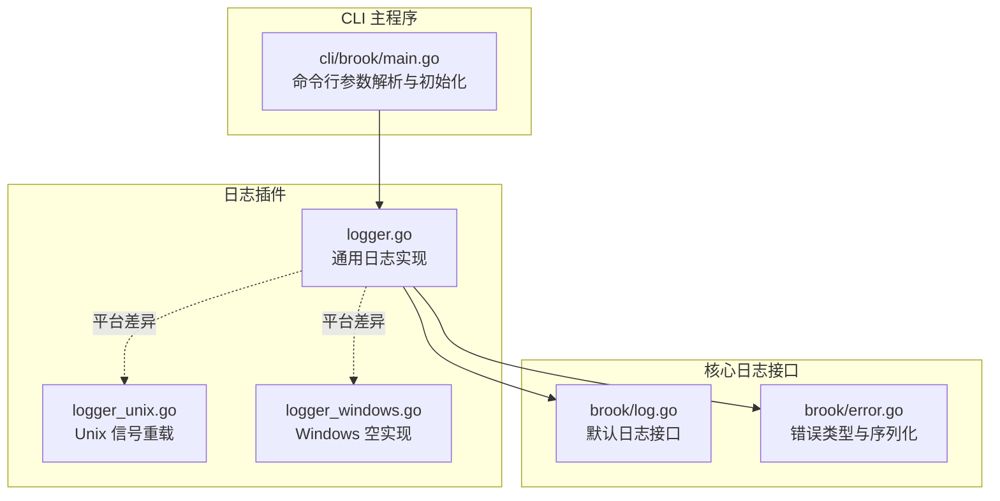
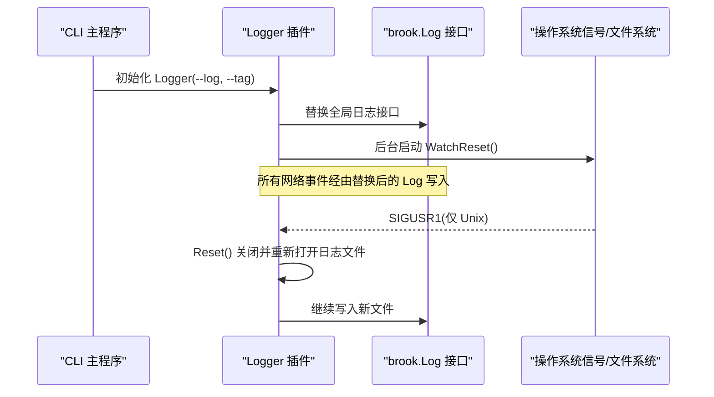
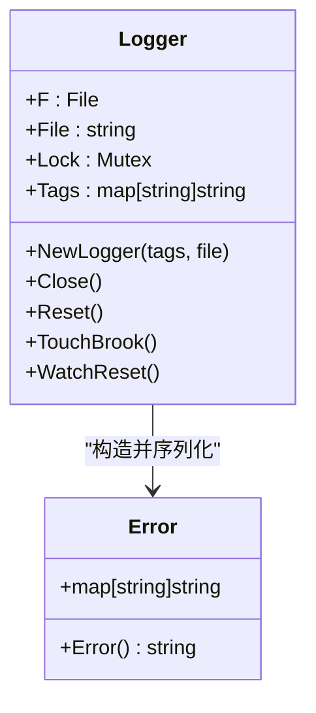
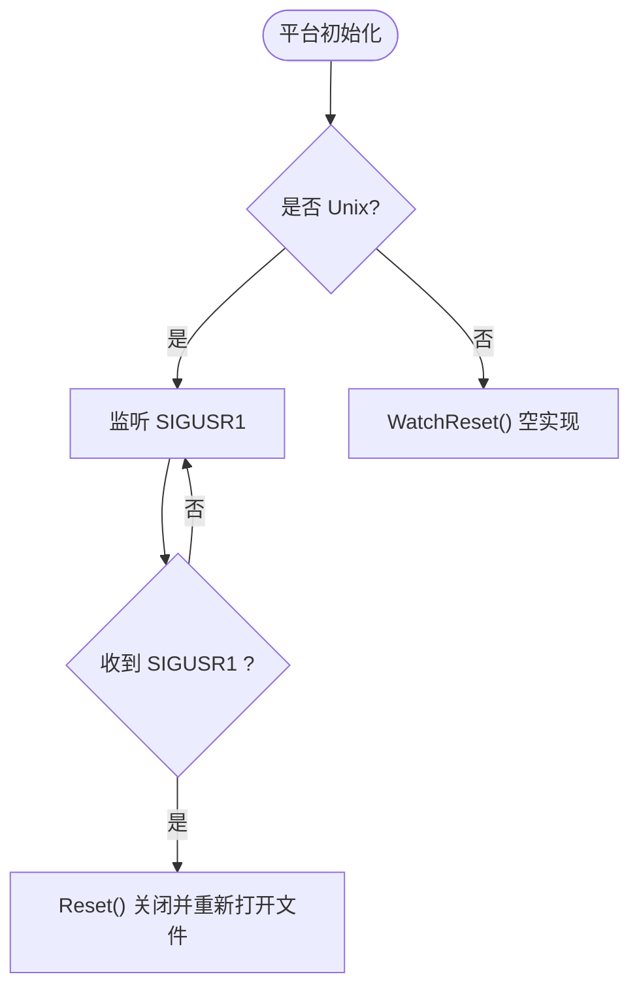
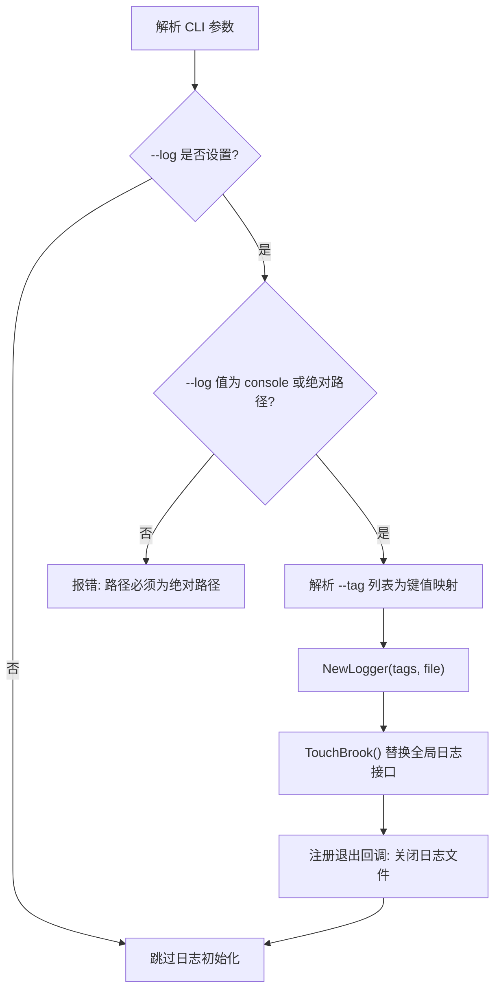
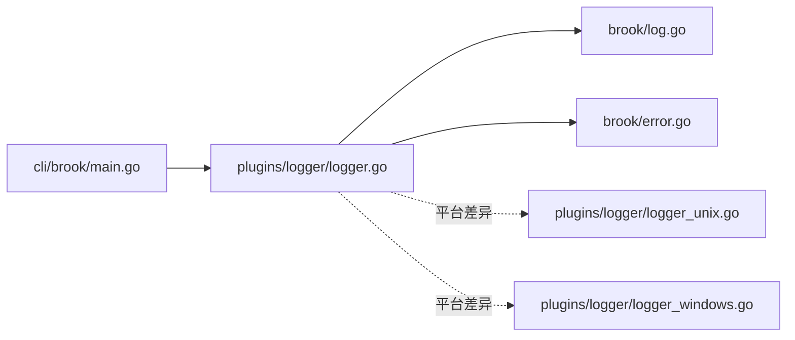

# 日志插件

<cite>
**本文引用的文件**
- [plugins/logger/logger.go](file://plugins/logger/logger.go)
- [plugins/logger/logger_unix.go](file://plugins/logger/logger_unix.go)
- [plugins/logger/logger_windows.go](file://plugins/logger/logger_windows.go)
- [plugins/logger/readme.md](file://plugins/logger/readme.md)
- [cli/brook/main.go](file://cli/brook/main.go)
- [brook/log.go](file://brook/log.go)
- [brook/error.go](file://brook/error.go)
</cite>

## 目录
1. [简介](#简介)
2. [项目结构](#项目结构)
3. [核心组件](#核心组件)
4. [架构总览](#架构总览)
5. [详细组件分析](#详细组件分析)
6. [依赖关系分析](#依赖关系分析)
7. [性能与并发特性](#性能与并发特性)
8. [故障排查指南](#故障排查指南)
9. [结论](#结论)
10. [附录：配置示例与用法](#附录配置示例与用法)

## 简介
本文件面向“日志插件”的使用者与维护者，系统性说明其跨平台日志记录机制。该插件通过命令行参数启用，支持将日志输出到控制台或文件；在 Unix 系统上，可通过发送 SIGUSR1 信号重载日志文件；同时支持为日志注入标签（tag），以便在日志中附加上下文信息。本文基于源码解析，覆盖日志格式、信号处理、平台差异、以及与主程序钩子的集成方式。

## 项目结构
日志插件位于 plugins/logger 目录，包含通用实现与平台特定实现：
- 通用实现：负责日志对象生命周期管理、写入、标签注入、与主程序日志钩子对接
- 平台实现：Unix 使用信号监听重载日志文件；Windows 提供空实现（不重载）

图表来源
- [plugins/logger/logger.go](file://plugins/logger/logger.go#L1-L134)
- [plugins/logger/logger_unix.go](file://plugins/logger/logger_unix.go#L1-L22)
- [plugins/logger/logger_windows.go](file://plugins/logger/logger_windows.go#L1-L5)
- [cli/brook/main.go](file://cli/brook/main.go#L160-L214)
- [brook/log.go](file://brook/log.go#L1-L21)
- [brook/error.go](file://brook/error.go#L1-L27)

章节来源
- [plugins/logger/logger.go](file://plugins/logger/logger.go#L1-L134)
- [plugins/logger/logger_unix.go](file://plugins/logger/logger_unix.go#L1-L22)
- [plugins/logger/logger_windows.go](file://plugins/logger/logger_windows.go#L1-L5)
- [cli/brook/main.go](file://cli/brook/main.go#L60-L80)
- [cli/brook/main.go](file://cli/brook/main.go#L189-L214)
- [brook/log.go](file://brook/log.go#L1-L21)
- [brook/error.go](file://brook/error.go#L1-L27)

## 核心组件
- Logger 结构体
  - 字段：文件句柄、文件路径、互斥锁、标签映射
  - 方法：新建、关闭、重置、挂接主程序日志钩子、平台信号监听
- CLI 参数
  - --log：启用日志，值为绝对路径或 "console"
  - --tag：键值对标签，多组以冒号分隔，最终注入到每条日志
- 默认日志接口
  - 全局函数指针，可被插件替换为自定义实现
- 错误类型
  - 统一为 map[string]string 的 Error 类型，序列化为 JSON 字符串

章节来源
- [plugins/logger/logger.go](file://plugins/logger/logger.go#L32-L48)
- [plugins/logger/logger.go](file://plugins/logger/logger.go#L50-L74)
- [plugins/logger/logger.go](file://plugins/logger/logger.go#L76-L133)
- [cli/brook/main.go](file://cli/brook/main.go#L60-L80)
- [cli/brook/main.go](file://cli/brook/main.go#L189-L214)
- [brook/log.go](file://brook/log.go#L1-L21)
- [brook/error.go](file://brook/error.go#L1-L27)

## 架构总览
日志插件通过替换全局日志接口，将所有网络事件（服务端/客户端连接、DNS 查询、DoH 请求、DHCP 处理）转换为统一的错误对象并写入目标（控制台或文件）。在 Unix 上，后台协程监听 SIGUSR1，收到信号后调用重置逻辑，重新打开日志文件，实现滚动重载。

图表来源
- [cli/brook/main.go](file://cli/brook/main.go#L189-L214)
- [plugins/logger/logger.go](file://plugins/logger/logger.go#L76-L133)
- [plugins/logger/logger_unix.go](file://plugins/logger/logger_unix.go#L12-L21)

## 详细组件分析

### 通用日志实现（logger.go）
- Logger 结构体字段与职责
  - F：日志文件句柄（控制台模式为空）
  - File：日志文件路径
  - Lock：写入互斥锁
  - Tags：标签键值映射
- 生命周期方法
  - NewLogger：当值为 "console" 时返回空文件句柄；否则以截断/创建/只写方式打开文件
  - Close：关闭文件句柄
  - Reset：关闭旧句柄并重新打开同一文件，实现滚动重载
- 日志钩子挂接（TouchBrook）
  - 替换全局日志接口：将任意错误包装为统一的 Error 对象，追加时间戳与标签
  - 替换多个网关钩子：ServerGate、ClientGate、DNSGate、DOHGate、DHCPServerGate
  - 每个钩子在关键事件发生时构造统一的错误对象并调用 Log
- 写入策略
  - 控制台模式直接打印
  - 文件模式加锁写入一行 JSON 字符串（序列化后追加换行）

图表来源
- [plugins/logger/logger.go](file://plugins/logger/logger.go#L32-L133)
- [brook/error.go](file://brook/error.go#L1-L27)

章节来源
- [plugins/logger/logger.go](file://plugins/logger/logger.go#L32-L48)
- [plugins/logger/logger.go](file://plugins/logger/logger.go#L50-L74)
- [plugins/logger/logger.go](file://plugins/logger/logger.go#L76-L133)
- [brook/error.go](file://brook/error.go#L1-L27)

### 平台特定实现差异（logger_unix.go vs logger_windows.go）
- Unix 实现
  - 后台循环监听 SIGUSR1
  - 收到信号后调用 Reset，重新打开日志文件
- Windows 实现
  - WatchReset 为空实现，不支持信号重载

图表来源
- [plugins/logger/logger_unix.go](file://plugins/logger/logger_unix.go#L12-L21)
- [plugins/logger/logger_windows.go](file://plugins/logger/logger_windows.go#L1-L5)

章节来源
- [plugins/logger/logger_unix.go](file://plugins/logger/logger_unix.go#L1-L22)
- [plugins/logger/logger_windows.go](file://plugins/logger/logger_windows.go#L1-L5)

### CLI 集成与参数校验（cli/brook/main.go）
- 参数定义
  - --log：启用日志，值必须为绝对路径或 "console"
  - --tag：键值对标签，多组以冒号分隔，最终注入到每条日志
- 初始化流程
  - 解析 --log 与 --tag
  - 创建 Logger 实例并挂接到全局日志接口
  - 注册退出时关闭日志文件的回调

图表来源
- [cli/brook/main.go](file://cli/brook/main.go#L60-L80)
- [cli/brook/main.go](file://cli/brook/main.go#L189-L214)

章节来源
- [cli/brook/main.go](file://cli/brook/main.go#L60-L80)
- [cli/brook/main.go](file://cli/brook/main.go#L189-L214)

### 日志格式与标签注入
- 日志格式
  - 统一为 JSON 字符串，序列化自 Error 对象
  - 自动注入字段：time（RFC3339 时间）、所有 --tag 键值
  - 不同事件类型会注入不同的上下文字段（见下节）
- 标签注入
  - 在 TouchBrook 中将 Tags 追加到每个日志对象
  - 可用于标识进程、环境、实例等信息

章节来源
- [plugins/logger/logger.go](file://plugins/logger/logger.go#L76-L96)
- [brook/error.go](file://brook/error.go#L1-L27)

### 事件钩子与上下文字段
- ServerGate/ClientGate
  - 字段：network、from、dst
- DNSGate
  - 字段：from、dns、domain
- DOHGate
  - 字段：from（优先取 X-Forwarded-For，否则 RemoteAddr）、dns、domain
- DHCPServerGate
  - 字段：in、client、out、ip（可选）、error（可选）

章节来源
- [plugins/logger/logger.go](file://plugins/logger/logger.go#L97-L133)

## 依赖关系分析
- Logger 依赖
  - 标准库：os、net、net/http、sync、time、log、fmt
  - 第三方库：miekg/dns、krolaw/dhcp4
  - 主程序接口：brook.Log、brook.ServerGate、brook.ClientGate、brook.DNSGate、brook.DOHGate、brook.DHCPServerGate
- CLI 依赖
  - urfave/cli：参数解析
  - runnergroup：运行时生命周期管理

图表来源
- [cli/brook/main.go](file://cli/brook/main.go#L160-L214)
- [plugins/logger/logger.go](file://plugins/logger/logger.go#L1-L134)
- [brook/log.go](file://brook/log.go#L1-L21)
- [brook/error.go](file://brook/error.go#L1-L27)
- [plugins/logger/logger_unix.go](file://plugins/logger/logger_unix.go#L1-L22)
- [plugins/logger/logger_windows.go](file://plugins/logger/logger_windows.go#L1-L5)

章节来源
- [cli/brook/main.go](file://cli/brook/main.go#L160-L214)
- [plugins/logger/logger.go](file://plugins/logger/logger.go#L1-L134)
- [brook/log.go](file://brook/log.go#L1-L21)
- [brook/error.go](file://brook/error.go#L1-L27)

## 性能与并发特性
- 写入并发
  - 使用互斥锁保护文件写入，避免竞争条件
- 文件重载
  - Reset 会先关闭旧句柄再重新打开，确保后续写入落到新文件
- Unix 信号
  - WatchReset 循环监听 SIGUSR1，收到即重载，适合日志滚动场景
- 控制台输出
  - 直接打印，无锁开销，适合开发调试

章节来源
- [plugins/logger/logger.go](file://plugins/logger/logger.go#L50-L74)
- [plugins/logger/logger_unix.go](file://plugins/logger/logger_unix.go#L12-L21)

## 故障排查指南
- --log 必须为绝对路径或 "console"
  - 若传入相对路径将报错
- --tag 格式错误
  - 必须为 key:value 形式，否则报错
- Windows 不支持 SIGUSR1
  - WatchReset 为空实现，无法通过信号重载日志文件
- 日志未落盘
  - 检查文件权限与路径是否存在
  - 确认未被其他进程占用
- 日志内容为空
  - 确认已正确挂接日志钩子（CLI 已自动处理）
  - 确认事件确实触发（如 DNS 查询、连接建立等）

章节来源
- [cli/brook/main.go](file://cli/brook/main.go#L189-L214)
- [plugins/logger/logger_windows.go](file://plugins/logger/logger_windows.go#L1-L5)

## 结论
日志插件提供了统一、可扩展的日志记录能力：支持控制台与文件输出、跨平台兼容、事件钩子覆盖全面、标签注入灵活、Unix 下支持信号重载。通过 CLI 一键启用，即可获得一致的 JSON 格式日志，便于运维与问题定位。

## 附录：配置示例与用法
- 启用控制台日志
  - 使用参数：--log console
- 启用文件日志
  - 使用参数：--log /绝对/路径/到/日志文件.log
- 注入标签
  - 使用参数：--tag key1:value1 --tag key2:value2
  - 标签将作为键值对注入每条日志
- Unix 重载日志文件
  - 运行中向进程发送 SIGUSR1，触发日志文件重载
- Windows 注意事项
  - WatchReset 为空实现，不支持信号重载；可通过重启或外部轮转工具实现滚动

章节来源
- [plugins/logger/readme.md](file://plugins/logger/readme.md#L1-L2)
- [cli/brook/main.go](file://cli/brook/main.go#L60-L80)
- [cli/brook/main.go](file://cli/brook/main.go#L189-L214)
- [plugins/logger/logger_unix.go](file://plugins/logger/logger_unix.go#L12-L21)
- [plugins/logger/logger_windows.go](file://plugins/logger/logger_windows.go#L1-L5)