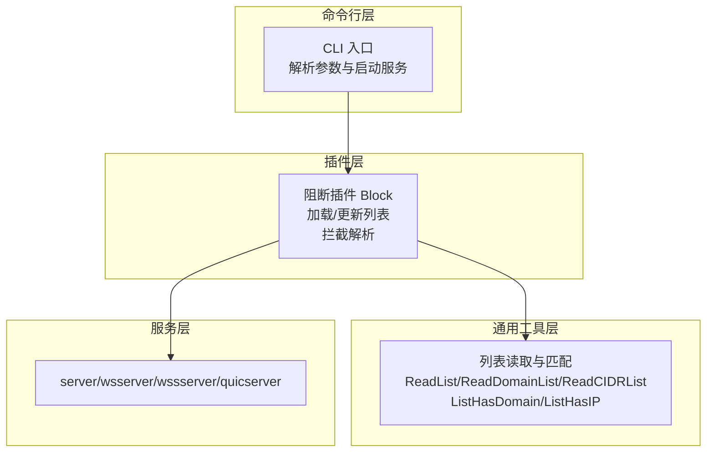
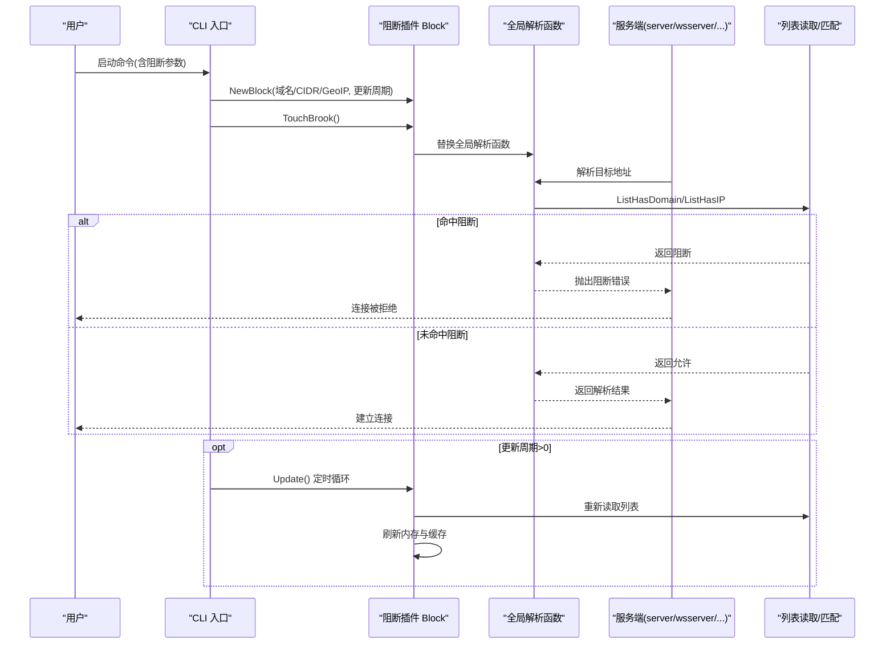
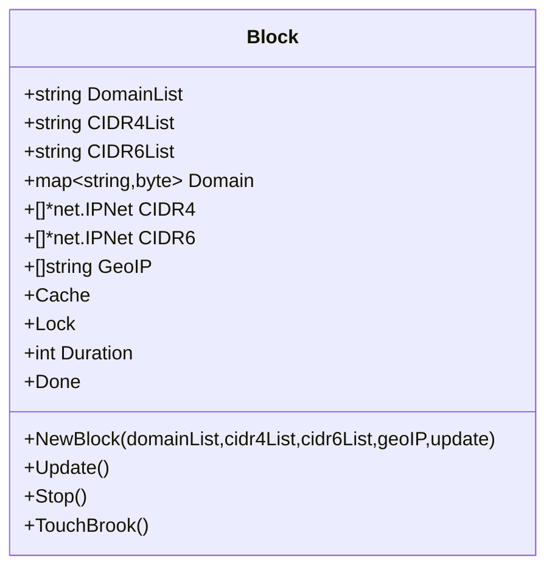
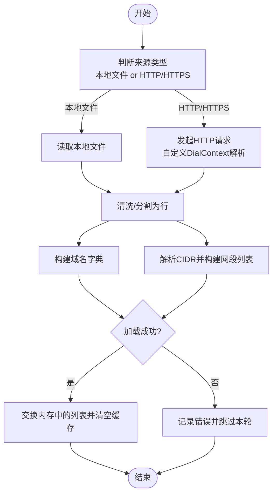
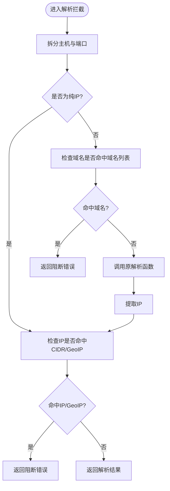
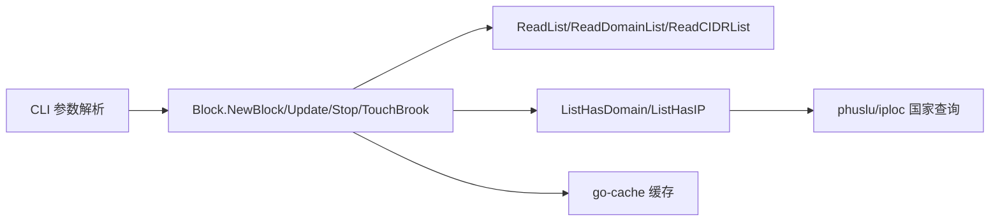

# 网络阻断插件

<cite>
**本文引用的文件**
- [plugins/block/block.go](file://plugins/block/block.go)
- [plugins/block/readme.md](file://plugins/block/readme.md)
- [list.go](file://list.go)
- [cli/brook/main.go](file://cli/brook/main.go)
</cite>

## 目录
1. [简介](#简介)
2. [项目结构](#项目结构)
3. [核心组件](#核心组件)
4. [架构总览](#架构总览)
5. [详细组件分析](#详细组件分析)
6. [依赖关系分析](#依赖关系分析)
7. [性能与缓存特性](#性能与缓存特性)
8. [故障排查指南](#故障排查指南)
9. [结论](#结论)
10. [附录：参数与使用示例](#附录参数与使用示例)

## 简介
本文件系统性阐述“网络阻断插件”的实现与使用方法，重点围绕以下目标：
- 基于 block.go 的实现，说明如何通过 --blockDomainList、--blockCIDR4List、--blockCIDR6List 和 --blockGeoIP 参数实现对域名、IPv4/IPv6 段以及地理国家的阻断。
- 解释黑名单列表的加载方式（本地文件、HTTP/HTTPS），以及更新机制（--blockListUpdateInterval）。
- 提供黑名单文件格式示例与注意事项。
- 强调该插件适用于 server、wsserver、wssserver、quicserver 等服务端命令。

此外，插件通过重写全局解析流程，在地址解析阶段进行阻断判断，从而在服务端侧统一生效。

## 项目结构
与“网络阻断插件”直接相关的文件与职责如下：
- plugins/block/block.go：阻断插件主体，负责加载与更新黑名单、拦截解析结果。
- list.go：通用列表读取与匹配逻辑，包括域名列表、CIDR 列表、IP 匹配、HTTP/HTTPS 与本地文件读取。
- cli/brook/main.go：命令行入口，定义并解析阻断相关参数，初始化插件并在需要时启动自动更新协程。
- plugins/block/readme.md：简要说明阻断插件的作用范围（服务端侧）。

图表来源
- [plugins/block/block.go](file://plugins/block/block.go#L1-L183)
- [list.go](file://list.go#L1-L250)
- [cli/brook/main.go](file://cli/brook/main.go#L142-L1155)

章节来源
- [plugins/block/readme.md](file://plugins/block/readme.md#L1-L2)
- [plugins/block/block.go](file://plugins/block/block.go#L1-L183)
- [list.go](file://list.go#L1-L250)
- [cli/brook/main.go](file://cli/brook/main.go#L142-L1155)

## 核心组件
- Block 结构体：保存域名列表、IPv4/IPv6 列表、地理国家列表、缓存、并发锁、更新周期等。
- NewBlock：根据传入的列表路径或 URL 初始化 Block；若设置更新周期，则启用互斥锁与停止通道。
- Update：按周期从源重新加载列表，更新内存数据并清空缓存。
- TouchBrook：重写全局解析函数，使后续所有解析都经过阻断检查。
- ListHasDomain/ListHasIP：域名与 IP 的匹配逻辑，包含缓存与地理国家匹配。

章节来源
- [plugins/block/block.go](file://plugins/block/block.go#L29-L82)
- [plugins/block/block.go](file://plugins/block/block.go#L84-L127)
- [plugins/block/block.go](file://plugins/block/block.go#L137-L182)
- [list.go](file://list.go#L32-L118)

## 架构总览
下图展示了阻断插件在服务端命令中的工作流：命令行解析参数后创建 Block，注入到全局解析流程中；每次连接建立时，解析目标地址，触发阻断检查；支持周期性更新列表。

图表来源
- [cli/brook/main.go](file://cli/brook/main.go#L266-L286)
- [plugins/block/block.go](file://plugins/block/block.go#L137-L182)
- [list.go](file://list.go#L32-L118)

## 详细组件分析

### 组件一：Block 结构与生命周期
- 字段说明
  - DomainList/CIDR4List/CIDR6List：分别指向域名/CIDR 列表的来源（本地绝对路径或 HTTP/HTTPS URL）。
  - Domain/CIDR4/CIDR6：内存中的黑名单集合。
  - GeoIP：地理国家代码列表，用于按国家阻断。
  - Cache：解析结果缓存，提升匹配性能。
  - Lock/Done：并发控制与停止信号。
  - Duration：更新周期（秒），为 0 表示仅启动时加载一次。
- 生命周期
  - 初始化：NewBlock 加载初始列表，必要时初始化锁与停止通道。
  - 运行期：TouchBrook 注入解析拦截；Update 在后台定时刷新。
  - 停止：Stop 关闭 Done 通道，结束 Update 循环。

图表来源
- [plugins/block/block.go](file://plugins/block/block.go#L29-L82)
- [plugins/block/block.go](file://plugins/block/block.go#L84-L127)
- [plugins/block/block.go](file://plugins/block/block.go#L137-L182)

章节来源
- [plugins/block/block.go](file://plugins/block/block.go#L29-L82)
- [plugins/block/block.go](file://plugins/block/block.go#L84-L127)
- [plugins/block/block.go](file://plugins/block/block.go#L137-L182)

### 组件二：列表加载与更新机制
- 列表来源
  - 本地文件：必须为绝对路径。
  - HTTP/HTTPS：支持远程下载，内部使用自定义 DialContext，优先解析 AAAA 再回退 A。
- 加载函数
  - ReadList：统一处理本地文件与 HTTP/HTTPS 下载，清洗空白字符与换行，按行分割。
  - ReadDomainList：将每行作为域名加载为字典。
  - ReadCIDRList：将每行解析为 IPv4/IPv6 网段。
- 更新策略
  - 当 Duration>0 时，启动 Update 定时器，周期性重新加载列表并刷新缓存。
  - 更新期间持有写锁，避免并发读写冲突。

图表来源
- [list.go](file://list.go#L149-L200)
- [list.go](file://list.go#L120-L147)
- [plugins/block/block.go](file://plugins/block/block.go#L84-L127)

章节来源
- [list.go](file://list.go#L149-L200)
- [list.go](file://list.go#L120-L147)
- [plugins/block/block.go](file://plugins/block/block.go#L84-L127)

### 组件三：解析拦截与阻断判定
- 注入点：TouchBrook 将全局解析函数替换为带阻断逻辑的版本。
- 阻断顺序
  1) 若目标为域名（非纯 IP），先检查域名是否命中域名列表。
  2) 若解析失败或无法解析为 IP，直接返回阻断。
  3) 若解析成功，获取 IP 并检查：
     - 是否命中任一 IPv4/IPv6 网段；
     - 或者是否命中指定地理国家代码。
  4) 任一条件满足即阻断，否则放行。
- 缓存：域名/IP 的匹配结果会缓存，减少重复计算。

图表来源
- [plugins/block/block.go](file://plugins/block/block.go#L137-L182)
- [list.go](file://list.go#L32-L118)

章节来源
- [plugins/block/block.go](file://plugins/block/block.go#L137-L182)
- [list.go](file://list.go#L32-L118)

## 依赖关系分析
- Block 依赖
  - list.go 中的 ReadDomainList/ReadCIDRList/ReadList 与 ListHasDomain/ListHasIP。
  - go-cache 用于缓存解析结果。
  - phuslu/iploc 用于地理国家查询。
- CLI 依赖
  - 在 server/wsserver/wssserver/quicserver 子命令中注册阻断参数，并在满足条件时创建 Block 并注入解析。
  - 对本地文件路径进行校验，确保为绝对路径；对 HTTP/HTTPS URL 进行校验。

图表来源
- [cli/brook/main.go](file://cli/brook/main.go#L142-L158)
- [cli/brook/main.go](file://cli/brook/main.go#L266-L286)
- [plugins/block/block.go](file://plugins/block/block.go#L43-L82)
- [list.go](file://list.go#L32-L147)

章节来源
- [cli/brook/main.go](file://cli/brook/main.go#L142-L158)
- [cli/brook/main.go](file://cli/brook/main.go#L266-L286)
- [plugins/block/block.go](file://plugins/block/block.go#L43-L82)
- [list.go](file://list.go#L32-L147)

## 性能与缓存特性
- 缓存策略
  - 域名命中结果缓存 24 小时。
  - IP 命中结果缓存 24 小时。
- 匹配复杂度
  - 域名匹配：按从长到短的标签逐级匹配，时间复杂度近似 O(k)，k 为标签数。
  - IP 匹配：IPv4/IPv6 分别遍历网段，最坏 O(n)。
- 更新开销
  - 更新周期越短，CPU/IO 负担越高；建议结合实际威胁情况合理设置。
- 地理阻断
  - 使用国家查询，命中后缓存结果，降低频繁查询成本。

章节来源
- [list.go](file://list.go#L32-L118)

## 故障排查指南
- 参数校验失败
  - 本地文件路径必须为绝对路径；HTTP/HTTPS URL 必须以 http:// 或 https:// 开头。
  - 若未满足上述要求，CLI 将报错并阻止启动。
- 列表加载失败
  - HTTP/HTTPS 下载超时或无法解析域名时，会记录错误日志并跳过本次更新。
  - 本地文件读取失败也会记录错误。
- 阻断误判
  - 检查域名列表是否包含子域；域名匹配采用从长到短的标签匹配。
  - 检查 CIDR 是否覆盖目标 IP；确认 GeoIP 国家码是否正确。
- 更新不生效
  - 确认 --blockListUpdateInterval 设置为大于 0 的值，且服务处于运行状态。
  - 观察日志中是否有更新失败的提示。

章节来源
- [cli/brook/main.go](file://cli/brook/main.go#L266-L286)
- [plugins/block/block.go](file://plugins/block/block.go#L84-L127)
- [list.go](file://list.go#L149-L200)

## 结论
网络阻断插件通过在服务端解析阶段注入阻断逻辑，实现了对域名、IP 段与地理国家的统一阻断。其支持本地文件与 HTTP/HTTPS 列表来源，并可通过周期性更新保持列表时效性。配合合理的缓存与匹配策略，可在保证性能的同时提供可靠的阻断能力。该插件适用于 server、wsserver、wssserver、quicserver 等服务端命令。

## 附录：参数与使用示例

### 参数说明
- --blockDomainList
  - 类型：字符串
  - 作用：域名阻断列表来源（本地绝对路径或 HTTP/HTTPS URL）
  - 适用命令：server、wsserver、wssserver、quicserver
- --blockCIDR4List
  - 类型：字符串
  - 作用：IPv4 段阻断列表来源（本地绝对路径或 HTTP/HTTPS URL）
  - 适用命令：server、wsserver、wssserver、quicserver
- --blockCIDR6List
  - 类型：字符串
  - 作用：IPv6 段阻断列表来源（本地绝对路径或 HTTP/HTTPS URL）
  - 适用命令：server、wsserver、wssserver、quicserver
- --blockGeoIP
  - 类型：字符串切片
  - 作用：按国家代码阻断（如 US、CN 等）
  - 适用命令：server、wsserver、wssserver、quicserver
- --blockListUpdateInterval
  - 类型：整数（秒）
  - 作用：列表更新周期；为 0 表示仅启动时加载一次
  - 适用命令：server、wsserver、wssserver、quicserver

章节来源
- [cli/brook/main.go](file://cli/brook/main.go#L142-L158)
- [cli/brook/main.go](file://cli/brook/main.go#L266-L286)

### 黑名单文件格式示例
- 域名列表（每行一个域名）
  - 示例行：example.com
  - 注意：支持子域匹配，例如列表包含 example.com 会同时阻断 www.example.com 等
- IPv4 段列表（每行一个 CIDR）
  - 示例行：198.51.100.0/24
- IPv6 段列表（每行一个 CIDR）
  - 示例行：2001:db8::/32
- 地理国家阻断
  - 通过 --blockGeoIP 指定国家代码（如 US、CN 等）

章节来源
- [list.go](file://list.go#L120-L147)
- [list.go](file://list.go#L32-L118)

### 适用命令
- server、wsserver、wssserver、quicserver
- 插件会在这些命令启动时注入解析拦截，并可选地开启周期性更新

章节来源
- [plugins/block/readme.md](file://plugins/block/readme.md#L1-L2)
- [cli/brook/main.go](file://cli/brook/main.go#L528-L646)
- [cli/brook/main.go](file://cli/brook/main.go#L828-L917)
- [cli/brook/main.go](file://cli/brook/main.go#L1096-L1155)