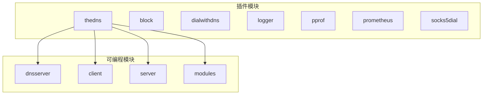
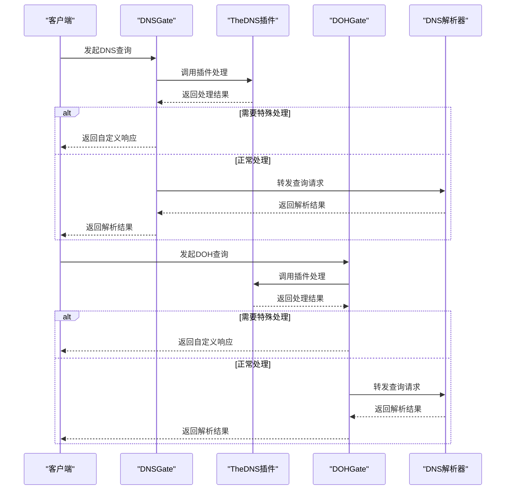
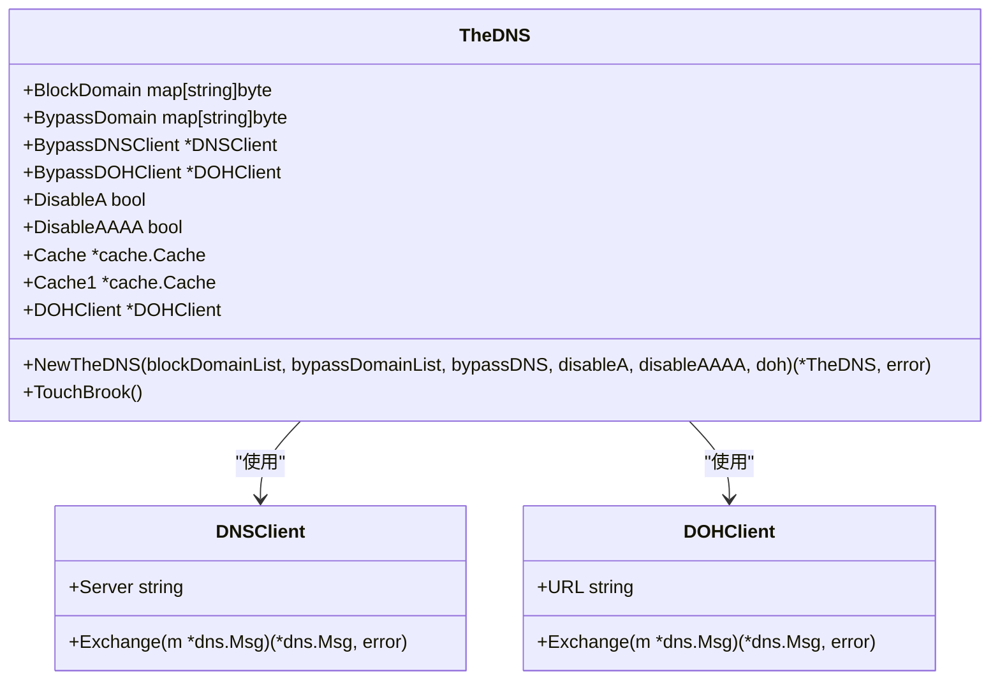
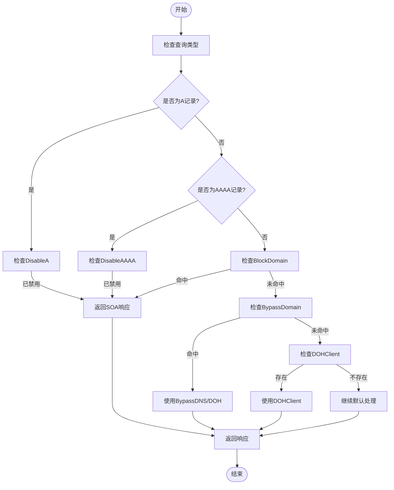
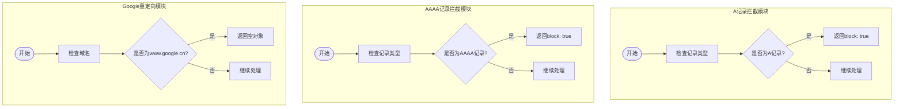
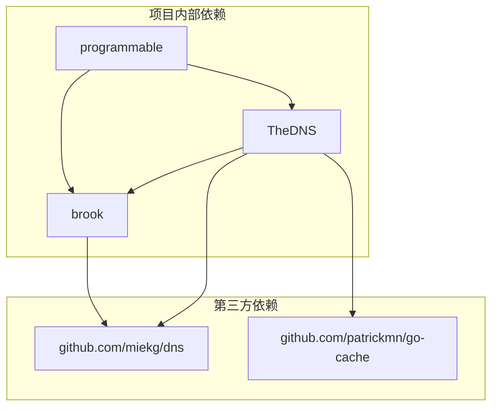

# 自定义DNS插件

<cite>
**本文档中引用的文件**   
- [thedns.go](file://plugins/thedns/thedns.go)
- [readme.md](file://plugins/thedns/readme.md)
- [example.tengo](file://programmable/dnsserver/example.tengo)
- [block_a.tengo](file://programmable/modules/block_a.tengo)
- [block_aaaa.tengo](file://programmable/modules/block_aaaa.tengo)
- [redirect_google_cn.tengo](file://programmable/modules/redirect_google_cn.tengo)
- [response_sample.tengo](file://programmable/modules/response_sample.tengo)
- [dnsserver.go](file://dnsserver.go)
- [dohserver.go](file://dohserver.go)
- [resolve.go](file://resolve.go)
- [init.go](file://init.go)
</cite>

## 目录
1. [简介](#简介)
2. [项目结构](#项目结构)
3. [核心组件](#核心组件)
4. [架构概述](#架构概述)
5. [详细组件分析](#详细组件分析)
6. [依赖分析](#依赖分析)
7. [性能考虑](#性能考虑)
8. [故障排除指南](#故障排除指南)
9. [结论](#结论)

## 简介
本文档详细介绍了如何基于`thedns.go`实现开发自定义DNS插件，为brook的DNS解析过程提供可编程的钩子（DNSGate）。文档将指导用户如何通过导入此插件并编写Tengo脚本来自定义DNS响应，实现如域名重定向、伪造记录等高级功能。结合programmable模块，提供具体的脚本开发示例。

## 项目结构
该项目的结构清晰地组织了各个功能模块，其中`plugins/thedns/`目录包含了自定义DNS插件的核心实现，而`programmable/`目录则提供了可编程脚本的支持。



**Diagram sources**
- [plugins/thedns](file://plugins/thedns)
- [programmable](file://programmable)

**Section sources**
- [plugins/thedns](file://plugins/thedns)
- [programmable](file://programmable)

## 核心组件
`TheDNS`结构体是自定义DNS插件的核心，它通过`TouchBrook()`方法注入到brook的DNS解析流程中，提供了对DNS查询的拦截和处理能力。

**Section sources**
- [thedns.go](file://plugins/thedns/thedns.go#L28-L83)
- [dnsserver.go](file://dnsserver.go#L24-L49)

## 架构概述
自定义DNS插件通过hook机制介入brook的DNS解析流程，利用`DNSGate`和`DOHGate`两个全局变量来拦截和处理DNS查询请求。



**Diagram sources**
- [thedns.go](file://plugins/thedns/thedns.go#L134-L208)
- [dnsserver.go](file://dnsserver.go#L24-L49)
- [dohserver.go](file://dohserver.go#L135-L202)

## 详细组件分析

### TheDNS插件分析
`TheDNS`插件通过`TouchBrook()`方法将自定义逻辑注入到brook的DNS解析流程中，实现了对DNS查询的全面控制。

#### 插件结构分析


**Diagram sources**
- [thedns.go](file://plugins/thedns/thedns.go#L28-L83)

#### 插件工作流程


**Diagram sources**
- [thedns.go](file://plugins/thedns/thedns.go#L134-L208)

**Section sources**
- [thedns.go](file://plugins/thedns/thedns.go#L134-L208)

### 可编程模块分析
programmable模块通过Tengo脚本语言为用户提供了一种灵活的方式来定制DNS行为。

#### Tengo脚本示例分析
```mermaid
classDiagram
class ScriptExample {
+in_dnsservers bool
+in_dohservers bool
+in_dnsquery bool
+in_address bool
+in_httprequest bool
+in_httpresponse bool
+out map[string]interface{}
}
class DNSQuery {
+domain string
+type string
}
class Address {
+ipaddress string
+domainaddress string
+network string
}
class HTTPRequest {
+URL string
+Method string
+Headers map[string]string
+Body string
}
class HTTPResponse {
+StatusCode int
+Headers map[string]string
+Body string
}
ScriptExample --> DNSQuery : "处理"
ScriptExample --> Address : "处理"
ScriptExample --> HTTPRequest : "处理"
ScriptExample --> HTTPResponse : "处理"
```

**Diagram sources**
- [example.tengo](file://programmable/dnsserver/example.tengo)
- [modules/readme.md](file://programmable/modules/readme.md)

#### 常用模块示例


**Diagram sources**
- [block_a.tengo](file://programmable/modules/block_a.tengo)
- [block_aaaa.tengo](file://programmable/modules/block_aaaa.tengo)
- [redirect_google_cn.tengo](file://programmable/modules/redirect_google_cn.tengo)

**Section sources**
- [block_a.tengo](file://programmable/modules/block_a.tengo)
- [block_aaaa.tengo](file://programmable/modules/block_aaaa.tengo)
- [redirect_google_cn.tengo](file://programmable/modules/redirect_google_cn.tengo)

## 依赖分析
自定义DNS插件依赖于多个核心组件和第三方库，形成了一个完整的DNS处理生态系统。



**Diagram sources**
- [go.mod](file://go.mod)
- [thedns.go](file://plugins/thedns/thedns.go#L23-L25)

**Section sources**
- [go.mod](file://go.mod)
- [thedns.go](file://plugins/thedns/thedns.go)

## 性能考虑
自定义DNS插件在提供强大功能的同时，也需要考虑性能影响。插件使用了内存缓存来提高重复查询的效率，并通过合理的逻辑判断减少不必要的网络请求。

## 故障排除指南
当自定义DNS插件出现问题时，可以通过以下步骤进行排查：

**Section sources**
- [thedns.go](file://plugins/thedns/thedns.go)
- [resolve.go](file://resolve.go)
- [init.go](file://init.go)

## 结论
自定义DNS插件为brook提供了强大的DNS处理能力，通过`TheDNS`结构体和`TouchBrook()`方法，用户可以轻松地拦截和修改DNS查询。结合programmable模块的Tengo脚本，用户可以实现各种高级功能，如域名重定向、记录伪造等。这种设计模式既保持了核心代码的简洁性，又提供了极大的扩展灵活性。