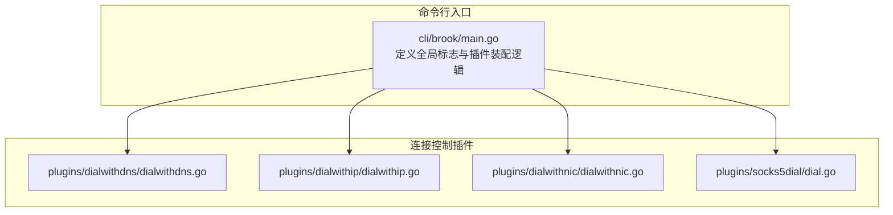
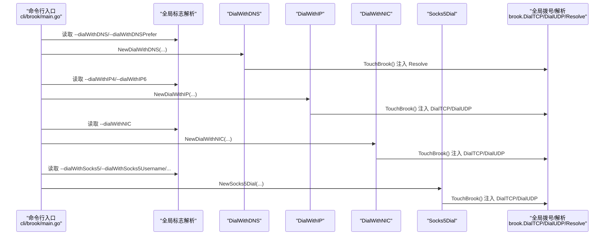
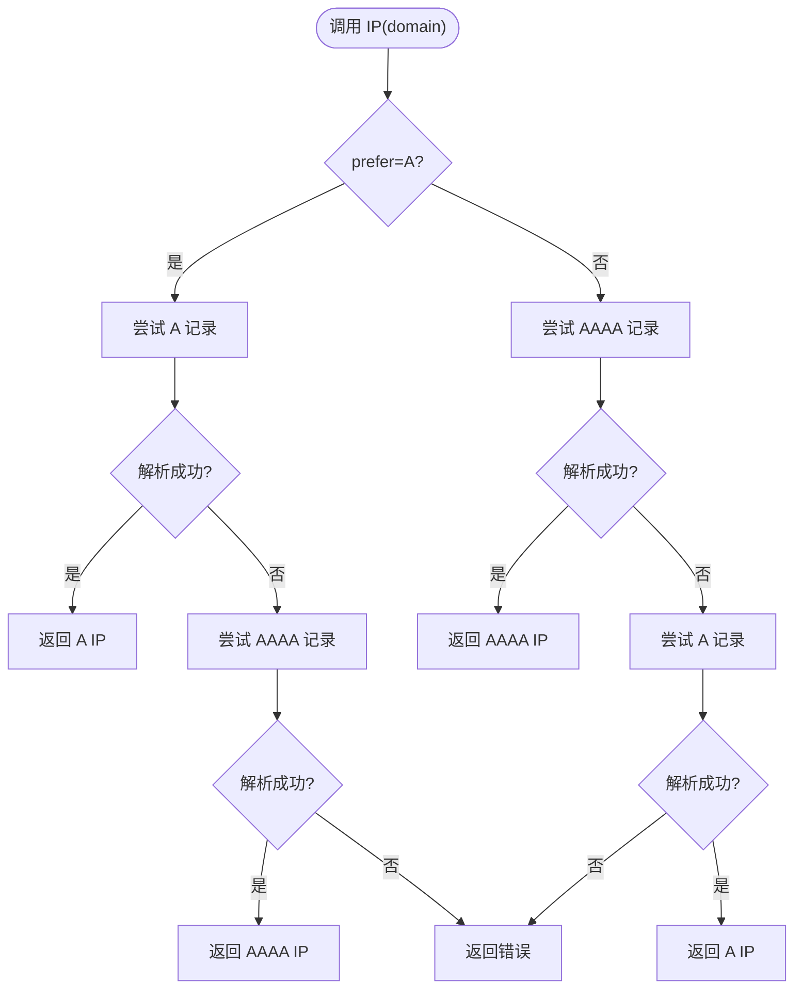
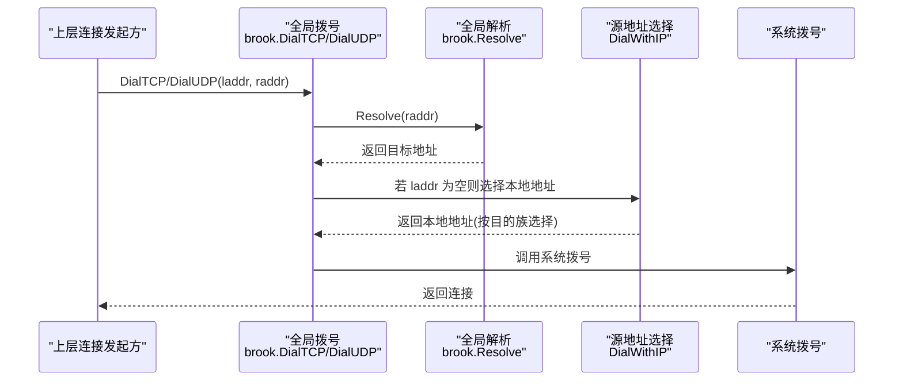
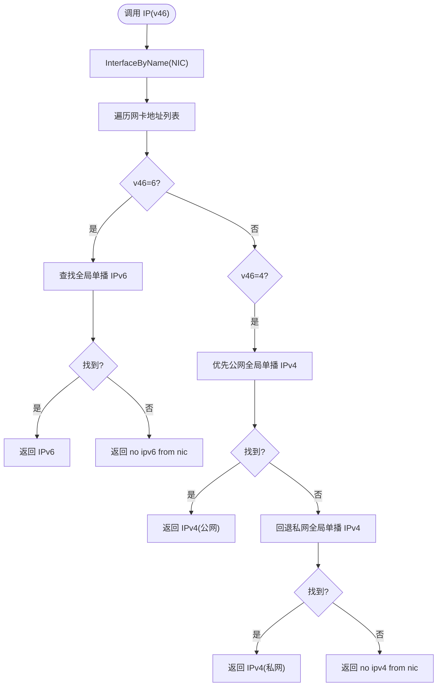
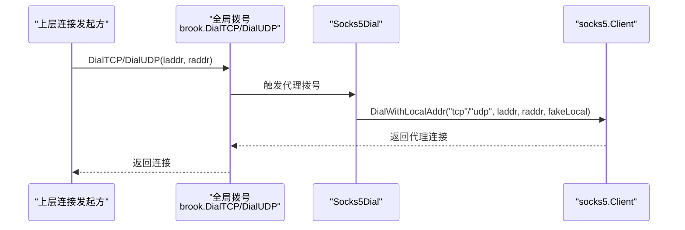
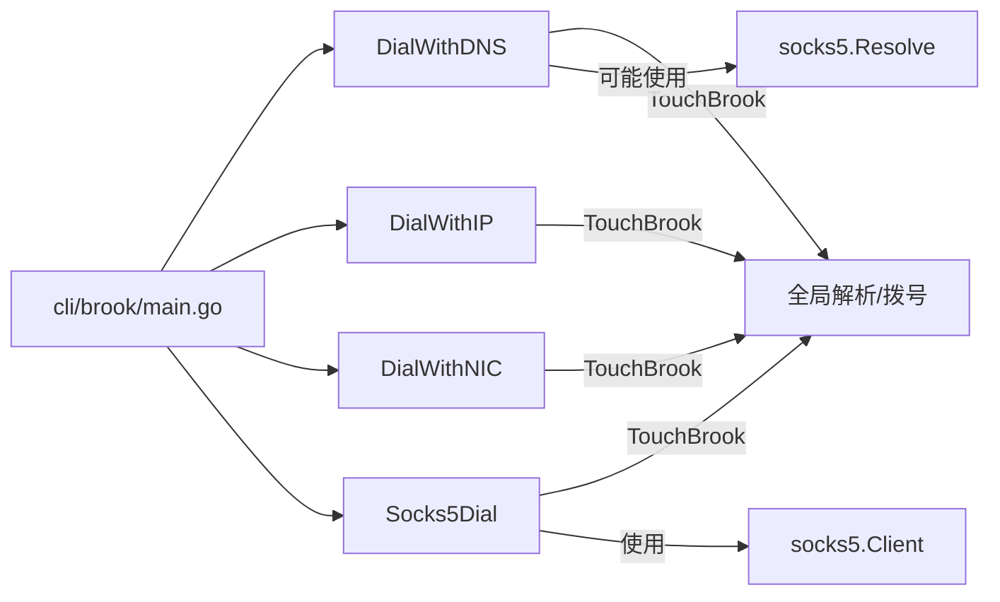

# 连接控制插件

<cite>
**本文引用的文件**
- [cli/brook/main.go](file://cli/brook/main.go)
- [plugins/dialwithdns/dialwithdns.go](file://plugins/dialwithdns/dialwithdns.go)
- [plugins/dialwithip/dialwithip.go](file://plugins/dialwithip/dialwithip.go)
- [plugins/dialwithnic/dialwithnic.go](file://plugins/dialwithnic/dialwithnic.go)
- [plugins/socks5dial/dial.go](file://plugins/socks5dial/dial.go)
- [plugins/dialwithdns/readme.md](file://plugins/dialwithdns/readme.md)
- [plugins/dialwithip/readme.md](file://plugins/dialwithip/readme.md)
- [plugins/dialwithnic/readme.md](file://plugins/dialwithnic/readme.md)
- [plugins/socks5dial/readme.md](file://plugins/socks5dial/readme.md)
</cite>

## 目录
1. [简介](#简介)
2. [项目结构](#项目结构)
3. [核心组件](#核心组件)
4. [架构总览](#架构总览)
5. [详细组件分析](#详细组件分析)
6. [依赖关系分析](#依赖关系分析)
7. [性能与行为特性](#性能与行为特性)
8. [故障排查指南](#故障排查指南)
9. [结论](#结论)
10. [附录：命令行参数速查](#附录命令行参数速查)

## 简介
本文件系统性梳理 Brook 的“连接控制插件”体系，重点覆盖以下四个子插件：
- dialwithdns：自定义 DNS/DoH 解析，替代本地解析策略
- dialwithip：强制出站连接使用指定 IPv4/IPv6 源地址
- dialwithnic：强制出站连接绑定到指定网卡（接口）的全局单播地址
- socks5dial：通过 SOCKS5 代理建立出站连接，支持 TCP/UDP

这些插件通过在启动阶段注入全局拨号与解析函数，统一影响客户端与服务端侧的出站连接路径，从而实现对 DNS 解析、源地址选择、网卡绑定以及代理链路的可控化。

## 项目结构
围绕连接控制插件的关键文件组织如下：
- 命令行入口与插件装配：cli/brook/main.go
- 插件实现：
  - plugins/dialwithdns/dialwithdns.go
  - plugins/dialwithip/dialwithip.go
  - plugins/dialwithnic/dialwithnic.go
  - plugins/socks5dial/dial.go
- 各插件简要说明：plugins/*/readme.md

图表来源
- [cli/brook/main.go](file://cli/brook/main.go#L80-L120)
- [plugins/dialwithdns/dialwithdns.go](file://plugins/dialwithdns/dialwithdns.go#L1-L145)
- [plugins/dialwithip/dialwithip.go](file://plugins/dialwithip/dialwithip.go#L1-L99)
- [plugins/dialwithnic/dialwithnic.go](file://plugins/dialwithnic/dialwithnic.go#L1-L125)
- [plugins/socks5dial/dial.go](file://plugins/socks5dial/dial.go#L1-L60)

章节来源
- [cli/brook/main.go](file://cli/brook/main.go#L80-L120)

## 核心组件
- DialWithDNS：封装 DNS/DoH 客户端，提供域名解析能力，并将解析结果注入全局解析器
- DialWithIP：根据目的地址族（IPv4/IPv6）选择对应源地址，重写全局 TCP/UDP 拨号
- DialWithNIC：从指定网卡枚举可用的全局单播地址，按目的地址族选择源地址，重写全局 TCP/UDP 拨号
- Socks5Dial：包装 SOCKS5 客户端，重写全局 TCP/UDP 拨号为经代理出站

章节来源
- [plugins/dialwithdns/dialwithdns.go](file://plugins/dialwithdns/dialwithdns.go#L27-L145)
- [plugins/dialwithip/dialwithip.go](file://plugins/dialwithip/dialwithip.go#L25-L99)
- [plugins/dialwithnic/dialwithnic.go](file://plugins/dialwithnic/dialwithnic.go#L25-L125)
- [plugins/socks5dial/dial.go](file://plugins/socks5dial/dial.go#L24-L60)

## 架构总览
下图展示命令行如何解析参数并在运行时装配连接控制插件，以及插件如何修改全局拨号与解析行为。

图表来源
- [cli/brook/main.go](file://cli/brook/main.go#L215-L239)
- [plugins/dialwithdns/dialwithdns.go](file://plugins/dialwithdns/dialwithdns.go#L121-L145)
- [plugins/dialwithip/dialwithip.go](file://plugins/dialwithip/dialwithip.go#L47-L99)
- [plugins/dialwithnic/dialwithnic.go](file://plugins/dialwithnic/dialwithnic.go#L67-L125)
- [plugins/socks5dial/dial.go](file://plugins/socks5dial/dial.go#L38-L60)

## 详细组件分析

### DialWithDNS（自定义 DNS/DoH）
- 功能要点
  - 支持传统 DNS 服务器与 DoH（HTTPS）两种上游解析方式
  - 可指定优先返回 A 记录还是 AAAA 记录
  - 将解析结果注入全局解析器，后续连接建立时直接使用解析得到的 IP
- 关键流程
  - 初始化：根据传入的 DNS/DoH 地址创建 DNSClient 或 DOHClient
  - 解析：优先尝试 A/AAAA，若首选失败则回退到另一记录类型；若均失败则报错
  - 注入：TouchBrook 将 Resolve 函数替换为基于域名解析结果构造 TCP/UDP 地址

图表来源
- [plugins/dialwithdns/dialwithdns.go](file://plugins/dialwithdns/dialwithdns.go#L47-L119)

章节来源
- [plugins/dialwithdns/dialwithdns.go](file://plugins/dialwithdns/dialwithdns.go#L27-L145)
- [plugins/dialwithdns/readme.md](file://plugins/dialwithdns/readme.md#L1-L2)

### DialWithIP（指定源 IPv4/IPv6）
- 功能要点
  - 在未显式指定本地地址时，依据目的地址族自动选择 IPv4 或 IPv6 源地址
  - 仅在目的地址族匹配时生效（IPv4 目的使用 IPv4 源，IPv6 目的使用 IPv6 源）
  - 对 TCP/UDP 分别重写拨号函数
- 关键流程
  - 参数校验：确保传入的 IPv4/IPv6 字符串合法且族匹配
  - 触发注入：TouchBrook 重写全局 DialTCP/DialUDP，在必要时填充本地地址

图表来源
- [plugins/dialwithip/dialwithip.go](file://plugins/dialwithip/dialwithip.go#L47-L99)

章节来源
- [plugins/dialwithip/dialwithip.go](file://plugins/dialwithip/dialwithip.go#L25-L99)
- [plugins/dialwithip/readme.md](file://plugins/dialwithip/readme.md#L1-L2)

### DialWithNIC（指定网卡）
- 功能要点
  - 从指定网卡枚举可用的全局单播地址
  - IPv6：优先返回全局单播地址，否则报错
  - IPv4：优先返回公网全局单播地址，其次私网全局单播地址
  - 对 TCP/UDP 分别重写拨号函数
- 关键流程
  - 接口查询：InterfaceByName 获取网卡
  - 地址筛选：按族选择合适的全局单播地址
  - 注入：TouchBrook 重写全局 DialTCP/DialUDP 并在需要时填充本地地址

图表来源
- [plugins/dialwithnic/dialwithnic.go](file://plugins/dialwithnic/dialwithnic.go#L34-L65)

章节来源
- [plugins/dialwithnic/dialwithnic.go](file://plugins/dialwithnic/dialwithnic.go#L25-L125)
- [plugins/dialwithnic/readme.md](file://plugins/dialwithnic/readme.md#L1-L2)

### Socks5Dial（SOCKS5 代理出站）
- 功能要点
  - 创建 SOCKS5 客户端，支持用户名密码认证与超时配置
  - 重写全局 DialTCP/DialUDP，使出站连接经由 SOCKS5 代理
  - 为 UDP 模式提供本地地址伪装（fake local addr）
- 关键流程
  - 初始化：NewSocks5Dial 创建 socks5.Client
  - 注入：TouchBrook 将 DialTCP/DialUDP 替换为 DialWithLocalAddr，实现经代理出站

图表来源
- [plugins/socks5dial/dial.go](file://plugins/socks5dial/dial.go#L28-L60)

章节来源
- [plugins/socks5dial/dial.go](file://plugins/socks5dial/dial.go#L24-L60)
- [plugins/socks5dial/readme.md](file://plugins/socks5dial/readme.md#L1-L2)

## 依赖关系分析
- 命令行标志与插件装配
  - --dialWithDNS 与 --dialWithDNSPrefer：启用 DialWithDNS 并注入全局解析
  - --dialWithIP4 / --dialWithIP6：启用 DialWithIP 并注入全局拨号
  - --dialWithNIC：启用 DialWithNIC 并注入全局拨号
  - --dialWithSocks5 / --dialWithSocks5Username / --dialWithSocks5Password / --dialWithSocks5TCPTimeout / --dialWithSocks5UDPTimeout：启用 Socks5Dial 并注入全局拨号
- 插件间耦合
  - 四个插件彼此独立，互不依赖；均通过 TouchBrook 修改全局拨号/解析函数
  - 与 socks5 库存在间接耦合（DialWithDNS 注入 socks5.Resolve；Socks5Dial 使用 socks5.Client）

图表来源
- [cli/brook/main.go](file://cli/brook/main.go#L215-L239)
- [plugins/dialwithdns/dialwithdns.go](file://plugins/dialwithdns/dialwithdns.go#L121-L145)
- [plugins/socks5dial/dial.go](file://plugins/socks5dial/dial.go#L38-L60)

章节来源
- [cli/brook/main.go](file://cli/brook/main.go#L80-L120)
- [cli/brook/main.go](file://cli/brook/main.go#L215-L239)

## 性能与行为特性
- 解析与拨号开销
  - DialWithDNS：每次域名解析都会走指定 DNS/DoH，可能增加延迟；建议结合缓存策略（由上游实现负责）
  - DialWithIP/DialWithNIC：仅在本地地址缺失时选择，通常不会显著增加额外开销
  - Socks5Dial：引入代理握手与转发，会带来额外延迟与带宽消耗
- 适用场景
  - 绕过特定网络限制：通过指定 DNS/DoH 或代理链路，规避本地 DNS/路由限制
  - 多线路出口：通过指定网卡或源地址，选择不同运营商/物理链路
  - 隐私与合规：通过 DoH 或代理隐藏真实源地址与流量特征

[本节为通用指导，无需列出具体文件来源]

## 故障排查指南
- 参数校验失败
  - DialWithDNS：当 prefer 不是 A/AAAA 时会报错
  - DialWithIP：当传入的 IPv4/IPv6 字符串非法或族不匹配时会报错
  - DialWithNIC：当网卡不存在或无法枚举到满足条件的地址时会报错
- 解析失败
  - DialWithDNS：当域名无法解析到 A/AAAA 时会报错；请检查 DNS/DoH 地址与网络连通性
- 代理不可达
  - Socks5Dial：当代理地址不可达或认证失败时会报错；请核对地址、凭据与超时设置
- 典型定位步骤
  - 开启日志并复现问题，确认错误来自哪个插件
  - 单独禁用其他插件，验证问题是否仍出现
  - 检查网络连通性与代理配置

章节来源
- [plugins/dialwithdns/dialwithdns.go](file://plugins/dialwithdns/dialwithdns.go#L33-L45)
- [plugins/dialwithip/dialwithip.go](file://plugins/dialwithip/dialwithip.go#L30-L45)
- [plugins/dialwithnic/dialwithnic.go](file://plugins/dialwithnic/dialwithnic.go#L34-L65)
- [plugins/socks5dial/dial.go](file://plugins/socks5dial/dial.go#L28-L36)

## 结论
连接控制插件通过在启动阶段注入全局拨号与解析函数，提供了对 DNS 解析、源地址选择、网卡绑定与代理链路的细粒度控制。合理组合使用这些插件，可实现绕过网络限制、多线路出口与隐私保护等目标。建议在生产环境中结合日志与监控，持续评估其对性能与稳定性的影响。

[本节为总结性内容，无需列出具体文件来源]

## 附录：命令行参数速查
- --dialWithDNS
  - 作用：当需要解析域名时，使用指定 DNS/DoH 服务器
  - 用法示例：指定 DNS 服务器或 DoH 地址（需包含地址）
  - 注意：对客户端向服务器传递的域名地址无影响
- --dialWithDNSPrefer
  - 作用：与 --dialWithDNS 配合，指定优先返回 A 记录或 AAAA 记录
  - 取值：A 或 AAAA
- --dialWithIP4
  - 作用：当当前机器对外建立 IPv4 连接时，强制使用指定 IPv4 作为本地地址
- --dialWithIP6
  - 作用：当当前机器对外建立 IPv6 连接时，强制使用指定 IPv6 作为本地地址
- --dialWithNIC
  - 作用：当当前机器对外建立连接时，强制绑定到指定网卡的全局单播地址
- --dialWithSocks5
  - 作用：当当前机器对外建立连接时，通过指定 SOCKS5 代理出站
- --dialWithSocks5Username
  - 作用：SOCKS5 认证用户名
- --dialWithSocks5Password
  - 作用：SOCKS5 认证密码
- --dialWithSocks5TCPTimeout
  - 作用：SOCKS5 TCP 超时（秒）
- --dialWithSocks5UDPTimeout
  - 作用：SOCKS5 UDP 超时（秒）

章节来源
- [cli/brook/main.go](file://cli/brook/main.go#L80-L120)
- [cli/brook/main.go](file://cli/brook/main.go#L215-L239)