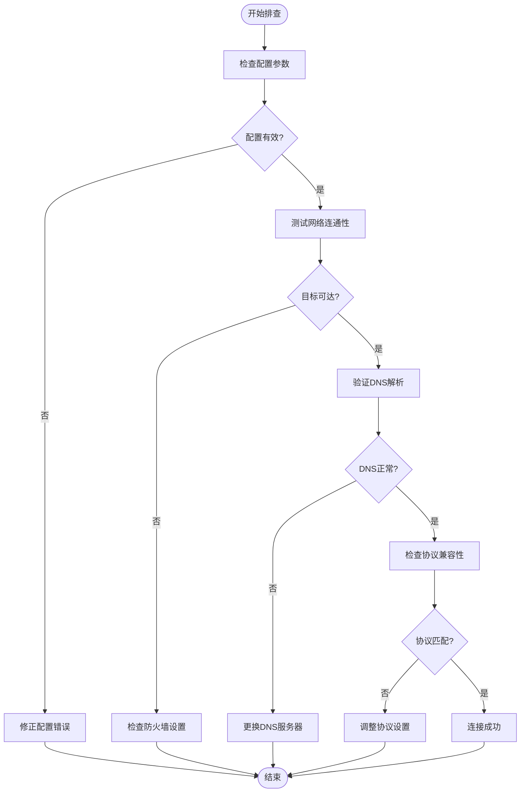
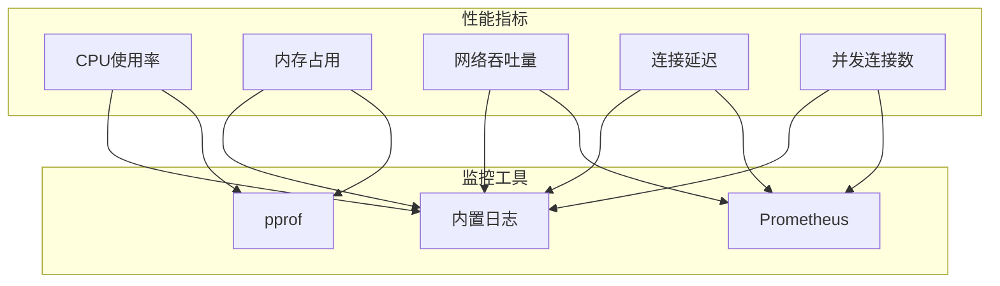
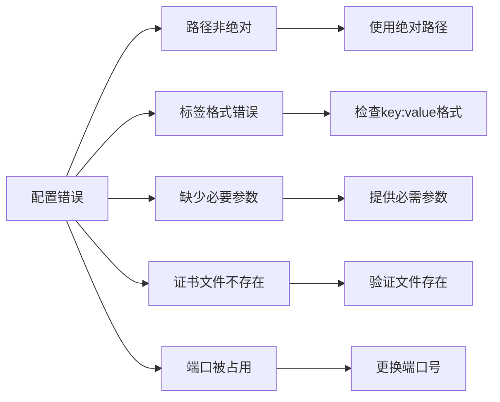
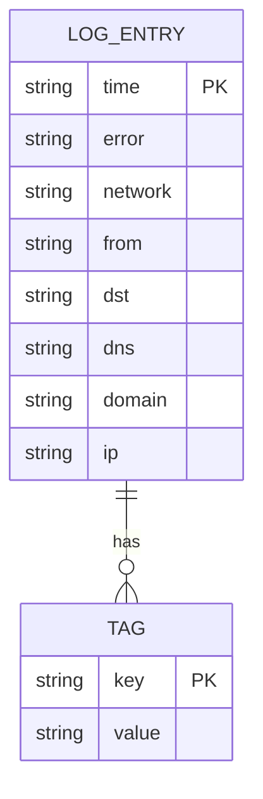
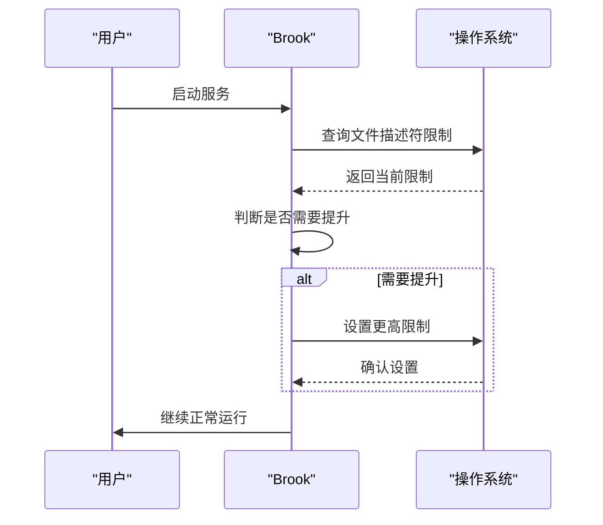

# 故障排除

<cite>
**本文档中引用的文件**
- [error.go](file://error.go)
- [log.go](file://log.go)
- [util.go](file://util.go)
- [brooklink.go](file://brooklink.go)
- [cli/brook/main.go](file://cli/brook/main.go)
- [plugins/logger/logger.go](file://plugins/logger/logger.go)
- [limits/limits.go](file://limits/limits.go)
- [plugins/dialwithnic/dialwithnic.go](file://plugins/dialwithnic/dialwithnic.go)
</cite>

## 目录
1. [简介](#简介)
2. [错误类型分类](#错误类型分类)
3. [网络连接问题排查](#网络连接问题排查)
4. [性能瓶颈诊断](#性能瓶颈诊断)
5. [配置错误处理](#配置错误处理)
6. [日志分析指南](#日志分析指南)
7. [系统资源限制](#系统资源限制)
8. [高级诊断工具](#高级诊断工具)

## 简介

本故障排除指南旨在帮助用户诊断和解决在使用 Brook 工具时遇到的常见问题。通过分析代码库中的错误处理机制、日志系统和配置选项，本文档提供了针对网络连接问题、性能瓶颈和配置错误的系统性排查方法。指南基于 `error.go` 文件中定义的错误类型，结合实际代码实现，为用户提供实用的解决方案和诊断流程。

**Section sources**
- [error.go](file://error.go#L1-L28)
- [log.go](file://log.go#L1-L22)

## 错误类型分类

根据代码库分析，Brook 的错误处理主要分为以下几类：

### 网络连接错误
这类错误通常与 TCP/UDP 连接建立失败相关，可能由防火墙、网络不通或目标地址不可达引起。在 `util.go` 中的 `ErrorReply` 函数处理了 SOCKS5 协议中的连接拒绝情况。

### 配置验证错误
当用户提供的配置参数无效时会触发此类错误。例如，在 `cli/brook/main.go` 中，对 `--pid`、`--log` 和 `--tag` 等参数进行验证时，如果路径不是绝对路径或标签格式不正确，会返回相应的错误信息。

### 证书和安全错误
在使用 TLS 加密连接时可能出现此类错误。`brooklink.go` 文件中的代码显示，当无法解析根证书时会返回 "failed to parse root certificate" 错误。

### 系统资源错误
这类错误与系统资源限制有关，如文件描述符数量不足。`limits/limits.go` 文件中的 `Raise` 函数尝试提升系统限制，如果失败会返回相应的错误。

**Section sources**
- [error.go](file://error.go#L19-L27)
- [util.go](file://util.go#L28-L38)
- [brooklink.go](file://brooklink.go#L98-L99)
- [limits/limits.go](file://limits/limits.go#L24-L42)

## 网络连接问题排查

### 常见网络错误及解决方案

**Diagram sources**
- [util.go](file://util.go#L41-L50)
- [plugins/dialwithnic/dialwithnic.go](file://plugins/dialwithnic/dialwithnic.go#L34-L64)

### 排查步骤

1. **验证配置参数**：确保所有命令行参数格式正确，特别是路径必须为绝对路径。
2. **测试基本连通性**：使用 ping 或 telnet 测试目标服务器的可达性。
3. **检查DNS解析**：确认域名能够正确解析为IP地址。
4. **验证端口开放**：确保目标端口在服务器端已正确监听。
5. **检查防火墙规则**：确认本地和远程防火墙未阻止相关连接。

**Section sources**
- [cli/brook/main.go](file://cli/brook/main.go#L168-L172)
- [util.go](file://util.go#L41-L50)

## 性能瓶颈诊断

### 性能监控指标

**Diagram sources**
- [cli/brook/main.go](file://cli/brook/main.go#L68-L70)
- [plugins/prometheus/prometheus.go](file://plugins/prometheus/prometheus.go#L56-L62)

### 性能优化建议

1. **启用pprof**：通过 `--pprof` 参数启动性能分析服务，可以深入分析CPU和内存使用情况。
2. **使用Prometheus监控**：配置 `--prometheus` 和 `--prometheusPath` 参数以启用指标收集。
3. **调整超时设置**：根据网络状况合理设置 `tcpTimeout` 和 `udpTimeout` 参数。
4. **优化缓冲区大小**：对于高吞吐量场景，考虑调整系统级别的网络缓冲区大小。

**Section sources**
- [cli/brook/main.go](file://cli/brook/main.go#L68-L70)
- [plugins/prometheus/prometheus.go](file://plugins/prometheus/prometheus.go#L50-L92)

## 配置错误处理

### 常见配置错误

**Diagram sources**
- [cli/brook/main.go](file://cli/brook/main.go#L168-L172)
- [cli/brook/main.go](file://cli/brook/main.go#L198-L202)

### 配置验证流程

1. **路径验证**：所有文件路径参数（如 `--log`、`--pid`）必须使用绝对路径。
2. **标签格式检查**：`--tag` 参数必须遵循 `key:value` 格式，且只能包含一个冒号。
3. **必要参数检查**：确保所有必需参数都已提供，如服务器地址和密码。
4. **文件存在性验证**：确认指定的证书文件和其他资源文件确实存在。

**Section sources**
- [cli/brook/main.go](file://cli/brook/main.go#L168-L203)

## 日志分析指南

### 日志结构和内容

**Diagram sources**
- [plugins/logger/logger.go](file://plugins/logger/logger.go#L78-L85)
- [log.go](file://log.go#L19-L21)

### 日志启用和管理

1. **启用日志**：使用 `--log` 参数指定日志文件路径或设置为 "console" 输出到控制台。
2. **添加标签**：通过 `--tag` 参数为日志添加自定义标签，便于分类和过滤。
3. **重置日志文件**：在Unix系统上发送 SIGUSR1 信号可重置日志文件。
4. **分析日志内容**：结构化日志包含时间戳、错误信息、网络类型、源地址和目标地址等关键字段。

**Section sources**
- [plugins/logger/logger.go](file://plugins/logger/logger.go#L76-L133)
- [cli/brook/main.go](file://cli/brook/main.go#L71-L78)

## 系统资源限制

### 系统限制调整

**Diagram sources**
- [limits/limits.go](file://limits/limits.go#L24-L42)
- [brooklink.go](file://brooklink.go#L280-L281)

### 资源限制说明

1. **文件描述符限制**：在非Windows系统上，Brook 会尝试将文件描述符限制提升到60000（非macOS）或10240（macOS）。
2. **UDP缓冲区大小**：在特定情况下（如使用quicserver），会尝试调整系统UDP接收缓冲区大小。
3. **内存管理**：使用对象池（sync.Pool）来复用缓冲区，减少内存分配开销。

**Section sources**
- [limits/limits.go](file://limits/limits.go#L24-L42)
- [brooklink.go](file://brooklink.go#L284-L297)

## 高级诊断工具

### 内置诊断功能

1. **pprof支持**：通过 `--pprof` 参数启用Go语言的pprof性能分析工具，可以进行CPU、内存、goroutine等多方面的性能分析。
2. **Prometheus集成**：配置 `--prometheus` 和 `--prometheusPath` 参数后，可以将性能指标暴露给Prometheus监控系统。
3. **SIGUSR1信号**：在Unix系统上，发送SIGUSR1信号可以重置日志文件，便于日志轮转和管理。

### 网络接口选择

当系统有多个网络接口时，可以使用 `--dialWithNIC` 参数指定特定的网络接口进行连接。这在多网卡环境中特别有用，可以确保流量通过正确的网络路径。

**Section sources**
- [cli/brook/main.go](file://cli/brook/main.go#L68-L70)
- [cli/brook/main.go](file://cli/brook/main.go#L122-L128)
- [plugins/dialwithnic/dialwithnic.go](file://plugins/dialwithnic/dialwithnic.go#L29-L32)