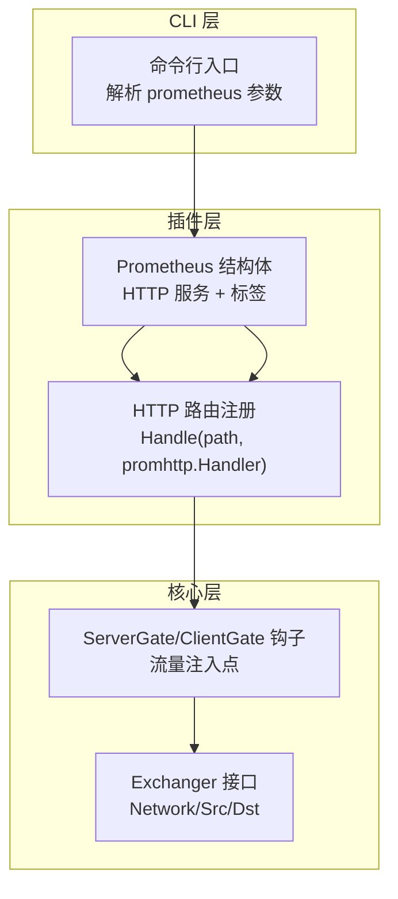
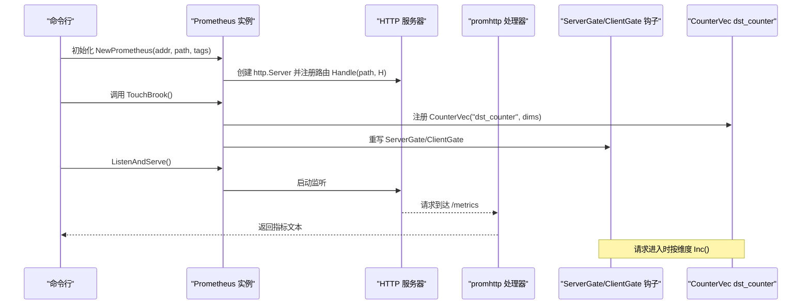
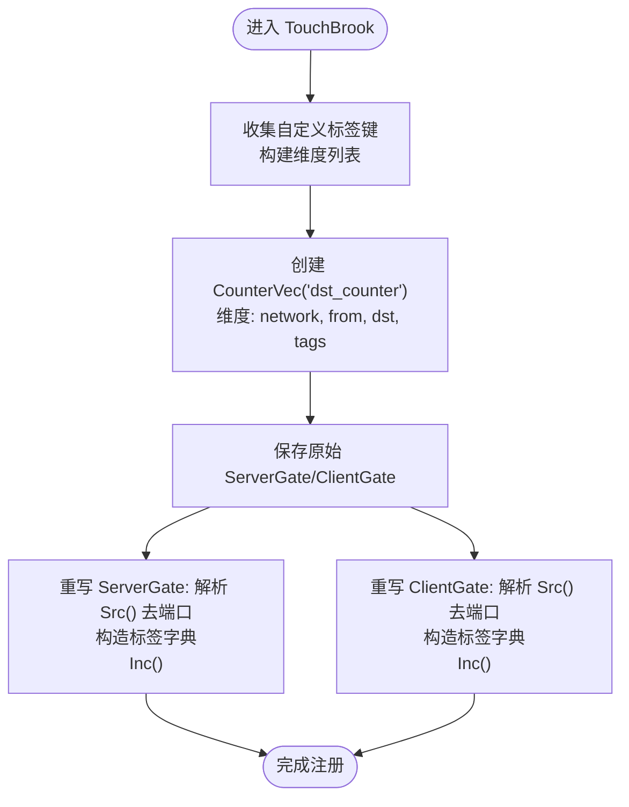
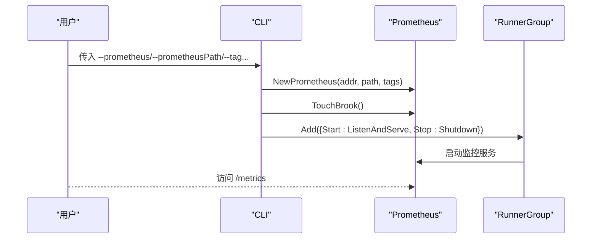
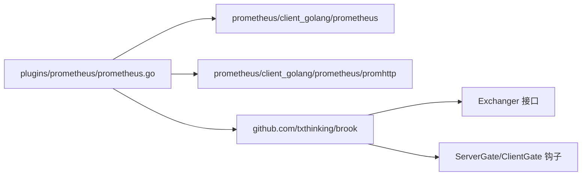

# Prometheus监控

<cite>
**本文引用的文件**
- [plugins/prometheus/prometheus.go](file://plugins/prometheus/prometheus.go)
- [plugins/prometheus/readme.md](file://plugins/prometheus/readme.md)
- [cli/brook/main.go](file://cli/brook/main.go)
- [brook/exchanger.go](file://brook/exchanger.go)
</cite>

## 目录
1. [简介](#简介)
2. [项目结构](#项目结构)
3. [核心组件](#核心组件)
4. [架构总览](#架构总览)
5. [组件详解](#组件详解)
6. [依赖关系分析](#依赖关系分析)
7. [性能考量](#性能考量)
8. [故障排查指南](#故障排查指南)
9. [结论](#结论)
10. [附录](#附录)

## 简介
本文件面向希望在 Brook 中集成 Prometheus 监控的用户与开发者，系统性说明 Prometheus 结构体的设计、NewPrometheus 如何配置自定义 HTTP 路径与标签系统、TouchBrook 如何通过 ServerGate 与 ClientGate 钩子注册并上报 dst_counter 指标以实现网络流量的细粒度统计、标签如何扩展指标维度支持多维数据分析、以及 ListenAndServe 与 Shutdown 对监控服务生命周期的控制。同时提供指标端点配置示例与 Grafana 可视化建议，帮助监控连接数、流量来源与目标分布等关键业务指标。

## 项目结构
Prometheus 监控能力由插件模块提供，并与 CLI 启动流程集成：
- 插件层：plugins/prometheus 提供 Prometheus 结构体与初始化逻辑
- 核心钩子：brook/exchanger 定义 ServerGate/ClientGate 钩子，作为流量统计注入点
- CLI 集成：cli/brook/main.go 解析命令行参数并启动监控 HTTP 服务

图表来源
- [plugins/prometheus/prometheus.go](file://plugins/prometheus/prometheus.go#L32-L40)
- [cli/brook/main.go](file://cli/brook/main.go#L121-L129)
- [cli/brook/main.go](file://cli/brook/main.go#L240-L265)
- [brook/exchanger.go](file://brook/exchanger.go#L33-L39)

章节来源
- [plugins/prometheus/prometheus.go](file://plugins/prometheus/prometheus.go#L32-L40)
- [cli/brook/main.go](file://cli/brook/main.go#L121-L129)
- [cli/brook/main.go](file://cli/brook/main.go#L240-L265)
- [brook/exchanger.go](file://brook/exchanger.go#L33-L39)

## 核心组件
- Prometheus 结构体：封装 HTTP 服务器与标签映射，负责指标端点暴露与生命周期管理
- NewPrometheus：创建 HTTP 服务，注册自定义路径到 promhttp 处理器
- TouchBrook：注册 CounterVec dst_counter，重写 ServerGate/ClientGate 钩子，按维度打点
- 生命周期方法：ListenAndServe/Shutdown 控制监控服务启停

章节来源
- [plugins/prometheus/prometheus.go](file://plugins/prometheus/prometheus.go#L27-L40)
- [plugins/prometheus/prometheus.go](file://plugins/prometheus/prometheus.go#L42-L48)
- [plugins/prometheus/prometheus.go](file://plugins/prometheus/prometheus.go#L50-L92)

## 架构总览
Prometheus 插件通过 HTTP 暴露指标端点，利用 Brook 的 ServerGate/ClientGate 钩子在请求进入时进行打点，形成“监控服务 + 流量钩子”的双通道架构。

图表来源
- [plugins/prometheus/prometheus.go](file://plugins/prometheus/prometheus.go#L32-L40)
- [plugins/prometheus/prometheus.go](file://plugins/prometheus/prometheus.go#L50-L92)
- [cli/brook/main.go](file://cli/brook/main.go#L240-L265)

## 组件详解

### Prometheus 结构体与生命周期
- 字段
  - Server：承载监控 HTTP 服务
  - Tags：键值对标签集合，用于扩展指标维度
- 方法
  - NewPrometheus(addr, path, tags)：创建 ServeMux，注册 path 到 promhttp.Handler，返回 Prometheus 实例
  - ListenAndServe()：启动 HTTP 服务
  - Shutdown()：优雅关闭 HTTP 服务
- 设计要点
  - 通过自定义 path 将指标端点与业务端口隔离，便于安全与运维管理
  - Tags 作为静态维度，在 TouchBrook 时一次性注入 CounterVec 的标签列表

章节来源
- [plugins/prometheus/prometheus.go](file://plugins/prometheus/prometheus.go#L27-L40)
- [plugins/prometheus/prometheus.go](file://plugins/prometheus/prometheus.go#L42-L48)

### NewPrometheus：自定义 HTTP 路径与标签系统
- 自定义路径
  - 使用 http.NewServeMux 创建路由表
  - 通过 mux.Handle(path, promhttp.Handler()) 将指定路径绑定到 Prometheus HTTP 处理器
- 标签系统
  - 通过构造 map[string]string 传入 Prometheus 实例
  - 在 TouchBrook 中将标签键名追加为 CounterVec 的标签维度，实现多维切片分析

章节来源
- [plugins/prometheus/prometheus.go](file://plugins/prometheus/prometheus.go#L32-L40)
- [plugins/prometheus/prometheus.go](file://plugins/prometheus/prometheus.go#L50-L62)

### TouchBrook：通过 ServerGate/ClientGate 注册 dst_counter
- CounterVec 定义
  - 名称：dst_counter
  - 帮助信息：总数
  - 标签维度：network、from、dst 以及所有自定义标签键
- 钩子重写
  - 保存原始 ServerGate/ClientGate
  - 重写后在每次请求进入时：
    - 从 Exchanger 获取 Network()/Src()/Dst()
    - 从 Src() 中剥离端口，仅保留主机部分
    - 构造标签字典，包含 network、from、dst 与所有自定义标签
    - 通过 CounterVec.With(labels).Inc() 进行累加
- 影响范围
  - 作用于 Brook 侧所有 Exchanger 实现（ServerGate/ClientGate），覆盖 TCP/UDP 等多种协议

图表来源
- [plugins/prometheus/prometheus.go](file://plugins/prometheus/prometheus.go#L50-L92)
- [brook/exchanger.go](file://brook/exchanger.go#L21-L27)

章节来源
- [plugins/prometheus/prometheus.go](file://plugins/prometheus/prometheus.go#L50-L92)
- [brook/exchanger.go](file://brook/exchanger.go#L21-L27)

### 标签（Tags）如何扩展指标维度
- 标签键作为 CounterVec 的标签维度参与注册
- 运行期将标签键对应的值注入到每个样本的标签字典中
- 支持多维切片分析，例如按 network、from、dst、环境、集群等维度聚合

章节来源
- [plugins/prometheus/prometheus.go](file://plugins/prometheus/prometheus.go#L50-L62)

### ListenAndServe 与 Shutdown：监控服务生命周期控制
- ListenAndServe：启动 HTTP 服务器，对外暴露指标端点
- Shutdown：优雅关闭，释放资源，避免中断正在拉取指标的 Prometheus 抓取器

章节来源
- [plugins/prometheus/prometheus.go](file://plugins/prometheus/prometheus.go#L42-L48)

### CLI 集成与指标端点配置示例
- 命令行参数
  - prometheus：监控 HTTP 监听地址（如 :7070）
  - prometheusPath：指标端点路径（如 /metrics 或 /xxx）
  - tag：可选的键值对标签（如 key1:value1）
- 启动流程
  - 解析参数后调用 NewPrometheus(addr, path, tags)
  - 调用 TouchBrook 注册指标与钩子
  - 将 ListenAndServe/Shutdown 加入 RunnerGroup，随应用一起启停

图表来源
- [cli/brook/main.go](file://cli/brook/main.go#L121-L129)
- [cli/brook/main.go](file://cli/brook/main.go#L240-L265)
- [plugins/prometheus/prometheus.go](file://plugins/prometheus/prometheus.go#L32-L40)

章节来源
- [cli/brook/main.go](file://cli/brook/main.go#L121-L129)
- [cli/brook/main.go](file://cli/brook/main.go#L240-L265)

### 指标端点与 Prometheus 集成
- 指标端点：在启动时通过 NewPrometheus(path) 注册到 HTTP 服务器
- Prometheus 抓取：配置 Prometheus 抓取 job，指向该端点
- 建议实践：
  - 将 prometheusPath 设置为不易猜测的值，降低未授权访问风险
  - 在生产环境配合反向代理或鉴权策略

章节来源
- [plugins/prometheus/prometheus.go](file://plugins/prometheus/prometheus.go#L32-L40)

### Grafana 可视化建议
以下为常见业务指标的查询与可视化思路（不直接展示代码，仅给出查询与面板设计建议）：
- 连接数趋势
  - 查询：rate(dst_counter[5m]) 按 network/cluster 等维度聚合
  - 面板：折线图，分组显示不同 network 的速率
- 流量来源分布
  - 查询：sum by (from) (rate(dst_counter[5m]))
  - 面板：饼图或条形图，展示 top N 来源
- 目标分布
  - 查询：sum by (dst) (rate(dst_counter[5m]))
  - 面板：条形图，展示 top N 目标
- 多维切片
  - 查询：sum by (network, cluster) (rate(dst_counter[5m]))
  - 面板：堆叠面积图，观察不同维度组合下的占比

说明：以上查询基于 CounterVec 的标签维度（network、from、dst 以及自定义标签）。实际查询语法以所用查询语言为准。

## 依赖关系分析
- Prometheus 插件依赖
  - github.com/prometheus/client_golang/prometheus：指标定义与注册
  - github.com/prometheus/client_golang/prometheus/promhttp：HTTP 指标端点处理器
  - github.com/txthinking/brook：ServerGate/ClientGate 钩子与 Exchanger 接口
- 关键耦合点
  - Prometheus 通过重写 ServerGate/ClientGate 将指标采集与业务处理解耦
  - CounterVec 的维度在 TouchBrook 时确定，运行期不可动态变更

图表来源
- [plugins/prometheus/prometheus.go](file://plugins/prometheus/prometheus.go#L17-L25)
- [brook/exchanger.go](file://brook/exchanger.go#L33-L39)

章节来源
- [plugins/prometheus/prometheus.go](file://plugins/prometheus/prometheus.go#L17-L25)
- [brook/exchanger.go](file://brook/exchanger.go#L33-L39)

## 性能考量
- 指标开销
  - CounterVec.With(...).Inc() 为轻量操作，但高频请求下仍需关注标签基数
  - 建议限制 from/dst 的高基数标签数量，必要时做采样或聚合
- 标签设计
  - network、from、dst 为固定维度；自定义标签应谨慎选择，避免无限增长
- HTTP 服务
  - ListenAndServe/Shutdown 采用标准 http.Server，注意并发与超时设置

## 故障排查指南
- 无法访问指标端点
  - 检查 prometheusPath 是否正确注册，确认 HTTP 服务器已启动
  - 章节来源
    - [plugins/prometheus/prometheus.go](file://plugins/prometheus/prometheus.go#L32-L40)
    - [cli/brook/main.go](file://cli/brook/main.go#L240-L265)
- 指标为空
  - 确认 TouchBrook 已被调用，且 ServerGate/ClientGate 已被重写
  - 章节来源
    - [plugins/prometheus/prometheus.go](file://plugins/prometheus/prometheus.go#L50-L92)
- 标签缺失
  - 确认 --tag 参数格式正确（key:value），并在 NewPrometheus 时传入
  - 章节来源
    - [cli/brook/main.go](file://cli/brook/main.go#L240-L265)
    - [plugins/prometheus/prometheus.go](file://plugins/prometheus/prometheus.go#L50-L62)

## 结论
Prometheus 插件通过简洁的结构体与钩子重写，实现了对 Brook 流量的细粒度统计。借助自定义 HTTP 路径与标签系统，用户可以灵活地将监控服务与业务隔离，并按需扩展指标维度。结合 CLI 的生命周期管理与 Prometheus/Grafana 的生态，能够快速构建可观测性体系，支撑连接数、来源与目标分布等关键业务指标的持续监控。

## 附录
- 插件说明文件
  - [plugins/prometheus/readme.md](file://plugins/prometheus/readme.md#L1-L2)