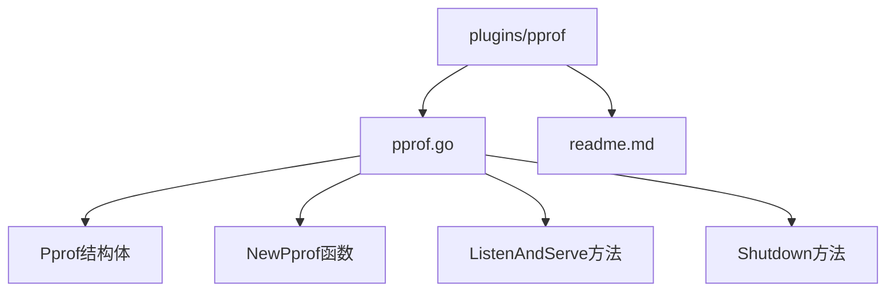
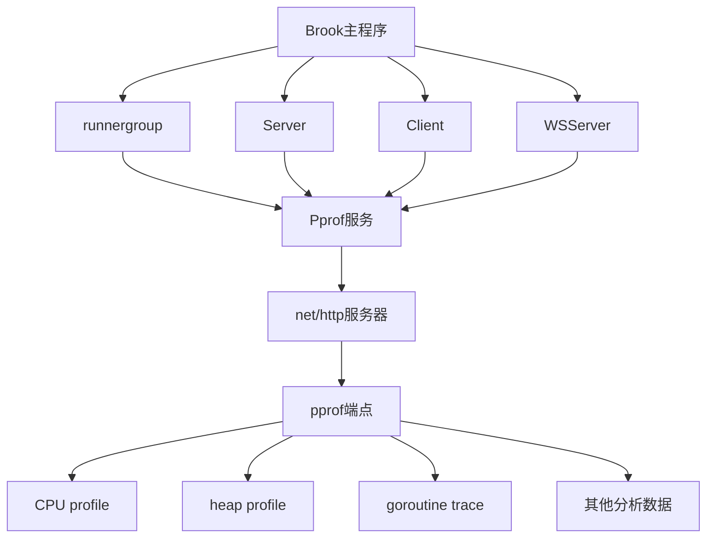
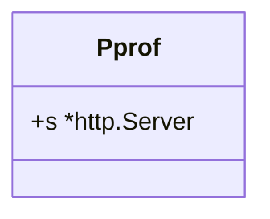
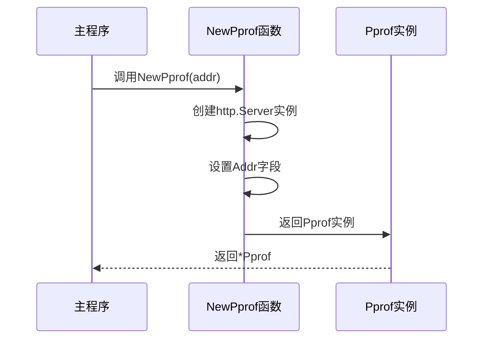
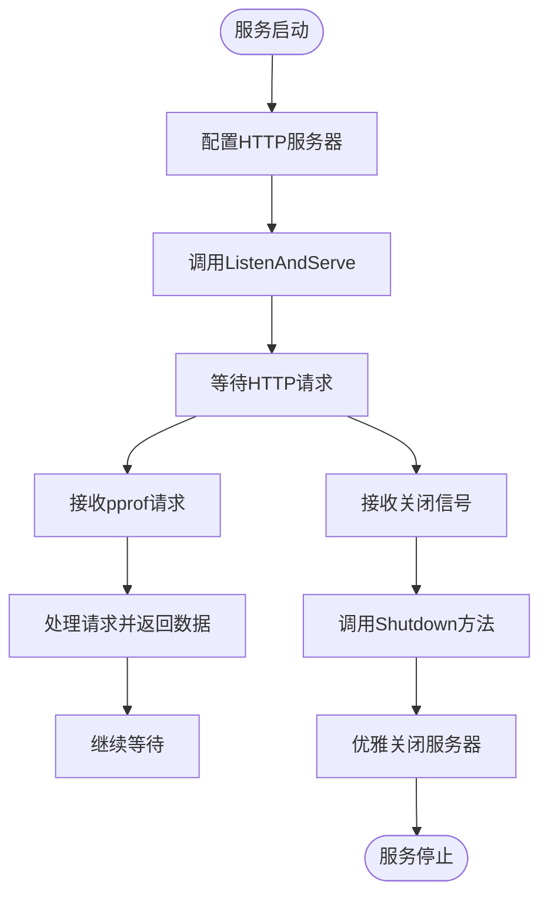
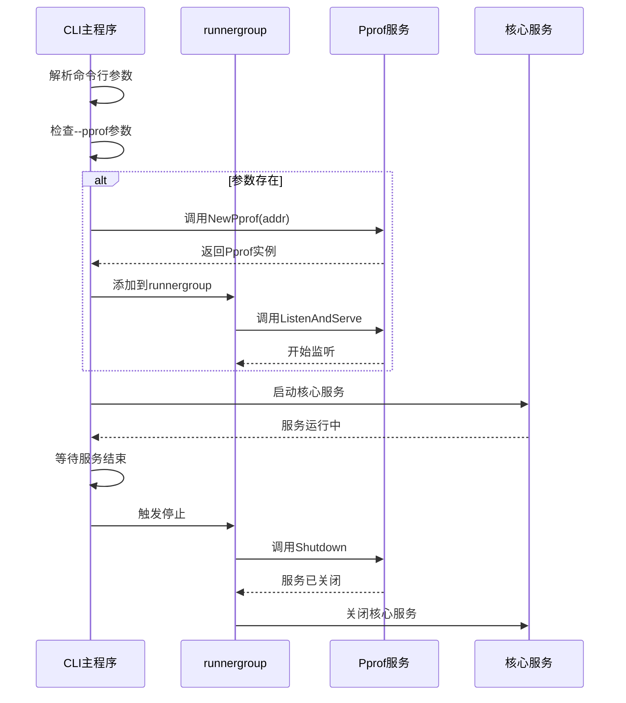
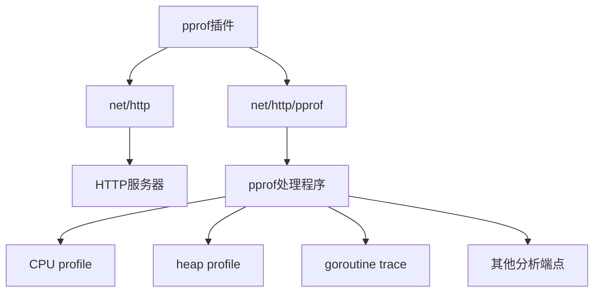

# pprof性能分析

<cite>
**本文档引用文件**   
- [pprof.go](file://plugins/pprof/pprof.go)
- [main.go](file://cli/brook/main.go)
- [server.go](file://server.go)
- [client.go](file://client.go)
- [wsserver.go](file://wsserver.go)
</cite>

## 目录
1. [简介](#简介)
2. [项目结构](#项目结构)
3. [核心组件](#核心组件)
4. [架构概述](#架构概述)
5. [详细组件分析](#详细组件分析)
6. [依赖分析](#依赖分析)
7. [性能考虑](#性能考虑)
8. [故障排除指南](#故障排除指南)
9. [结论](#结论)

## 简介
pprof插件为brook项目提供了Go语言运行时性能分析能力。该插件封装了`net/http/pprof`服务，允许开发者通过HTTP端点收集和分析CPU、内存、goroutine等性能数据。通过`--pprof`命令行参数，用户可以轻松启用性能分析服务，为Server、Client、WSServer等核心模块提供运行时性能监控能力。本文档详细说明了pprof插件的实现原理、生命周期管理、集成方式以及安全注意事项。

## 项目结构
pprof插件位于`plugins/pprof/`目录下，包含`pprof.go`主实现文件和`readme.md`说明文件。该插件作为brook的可选组件，通过CLI参数集成到主程序中。插件结构简洁，专注于提供性能分析服务，不包含复杂的业务逻辑。

**Diagram sources**
- [pprof.go](file://plugins/pprof/pprof.go#L23-L42)

**Section sources**
- [pprof.go](file://plugins/pprof/pprof.go#L1-L42)
- [readme.md](file://plugins/pprof/readme.md#L1-L2)

## 核心组件
pprof插件的核心组件是`Pprof`结构体，它封装了一个HTTP服务器实例，用于提供性能分析服务。`NewPprof`函数负责创建和初始化该结构体，而`ListenAndServe`和`Shutdown`方法则管理服务的生命周期。这些组件共同构成了一个轻量级的性能分析工具，可以无缝集成到brook的各种服务中。

**Section sources**
- [pprof.go](file://plugins/pprof/pprof.go#L23-L42)

## 架构概述
pprof插件的架构基于Go标准库的`net/http`和`net/http/pprof`包。它通过创建一个独立的HTTP服务器来暴露pprof的各个端点，这些端点提供了丰富的性能分析数据。插件与brook主程序通过runnergroup进行生命周期管理，确保性能分析服务与其他服务同步启动和停止。

**Diagram sources**
- [pprof.go](file://plugins/pprof/pprof.go#L23-L42)
- [main.go](file://cli/brook/main.go#L175-L187)

## 详细组件分析

### Pprof结构体分析
Pprof结构体是pprof插件的核心，它包含一个指向`http.Server`的指针，用于管理性能分析服务的生命周期。该结构体的设计遵循了Go语言的简洁性原则，只包含必要的字段和方法。

#### 结构体定义

**Diagram sources**
- [pprof.go](file://plugins/pprof/pprof.go#L23-L25)

**Section sources**
- [pprof.go](file://plugins/pprof/pprof.go#L23-L25)

### NewPprof函数分析
NewPprof函数是Pprof结构体的构造函数，它接收一个地址参数并创建一个新的Pprof实例。该函数初始化了一个HTTP服务器，并将其绑定到指定地址，为后续的性能分析服务做好准备。

#### 函数调用流程

**Diagram sources**
- [pprof.go](file://plugins/pprof/pprof.go#L27-L34)

**Section sources**
- [pprof.go](file://plugins/pprof/pprof.go#L27-L34)

### 生命周期管理分析
pprof插件通过ListenAndServe和Shutdown方法管理服务的生命周期。ListenAndServe方法启动HTTP服务器并开始监听指定端口，而Shutdown方法则优雅地关闭服务器，确保所有正在进行的请求都能完成。

#### 生命周期流程

**Diagram sources**
- [pprof.go](file://plugins/pprof/pprof.go#L36-L41)

**Section sources**
- [pprof.go](file://plugins/pprof/pprof.go#L36-L41)

### 插件集成分析
pprof插件通过brook的CLI主程序集成到各个服务中。当用户使用`--pprof`参数启动任何brook服务时，主程序会创建pprof实例并将其添加到runnergroup中，确保性能分析服务与主服务同步运行。

#### 集成流程

**Diagram sources**
- [main.go](file://cli/brook/main.go#L175-L187)
- [pprof.go](file://plugins/pprof/pprof.go#L36-L41)

**Section sources**
- [main.go](file://cli/brook/main.go#L175-L187)

## 依赖分析
pprof插件的依赖关系简单明了，主要依赖Go标准库的`net/http`和`net/http/pprof`包。通过导入`_ "net/http/pprof"`，插件自动注册了pprof的所有HTTP处理程序，无需额外的配置。这种设计使得插件能够轻松地为brook的各个组件提供性能分析能力。

**Diagram sources**
- [pprof.go](file://plugins/pprof/pprof.go#L17-L21)

**Section sources**
- [pprof.go](file://plugins/pprof/pprof.go#L17-L21)

## 性能考虑
pprof插件本身对系统性能的影响极小，因为它只在被显式调用时才启动。然而，频繁的性能数据采集可能会对生产环境产生一定影响，特别是在高负载情况下。建议在生产环境中仅在需要诊断性能问题时才启用pprof，并限制其访问权限。

## 故障排除指南
当pprof服务无法正常工作时，可以按照以下步骤进行排查：
1. 确认`--pprof`参数已正确设置
2. 检查指定端口是否被其他进程占用
3. 验证网络连接是否正常
4. 查看日志输出是否有错误信息
5. 确认`net/http/pprof`包已正确导入

**Section sources**
- [pprof.go](file://plugins/pprof/pprof.go#L1-L42)
- [main.go](file://cli/brook/main.go#L68-L70)

## 结论
pprof插件为brook项目提供了一个强大而灵活的性能分析工具。通过简单的配置，开发者可以获得详细的运行时性能数据，帮助优化和调试各种服务组件。该插件的设计体现了Go语言的简洁性和实用性，是brook生态系统中不可或缺的一部分。在使用时，应注意安全性和性能影响，确保在生产环境中合理使用。