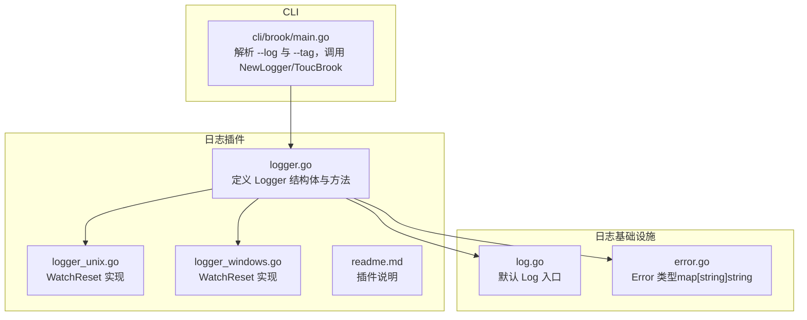
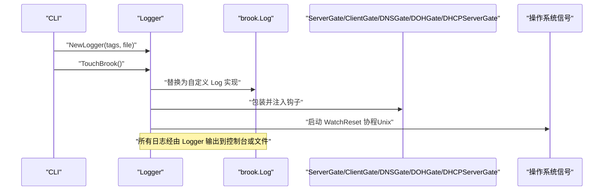
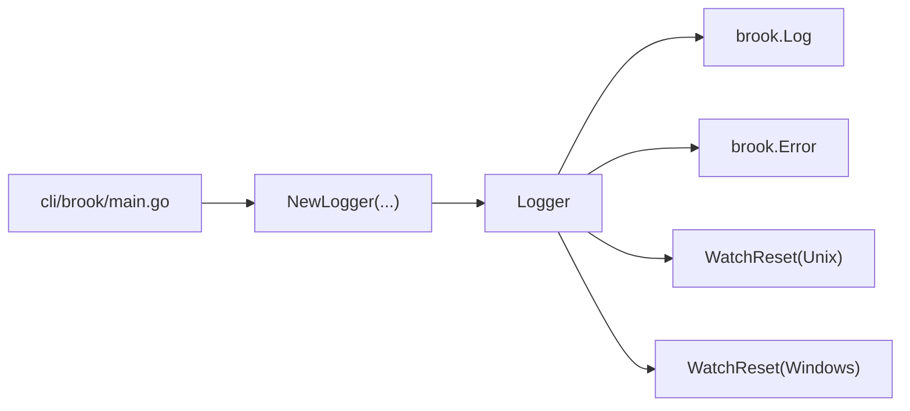
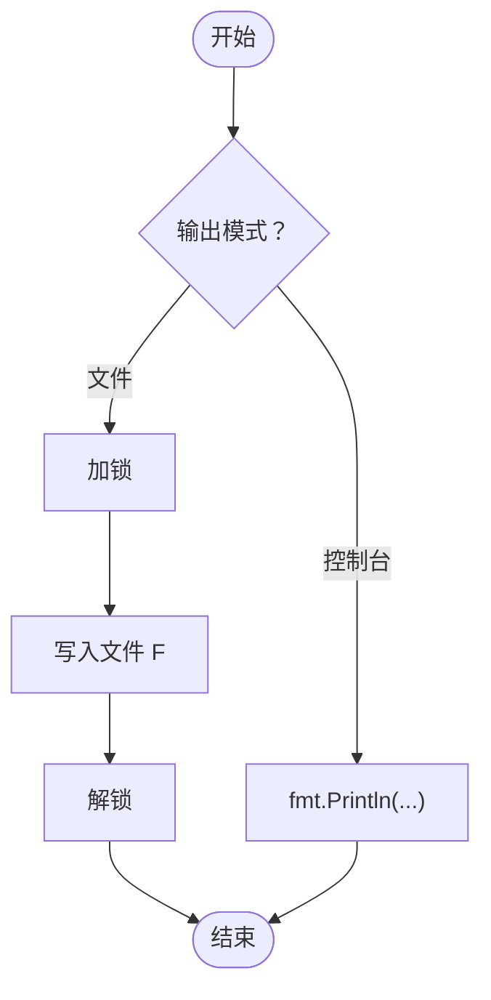
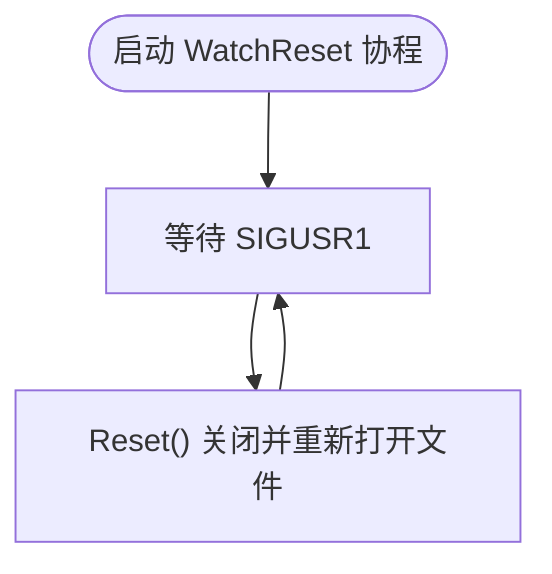
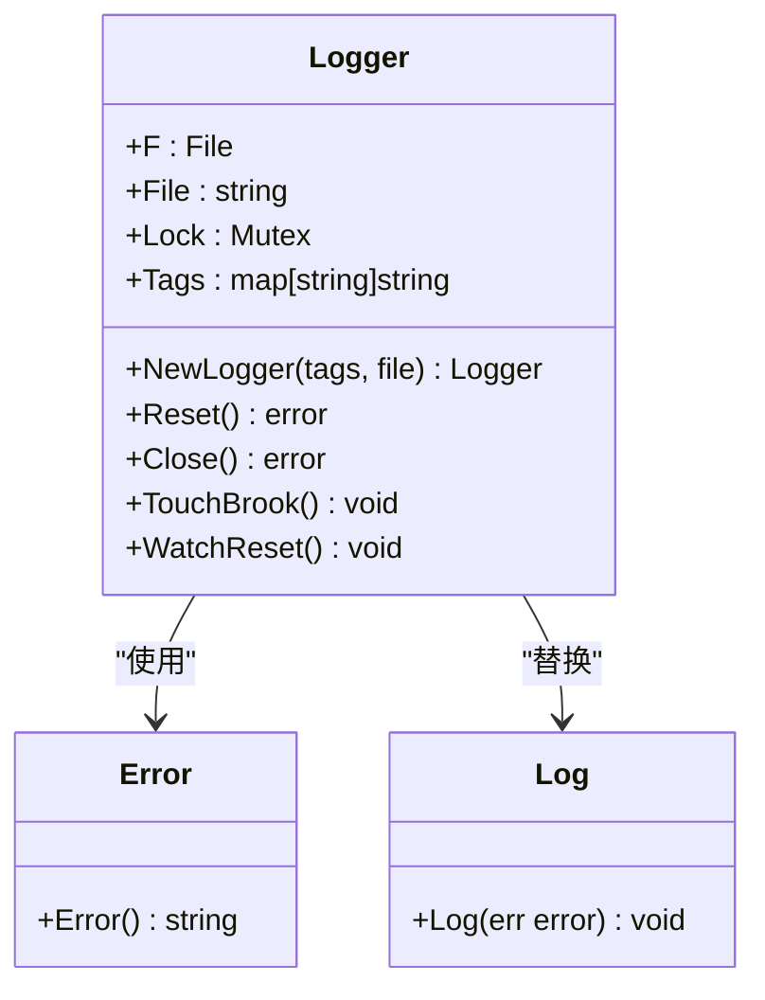

# 日志插件

<cite>
**本文引用的文件**
- [plugins/logger/logger.go](file://plugins/logger/logger.go)
- [plugins/logger/logger_unix.go](file://plugins/logger/logger_unix.go)
- [plugins/logger/logger_windows.go](file://plugins/logger/logger_windows.go)
- [plugins/logger/readme.md](file://plugins/logger/readme.md)
- [cli/brook/main.go](file://cli/brook/main.go)
- [log.go](file://log.go)
- [error.go](file://error.go)
</cite>

## 目录
1. [简介](#简介)
2. [项目结构](#项目结构)
3. [核心组件](#核心组件)
4. [架构总览](#架构总览)
5. [详细组件分析](#详细组件分析)
6. [依赖关系分析](#依赖关系分析)
7. [性能考量](#性能考量)
8. [故障排查指南](#故障排查指南)
9. [结论](#结论)
10. [附录](#附录)

## 简介
本文件面向“日志插件”的使用者与维护者，系统性阐述 Logger 结构体的设计与实现，覆盖以下关键点：
- NewLogger 如何初始化日志实例，支持控制台输出与文件输出两种模式
- TouchBrook 如何拦截 brook.Log、ServerGate、ClientGate、DNSGate、DOHGate、DHCPServerGate 等钩子函数，统一采集系统运行时日志
- 日志标签（Tags）机制如何为每条日志附加上下文信息
- 日志格式示例：错误日志、连接日志、DNS 查询日志
- Reset 与 Close 的资源管理行为，以及跨平台 WatchReset 的实现差异
- 在 CLI 中启用日志插件并配置输出路径的方法

## 项目结构
日志插件位于 plugins/logger 目录，包含通用实现与平台特定实现：
- 通用实现：logger.go 定义 Logger 结构体、初始化与资源管理方法，并注入钩子
- 平台实现：logger_unix.go（Unix/Linux/macOS）与 logger_windows.go（Windows）
- CLI 集成：cli/brook/main.go 解析命令行参数并启用日志插件
- 日志基础设施：brook 包中的 log.go 定义默认日志入口，error.go 定义结构化错误类型

图表来源
- [plugins/logger/logger.go](file://plugins/logger/logger.go#L1-L134)
- [plugins/logger/logger_unix.go](file://plugins/logger/logger_unix.go#L1-L22)
- [plugins/logger/logger_windows.go](file://plugins/logger/logger_windows.go#L1-L5)
- [cli/brook/main.go](file://cli/brook/main.go#L164-L214)
- [log.go](file://log.go#L15-L22)
- [error.go](file://error.go#L15-L27)

章节来源
- [plugins/logger/logger.go](file://plugins/logger/logger.go#L1-L134)
- [plugins/logger/logger_unix.go](file://plugins/logger/logger_unix.go#L1-L22)
- [plugins/logger/logger_windows.go](file://plugins/logger/logger_windows.go#L1-L5)
- [cli/brook/main.go](file://cli/brook/main.go#L164-L214)
- [log.go](file://log.go#L15-L22)
- [error.go](file://error.go#L15-L27)

## 核心组件
- Logger 结构体
  - 字段：F（文件句柄）、File（文件路径）、Lock（互斥锁）、Tags（键值对标签）
  - 方法：NewLogger、Reset、Close、TouchBrook、WatchReset（平台相关）
- 日志入口与格式
  - 默认日志入口：brook.Log
  - 错误类型：brook.Error（map[string]string），实现 Error 接口，JSON 序列化为字符串
- CLI 启用流程
  - 解析 --log 与 --tag
  - 创建 Logger 实例并调用 TouchBrook 注入钩子
  - 退出时通过回调关闭日志文件

章节来源
- [plugins/logger/logger.go](file://plugins/logger/logger.go#L32-L134)
- [log.go](file://log.go#L15-L22)
- [error.go](file://error.go#L15-L27)
- [cli/brook/main.go](file://cli/brook/main.go#L164-L214)

## 架构总览
日志插件通过替换全局日志入口与注入多个钩子，将系统运行时的关键事件统一转化为结构化日志。CLI 层负责参数解析与生命周期管理，平台层负责信号监听以触发日志文件重置。

图表来源
- [plugins/logger/logger.go](file://plugins/logger/logger.go#L39-L134)
- [plugins/logger/logger_unix.go](file://plugins/logger/logger_unix.go#L12-L21)
- [cli/brook/main.go](file://cli/brook/main.go#L164-L214)
- [log.go](file://log.go#L15-L22)

## 详细组件分析

### Logger 结构体与初始化
- 结构体字段
  - F：文件句柄；当为控制台模式时为空
  - File：文件路径字符串
  - Lock：互斥锁，保证写入线程安全
  - Tags：键值对标签，用于为每条日志附加上下文
- 初始化 NewLogger
  - 控制台模式：file 参数为 "console"，仅返回 Logger 实例，不打开文件
  - 文件模式：以截断、创建、只写方式打开文件，设置 F 与 File，并初始化 Lock
- 资源管理 Reset 与 Close
  - Reset：关闭旧文件句柄，重新以截断方式打开同一文件路径，用于轮转日志
  - Close：关闭文件句柄，释放资源

章节来源
- [plugins/logger/logger.go](file://plugins/logger/logger.go#L32-L74)

### 触发钩子：TouchBrook
- 启动 WatchReset 协程（Unix 平台），用于接收 SIGUSR1 信号后重置日志文件
- 替换 brook.Log：将错误封装为 brook.Error（map[string]string），追加时间戳与 Tags，然后输出到控制台或文件
- 注入钩子
  - ServerGate/ClientGate：记录网络类型、来源地址、目标域名（小写）
  - DNSGate：记录查询来源、DNS 类型、域名（小写）
  - DOHGate：记录来源（优先 X-Forwarded-For）、DNS 类型、域名（小写）
  - DHCPServerGate：记录入站/出站消息类型、客户端 MAC、可选 IP 与错误信息

章节来源
- [plugins/logger/logger.go](file://plugins/logger/logger.go#L76-L134)

### 日志标签（Tags）机制
- Tags 是键值对映射，在 NewLogger 时传入
- 在每次日志输出前，会将 Tags 合并到当前日志条目中，作为结构化字段的一部分
- 该机制可用于为进程打上环境标识、版本号、实例 ID 等上下文信息

章节来源
- [plugins/logger/logger.go](file://plugins/logger/logger.go#L39-L48)
- [plugins/logger/logger.go](file://plugins/logger/logger.go#L76-L110)

### 跨平台 WatchReset 行为
- Unix/Linux/macOS：WatchReset 循环监听 SIGUSR1，收到信号后调用 Reset，实现日志文件重置
- Windows：WatchReset 为空实现，不进行信号监听

章节来源
- [plugins/logger/logger_unix.go](file://plugins/logger/logger_unix.go#L12-L21)
- [plugins/logger/logger_windows.go](file://plugins/logger/logger_windows.go#L1-L5)

### 日志格式示例
- 错误日志
  - 字段：time（RFC3339）、所有 Tags 键值对、以及错误详情
  - 输出：JSON 字符串（brook.Error 实现 Error 接口时的 JSON 序列化结果）
- 连接日志（ServerGate/ClientGate）
  - 字段：network（网络类型）、from（来源地址）、dst（目标域名，小写）
- DNS 查询日志（DNSGate）
  - 字段：from（查询来源）、dns（DNS 类型名称）、domain（域名，小写）
- DOH 查询日志（DOHGate）
  - 字段：from（来源，优先取 X-Forwarded-For）、dns（DNS 类型名称）、domain（域名，小写）
- DHCP 服务器日志（DHCPServerGate）
  - 字段：in/out（消息类型）、client（客户端 MAC）、ip（可选）、error（可选）

章节来源
- [plugins/logger/logger.go](file://plugins/logger/logger.go#L76-L134)
- [error.go](file://error.go#L15-L27)

### CLI 启用与配置
- 启用方式
  - 使用 --log 指定输出路径，支持绝对路径或 "console"
  - 使用 --tag 可多次传入 key:value 形式的标签
- 生命周期
  - Before 阶段：解析参数、创建 Logger、调用 TouchBrook 注入钩子
  - 退出阶段：通过回调关闭日志文件句柄
- 注意事项
  - --log 必须为绝对路径（非 console 模式）
  - --tag 每个条目必须为 key:value 形式

章节来源
- [cli/brook/main.go](file://cli/brook/main.go#L67-L80)
- [cli/brook/main.go](file://cli/brook/main.go#L164-L214)

## 依赖关系分析
- Logger 依赖
  - brook.Log：默认日志入口，被 Logger 替换为结构化输出
  - brook.Error：结构化错误类型，JSON 序列化为字符串
  - 平台信号：Unix 下通过 os/signal 监听 SIGUSR1，触发 Reset
- CLI 依赖
  - urfave/cli：解析命令行参数
  - runnergroup：管理生命周期与优雅退出

图表来源
- [cli/brook/main.go](file://cli/brook/main.go#L164-L214)
- [plugins/logger/logger.go](file://plugins/logger/logger.go#L39-L134)
- [log.go](file://log.go#L15-L22)
- [error.go](file://error.go#L15-L27)
- [plugins/logger/logger_unix.go](file://plugins/logger/logger_unix.go#L12-L21)
- [plugins/logger/logger_windows.go](file://plugins/logger/logger_windows.go#L1-L5)

章节来源
- [cli/brook/main.go](file://cli/brook/main.go#L164-L214)
- [plugins/logger/logger.go](file://plugins/logger/logger.go#L39-L134)
- [log.go](file://log.go#L15-L22)
- [error.go](file://error.go#L15-L27)

## 性能考量
- 线程安全：使用互斥锁保护文件写入，避免并发写入冲突
- I/O 开销：建议在高吞吐场景下优先使用控制台模式进行调试，生产环境使用文件模式并配合外部日志收集
- 信号处理：Unix 下 WatchReset 采用阻塞等待信号的方式，开销极低
- JSON 序列化：brook.Error 的 JSON 序列化在每次日志输出时执行，建议控制 Tags 数量与层级，避免过大的日志条目

[本节为通用指导，不直接分析具体文件]

## 故障排查指南
- 无法写入日志文件
  - 检查 --log 是否为绝对路径且目录存在
  - 检查文件权限是否允许写入
- 日志未输出
  - 确认已调用 TouchBrook 注入钩子
  - 确认 CLI Before 阶段成功创建 Logger 并调用 TouchBrook
- Windows 下无法重置日志文件
  - WatchReset 为空实现，不支持 SIGUSR1；可通过重启进程或外部工具轮转文件
- 标签无效
  - --tag 必须为 key:value 形式，否则会被拒绝

章节来源
- [cli/brook/main.go](file://cli/brook/main.go#L164-L214)
- [plugins/logger/logger.go](file://plugins/logger/logger.go#L39-L74)
- [plugins/logger/logger_windows.go](file://plugins/logger/logger_windows.go#L1-L5)

## 结论
日志插件通过轻量级的 Logger 结构体与钩子注入，实现了对系统运行时日志的统一采集与输出。其设计兼顾了易用性与可扩展性：既支持控制台快速调试，也支持文件持久化；通过 Tags 提供上下文信息；通过 WatchReset 实现 Unix 平台的日志文件重置。在 CLI 中启用非常简单，只需指定 --log 与 --tag 参数即可。

[本节为总结性内容，不直接分析具体文件]

## 附录

### 关键流程图：日志输出路径

图表来源
- [plugins/logger/logger.go](file://plugins/logger/logger.go#L76-L96)

### 关键流程图：Unix 下日志重置

图表来源
- [plugins/logger/logger_unix.go](file://plugins/logger/logger_unix.go#L12-L21)

### 关键类图：Logger 与相关类型

图表来源
- [plugins/logger/logger.go](file://plugins/logger/logger.go#L32-L134)
- [error.go](file://error.go#L15-L27)
- [log.go](file://log.go#L15-L22)