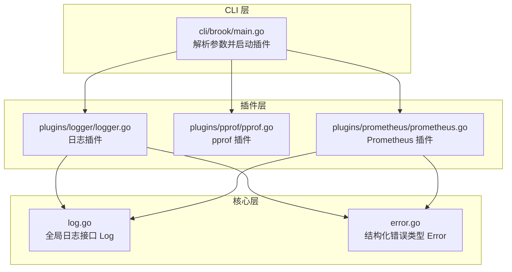
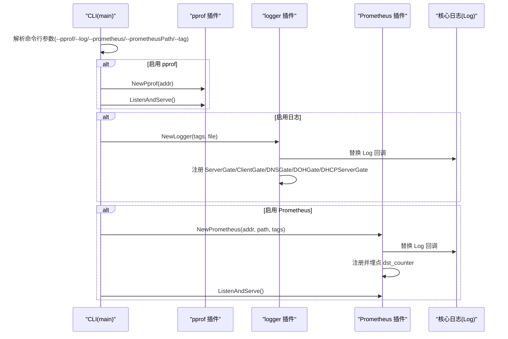
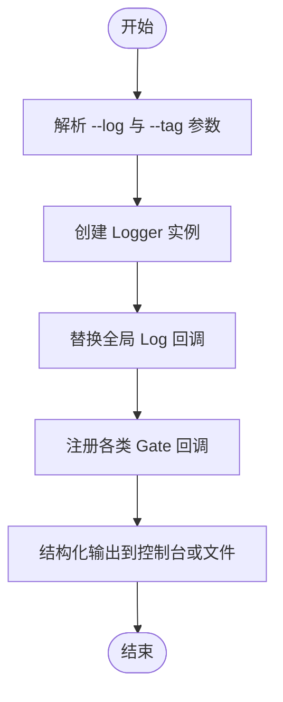
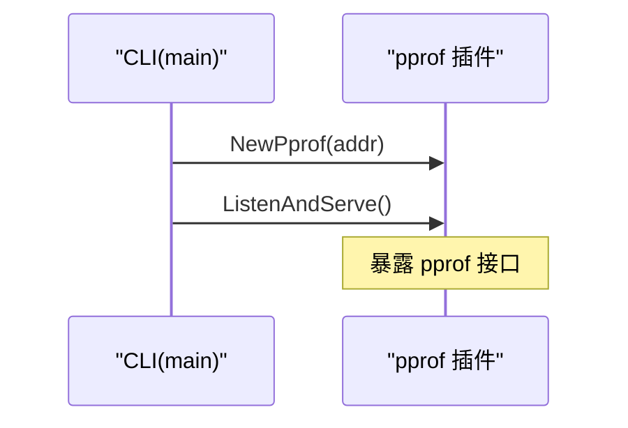
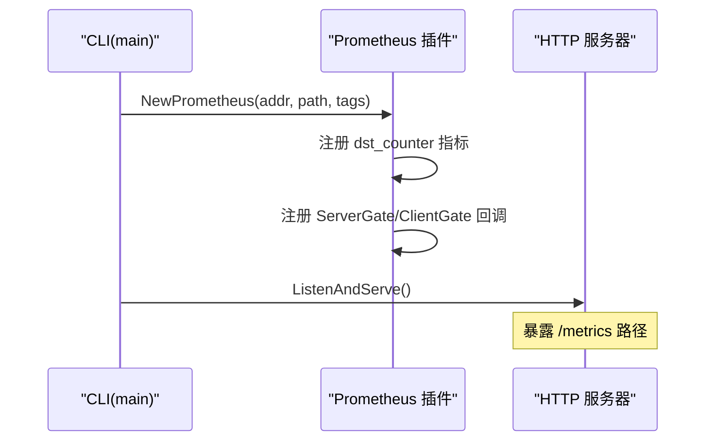
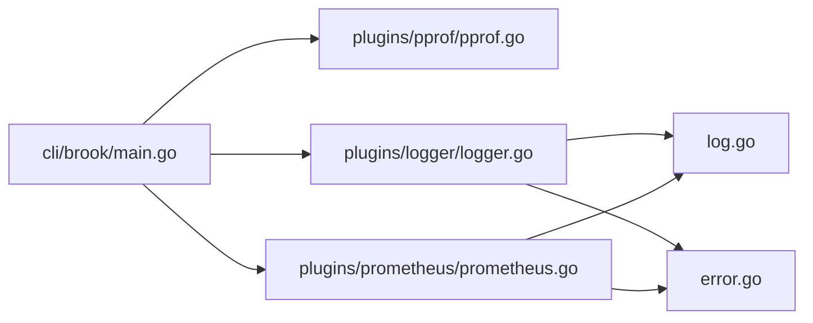

# 监控与日志

<cite>
**本文引用的文件**
- [cli/brook/main.go](file://cli/brook/main.go)
- [log.go](file://log.go)
- [error.go](file://error.go)
- [plugins/logger/logger.go](file://plugins/logger/logger.go)
- [plugins/logger/readme.md](file://plugins/logger/readme.md)
- [plugins/pprof/pprof.go](file://plugins/pprof/pprof.go)
- [plugins/pprof/readme.md](file://plugins/pprof/readme.md)
- [plugins/prometheus/prometheus.go](file://plugins/prometheus/prometheus.go)
- [plugins/prometheus/readme.md](file://plugins/prometheus/readme.md)
</cite>

## 目录
1. [简介](#简介)
2. [项目结构](#项目结构)
3. [核心组件](#核心组件)
4. [架构总览](#架构总览)
5. [组件详解](#组件详解)
6. [依赖关系分析](#依赖关系分析)
7. [性能考量](#性能考量)
8. [故障排查指南](#故障排查指南)
9. [结论](#结论)

## 简介
本文件聚焦于系统的可观测性能力，围绕三类观测手段展开：
- 日志插件：统一的结构化日志输出，支持控制台或文件输出，并可注入标签字段。
- pprof 性能分析：内置 Go pprof HTTP 接口，便于在本地或受控环境进行 CPU/内存等性能分析。
- Prometheus 监控指标：通过 HTTP 暴露 Prometheus 指标端点，采集关键流量路径的计数指标，用于可视化与告警。

文档将从配置选项、输出格式、级别控制、启用方式与使用场景等方面，结合代码实现，说明如何收集、分析与利用这些数据以优化系统性能与定位问题。

## 项目结构
可观测性相关代码主要分布在以下位置：
- CLI 入口负责解析命令行参数并按需启动各观测插件（pprof、日志、Prometheus）。
- 核心日志接口定义在全局包中，供各子系统统一调用。
- 插件层提供具体实现：日志插件负责结构化输出；pprof 插件提供 HTTP 服务器；Prometheus 插件注册指标并埋点。

图表来源
- [cli/brook/main.go](file://cli/brook/main.go#L160-L265)
- [log.go](file://log.go#L19-L21)
- [error.go](file://error.go#L19-L27)
- [plugins/logger/logger.go](file://plugins/logger/logger.go#L39-L134)
- [plugins/pprof/pprof.go](file://plugins/pprof/pprof.go#L23-L43)
- [plugins/prometheus/prometheus.go](file://plugins/prometheus/prometheus.go#L32-L93)

章节来源
- [cli/brook/main.go](file://cli/brook/main.go#L67-L120)
- [log.go](file://log.go#L19-L21)
- [error.go](file://error.go#L19-L27)

## 核心组件
- 结构化日志接口
  - 全局日志变量提供统一入口，便于在任意模块直接调用。
  - 错误类型为 map[string]string，序列化为 JSON 字符串，保证结构化输出。
- 日志插件
  - 支持输出到控制台或指定文件；支持运行时重置文件句柄。
  - 将各类网关事件（服务端/客户端/域名/DNS/DHCP）转换为结构化日志条目。
  - 可注入自定义标签键值对，附加到每条日志。
- pprof 插件
  - 启动独立 HTTP 服务器，暴露标准 pprof 接口，便于本地分析。
- Prometheus 插件
  - 注册计数指标，统计“网络类型/来源/目标”等维度的请求数量。
  - 通过标签扩展，将 CLI 中的 tag 注入指标标签，便于多实例或多环境对比。

章节来源
- [log.go](file://log.go#L19-L21)
- [error.go](file://error.go#L19-L27)
- [plugins/logger/logger.go](file://plugins/logger/logger.go#L39-L134)
- [plugins/pprof/pprof.go](file://plugins/pprof/pprof.go#L23-L43)
- [plugins/prometheus/prometheus.go](file://plugins/prometheus/prometheus.go#L32-L93)

## 架构总览
下图展示 CLI 如何根据参数选择性启用观测插件，并由插件向核心日志接口写入或注册指标。

图表来源
- [cli/brook/main.go](file://cli/brook/main.go#L175-L265)
- [plugins/logger/logger.go](file://plugins/logger/logger.go#L76-L133)
- [plugins/prometheus/prometheus.go](file://plugins/prometheus/prometheus.go#L50-L92)
- [plugins/pprof/pprof.go](file://plugins/pprof/pprof.go#L27-L43)

## 组件详解

### 日志插件（logger）
- 配置选项
  - 输出目标：控制台或绝对路径文件；在 Unix 系统可通过信号重置日志文件。
  - 标签注入：通过命令行 tag 列表注入键值对，附加到每条日志。
- 输出格式
  - 统一采用结构化 JSON 输出，字段包含时间戳、来源、目标、DNS 类型与域名等。
  - 自定义标签键值对作为额外字段随日志输出。
- 级别控制
  - 当前实现未区分日志级别；所有事件均以结构化形式输出。
- 使用场景
  - 运行时观察网络请求路径、DNS 查询、DHCP 交互等。
  - 与外部日志系统对接，便于集中检索与分析。
- 关键行为
  - 替换全局日志回调，拦截各类网关事件并写入文件或控制台。
  - 提供运行时重置文件句柄的能力，避免日志轮转导致的句柄失效。

图表来源
- [cli/brook/main.go](file://cli/brook/main.go#L189-L214)
- [plugins/logger/logger.go](file://plugins/logger/logger.go#L39-L133)

章节来源
- [cli/brook/main.go](file://cli/brook/main.go#L67-L120)
- [plugins/logger/logger.go](file://plugins/logger/logger.go#L39-L134)
- [plugins/logger/readme.md](file://plugins/logger/readme.md#L1-L2)

### pprof 性能分析（pprof）
- 启用方式
  - 通过命令行参数指定监听地址，CLI 创建 pprof 插件并启动 HTTP 服务器。
- 使用场景
  - 本地开发/测试环境进行 CPU/内存/profile 分析，定位热点与内存增长。
  - 仅建议在受控网络内启用，避免对外暴露。
- 关键行为
  - 插件内部引入 pprof 包并启动独立 HTTP 服务器，提供标准 pprof 接口。

图表来源
- [cli/brook/main.go](file://cli/brook/main.go#L175-L188)
- [plugins/pprof/pprof.go](file://plugins/pprof/pprof.go#L27-L43)

章节来源
- [cli/brook/main.go](file://cli/brook/main.go#L67-L80)
- [plugins/pprof/pprof.go](file://plugins/pprof/pprof.go#L23-L43)
- [plugins/pprof/readme.md](file://plugins/pprof/readme.md#L1-L2)

### Prometheus 监控指标（Prometheus）
- 启用方式
  - 通过命令行参数指定监听地址与指标路径；必须同时提供路径参数。
  - CLI 创建 Prometheus 插件并注册 HTTP 处理器，随后启动 HTTP 服务器。
- 指标说明
  - 计数指标：dst_counter，统计“网络类型/来源/目标”等维度的请求数量。
  - 标签扩展：将 CLI 中的 tag 注入指标标签，便于多实例或多环境对比。
- 使用场景
  - 与 Prometheus 服务端集成，采集指标并进行可视化与告警。
  - 通过标签区分不同部署环境、实例或业务维度，辅助容量规划与异常检测。
- 关键行为
  - 替换全局日志回调，注册 Counter 并在各类网关事件发生时递增对应标签的计数。

图表来源
- [cli/brook/main.go](file://cli/brook/main.go#L240-L265)
- [plugins/prometheus/prometheus.go](file://plugins/prometheus/prometheus.go#L32-L93)

章节来源
- [cli/brook/main.go](file://cli/brook/main.go#L122-L129)
- [plugins/prometheus/prometheus.go](file://plugins/prometheus/prometheus.go#L32-L93)
- [plugins/prometheus/readme.md](file://plugins/prometheus/readme.md#L1-L2)

## 依赖关系分析
- CLI 对插件的依赖
  - CLI 根据参数条件性地创建并启动各插件；插件之间互不影响。
- 插件对核心日志接口的依赖
  - 日志与 Prometheus 插件会替换全局日志回调，以便在关键事件发生时输出结构化日志或更新指标。
- 插件间耦合
  - 插件彼此独立，无直接依赖；通过 CLI 组合使用。

图表来源
- [cli/brook/main.go](file://cli/brook/main.go#L175-L265)
- [plugins/logger/logger.go](file://plugins/logger/logger.go#L76-L133)
- [plugins/prometheus/prometheus.go](file://plugins/prometheus/prometheus.go#L50-L92)
- [log.go](file://log.go#L19-L21)
- [error.go](file://error.go#L19-L27)

章节来源
- [cli/brook/main.go](file://cli/brook/main.go#L175-L265)
- [plugins/logger/logger.go](file://plugins/logger/logger.go#L76-L133)
- [plugins/prometheus/prometheus.go](file://plugins/prometheus/prometheus.go#L50-L92)

## 性能考量
- 日志开销
  - 结构化输出与文件写入存在 IO 成本；建议在生产环境谨慎开启文件日志，优先使用控制台或外部日志系统。
  - 文件重置与锁保护确保线程安全，但频繁重置可能带来额外开销。
- pprof 开销
  - pprof 在启用后会持续占用 HTTP 服务器资源；仅在需要分析时启用。
- Prometheus 指标
  - 指标注册与标签扩展为常量开销；在高并发场景下，注意标签基数控制，避免过多动态标签导致指标维度爆炸。
- 建议
  - 生产环境默认关闭文件日志，使用控制台输出并交由外部系统收集。
  - pprof 仅在本地或受控网络启用，避免对外暴露。
  - Prometheus 路径建议使用非默认值，降低被扫描风险。

[本节为通用指导，无需列出章节来源]

## 故障排查指南
- 启动参数校验
  - 日志文件路径必须为绝对路径；Prometheus 必须提供路径参数；tag 格式必须为 key:value。
- 日志文件无法写入
  - 检查文件权限与路径是否存在；必要时通过信号触发重置。
- pprof 无法访问
  - 确认监听地址未被占用；仅在受控网络内访问。
- Prometheus 指标为空
  - 确认已产生相关网关事件；检查路径是否正确；确认标签注入是否生效。

章节来源
- [cli/brook/main.go](file://cli/brook/main.go#L189-L203)
- [cli/brook/main.go](file://cli/brook/main.go#L240-L243)

## 结论
本项目的可观测性方案通过统一的日志接口与插件化设计，提供了灵活且可组合的监控与日志能力：
- 日志插件以结构化 JSON 输出为核心，支持控制台与文件输出，并可注入标签，便于与外部系统集成。
- pprof 插件提供本地性能分析能力，适合开发与测试阶段使用。
- Prometheus 插件通过计数指标与标签扩展，满足生产环境的可视化与告警需求。

建议在生产环境中优先采用控制台输出与外部日志系统，谨慎启用文件日志；pprof 仅限受控网络；Prometheus 路径与标签应遵循最小暴露原则，配合监控平台进行持续优化与问题定位。