# 全局参数

<cite>
**本文档中引用的文件**   
- [main.go](file://cli/brook/main.go)
- [pprof.go](file://plugins/pprof/pprof.go)
- [logger.go](file://plugins/logger/logger.go)
- [dialwithdns.go](file://plugins/dialwithdns/dialwithdns.go)
- [dialwithip.go](file://plugins/dialwithip/dialwithip.go)
- [dialwithnic.go](file://plugins/dialwithnic/dialwithnic.go)
- [socks5dial.go](file://plugins/socks5dial/dial.go)
- [prometheus.go](file://plugins/prometheus/prometheus.go)
- [block.go](file://plugins/block/block.go)
- [init.go](file://init.go)
</cite>

## 目录
1. [全局参数概述](#全局参数概述)
2. [详细参数说明](#详细参数说明)
3. [参数优先级与作用范围](#参数优先级与作用范围)
4. [使用示例](#使用示例)
5. [配置最佳实践](#配置最佳实践)

## 全局参数概述

brook工具提供了一系列全局参数，这些参数在所有命令执行前进行初始化，影响整个程序的行为。这些参数通过`cli/brook/main.go`中的`app.Flags`定义，为各种功能提供统一的配置接口。全局参数的设计使得用户可以在不同命令间共享配置，提高配置效率和一致性。

全局参数主要分为以下几类：
- **监控与调试类**：如`pprof`、`log`、`prometheus`，用于性能分析和日志记录
- **网络连接控制类**：如`dialWithDNS`、`dialWithIP4`、`dialWithIP6`、`dialWithNIC`、`dialWithSocks5`，用于控制网络连接行为
- **安全与加密类**：如`clientHKDFInfo`、`serverHKDFInfo`，用于加密协议配置
- **访问控制类**：如`blockDomainList`、`blockCIDR4List`、`blockCIDR6List`、`blockGeoIP`，用于阻止特定域名、IP段或地理位置的访问
- **系统管理类**：如`tag`、`blockListUpdateInterval`、`pid`，用于进程管理和配置更新

这些参数在`app.Before`钩子函数中被处理，确保在任何命令执行前完成初始化。这种设计模式使得全局配置能够一致地应用于所有子命令，同时保持了命令行接口的简洁性。

**Section sources**
- [main.go](file://cli/brook/main.go#L66-L295)

## 详细参数说明

### 监控与调试参数

#### pprof
`pprof`参数用于启用Go语言的pprof性能分析工具。通过指定HTTP监听地址（如`:6060`），可以访问pprof提供的各种性能分析接口，包括CPU、内存、goroutine等的详细信息。这对于诊断性能瓶颈和内存泄漏问题非常有用。

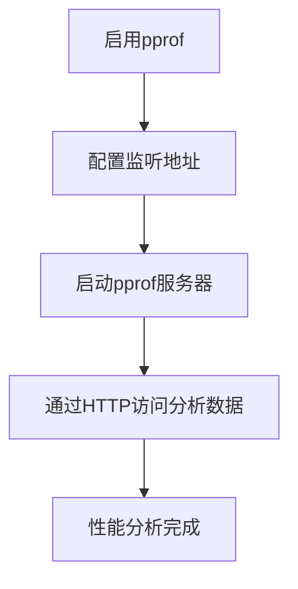

**Diagram sources**
- [main.go](file://cli/brook/main.go#L67-L70)
- [pprof.go](file://plugins/pprof/pprof.go#L27-L34)

#### log
`log`参数用于启用日志记录功能。可以指定日志文件的绝对路径或将日志输出到控制台（使用`console`值）。在Unix系统上，可以通过发送SIGUSR1信号来重置日志文件。此参数还支持通过环境变量`SOCKS5_DEBUG=true`来调试SOCKS5库。

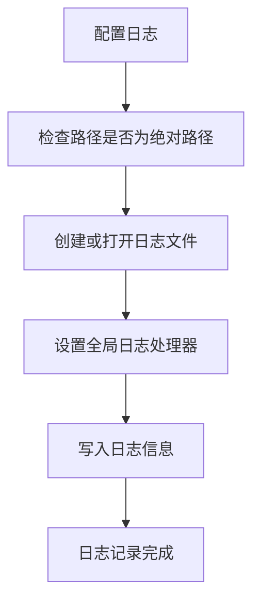

**Diagram sources**
- [main.go](file://cli/brook/main.go#L71-L74)
- [logger.go](file://plugins/logger/logger.go#L39-L47)

#### prometheus
`prometheus`参数用于启用Prometheus监控。需要同时指定HTTP监听地址（如`:7070`）和访问路径（通过`prometheusPath`参数）。建议在公网传输时使用难以猜测的路径值以增强安全性。

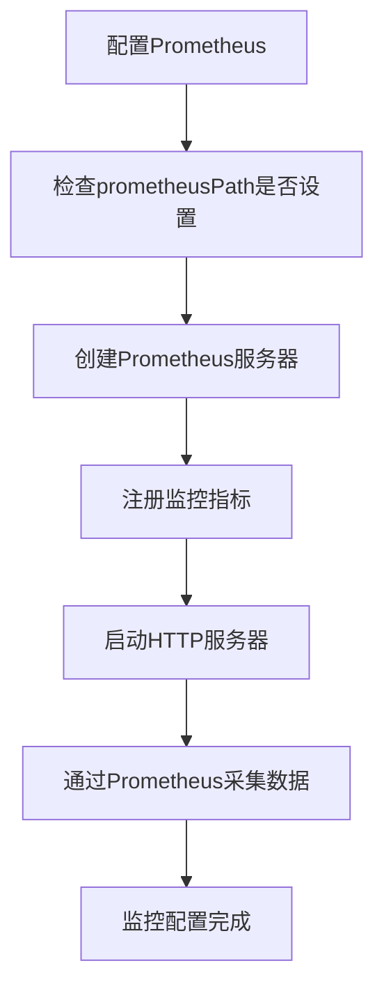

**Diagram sources**
- [main.go](file://cli/brook/main.go#L122-L128)
- [prometheus.go](file://plugins/prometheus/prometheus.go#L32-L39)

### 网络连接控制参数

#### dialWithDNS
`dialWithDNS`参数指定域名解析时使用的DNS服务器。可以是传统的UDP DNS服务器（如`8.8.8.8:53`）或基于HTTPS的DNS（如`https://dns.google/dns-query?address=8.8.8.8%3A443`）。此参数还支持通过`dialWithDNSPrefer`指定优先解析A记录还是AAAA记录。

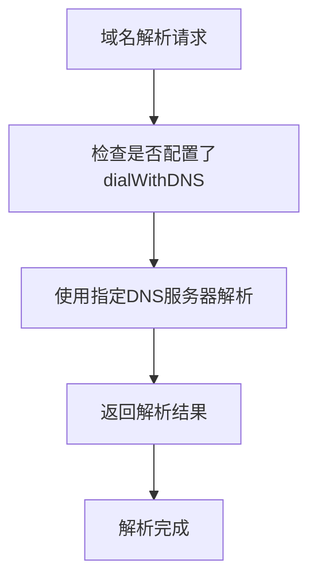

**Diagram sources**
- [main.go](file://cli/brook/main.go#L80-L86)
- [dialwithdns.go](file://plugins/dialwithdns/dialwithdns.go#L33-L45)

#### dialWithIP4 和 dialWithIP6
这两个参数分别用于指定IPv4和IPv6连接时使用的本地IP地址。当机器有多个网络接口时，可以通过这些参数明确指定使用哪个IP地址建立外部连接。

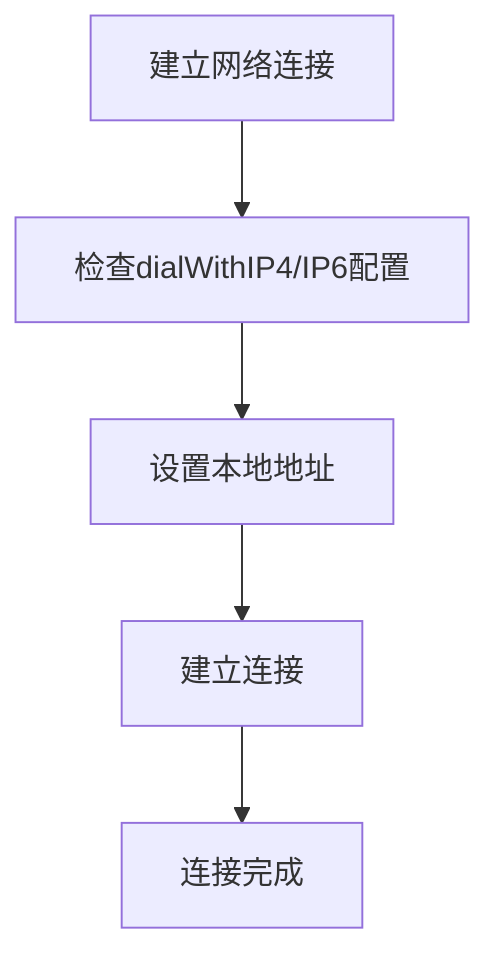

**Diagram sources**
- [main.go](file://cli/brook/main.go#L88-L93)
- [dialwithip.go](file://plugins/dialwithip/dialwithip.go#L30-L45)

#### dialWithNIC
`dialWithNIC`参数用于指定网络连接时使用的网络接口卡（NIC）。通过指定接口名称，可以控制流量从哪个物理或虚拟网络接口发出。

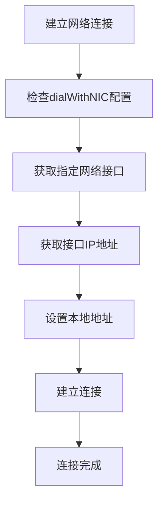

**Diagram sources**
- [main.go](file://cli/brook/main.go#L96-L97)
- [dialwithnic.go](file://plugins/dialwithnic/dialwithnic.go#L29-L32)

#### dialWithSocks5
`dialWithSocks5`参数用于指定通过SOCKS5代理建立外部网络连接。可以配置代理服务器地址、用户名、密码以及TCP和UDP连接的超时时间。

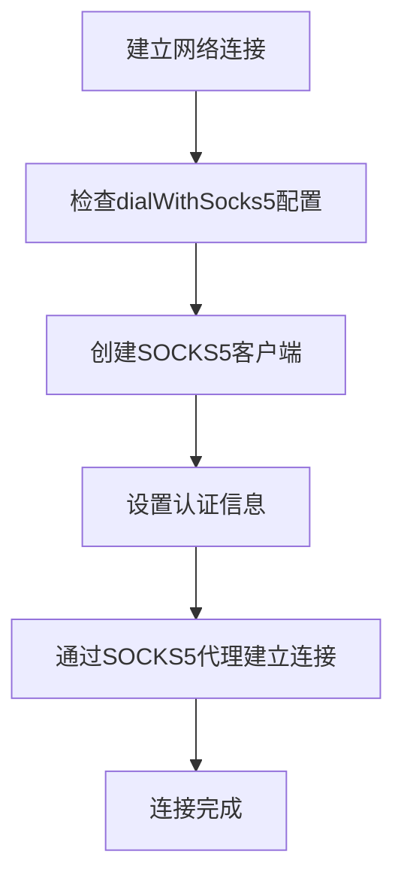

**Diagram sources**
- [main.go](file://cli/brook/main.go#L100-L120)
- [dial.go](file://plugins/socks5dial/dial.go#L28-L36)

### 安全与加密参数

#### clientHKDFInfo 和 serverHKDFInfo
这两个参数用于配置HKDF（HMAC-based Key Derivation Function）信息，影响加密密钥的生成。默认值均为"brook"，通常不需要修改。如果修改了这些值，客户端和服务器必须使用相同的值，否则会导致连接失败。

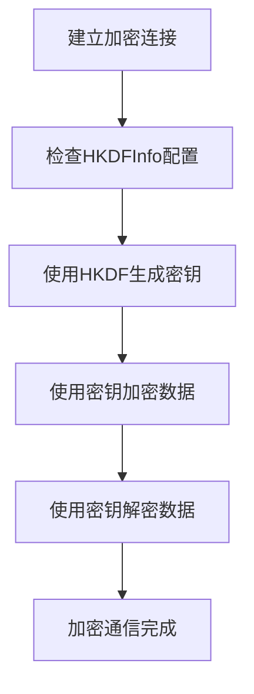

**Diagram sources**
- [main.go](file://cli/brook/main.go#L130-L137)
- [init.go](file://init.go#L17-L18)

### 访问控制参数

#### blockDomainList、blockCIDR4List、blockCIDR6List
这些参数用于配置阻止访问的域名列表和IP段列表。列表可以来自HTTP/HTTPS URL或本地文件，每行一个条目。域名列表使用后缀匹配模式。

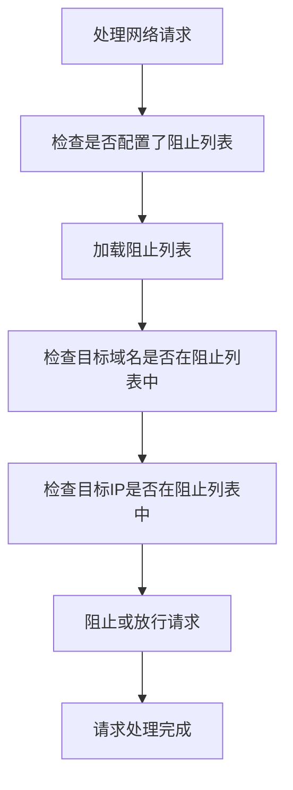

**Diagram sources**
- [main.go](file://cli/brook/main.go#L140-L149)
- [block.go](file://plugins/block/block.go#L43-L82)

#### blockGeoIP
`blockGeoIP`参数用于根据地理位置阻止IP访问，通过国家代码（如US）指定要阻止的国家。此功能依赖于IP地理位置数据库。

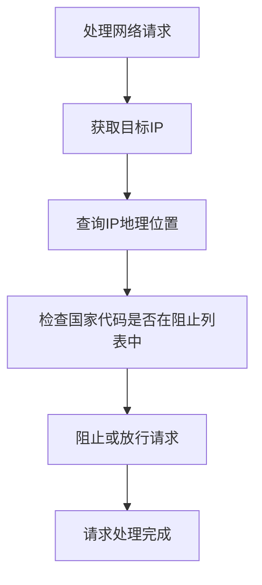

**Diagram sources**
- [main.go](file://cli/brook/main.go#L152-L154)
- [block.go](file://plugins/block/block.go#L43-L82)

#### blockListUpdateInterval
`blockListUpdateInterval`参数设置阻止列表的更新间隔（秒）。默认值为0，表示只在启动时读取一次。设置为非零值后，会定期更新列表内容。

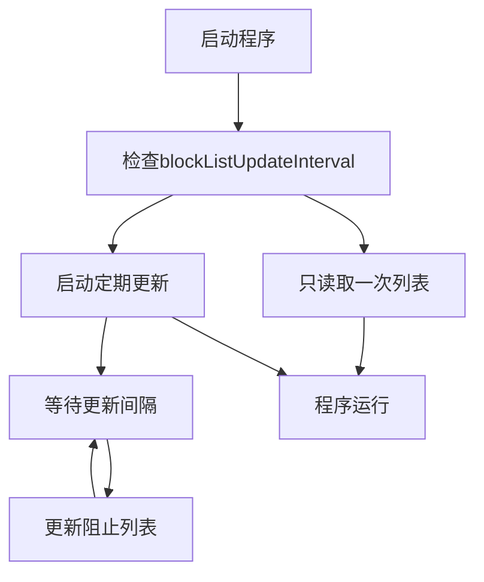

**Diagram sources**
- [main.go](file://cli/brook/main.go#L156-L158)
- [block.go](file://plugins/block/block.go#L84-L127)

### 系统管理参数

#### tag
`tag`参数用于为进程添加标签，这些标签会附加到日志或服务器日志中，并作为查询参数添加到用户API中。标签格式为`key:value`。

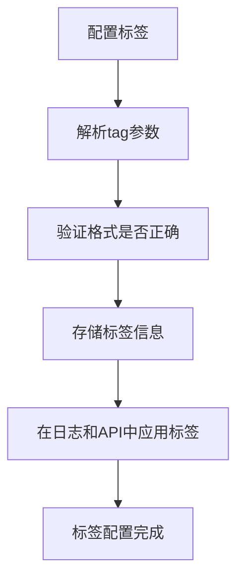

**Diagram sources**
- [main.go](file://cli/brook/main.go#L76-L78)
- [logger.go](file://plugins/logger/logger.go#L39-L47)

#### pid
`pid`参数指定一个文件路径，用于存储进程ID。在Unix系统上，可以发送SIGUSR1信号来重置`--serverLog`文件。

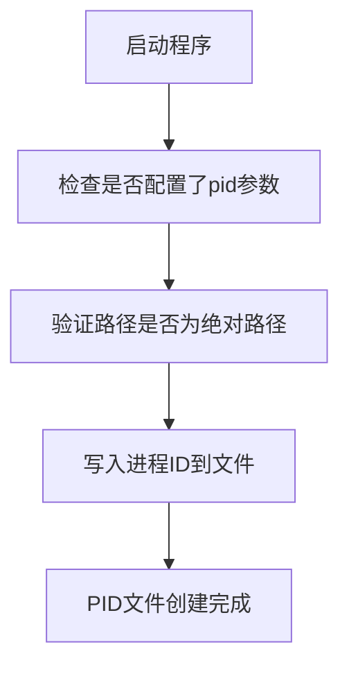

**Diagram sources**
- [main.go](file://cli/brook/main.go#L160-L162)
- [main.go](file://cli/brook/main.go#L167-L173)

## 参数优先级与作用范围

brook工具的全局参数具有明确的作用范围和优先级规则。所有全局参数在`app.Before`钩子中被处理，确保在任何命令执行前完成初始化。这些参数通过修改全局变量或注册回调函数的方式影响程序行为。

参数优先级遵循以下规则：
1. 命令行参数 > 配置文件 > 默认值
2. 全局参数 > 命令特定参数（当两者都存在时）
3. 后设置的参数值会覆盖先设置的值

作用范围方面，全局参数主要影响以下方面：
- **网络连接行为**：通过`dialWith*`系列参数控制所有出站连接
- **安全策略**：通过`block*`系列参数实施访问控制
- **监控与调试**：通过`pprof`、`log`、`prometheus`等参数启用监控功能
- **加密配置**：通过`HKDFInfo`参数影响加密密钥生成

值得注意的是，某些命令（如`quicclient`）会忽略全局拨号参数，这是为了满足特定协议的需求。

**Section sources**
- [main.go](file://cli/brook/main.go#L164-L295)

## 使用示例

### 基本监控配置
```bash
brook server --listen :9999 --password hello \
  --pprof :6060 \
  --log /var/log/brook.log \
  --prometheus :7070 --prometheusPath /metrics
```

### 网络连接控制
```bash
brook client --server 1.2.3.4:9999 --password hello \
  --dialWithDNS 8.8.8.8:53 \
  --dialWithIP4 192.168.1.100 \
  --dialWithNIC eth0
```

### 安全访问控制
```bash
brook server --listen :9999 --password hello \
  --blockDomainList https://example.com/blocklist.txt \
  --blockCIDR4List /path/to/cidr4.txt \
  --blockGeoIP US CN \
  --blockListUpdateInterval 3600
```

### 完整配置示例
```bash
brook server --listen :9999 --password hello \
  --pprof :6060 \
  --log /var/log/brook.log \
  --tag environment:production \
  --tag region:us-west \
  --dialWithDNS 1.1.1.1:53 \
  --dialWithIP4 203.0.113.10 \
  --prometheus :7070 --prometheusPath /secure-metrics-12345 \
  --blockDomainList https://raw.githubusercontent.com/txthinking/brook/master/programmable/list/example_domain.txt \
  --blockCIDR4List https://raw.githubusercontent.com/txthinking/brook/master/programmable/list/example_cidr4.txt \
  --blockListUpdateInterval 1800 \
  --pid /var/run/brook.pid
```

**Section sources**
- [main.go](file://cli/brook/main.go#L66-L295)

## 配置最佳实践

### 监控与调试
- 在生产环境中启用`log`参数，将日志输出到专用文件
- 使用`pprof`进行性能分析时，确保监听地址不在公网暴露
- 配置`prometheus`时使用难以猜测的路径，如`/metrics-abc123xyz`
- 定期检查日志文件大小，必要时实现日志轮转

### 网络连接
- 使用`dialWithDNS`指定可靠的DNS服务器，避免DNS污染
- 当有多个网络接口时，使用`dialWithNIC`明确指定出口接口
- 通过`dialWithSocks5`可以实现流量的二次代理，增强隐私保护
- 合理设置`dialWithSocks5TCPTimeout`和`dialWithSocks5UDPTimeout`避免连接挂起

### 安全与访问控制
- 定期更新`blockDomainList`和`blockCIDR*List`以应对新的威胁
- 设置合理的`blockListUpdateInterval`（如1800秒）以平衡安全性和性能
- 使用`blockGeoIP`阻止来自高风险国家的访问
- 不要随意修改`clientHKDFInfo`和`serverHKDFInfo`，除非有特殊安全需求

### 系统管理
- 使用`tag`参数为不同环境的实例添加标识，便于监控和管理
- 配置`pid`文件以便于进程管理和监控
- 在脚本中使用绝对路径，避免相对路径带来的问题
- 合理组合使用多个全局参数，实现复杂的功能需求

通过遵循这些最佳实践，可以充分发挥brook工具的潜力，构建安全、高效、可管理的网络服务。

**Section sources**
- [main.go](file://cli/brook/main.go#L66-L295)
- [pprof.go](file://plugins/pprof/pprof.go)
- [logger.go](file://plugins/logger/logger.go)
- [prometheus.go](file://plugins/prometheus/prometheus.go)
- [block.go](file://plugins/block/block.go)