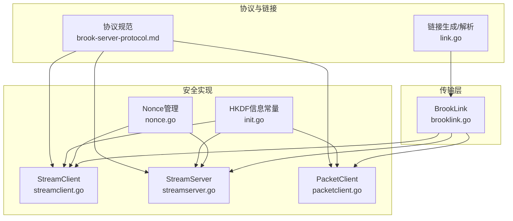
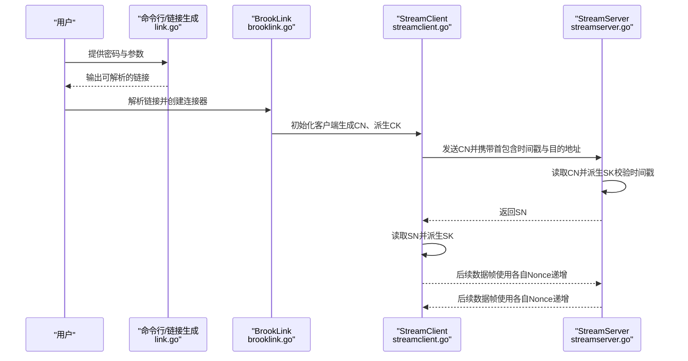
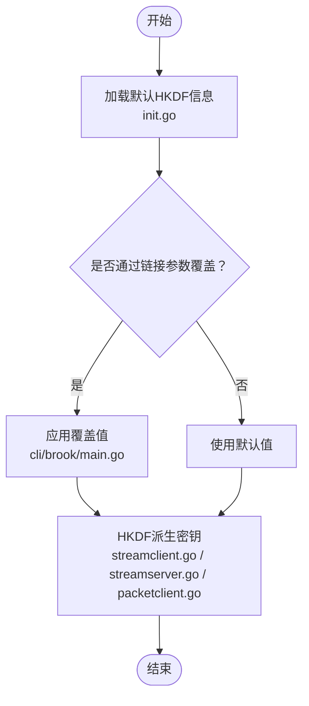
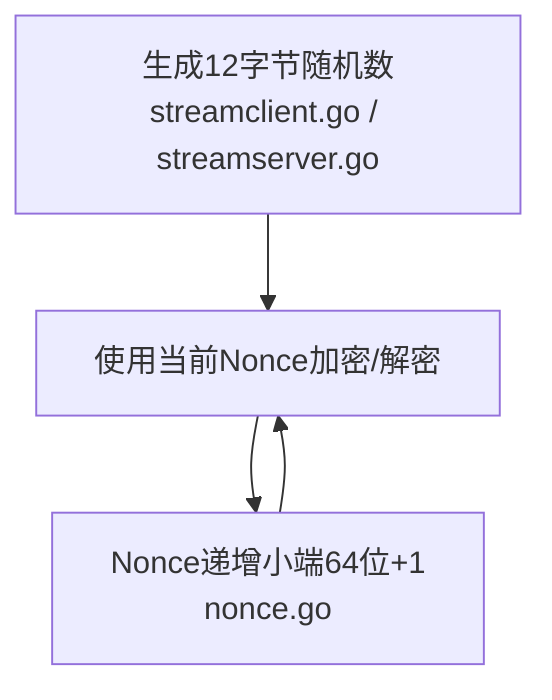
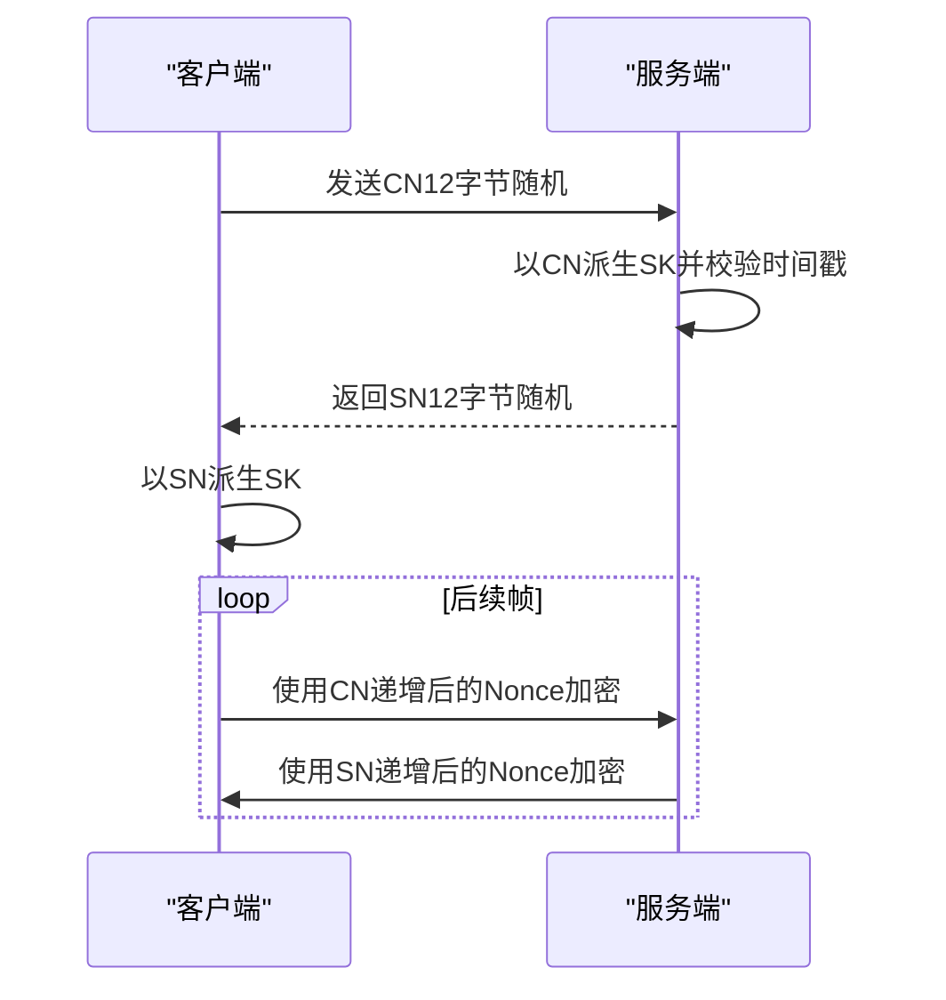
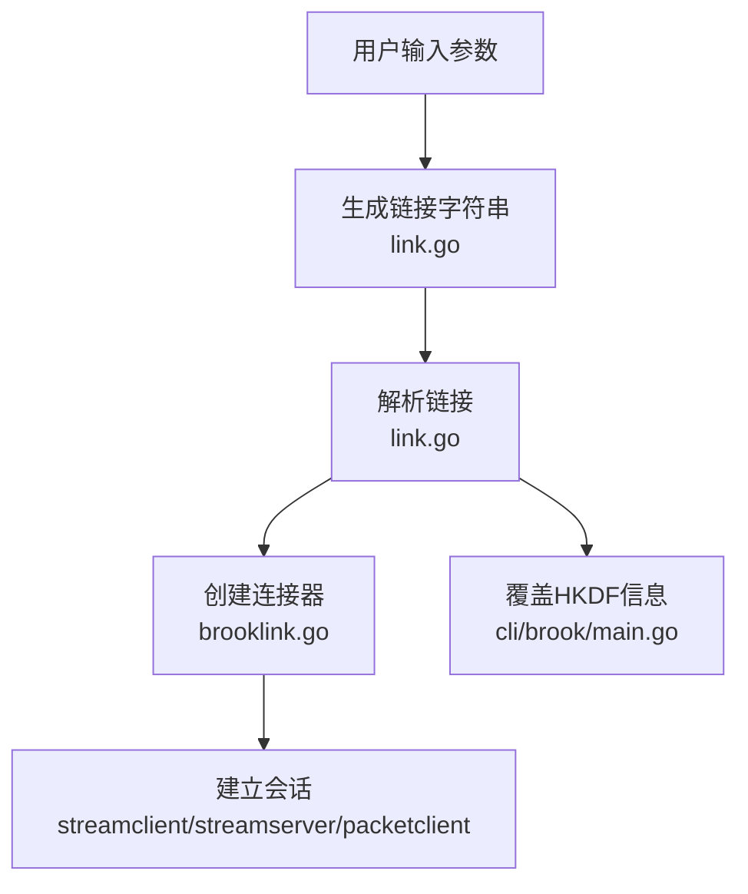
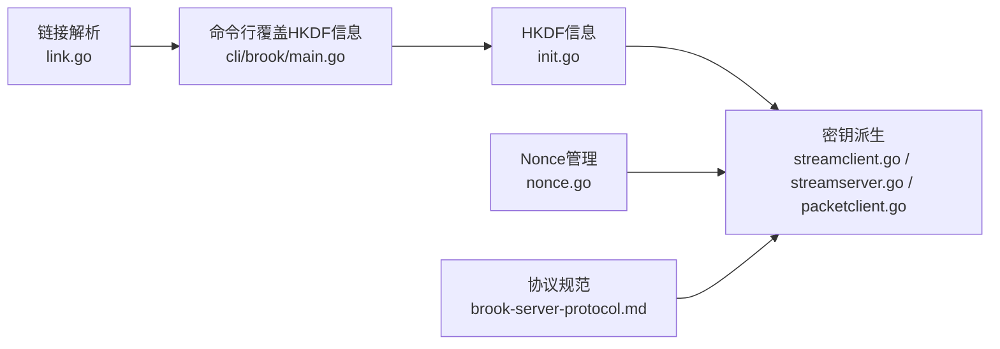
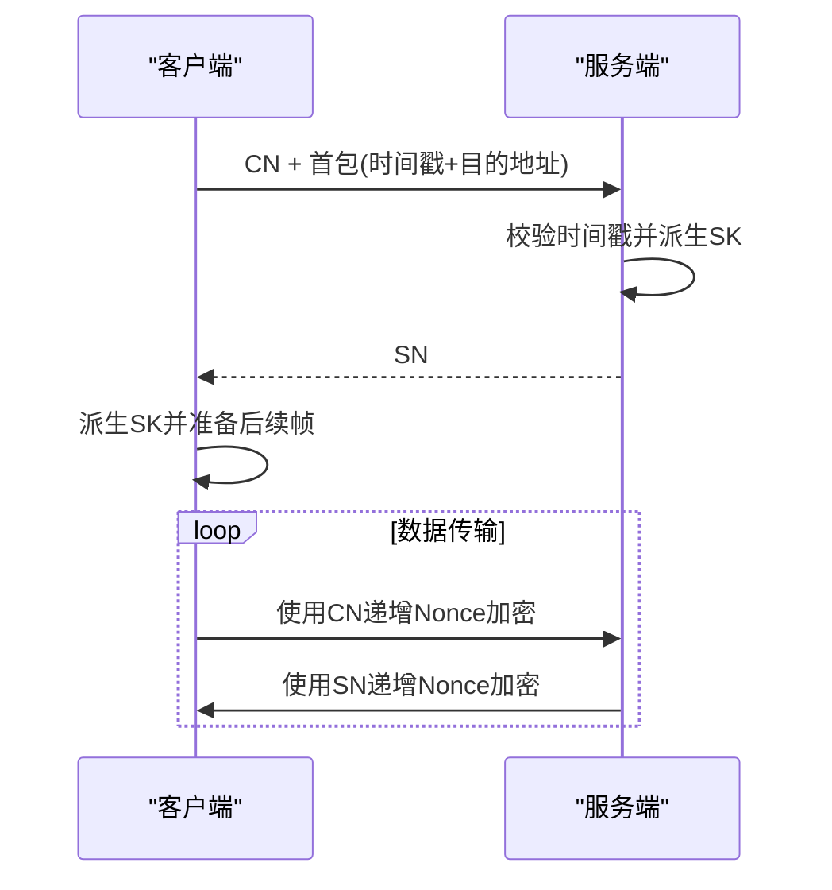

# 加密安全参数

<cite>
**本文引用的文件**
- [brooklink.go](file://brooklink.go)
- [nonce.go](file://nonce.go)
- [init.go](file://init.go)
- [streamclient.go](file://streamclient.go)
- [streamserver.go](file://streamserver.go)
- [packetclient.go](file://packetclient.go)
- [link.go](file://link.go)
- [protocol/brook-server-protocol.md](file://protocol/brook-server-protocol.md)
- [protocol/brook-wsserver-protocol.md](file://protocol/brook-wsserver-protocol.md)
- [cli/brook/main.go](file://cli/brook/main.go)
</cite>

## 目录
1. [引言](#引言)
2. [项目结构](#项目结构)
3. [核心组件](#核心组件)
4. [架构总览](#架构总览)
5. [详细组件分析](#详细组件分析)
6. [依赖分析](#依赖分析)
7. [性能考虑](#性能考虑)
8. [故障排查指南](#故障排查指南)
9. [结论](#结论)
10. [附录](#附录)

## 引言
本文件围绕 Brook 协议的安全加密机制展开，重点解析 clientHKDFInfo 与 serverHKDFInfo 在密钥派生中的作用，结合链接生成机制与随机数管理，阐明其在前向安全与防重放方面的贡献，并给出安全配置最佳实践与握手流程示例，帮助读者在端到端加密场景中正确理解与使用这些参数。

## 项目结构
- 协议与链接
  - 协议规范文档：描述了 HKDF 信息、Nonce、时间戳等安全要素
  - 链接生成与解析：将用户输入转换为可执行的连接参数
- 安全实现
  - HKDF 信息常量：默认值与命令行覆盖
  - 随机数管理：Nonce 的生成与递增
  - 握手与加解密：客户端/服务端在不同协议下的密钥派生与认证
- 传输层适配
  - WebSocket/QUIC 等上层传输对底层协议的封装

**图表来源**
- [protocol/brook-server-protocol.md](file://protocol/brook-server-protocol.md#L1-L127)
- [link.go](file://link.go#L1-L37)
- [init.go](file://init.go#L1-L22)
- [nonce.go](file://nonce.go#L1-L24)
- [streamclient.go](file://streamclient.go#L1-L234)
- [streamserver.go](file://streamserver.go#L1-L243)
- [packetclient.go](file://packetclient.go#L1-L155)
- [brooklink.go](file://brooklink.go#L1-L375)

**章节来源**
- [protocol/brook-server-protocol.md](file://protocol/brook-server-protocol.md#L1-L127)
- [link.go](file://link.go#L1-L37)
- [init.go](file://init.go#L1-L22)
- [nonce.go](file://nonce.go#L1-L24)
- [streamclient.go](file://streamclient.go#L1-L234)
- [streamserver.go](file://streamserver.go#L1-L243)
- [packetclient.go](file://packetclient.go#L1-L155)
- [brooklink.go](file://brooklink.go#L1-L375)

## 核心组件
- HKDF 信息（Info）：用于区分不同用途的密钥派生上下文，增强前向安全性与抗重放能力
- 随机数（Nonce）：每条会话或每个数据包使用 12 字节随机数，配合 HKDF 与时间戳共同保证唯一性
- 握手流程：客户端与服务端交换随机数，各自派生对称密钥，随后进行认证加密的数据传输
- 链接生成：将用户输入（含密码、传输参数、HKDF 信息等）编码为可解析的链接字符串

**章节来源**
- [init.go](file://init.go#L1-L22)
- [nonce.go](file://nonce.go#L1-L24)
- [streamclient.go](file://streamclient.go#L1-L234)
- [streamserver.go](file://streamserver.go#L1-L243)
- [packetclient.go](file://packetclient.go#L1-L155)
- [protocol/brook-server-protocol.md](file://protocol/brook-server-protocol.md#L1-L127)
- [link.go](file://link.go#L1-L37)

## 架构总览
下图展示了从链接生成到握手与加解密的整体流程，以及 HKDF 信息在其中的关键位置。

**图表来源**
- [link.go](file://link.go#L1-L37)
- [brooklink.go](file://brooklink.go#L149-L277)
- [streamclient.go](file://streamclient.go#L47-L143)
- [streamserver.go](file://streamserver.go#L47-L151)

## 详细组件分析

### HKDF 信息：clientHKDFInfo 与 serverHKDFInfo
- 默认值：两者均初始化为固定字节序列，确保默认行为一致
- 可覆盖：命令行可通过链接参数覆盖默认值，从而在不同部署场景下区分密钥派生上下文
- 作用：
  - 增强前向安全性：即使长期密码泄露，HKDF 信息不同也会导致派生出不同的密钥
  - 抗重放：结合时间戳与随机 Nonce，HKDF 信息使攻击者难以复用历史会话密钥
  - 场景隔离：同一密码可在不同链路或用途下派生出独立密钥

**图表来源**
- [init.go](file://init.go#L1-L22)
- [cli/brook/main.go](file://cli/brook/main.go#L1363-L1380)
- [streamclient.go](file://streamclient.go#L63-L73)
- [streamserver.go](file://streamserver.go#L59-L64)
- [packetclient.go](file://packetclient.go#L114-L130)

**章节来源**
- [init.go](file://init.go#L1-L22)
- [cli/brook/main.go](file://cli/brook/main.go#L1363-L1380)
- [protocol/brook-server-protocol.md](file://protocol/brook-server-protocol.md#L24-L32)
- [protocol/brook-wsserver-protocol.md](file://protocol/brook-wsserver-protocol.md#L24-L31)

### 随机数管理：Nonce 的生成与递增
- 生成：客户端与服务端分别生成 12 字节随机数作为初始 Nonce
- 递增：每次使用后按小端 64 位无符号整型递增，避免重复使用相同 Nonce
- 作用：与 HKDF 信息、时间戳共同构成密钥派生与认证的上下文，确保每帧加密唯一性

**图表来源**
- [streamclient.go](file://streamclient.go#L58-L73)
- [streamserver.go](file://streamserver.go#L54-L64)
- [nonce.go](file://nonce.go#L1-L24)

**章节来源**
- [nonce.go](file://nonce.go#L1-L24)
- [streamclient.go](file://streamclient.go#L179-L208)
- [streamserver.go](file://streamserver.go#L187-L217)

### 握手与密钥派生：TCP 流与 UDP 数据报
- TCP 流（双向）：
  - 客户端：生成 CN，派生 CK，发送 CN；接收 SN 后派生 SK；后续帧使用各自递增的 Nonce
  - 服务端：接收 CN 后派生 SK；生成 SN，发送 SN；后续帧使用各自递增的 Nonce
  - 时间戳校验：服务端对首包时间戳进行有效性判断，防止重放
- UDP 数据报（单向派生）：
  - 客户端：每次发送前生成随机 12 字节 Nonce，派生 CK 后进行认证加密
  - 服务端：收到后以收到的 12 字节 Nonce 派生 SK 并解密

**图表来源**
- [streamclient.go](file://streamclient.go#L47-L143)
- [streamserver.go](file://streamserver.go#L47-L151)
- [packetclient.go](file://packetclient.go#L106-L135)

**章节来源**
- [streamclient.go](file://streamclient.go#L47-L143)
- [streamserver.go](file://streamserver.go#L47-L151)
- [packetclient.go](file://packetclient.go#L106-L135)

### 链接生成机制：从用户输入到可执行参数
- 链接生成：将 kind 与参数编码为统一格式
- 链接解析：提取 kind、server 与查询参数，供后续创建连接器使用
- HKDF 信息覆盖：命令行解析时可设置 clientHKDFInfo 与 serverHKDFInfo，影响密钥派生

**图表来源**
- [link.go](file://link.go#L1-L37)
- [brooklink.go](file://brooklink.go#L54-L147)
- [cli/brook/main.go](file://cli/brook/main.go#L1363-L1380)

**章节来源**
- [link.go](file://link.go#L1-L37)
- [brooklink.go](file://brooklink.go#L54-L147)
- [cli/brook/main.go](file://cli/brook/main.go#L1363-L1380)

## 依赖分析
- HKDF 信息依赖于默认常量与命令行覆盖，最终影响密钥派生
- Nonce 依赖于随机源与递增规则，贯穿所有加解密路径
- 握手流程依赖于协议规范中的时间戳与地址字段格式

**图表来源**
- [init.go](file://init.go#L1-L22)
- [nonce.go](file://nonce.go#L1-L24)
- [protocol/brook-server-protocol.md](file://protocol/brook-server-protocol.md#L1-L127)
- [link.go](file://link.go#L1-L37)
- [cli/brook/main.go](file://cli/brook/main.go#L1363-L1380)

**章节来源**
- [init.go](file://init.go#L1-L22)
- [nonce.go](file://nonce.go#L1-L24)
- [protocol/brook-server-protocol.md](file://protocol/brook-server-protocol.md#L1-L127)
- [link.go](file://link.go#L1-L37)
- [cli/brook/main.go](file://cli/brook/main.go#L1363-L1380)

## 性能考虑
- 对称加密与 HKDF：采用硬件加速与缓存池减少分配开销
- 分片与缓冲：针对 TCP/UDP 的缓冲区大小与分片策略优化吞吐
- 时钟与超时：合理设置超时与时间戳容忍，避免频繁重建连接

[本节为通用建议，无需特定文件来源]

## 故障排查指南
- 密钥派生失败
  - 检查 HKDF 信息是否被覆盖且与服务端一致
  - 确认 Nonce 未被重复使用或越界
- 握手超时或失败
  - 核对链接参数与传输配置
  - 检查时间戳是否过期（默认 60 秒）
- 重放攻击检测
  - 服务端对首包时间戳进行校验，若过期则拒绝
  - 结合 HKDF 信息与随机 Nonce，确保历史会话密钥无法复用

**章节来源**
- [streamserver.go](file://streamserver.go#L86-L91)
- [streamclient.go](file://streamclient.go#L88-L95)
- [protocol/brook-server-protocol.md](file://protocol/brook-server-protocol.md#L40-L51)

## 结论
clientHKDFInfo 与 serverHKDFInfo 通过 HKDF 将“密码 + 随机 Nonce + 上下文信息”转化为独立的对称密钥，显著增强了前向安全性与抗重放能力。结合随机 Nonce 的生成与递增、协议规范中的时间戳校验，以及链接生成与命令行覆盖机制，形成了端到端加密的完整安全闭环。建议在生产环境中为不同用途与链路配置差异化 HKDF 信息，并定期轮换密码与 HKDF 信息，以进一步提升整体安全性。

[本节为总结，无需特定文件来源]

## 附录

### 安全配置最佳实践
- HKDF 信息
  - 为不同用途（如 TCP/UDP、WebSocket/QUIC、不同链路）设置唯一 HKDF 信息
  - 避免与他人共享相同的 HKDF 信息
- 随机性与熵
  - 确保密码具备足够熵（建议至少 128 位），并定期轮换
  - HKDF 信息应具备足够的随机性与唯一性
- 轮换策略
  - 建议每季度轮换一次密码与 HKDF 信息
  - 对高风险场景（如跨境链路）缩短轮换周期
- 与密码强度的协同
  - 密码强度与 HKDF 信息共同决定密钥空间，二者缺一不可
  - 避免使用弱口令或常见字典词典组合

[本节为通用建议，无需特定文件来源]

### 端到端握手示例（概念流程）
- 客户端生成 CN，派生 CK，发送 CN 与首包（含时间戳与目的地址）
- 服务端接收 CN，派生 SK，校验时间戳，返回 SN
- 客户端接收 SN，派生 SK，进入后续帧加密阶段
- 每帧使用各自 Nonce 递增，确保唯一性与抗重放

[本图为概念流程示意，无需图表来源]