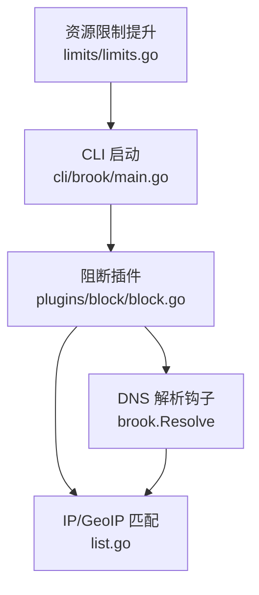
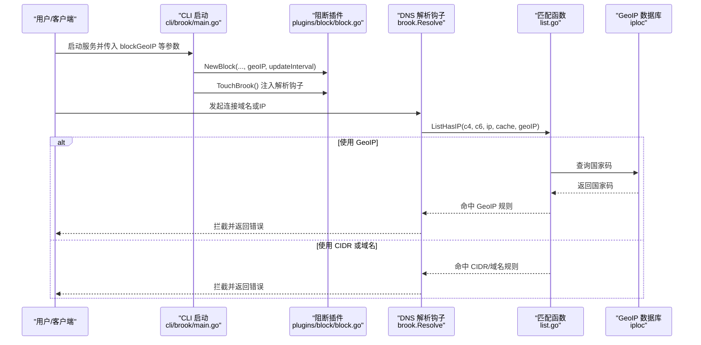
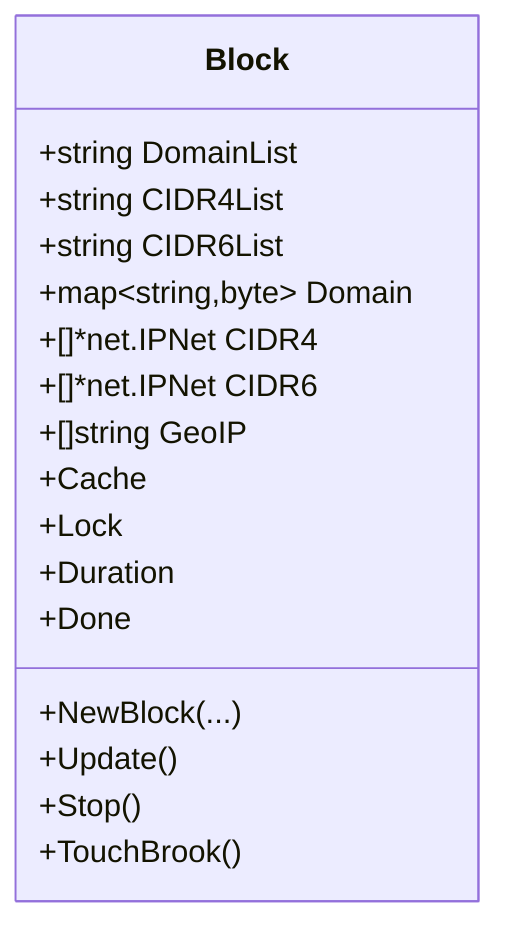
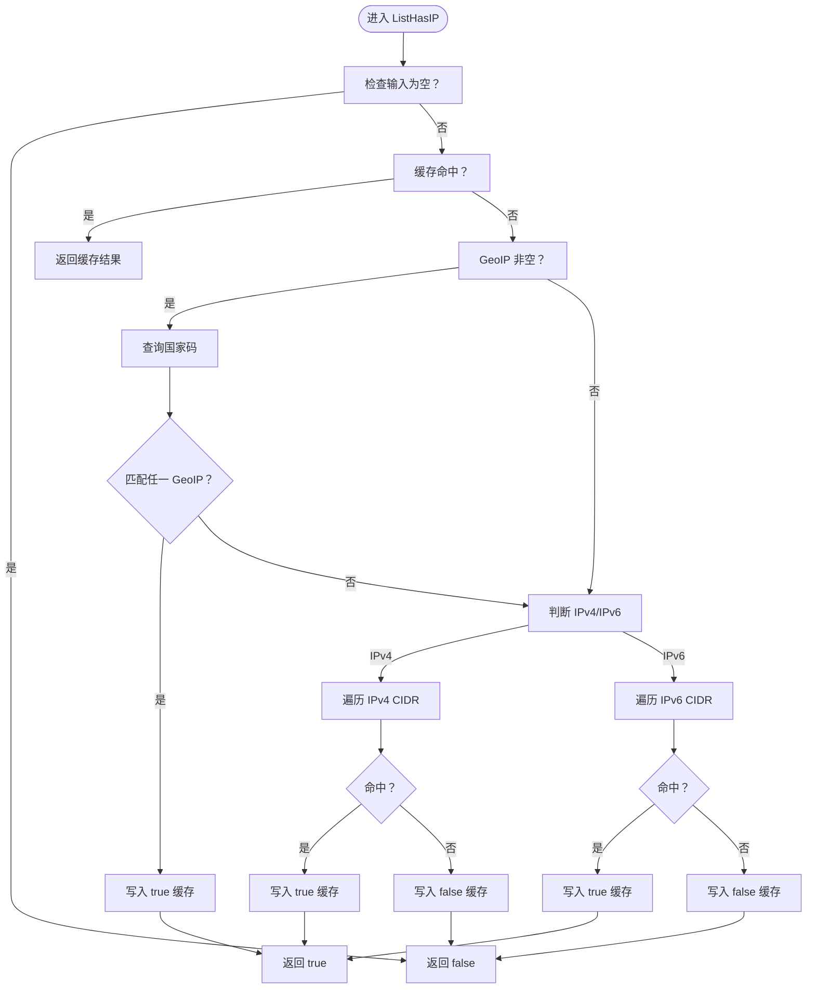
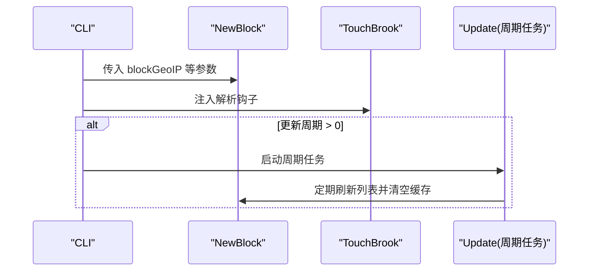
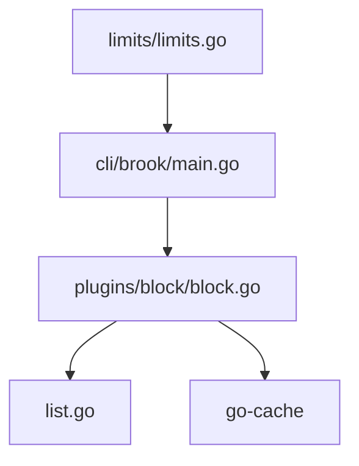

# 地理位置阻断

<cite>
**本文引用的文件**
- [plugins/block/block.go](file://plugins/block/block.go)
- [list.go](file://list.go)
- [cli/brook/main.go](file://cli/brook/main.go)
- [limits/limits.go](file://limits/limits.go)
- [plugins/block/readme.md](file://plugins/block/readme.md)
- [OPENSOURCELICENSES](file://OPENSOURCELICENSES)
</cite>

## 目录
1. [简介](#简介)
2. [项目结构](#项目结构)
3. [核心组件](#核心组件)
4. [架构总览](#架构总览)
5. [详细组件分析](#详细组件分析)
6. [依赖关系分析](#依赖关系分析)
7. [性能考量](#性能考量)
8. [故障排查指南](#故障排查指南)
9. [结论](#结论)
10. [附录](#附录)

## 简介
本文件围绕“基于地理位置的网络阻断”能力展开，重点解析以下内容：
- block.go 中 GeoIP 字段的使用方式
- ListHasIP 函数在 GeoIP 查询中的集成逻辑
- 如何结合 MaxMind 等 GeoIP 数据库实现区域访问控制
- limits/limits.go 中资源限制对 GeoIP 查询性能的影响
- 配置示例：国家/地区级流量封锁策略
- 实际部署问题：数据库更新机制、查询延迟优化与准确性权衡

## 项目结构
与地理位置阻断直接相关的文件主要分布在以下模块：
- 插件层：plugins/block/block.go 提供阻断插件的初始化、更新与拦截逻辑
- 核心判定：list.go 的 ListHasIP 负责 IP 列表与 GeoIP 的匹配
- CLI 入口：cli/brook/main.go 将命令行参数映射到阻断插件
- 资源限制：limits/limits.go 在非 Windows 平台提升文件描述符上限
- 第三方依赖：OPENSOURCELICENSES 显示 iploc（GeoIP 库）的来源

图表来源
- [cli/brook/main.go](file://cli/brook/main.go#L275-L293)
- [plugins/block/block.go](file://plugins/block/block.go#L43-L82)
- [list.go](file://list.go#L63-L118)
- [limits/limits.go](file://limits/limits.go#L24-L41)

章节来源
- [plugins/block/readme.md](file://plugins/block/readme.md#L1-L2)
- [cli/brook/main.go](file://cli/brook/main.go#L275-L293)

## 核心组件
- 阻断插件 Block：负责加载域名列表、IPv4/IPv6 CIDR 列表与 GeoIP 白名单/黑名单标识，注入 DNS 解析钩子以在连接前进行判定。
- ListHasIP：统一的 IP 匹配入口，支持缓存、IPv4/IPv6 CIDR 与 GeoIP 国家码匹配。
- CLI 参数映射：将 blockGeoIP 等参数传递给阻断插件并启动定时更新任务。
- 资源限制：在非 Windows 平台提升文件描述符上限，间接影响并发解析与查询性能。

章节来源
- [plugins/block/block.go](file://plugins/block/block.go#L29-L41)
- [plugins/block/block.go](file://plugins/block/block.go#L43-L82)
- [list.go](file://list.go#L63-L118)
- [cli/brook/main.go](file://cli/brook/main.go#L275-L293)
- [limits/limits.go](file://limits/limits.go#L24-L41)

## 架构总览
下图展示从 CLI 到阻断插件再到 IP/GeoIP 匹配的整体流程，以及 DNS 解析钩子的介入点。

图表来源
- [cli/brook/main.go](file://cli/brook/main.go#L275-L293)
- [plugins/block/block.go](file://plugins/block/block.go#L137-L182)
- [list.go](file://list.go#L63-L118)

## 详细组件分析

### 组件一：阻断插件 Block（GeoIP 字段与集成）
- GeoIP 字段：Block 结构体包含 GeoIP 字段，用于接收命令行传入的国家/地区标识集合（例如 ISO 3166-1 alpha-2 两位国家码）。
- 初始化与更新：
  - NewBlock：读取域名列表、IPv4/IPv6 CIDR 列表，保存 GeoIP 列表；若设置了更新周期，则启用互斥锁与停止通道。
  - Update：按周期刷新域名/CIDR 列表，并清空缓存。
- DNS 解析钩子 TouchBrook：
  - 替换全局解析函数，先尝试域名命中，再解析得到 IP；随后调用 ListHasIP 进行 GeoIP/CIDR 判定，命中则拦截。

图表来源
- [plugins/block/block.go](file://plugins/block/block.go#L29-L41)
- [plugins/block/block.go](file://plugins/block/block.go#L43-L82)
- [plugins/block/block.go](file://plugins/block/block.go#L84-L127)
- [plugins/block/block.go](file://plugins/block/block.go#L129-L182)

章节来源
- [plugins/block/block.go](file://plugins/block/block.go#L29-L41)
- [plugins/block/block.go](file://plugins/block/block.go#L43-L82)
- [plugins/block/block.go](file://plugins/block/block.go#L84-L127)
- [plugins/block/block.go](file://plugins/block/block.go#L129-L182)

### 组件二：ListHasIP（GeoIP 与 CIDR 的统一匹配）
- 输入：IPv4/IPv6 CIDR 列表、目标 IP、可选缓存、GeoIP 国家码集合。
- 逻辑要点：
  - 若 GeoIP 非空：调用 iploc.Country 查询国家码，若匹配任一 GeoIP 标识则命中。
  - IPv4：检查是否在任一 IPv4 CIDR 内；IPv6：检查是否在任一 IPv6 CIDR 内。
  - 命中结果写入缓存（带过期时间），未命中也写入缓存避免重复查询。
- 性能特性：缓存命中时 O(1)，未命中时 O(n)（n 为 CIDR 数量）；GeoIP 查询依赖外部数据库。

图表来源
- [list.go](file://list.go#L63-L118)

章节来源
- [list.go](file://list.go#L63-L118)

### 组件三：CLI 参数与阻断插件集成
- 命令行参数：
  - blockGeoIP：字符串切片，表示需要阻断的国家/地区标识集合。
  - blockDomainList/blockCIDR4List/blockCIDR6List：分别指定域名与 IPv4/IPv6 列表路径。
  - blockListUpdateInterval：列表更新周期（秒），0 表示不更新。
- 启动流程：
  - 校验路径合法性后创建阻断插件实例，调用 TouchBrook 注入解析钩子。
  - 若设置了更新周期，启动后台任务周期性刷新列表并清空缓存。

图表来源
- [cli/brook/main.go](file://cli/brook/main.go#L275-L293)
- [plugins/block/block.go](file://plugins/block/block.go#L43-L82)
- [plugins/block/block.go](file://plugins/block/block.go#L84-L127)

章节来源
- [cli/brook/main.go](file://cli/brook/main.go#L275-L293)

### 组件四：GeoIP 数据库与 MaxMind 关系
- 依据仓库依赖清单，GeoIP 查询由 iploc 提供，其为独立库，用于根据 IP 查询国家码。
- MaxMind 是常见的 GeoIP 数据库供应商之一，但本仓库通过 iploc 抽象对外提供 Country 查询接口，具体数据源与格式由 iploc 内部管理。
- 因此，若需使用 MaxMind 数据库，应确保 iploc 所依赖的数据文件已正确安装与加载（本仓库未直接包含 MaxMind 文件，需另行配置）。

章节来源
- [OPENSOURCELICENSES](file://OPENSOURCELICENSES#L885-L910)
- [list.go](file://list.go#L63-L118)

## 依赖关系分析
- 插件 Block 依赖：
  - brook.Resolve：替换全局解析函数以注入拦截逻辑
  - list.go 的 ListHasIP：统一的匹配入口
  - go-cache：本地缓存
- CLI 依赖：
  - 通过命令行参数驱动 Block 的初始化与更新
- 资源限制：
  - limits/limits.go 在非 Windows 平台提升文件描述符上限，有助于高并发场景下的解析与查询稳定性

图表来源
- [plugins/block/block.go](file://plugins/block/block.go#L137-L182)
- [list.go](file://list.go#L63-L118)
- [cli/brook/main.go](file://cli/brook/main.go#L275-L293)
- [limits/limits.go](file://limits/limits.go#L24-L41)

章节来源
- [plugins/block/block.go](file://plugins/block/block.go#L137-L182)
- [list.go](file://list.go#L63-L118)
- [cli/brook/main.go](file://cli/brook/main.go#L275-L293)
- [limits/limits.go](file://limits/limits.go#L24-L41)

## 性能考量
- 缓存策略：
  - ListHasIP 对命中与未命中的结果均写入缓存，减少重复查询与数据库访问开销。
  - 建议合理设置缓存过期时间，平衡实时性与性能。
- 列表更新：
  - 通过 Update 周期性刷新域名/CIDR 列表并清空缓存，避免旧数据导致误判。
- 资源限制：
  - limits/limits.go 在非 Windows 平台提升文件描述符上限，有助于高并发解析与查询，降低因资源不足导致的失败率。
- GeoIP 查询延迟：
  - GeoIP 查询依赖外部数据库，建议：
    - 使用本地化数据文件（如 iploc 所依赖的数据库）
    - 合理的缓存策略与过期时间
    - 控制并发与批量查询，避免瞬时高峰

章节来源
- [list.go](file://list.go#L63-L118)
- [plugins/block/block.go](file://plugins/block/block.go#L84-L127)
- [limits/limits.go](file://limits/limits.go#L24-L41)

## 故障排查指南
- 命令行参数校验失败：
  - 当 blockDomainList/blockCIDR4List/blockCIDR6List 非绝对路径时会报错，请确认传入绝对路径。
- GeoIP 列表未生效：
  - 确认 blockGeoIP 参数传入了正确的国家/地区标识集合（如 ISO 3166-1 alpha-2 两位码）。
  - 检查 Update 周期是否设置为 0（不更新）。
- 解析失败或阻断异常：
  - 检查 DNS 解析钩子是否成功注入（TouchBrook）。
  - 查看缓存是否命中，必要时等待缓存过期或手动触发刷新。
- 资源不足导致性能下降：
  - 在非 Windows 平台确认 limits 已生效，适当提高文件描述符上限。

章节来源
- [cli/brook/main.go](file://cli/brook/main.go#L266-L274)
- [cli/brook/main.go](file://cli/brook/main.go#L360-L368)
- [plugins/block/block.go](file://plugins/block/block.go#L129-L182)
- [limits/limits.go](file://limits/limits.go#L24-L41)

## 结论
- GeoIP 字段在阻断插件中作为国家/地区级策略的关键输入，与 CIDR 列表共同构成多维度的访问控制。
- ListHasIP 将 GeoIP 查询与 CIDR 匹配统一抽象，配合缓存显著提升性能。
- CLI 层提供灵活的参数配置与周期更新机制，便于在生产环境中动态调整策略。
- 资源限制与缓存策略是保障高并发与低延迟的关键因素。

## 附录

### 配置示例（国家/地区级流量封锁策略）
- 命令行示例（服务器端）：
  - 启动时传入 blockGeoIP，指定需要阻断的国家/地区标识集合
  - 可同时传入 blockDomainList/blockCIDR4List/blockCIDR6List 以叠加域名与 CIDR 级别的阻断
  - 设置 blockListUpdateInterval 以定期刷新列表
- 注意事项：
  - 确保 blockDomainList/blockCIDR4List/blockCIDR6List 为绝对路径
  - GeoIP 标识应与 iploc 支持的国家码一致（通常为 ISO 3166-1 alpha-2 两位码）

章节来源
- [cli/brook/main.go](file://cli/brook/main.go#L275-L293)
- [plugins/block/block.go](file://plugins/block/block.go#L43-L82)

### 数据库更新机制
- 列表更新：
  - 通过 Update 周期性读取域名/CIDR 列表，刷新内存状态并清空缓存
- GeoIP 数据库：
  - 由 iploc 提供国家码查询；MaxMind 等第三方数据库可通过 iploc 的数据文件形式接入
  - 建议定期更新 iploc 所依赖的数据文件以保持准确性

章节来源
- [plugins/block/block.go](file://plugins/block/block.go#L84-L127)
- [OPENSOURCELICENSES](file://OPENSOURCELICENSES#L885-L910)

### 查询延迟优化与准确性权衡
- 延迟优化：
  - 使用缓存减少重复查询
  - 合理设置更新周期，避免频繁 IO
  - 在高并发场景下提升文件描述符上限
- 准确性权衡：
  - GeoIP 数据库的准确性取决于底层数据质量与更新频率
  - 建议结合 CIDR 与域名列表进行交叉验证，降低误判风险

章节来源
- [list.go](file://list.go#L63-L118)
- [limits/limits.go](file://limits/limits.go#L24-L41)