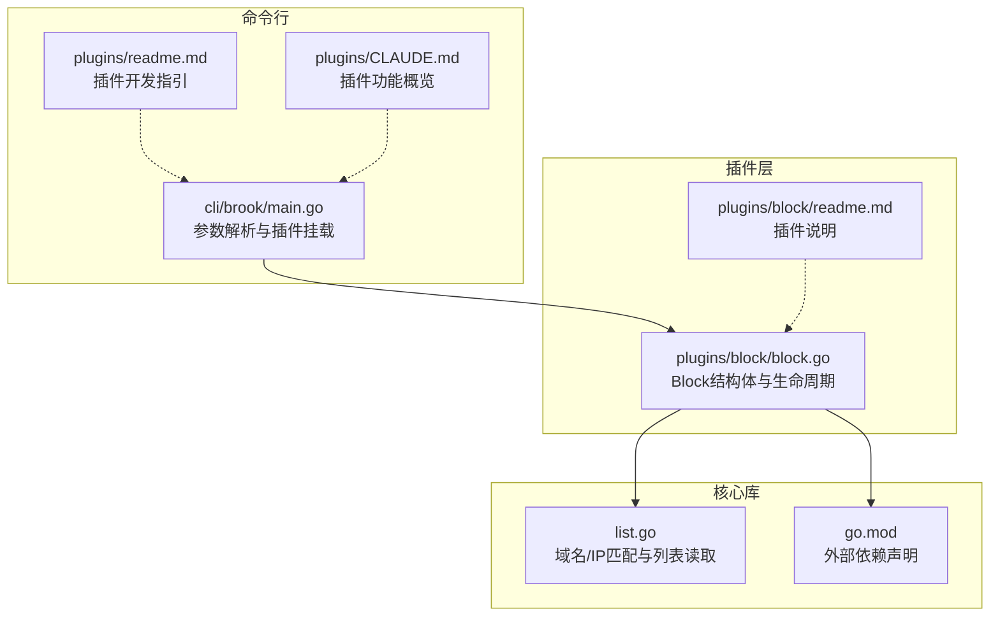
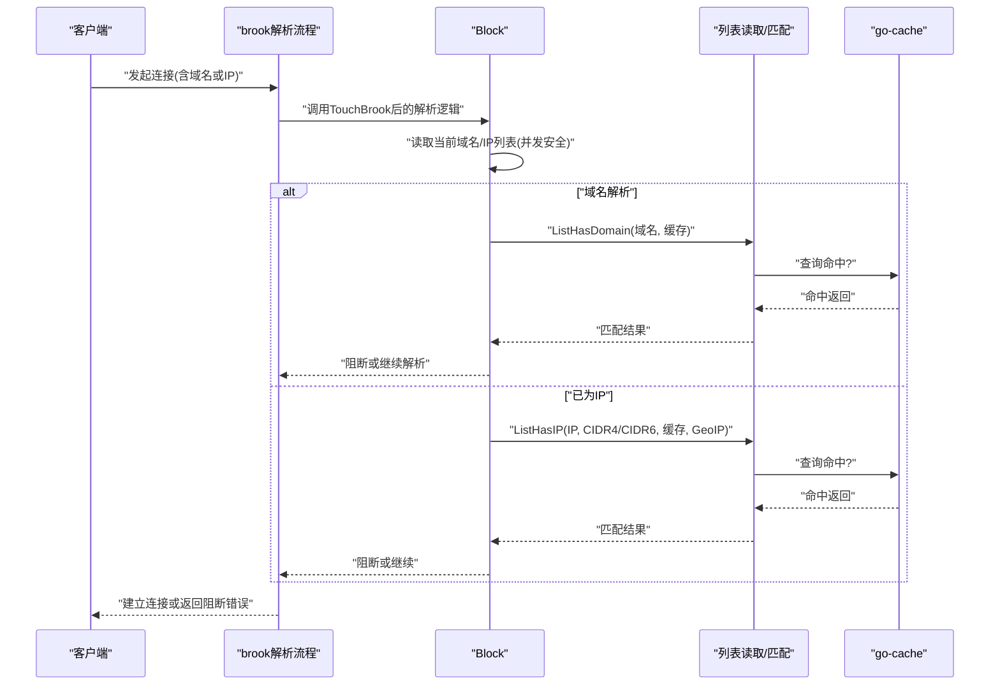
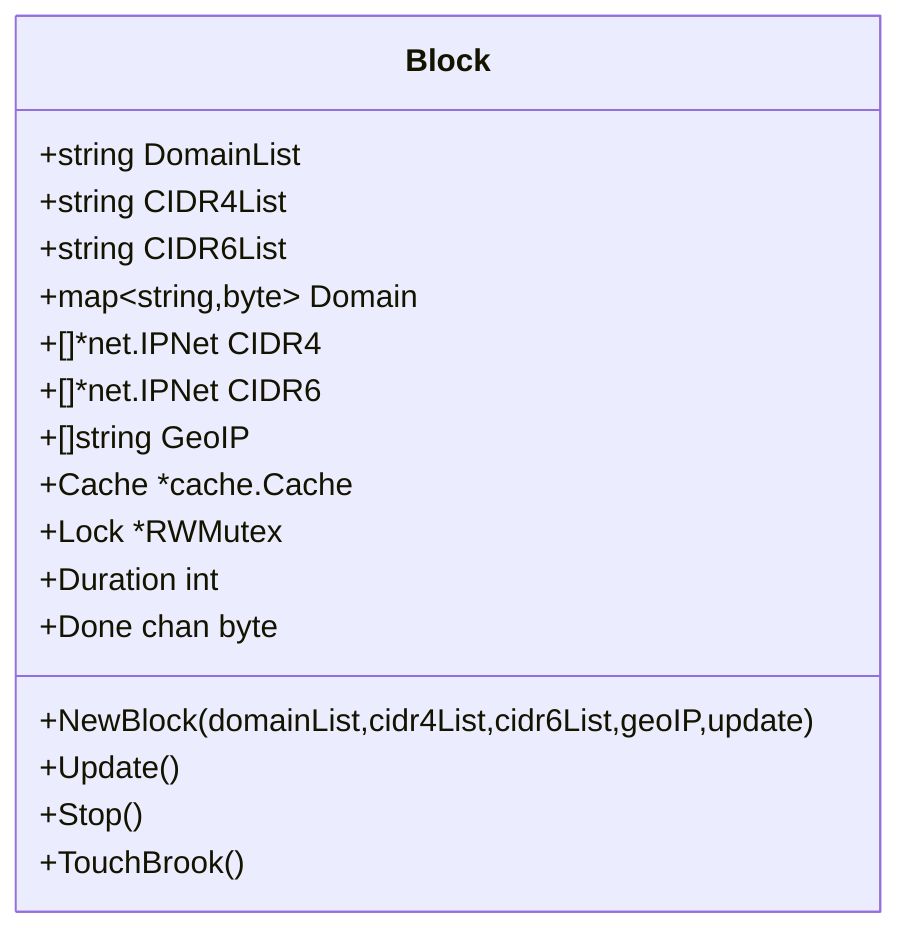
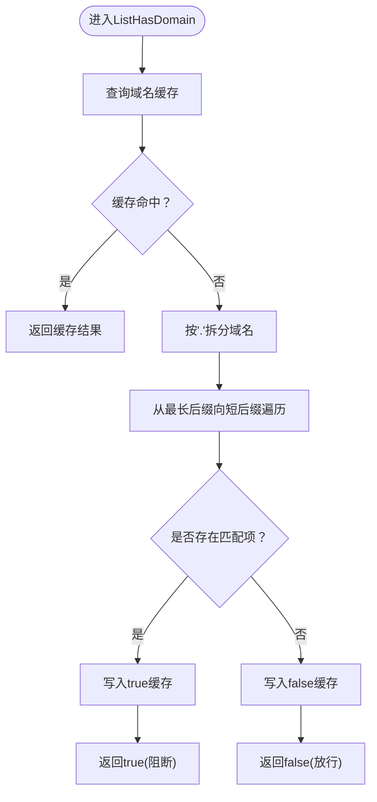
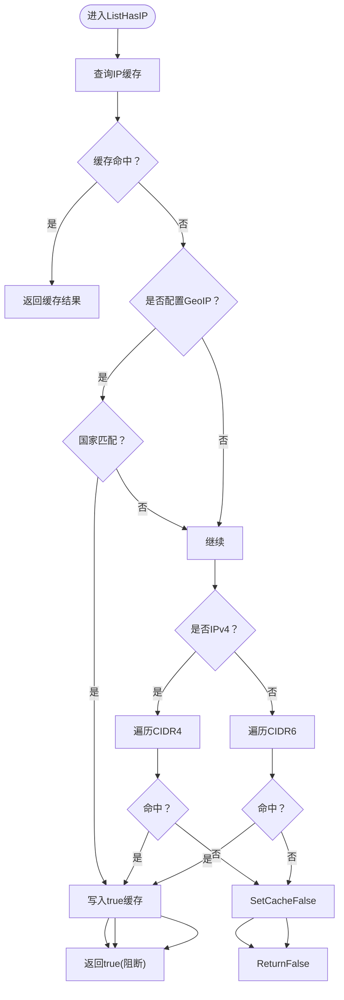
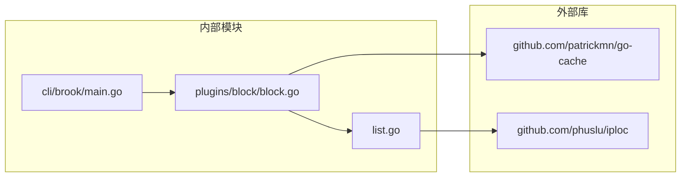

# 域名与IP阻断

<cite>
**本文引用的文件**
- [plugins/block/block.go](file://plugins/block/block.go)
- [list.go](file://list.go)
- [cli/brook/main.go](file://cli/brook/main.go)
- [plugins/block/readme.md](file://plugins/block/readme.md)
- [plugins/readme.md](file://plugins/readme.md)
- [plugins/CLAUDE.md](file://plugins/CLAUDE.md)
- [go.mod](file://go.mod)
</cite>

## 目录
1. [简介](#简介)
2. [项目结构](#项目结构)
3. [核心组件](#核心组件)
4. [架构总览](#架构总览)
5. [详细组件分析](#详细组件分析)
6. [依赖关系分析](#依赖关系分析)
7. [性能考量](#性能考量)
8. [故障排查指南](#故障排查指南)
9. [结论](#结论)
10. [附录](#附录)

## 简介
本文件聚焦于brook插件体系中的“block”插件，系统性阐述其域名阻断（blockDomainList）与IP地址段阻断（blockCIDR4List、blockCIDR6List）能力。围绕Block结构体、NewBlock与TouchBrook方法，解释如何通过读取域名列表与CIDR格式的IP列表实现流量拦截；详解ListHasDomain与ListHasIP的匹配逻辑；并说明go-cache在性能优化中的作用。文末提供配置示例、列表文件格式规范、加载性能影响评估与大规模列表优化建议。

## 项目结构
block插件位于plugins/block目录，核心实现集中在block.go中；域名/IP匹配逻辑与列表读取在list.go中；命令行入口在cli/brook/main.go中完成参数解析与插件初始化；插件使用说明见plugins/block/readme.md与plugins/CLAUDE.md。

图表来源
- [plugins/block/block.go](file://plugins/block/block.go#L1-L183)
- [list.go](file://list.go#L1-L200)
- [cli/brook/main.go](file://cli/brook/main.go#L258-L387)
- [plugins/block/readme.md](file://plugins/block/readme.md#L1-L2)
- [plugins/readme.md](file://plugins/readme.md#L1-L2)
- [plugins/CLAUDE.md](file://plugins/CLAUDE.md#L43-L108)
- [go.mod](file://go.mod#L1-L55)

章节来源
- [plugins/block/block.go](file://plugins/block/block.go#L1-L183)
- [list.go](file://list.go#L1-L200)
- [cli/brook/main.go](file://cli/brook/main.go#L258-L387)
- [plugins/block/readme.md](file://plugins/block/readme.md#L1-L2)
- [plugins/readme.md](file://plugins/readme.md#L1-L2)
- [plugins/CLAUDE.md](file://plugins/CLAUDE.md#L43-L108)
- [go.mod](file://go.mod#L1-L55)

## 核心组件
- Block结构体：承载域名与IP列表、缓存、锁与更新周期等状态。
- NewBlock：初始化Block，加载域名与CIDR列表，可选开启定时更新。
- TouchBrook：重写brook解析流程，对域名与IP进行实时阻断判断。
- Update/Stop：在启用定时更新时，周期性刷新列表并清理缓存。
- 列表读取与匹配：ReadDomainList/ReadCIDRList/ReadList用于加载列表；ListHasDomain/ListHasIP用于匹配。

章节来源
- [plugins/block/block.go](file://plugins/block/block.go#L29-L82)
- [plugins/block/block.go](file://plugins/block/block.go#L84-L135)
- [plugins/block/block.go](file://plugins/block/block.go#L137-L183)
- [list.go](file://list.go#L120-L147)
- [list.go](file://list.go#L149-L200)

## 架构总览
block插件通过重写brook的解析函数，将目标地址的域名解析与IP归属判断纳入统一的阻断检查流程。域名阻断采用逐级后缀匹配，IP阻断采用CIDR包含判断与可选的地理国家匹配，均辅以go-cache进行命中缓存，降低重复计算成本。

图表来源
- [plugins/block/block.go](file://plugins/block/block.go#L137-L183)
- [list.go](file://list.go#L32-L118)

## 详细组件分析

### Block结构体与生命周期
- 字段含义
  - DomainList/CIDR4List/CIDR6List：列表来源（本地绝对路径或HTTP/HTTPS URL）
  - Domain/CIDR4/CIDR6：加载后的内存结构（域名集合、IPv4 CIDR切片、IPv6 CIDR切片）
  - GeoIP：可选的地理国家代码列表
  - Cache：go-cache实例，用于域名/IP命中缓存
  - Lock/Done：并发安全与更新协程控制
  - Duration：更新周期（秒），0表示不自动更新
- 初始化
  - NewBlock根据传入的列表路径加载数据，若指定更新周期则创建互斥锁与停止通道
- 更新
  - Update按周期拉取最新列表，替换内存数据并清空缓存
  - Stop用于优雅退出更新循环

图表来源
- [plugins/block/block.go](file://plugins/block/block.go#L29-L82)
- [plugins/block/block.go](file://plugins/block/block.go#L84-L135)
- [plugins/block/block.go](file://plugins/block/block.go#L137-L183)

章节来源
- [plugins/block/block.go](file://plugins/block/block.go#L29-L82)
- [plugins/block/block.go](file://plugins/block/block.go#L84-L135)
- [plugins/block/block.go](file://plugins/block/block.go#L137-L183)

### 命令行接入与插件挂载
- 参数校验与约束
  - 当启用block相关参数时，要求列表路径为绝对路径或HTTP/HTTPS URL
- 插件初始化
  - 调用NewBlock创建Block实例，随后调用TouchBrook注入到brook解析流程
  - 若设置了更新周期，则启动Update协程并在停止时调用Stop
- 位置参考
  - server子命令与quicserver子命令均支持blockDomainList、blockCIDR4List、blockCIDR6List、blockGeoIP与更新间隔参数

章节来源
- [cli/brook/main.go](file://cli/brook/main.go#L258-L387)
- [cli/brook/main.go](file://cli/brook/main.go#L599-L1155)

### 域名阻断：ListHasDomain匹配逻辑
- 匹配策略
  - 将输入域名按点分隔，从最长后缀开始逐级匹配，命中即阻断
  - 命中后将该域名写入缓存，未命中也写入缓存标记，缓存有效期通常为24小时
- 复杂度
  - 对于长度为n的域名，最多进行n次后缀匹配，整体复杂度O(n)
- 缓存作用
  - 避免重复解析与多次匹配，显著降低CPU开销

图表来源
- [list.go](file://list.go#L32-L61)

章节来源
- [list.go](file://list.go#L32-L61)

### IP阻断：ListHasIP匹配逻辑
- 匹配策略
  - 若提供GeoIP列表，先按IP定位国家，命中任一国家即阻断
  - 若为IPv4，遍历CIDR4列表，命中任一网段即阻断
  - 若为IPv6，遍历CIDR6列表，命中任一网段即阻断
  - 未命中时同样写入缓存标记，缓存有效期通常为24小时
- 复杂度
  - GeoIP匹配为常数时间；IPv4/IPv6分别遍历对应CIDR切片，最坏O(|CIDR4|)或O(|CIDR6|)

图表来源
- [list.go](file://list.go#L63-L118)

章节来源
- [list.go](file://list.go#L63-L118)

### 列表加载与格式规范
- 列表来源
  - 支持本地绝对路径与HTTP/HTTPS URL
  - 通过ReadList统一读取：HTTP/HTTPS使用超时与DNS解析策略，本地文件直接读取
- 域名列表
  - 每行一个域名，空白字符与回车会被规范化处理
- CIDR列表
  - 每行一个IPv4或IPv6网段（标准CIDR格式）
  - 解析失败的条目会被忽略并记录日志
- 读取函数
  - ReadDomainList：将域名列表转为字典集合
  - ReadCIDRList：将CIDR列表转为net.IPNet切片
  - ReadList：通用读取器，支持网络与本地

章节来源
- [list.go](file://list.go#L120-L147)
- [list.go](file://list.go#L149-L200)
- [cli/brook/main.go](file://cli/brook/main.go#L258-L387)

### TouchBrook拦截流程
- 触发时机
  - 在brook解析阶段拦截，既可用于域名解析后的IP判断，也可直接对IP进行判断
- 关键步骤
  - 读取当前域名/IP列表（带读锁保护）
  - 若目标为域名：优先走ListHasDomain；若解析成功再取IP
  - 若目标为IP：直接走ListHasIP
  - 命中阻断则返回错误，否则放行
- 与解析器的关系
  - 通过替换brook.Resolve实现，确保所有出站解析均受控

章节来源
- [plugins/block/block.go](file://plugins/block/block.go#L137-L183)

### go-cache在性能优化中的作用
- 域名缓存
  - 对ListHasDomain的结果进行缓存，命中后直接返回，避免重复匹配
- IP缓存
  - 对ListHasIP的结果进行缓存，命中后直接返回，避免重复CIDR遍历
- 缓存策略
  - 命中与未命中的结果均写入缓存，有效期通常为24小时
  - 定时更新时会Flush缓存，确保后续命中准确反映最新列表

章节来源
- [list.go](file://list.go#L32-L61)
- [list.go](file://list.go#L63-L118)
- [plugins/block/block.go](file://plugins/block/block.go#L117-L124)

## 依赖关系分析
- 外部依赖
  - go-cache：本地内存缓存
  - phuslu/iploc：IP国家定位（用于GeoIP匹配）
- 内部依赖
  - block.go依赖list.go中的匹配与读取函数
  - CLI入口依赖block.NewBlock与block.TouchBrook

图表来源
- [go.mod](file://go.mod#L1-L55)
- [plugins/block/block.go](file://plugins/block/block.go#L1-L28)
- [list.go](file://list.go#L1-L31)
- [cli/brook/main.go](file://cli/brook/main.go#L258-L387)

章节来源
- [go.mod](file://go.mod#L1-L55)
- [plugins/block/block.go](file://plugins/block/block.go#L1-L28)
- [list.go](file://list.go#L1-L31)
- [cli/brook/main.go](file://cli/brook/main.go#L258-L387)

## 性能考量
- 域名匹配
  - O(n)后缀匹配，n为域名层级数；缓存命中后为O(1)
- IP匹配
  - GeoIP定位为常数时间；IPv4/IPv6分别遍历对应CIDR切片，最坏O(|CIDR4|)或O(|CIDR6|)
- 缓存收益
  - 命中缓存显著降低CPU与IO压力，尤其在高并发场景
- 列表规模
  - 域名集合与CIDR切片越大，匹配成本越高；建议按需裁剪与合并
- 更新策略
  - 合理设置更新周期，避免频繁I/O与重建数据结构
  - 使用并发安全的更新流程，避免阻塞解析路径

[本节为通用性能讨论，无需列出具体文件来源]

## 故障排查指南
- 列表路径错误
  - 当blockDomainList/blockCIDR4List/blockCIDR6List非绝对路径且非HTTP/HTTPS时，CLI会报错
- 列表加载失败
  - HTTP/HTTPS列表下载超时或无法解析域名时，ReadList会返回错误
  - CIDR解析失败的条目会被忽略并记录日志
- 阻断误判
  - 检查域名列表是否包含目标域名的完整后缀
  - 检查CIDR范围是否覆盖目标IP
  - 清理缓存后重试（更新会Flush缓存）
- 并发与更新
  - 若启用更新，确认更新协程正常运行且未被提前停止

章节来源
- [cli/brook/main.go](file://cli/brook/main.go#L258-L387)
- [list.go](file://list.go#L149-L200)
- [plugins/block/block.go](file://plugins/block/block.go#L84-L135)

## 结论
block插件通过简洁而高效的域名与IP阻断机制，结合go-cache缓存与可选的GeoIP匹配，在不侵入业务逻辑的前提下提供了强大的访问控制能力。合理配置列表来源与更新周期，可在保证拦截效果的同时兼顾性能与稳定性。

[本节为总结性内容，无需列出具体文件来源]

## 附录

### 实际配置示例
- 广告域名屏蔽
  - 使用blockDomainList指向包含广告域名的文本文件（每行一个域名）
  - 启动时通过CLI参数传入绝对路径或HTTP/HTTPS URL
- 恶意IP段拦截
  - 使用blockCIDR4List与blockCIDR6List分别指向IPv4与IPv6 CIDR列表
  - 列表每行一个CIDR网段
- 地理位置阻断（可选）
  - 使用blockGeoIP传入国家代码列表，命中任一国家即阻断

章节来源
- [plugins/block/readme.md](file://plugins/block/readme.md#L1-L2)
- [plugins/CLAUDE.md](file://plugins/CLAUDE.md#L43-L108)
- [cli/brook/main.go](file://cli/brook/main.go#L258-L387)

### 列表文件格式规范
- 域名列表
  - 每行一个域名，支持大小写混排，内部统一转换为小写
  - 空白字符与回车会被规范化处理
- CIDR列表
  - 每行一个IPv4或IPv6网段（标准CIDR格式）
  - 解析失败的条目会被忽略并记录日志
- 数据来源
  - 支持本地绝对路径与HTTP/HTTPS URL

章节来源
- [list.go](file://list.go#L120-L147)
- [list.go](file://list.go#L149-L200)
- [cli/brook/main.go](file://cli/brook/main.go#L258-L387)

### 加载性能影响与优化建议
- 加载性能
  - 本地文件读取延迟低；HTTP/HTTPS列表受网络与DNS解析影响
  - 列表越大，加载与解析耗时越长
- 匹配性能
  - 域名匹配O(n)，IP匹配O(|CIDR|)；缓存命中可显著降低开销
- 优化建议
  - 合并冗余规则，减少域名与CIDR数量
  - 使用合理的更新周期，避免频繁I/O
  - 对热点域名/IP保持缓存有效性，必要时缩短缓存时间以平衡准确性
  - 在高并发场景下，优先使用本地绝对路径，减少网络依赖

[本节为通用优化建议，无需列出具体文件来源]