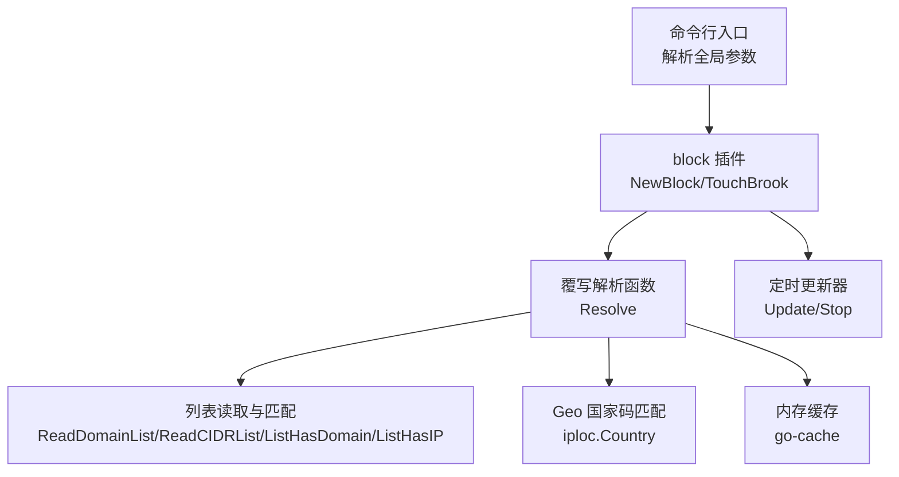
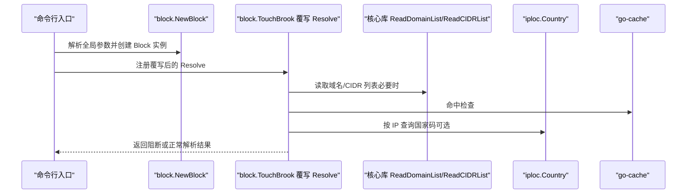
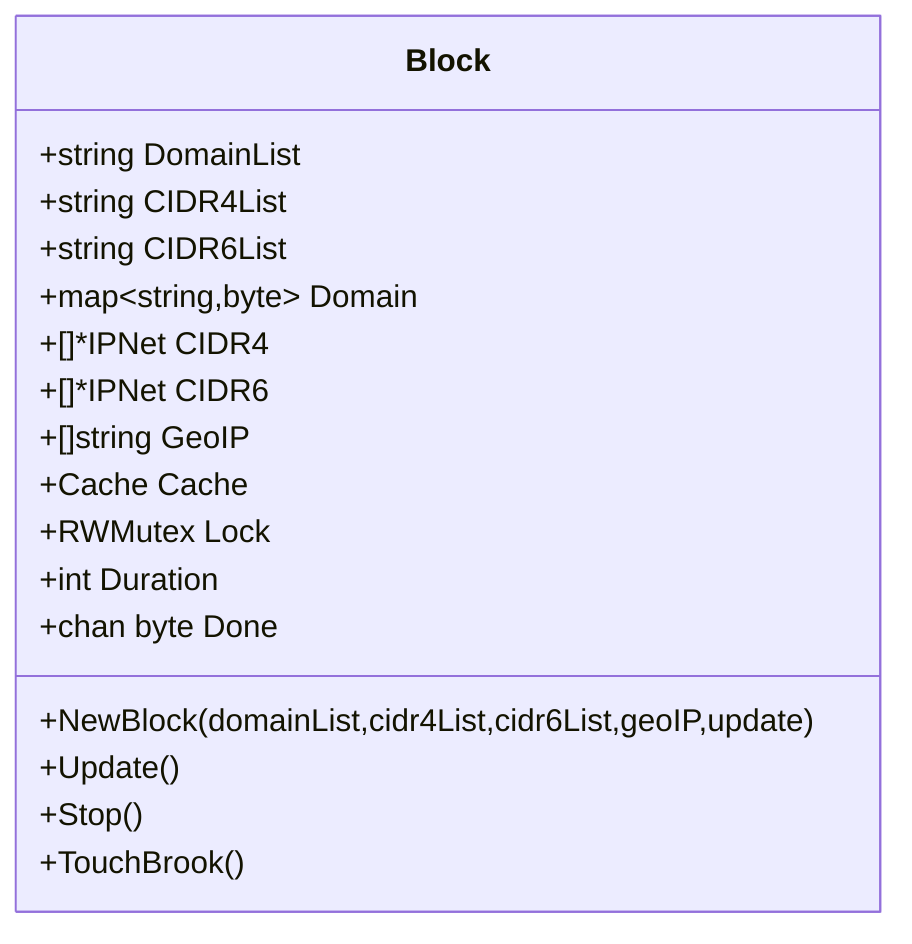
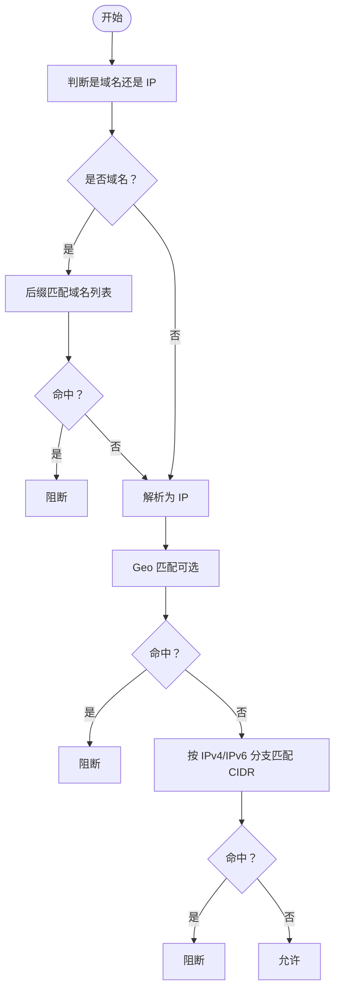
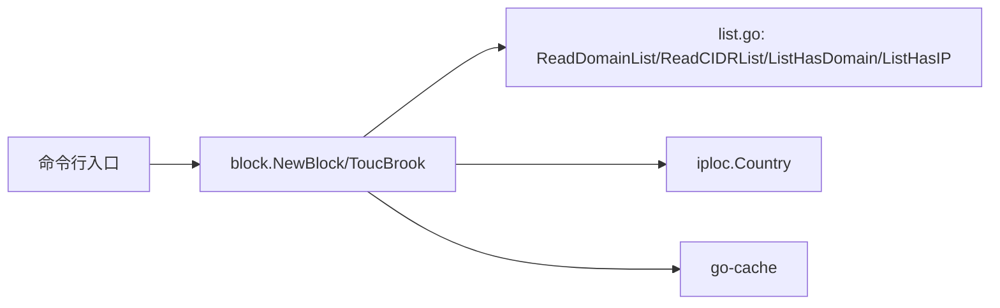

# 安全与阻断

<cite>
**本文引用的文件**
- [cli/brook/main.go](file://cli/brook/main.go)
- [plugins/block/block.go](file://plugins/block/block.go)
- [list.go](file://list.go)
- [init.go](file://init.go)
- [streamclient.go](file://streamclient.go)
- [protocol/brook-server-protocol.md](file://protocol/brook-server-protocol.md)
- [plugins/block/readme.md](file://plugins/block/readme.md)
- [plugins/readme.md](file://plugins/readme.md)
</cite>

## 目录
1. [简介](#简介)
2. [项目结构](#项目结构)
3. [核心组件](#核心组件)
4. [架构总览](#架构总览)
5. [详细组件分析](#详细组件分析)
6. [依赖关系分析](#依赖关系分析)
7. [性能考量](#性能考量)
8. [故障排查指南](#故障排查指南)
9. [结论](#结论)
10. [附录](#附录)

## 简介
本文件聚焦于 Brook 的“安全与阻断”能力，围绕以下全局参数展开：blockDomainList、blockCIDR4List、blockCIDR6List、blockGeoIP、blockListUpdateInterval，并补充说明 clientHKDFInfo 与 serverHKDFInfo 在加密握手中的作用。文档解释这些参数如何协同工作以实现域名阻断、IPv4/IPv6 地址段阻断与基于地理位置的阻断；说明它们与 block 插件的交互方式及列表更新机制；并给出典型使用场景（广告拦截、地理围栏、安全策略）与性能影响评估、配置优化建议。

## 项目结构
- 入口与参数定义位于命令行入口，负责解析全局参数并在满足条件时创建 block 插件实例。
- block 插件通过覆写全局解析函数实现阻断逻辑，内部维护域名、CIDR 列表与缓存，并支持定时刷新。
- 列表读取与匹配算法由核心库提供，支持从本地文件或远程 URL 加载，按域名后缀匹配与 IP/CIDR/Geo 匹配。
- 加密握手信息（HKDF Info）在初始化阶段注入，贯穿客户端与服务端握手流程，确保密钥派生的一致性。

图表来源
- [cli/brook/main.go](file://cli/brook/main.go#L140-L158)
- [plugins/block/block.go](file://plugins/block/block.go#L43-L82)
- [plugins/block/block.go](file://plugins/block/block.go#L137-L183)
- [list.go](file://list.go#L32-L118)
- [list.go](file://list.go#L120-L200)

章节来源
- [cli/brook/main.go](file://cli/brook/main.go#L140-L158)
- [plugins/block/readme.md](file://plugins/block/readme.md#L1-L2)
- [plugins/readme.md](file://plugins/readme.md#L1-L2)

## 核心组件
- 全局阻断参数
  - blockDomainList：域名列表，逐行一个域名，支持本地绝对路径或 http/https URL。用于后缀匹配阻断。
  - blockCIDR4List：IPv4 CIDR 列表，逐行一个前缀，支持本地绝对路径或 http/https URL。
  - blockCIDR6List：IPv6 CIDR 列表，逐行一个前缀，支持本地绝对路径或 http/https URL。
  - blockGeoIP：国家/地区代码列表，如 US，按 IP 查询 Geo 后阻断。
  - blockListUpdateInterval：列表更新间隔（秒），0 表示仅启动时加载一次，非 0 表示启用后台定时更新。
- 加密握手参数
  - clientHKDFInfo：客户端 HKDF Info，影响密钥派生输入，需与服务端一致。
  - serverHKDFInfo：服务端 HKDF Info，影响密钥派生输入，需与客户端一致。

章节来源
- [cli/brook/main.go](file://cli/brook/main.go#L130-L158)
- [init.go](file://init.go#L15-L21)
- [protocol/brook-server-protocol.md](file://protocol/brook-server-protocol.md#L24-L31)

## 架构总览
block 插件通过覆写全局解析函数，在每次解析目标地址时执行阻断判定：先对域名进行后缀匹配，再解析为 IP 并对 IP/CIDR/Geo 进行匹配，命中则直接返回阻断错误；否则走正常解析路径。若设置了更新间隔，则启动后台任务周期性拉取新列表并刷新缓存。

图表来源
- [cli/brook/main.go](file://cli/brook/main.go#L266-L293)
- [plugins/block/block.go](file://plugins/block/block.go#L43-L82)
- [plugins/block/block.go](file://plugins/block/block.go#L137-L183)
- [list.go](file://list.go#L120-L200)

## 详细组件分析

### 参数与命令行集成
- 全局参数注册与校验
  - 在命令行入口处注册 blockDomainList、blockCIDR4List、blockCIDR6List、blockGeoIP、blockListUpdateInterval 等参数，并对本地路径进行合法性校验。
  - 当任一阻断参数存在时，调用 block.NewBlock 创建插件实例，并根据 blockListUpdateInterval 决定是否启动后台更新任务。
- 子命令兼容
  - 多个子命令仍保留同名参数（带“此选项将在未来版本移除”的提示），但推荐统一使用全局参数。

章节来源
- [cli/brook/main.go](file://cli/brook/main.go#L140-L158)
- [cli/brook/main.go](file://cli/brook/main.go#L266-L293)
- [cli/brook/main.go](file://cli/brook/main.go#L328-L346)
- [cli/brook/main.go](file://cli/brook/main.go#L568-L586)
- [cli/brook/main.go](file://cli/brook/main.go#L828-L838)
- [cli/brook/main.go](file://cli/brook/main.go#L1096-L1104)

### block 插件实现与交互
- 初始化与列表加载
  - NewBlock 会按需从本地文件或远程 URL 加载域名与 CIDR 列表，构建内存结构；若设置更新间隔非 0，则初始化互斥锁与停止通道，准备后台更新。
- 覆写解析函数
  - TouchBrook 将全局解析函数替换为自定义实现：对域名进行后缀匹配阻断；若为域名则解析为 IP 后再进行 CIDR/Geo 匹配；命中即阻断，否则走原解析路径。
- 定时更新
  - Update 使用定时器周期触发，重新加载列表并替换内存结构，同时清空缓存；Stop 用于优雅退出后台循环。

图表来源
- [plugins/block/block.go](file://plugins/block/block.go#L29-L41)
- [plugins/block/block.go](file://plugins/block/block.go#L43-L82)
- [plugins/block/block.go](file://plugins/block/block.go#L84-L135)
- [plugins/block/block.go](file://plugins/block/block.go#L137-L183)

章节来源
- [plugins/block/block.go](file://plugins/block/block.go#L43-L82)
- [plugins/block/block.go](file://plugins/block/block.go#L84-L135)
- [plugins/block/block.go](file://plugins/block/block.go#L137-L183)

### 列表读取与匹配算法
- 列表读取
  - 支持 http/https 远程下载与本地文件读取；远程下载通过自定义 DialContext 优先尝试 IPv6/IPv4 解析，失败则报错。
  - 读取后按换行分割并去除空白字符，得到每行一个条目。
- 域名匹配
  - ListHasDomain 对域名进行后缀匹配，命中即阻断；命中结果与未命中结果均缓存 24 小时。
- IP/CIDR/Geo 匹配
  - ListHasIP 先按 Geo 匹配，再按 IPv4/IPv6 分支匹配对应 CIDR；命中同样缓存 24 小时；未命中也缓存以降低后续查询成本。

图表来源
- [plugins/block/block.go](file://plugins/block/block.go#L137-L183)
- [list.go](file://list.go#L32-L118)
- [list.go](file://list.go#L120-L200)

章节来源
- [list.go](file://list.go#L32-L118)
- [list.go](file://list.go#L120-L200)

### 列表更新机制
- 触发时机
  - 当 blockListUpdateInterval 非 0 时，命令行入口创建后台 Runner，启动 block.Update 循环。
- 更新流程
  - Update 按固定间隔拉取新列表，替换内存中的域名/CIDR 结构，并清空缓存，保证后续匹配使用最新规则。
- 停止机制
  - Stop 关闭 Done 通道，Update 循环检测到后退出，避免资源泄漏。

章节来源
- [cli/brook/main.go](file://cli/brook/main.go#L281-L293)
- [plugins/block/block.go](file://plugins/block/block.go#L84-L135)

### 加密握手参数（HKDF Info）
- 作用
  - HKDF Info 参与密钥派生，确保客户端与服务端使用一致的 Info 输入，从而生成相同的会话密钥。
- 设置位置
  - 命令行入口在 Before 中将 clientHKDFInfo/serverHKDFInfo 写入全局变量；客户端/服务端握手阶段使用该值参与 HKDF 计算。
- 影响范围
  - 仅影响密钥派生，不改变阻断行为；但若两端 Info 不一致，会导致握手失败。

章节来源
- [cli/brook/main.go](file://cli/brook/main.go#L163-L167)
- [init.go](file://init.go#L15-L21)
- [streamclient.go](file://streamclient.go#L103-L143)
- [protocol/brook-server-protocol.md](file://protocol/brook-server-protocol.md#L24-L31)

## 依赖关系分析
- 组件耦合
  - 命令行入口与 block 插件通过 NewBlock/TouchBrook 强耦合；block 插件依赖核心库的列表读取与匹配函数。
- 外部依赖
  - Geo 匹配依赖 iploc 库；远程列表下载依赖 http 客户端与自定义 DialContext；缓存依赖 go-cache。
- 潜在风险
  - 列表更新期间并发访问需注意互斥；远程下载超时与解析失败需妥善处理；Geo 匹配依赖外部库可用性。

图表来源
- [cli/brook/main.go](file://cli/brook/main.go#L266-L293)
- [plugins/block/block.go](file://plugins/block/block.go#L43-L82)
- [list.go](file://list.go#L32-L118)

章节来源
- [cli/brook/main.go](file://cli/brook/main.go#L266-L293)
- [plugins/block/block.go](file://plugins/block/block.go#L43-L82)
- [list.go](file://list.go#L32-L118)

## 性能考量
- 缓存策略
  - 域名与 IP 的命中/未命中结果均缓存 24 小时，显著降低重复匹配开销。
- 匹配复杂度
  - 域名后缀匹配为线性扫描域名字典；CIDR 匹配为线性扫描列表，时间复杂度 O(N)。
- 远程列表下载
  - 默认超时较短，且采用 IPv6/IPv4 双栈回退策略，提升可用性；频繁更新可能带来网络与 CPU 开销。
- Geo 匹配
  - 每次命中/未命中均缓存，减少重复查询；Geo 库本身性能取决于实现。
- 建议
  - 控制列表规模与更新频率；合理设置 blockListUpdateInterval；对大列表考虑分片或预处理；监控远程下载失败率。

[本节为通用性能讨论，无需列出具体文件来源]

## 故障排查指南
- 常见问题
  - 列表路径非法：本地路径必须为绝对路径；远程 URL 必须以 http/https 开头。
  - 远程下载失败：检查网络连通性与 DNS 解析；确认自定义 DialContext 能成功解析域名。
  - Geo 匹配异常：确认 iploc 库可用；检查目标 IP 是否能正确识别国家码。
  - 握手失败：检查 clientHKDFInfo/serverHKDFInfo 是否一致。
- 排查步骤
  - 验证参数合法性与路径可达性。
  - 查看 block 插件日志输出（如列表读取错误）。
  - 临时禁用 Geo 或 CIDR 列表定位问题来源。
  - 检查更新任务是否正常运行与退出。

章节来源
- [cli/brook/main.go](file://cli/brook/main.go#L266-L274)
- [plugins/block/block.go](file://plugins/block/block.go#L84-L135)
- [list.go](file://list.go#L149-L200)

## 结论
- blockDomainList、blockCIDR4List、blockCIDR6List、blockGeoIP、blockListUpdateInterval 提供了灵活而强大的网络阻断能力，覆盖域名、IP/CIDR 与 Geo 三个维度。
- 通过覆写解析函数与缓存机制，block 插件在保证阻断效果的同时兼顾性能。
- clientHKDFInfo 与 serverHKDFInfo 保障了密钥派生一致性，是安全连接的基础。
- 建议结合业务需求合理配置列表规模与更新频率，并持续监控性能与稳定性。

[本节为总结性内容，无需列出具体文件来源]

## 附录

### 使用场景示例
- 广告拦截
  - 使用 blockDomainList 指向广告域名列表，按后缀匹配阻断；可配合 programmable 模块实现更细粒度的 DNS 层拦截。
- 地理围栏
  - 使用 blockGeoIP 指定目标国家/地区代码，阻止来自特定区域的连接；适合合规与安全策略。
- 安全策略实施
  - 使用 blockCIDR4List/blockCIDR6List 指定威胁 IP 段，阻断恶意来源；结合 blockListUpdateInterval 定期更新威胁情报。

[本节为概念性示例，无需列出具体文件来源]

### 配置优化建议
- 列表管理
  - 优先使用 http/https 远程列表，便于集中维护与自动更新；本地列表适合离线环境或私有规则。
  - 控制列表大小，避免过长导致匹配耗时增加；定期清理无效条目。
- 更新策略
  - 对高频变化的威胁列表设置较短更新间隔；对稳定规则设置较长间隔以节省资源。
- 性能优化
  - 合理利用缓存，避免频繁重复匹配；在高并发场景下评估内存占用与 CPU 占用。
- 安全加固
  - 保持 clientHKDFInfo/serverHKDFInfo 一致；避免随意更改默认值；在公网传输时配合其他安全措施。

[本节为通用建议，无需列出具体文件来源]