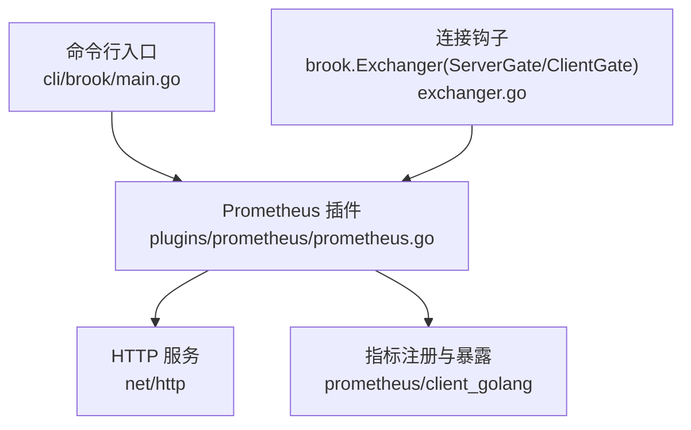
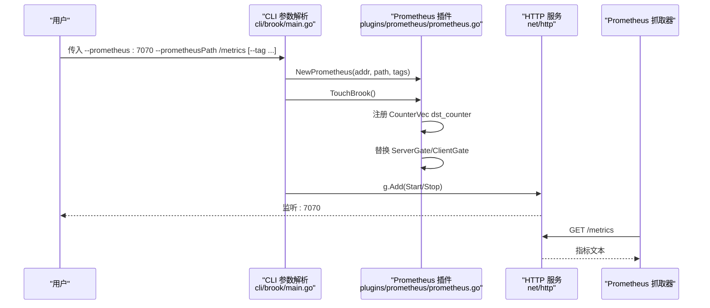
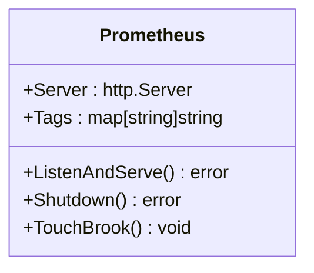
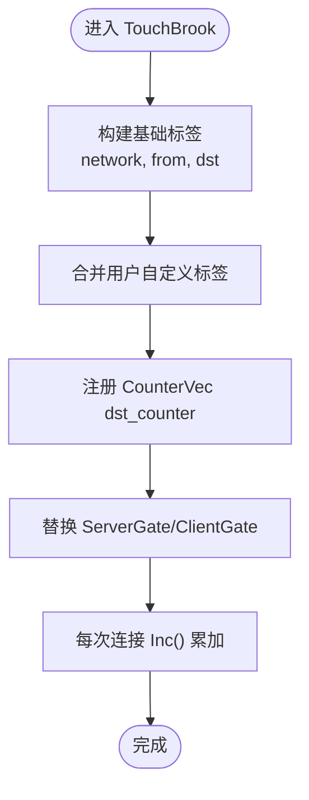
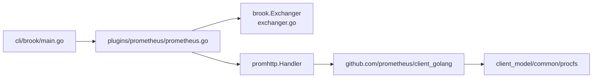

# Prometheus监控

<cite>
**本文引用的文件**
- [plugins/prometheus/prometheus.go](file://plugins/prometheus/prometheus.go)
- [plugins/prometheus/readme.md](file://plugins/prometheus/readme.md)
- [cli/brook/main.go](file://cli/brook/main.go)
- [plugins/CLAUDE.md](file://plugins/CLAUDE.md)
- [exchanger.go](file://exchanger.go)
- [go.sum](file://go.sum)
</cite>

## 目录
1. [简介](#简介)
2. [项目结构](#项目结构)
3. [核心组件](#核心组件)
4. [架构总览](#架构总览)
5. [详细组件分析](#详细组件分析)
6. [依赖关系分析](#依赖关系分析)
7. [性能考量](#性能考量)
8. [故障排查指南](#故障排查指南)
9. [结论](#结论)
10. [附录](#附录)

## 简介
本文件面向运维与平台工程人员，系统化说明如何在 Brook 中启用 Prometheus 监控。重点涵盖：
- 通过命令行参数 --prometheus 与 --prometheusPath 启用监控端点
- NewPrometheus 的实现机制：HTTP 服务启动、指标收集与暴露方式
- 标签（tag）附加机制：如何将自定义标签注入到指标中
- 实际使用示例：配置 Prometheus 抓取、在 Grafana 中创建监控面板、监控连接数、流量与错误率
- 安全建议：如何使用 nico 等工具保护监控端点
- 最佳实践：告警规则与运维建议

## 项目结构
Prometheus 监控能力由“插件”实现，核心位置如下：
- CLI 参数解析与插件启用：cli/brook/main.go
- Prometheus 插件实现：plugins/prometheus/prometheus.go
- 指标采集钩子：brook 包中的 ServerGate/ClientGate（exchanger.go）
- 文档与示例：plugins/CLAUDE.md、plugins/prometheus/readme.md
- 依赖版本：go.sum 中对 prometheus/client_golang 的声明

图表来源
- [cli/brook/main.go](file://cli/brook/main.go#L121-L128)
- [plugins/prometheus/prometheus.go](file://plugins/prometheus/prometheus.go#L32-L40)
- [exchanger.go](file://exchanger.go#L32-L39)

章节来源
- [cli/brook/main.go](file://cli/brook/main.go#L121-L128)
- [plugins/prometheus/prometheus.go](file://plugins/prometheus/prometheus.go#L32-L40)
- [exchanger.go](file://exchanger.go#L32-L39)

## 核心组件
- Prometheus 插件对象
  - 结构体包含 HTTP 服务器实例与标签映射
  - 提供 ListenAndServe/Shutdown 生命周期方法
  - 提供 TouchBrook 注册指标并替换全局钩子
- NewPrometheus
  - 构建 HTTP 路由，将 /metrics 暴露给 Prometheus
  - 以 promhttp.Handler 暴露标准指标端点
- 指标定义
  - CounterVec 类型，名为 dst_counter，帮助信息用于总量计数
  - 标签维度：network、from、dst，以及用户传入的自定义标签
- 钩子替换
  - 将 brook.ServerGate/ClientGate 替换为统计逻辑
  - 统计前会从源地址中剥离端口，仅保留主机部分
  - 将自定义标签合并到指标标签集中

章节来源
- [plugins/prometheus/prometheus.go](file://plugins/prometheus/prometheus.go#L27-L40)
- [plugins/prometheus/prometheus.go](file://plugins/prometheus/prometheus.go#L50-L92)
- [exchanger.go](file://exchanger.go#L32-L39)

## 架构总览
下图展示从 CLI 到指标暴露的整体流程：

图表来源
- [cli/brook/main.go](file://cli/brook/main.go#L240-L265)
- [plugins/prometheus/prometheus.go](file://plugins/prometheus/prometheus.go#L32-L40)
- [plugins/prometheus/prometheus.go](file://plugins/prometheus/prometheus.go#L50-L92)

## 详细组件分析

### Prometheus 插件类图

图表来源
- [plugins/prometheus/prometheus.go](file://plugins/prometheus/prometheus.go#L27-L40)

章节来源
- [plugins/prometheus/prometheus.go](file://plugins/prometheus/prometheus.go#L27-L40)

### NewPrometheus 实现机制
- 路由与暴露
  - 使用 http.ServeMux 将 path 映射到 promhttp.Handler
  - 通过 http.Server 在指定地址监听
- 生命周期
  - ListenAndServe 启动 HTTP 服务
  - Shutdown 平滑关闭
- 标签附加
  - 将用户传入的标签键集合写入 CounterVec 标签数组
  - 通过 promhttp 暴露指标，Prometheus 抓取时自动解析

章节来源
- [plugins/prometheus/prometheus.go](file://plugins/prometheus/prometheus.go#L32-L40)

### 指标收集与标签附加流程
- 指标定义
  - CounterVec 名称：dst_counter
  - 帮助信息：总量计数
  - 标签：network、from、dst，以及用户自定义标签
- 钩子替换
  - 替换 ServerGate/ClientGate，统计每次进入的连接
  - 从源地址中剥离端口，仅保留主机作为标签值
  - 合并用户自定义标签到指标标签集
  - 通过 CounterVec.With(labels).Inc() 进行累加

图表来源
- [plugins/prometheus/prometheus.go](file://plugins/prometheus/prometheus.go#L50-L92)
- [exchanger.go](file://exchanger.go#L32-L39)

章节来源
- [plugins/prometheus/prometheus.go](file://plugins/prometheus/prometheus.go#L50-L92)
- [exchanger.go](file://exchanger.go#L32-L39)

### CLI 参数与插件启用
- 参数
  - --prometheus：监听地址，如 :7070
  - --prometheusPath：指标路径，如 /metrics
  - --tag：可多次传入，格式为 key:value
- 行为
  - 若未提供 --prometheusPath，CLI 返回错误
  - 将 --tag 解析为 map[string]string
  - 创建 Prometheus 实例并调用 TouchBrook
  - 将 HTTP 服务加入运行组，随进程启动/停止

章节来源
- [cli/brook/main.go](file://cli/brook/main.go#L121-L128)
- [cli/brook/main.go](file://cli/brook/main.go#L240-L265)

## 依赖关系分析
- 外部依赖
  - github.com/prometheus/client_golang：指标定义与 HTTP 暴露
  - github.com/prometheus/client_model、common、procfs：Prometheus 客户端模型与通用库
- 内部耦合
  - Prometheus 插件依赖 brook.Exchanger 接口与 ServerGate/ClientGate 钩子
  - CLI 通过 runnergroup 管理 HTTP 服务生命周期

图表来源
- [cli/brook/main.go](file://cli/brook/main.go#L240-L265)
- [plugins/prometheus/prometheus.go](file://plugins/prometheus/prometheus.go#L32-L40)
- [exchanger.go](file://exchanger.go#L21-L39)
- [go.sum](file://go.sum#L59-L73)

章节来源
- [go.sum](file://go.sum#L59-L73)
- [plugins/prometheus/prometheus.go](file://plugins/prometheus/prometheus.go#L32-L40)
- [exchanger.go](file://exchanger.go#L21-L39)

## 性能考量
- 指标开销
  - CounterVec 每次连接 Inc() 是轻量操作，但请合理设置标签基数，避免过多唯一标签导致内存增长
- 标签设计
  - from 字段已剥离端口，建议结合业务场景限制标签值数量（例如按网段或国家）
- HTTP 服务
  - 使用默认 HTTP 服务器，注意在公网暴露时配合反向代理或安全网关
- 并发与资源
  - 插件替换钩子发生在连接建立阶段，尽量避免在此处引入阻塞逻辑

[本节为通用指导，不直接分析具体文件]

## 故障排查指南
- 未提供 --prometheusPath
  - 现象：启动时报错提示缺少路径
  - 处理：补充 --prometheusPath，建议使用不易被扫描的随机路径
- 标签格式错误
  - 现象：--tag 不是 key:value 形式时报错
  - 处理：确保每项 --tag 为 key:value
- 监控端点无法访问
  - 检查监听地址是否可达（内网/公网）
  - 确认防火墙放行端口
  - 如需公网暴露，建议使用 nico 或反向代理隐藏真实路径
- 指标为空
  - 确认有连接经过 Brook 服务端/客户端
  - 检查 Prometheus 是否正确抓取到 /metrics 路径

章节来源
- [cli/brook/main.go](file://cli/brook/main.go#L240-L265)

## 结论
通过 Brook 的 Prometheus 插件，可以在不侵入业务代码的前提下，快速暴露连接总量指标，并按需附加自定义标签。结合合理的标签设计与安全防护（如 nico），即可在生产环境中稳定地进行监控与告警。

[本节为总结性内容，不直接分析具体文件]

## 附录

### 使用示例

- 启用 Prometheus 监控端点
  - 在 CLI 中传入 --prometheus 与 --prometheusPath，可选 --tag
  - 示例参考：plugins/CLAUDE.md 中的组合使用示例

- 配置 Prometheus 抓取
  - 在 Prometheus 配置中添加 job，目标为 Brook 监控端点的地址与路径
  - 建议使用随机且不易猜测的路径，降低扫描风险

- 在 Grafana 中创建监控面板
  - 新建数据源为 Prometheus
  - 创建面板，查询指标名称为 dst_counter
  - 可按标签 network、from、dst 与自定义标签进行分组与聚合

- 监控关键指标
  - 连接数：使用 dst_counter 的总量趋势
  - 流量：可通过其他指标（如 bytes_total）或结合日志统计
  - 错误率：结合日志与错误计数器进行计算

章节来源
- [plugins/CLAUDE.md](file://plugins/CLAUDE.md#L88-L96)
- [plugins/prometheus/readme.md](file://plugins/prometheus/readme.md#L1-L2)

### 安全建议
- 使用 nico 或反向代理隐藏 /metrics 路径，避免被自动化扫描
- 对外暴露时建议使用 HTTPS 与鉴权
- 设置合理的抓取间隔，避免对服务造成压力
- 控制标签基数，避免过多唯一标签导致指标膨胀

[本节为通用指导，不直接分析具体文件]

### 最佳实践
- 标签命名规范：使用语义化标签，避免过长或高基数
- 告警规则建议
  - 连接数异常波动
  - 错误率阈值告警
  - 指标缺失或抓取失败告警
- 版本与依赖
  - 关注 prometheus/client_golang 的版本更新，确保兼容性

章节来源
- [go.sum](file://go.sum#L59-L73)