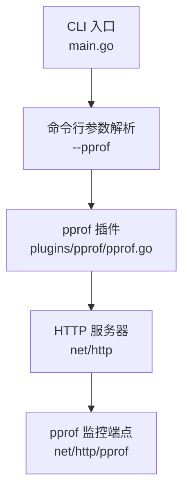
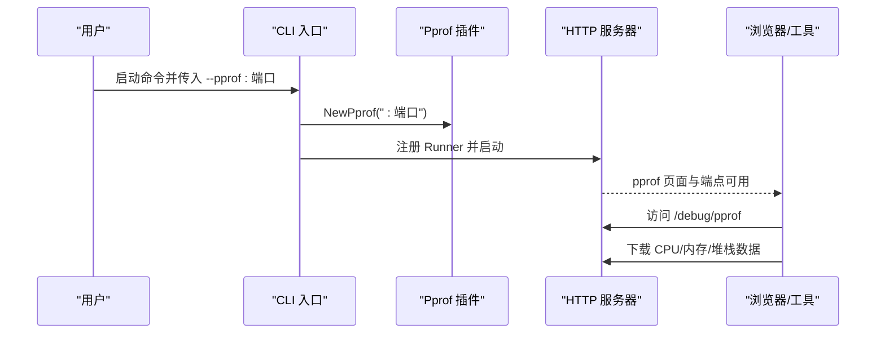
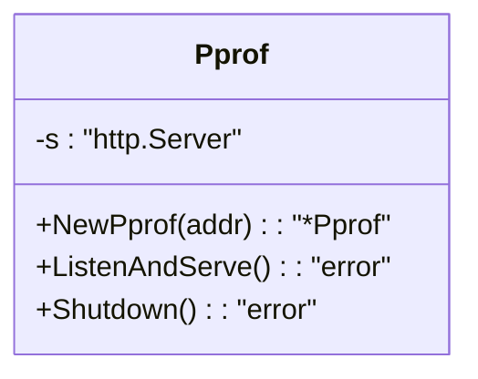
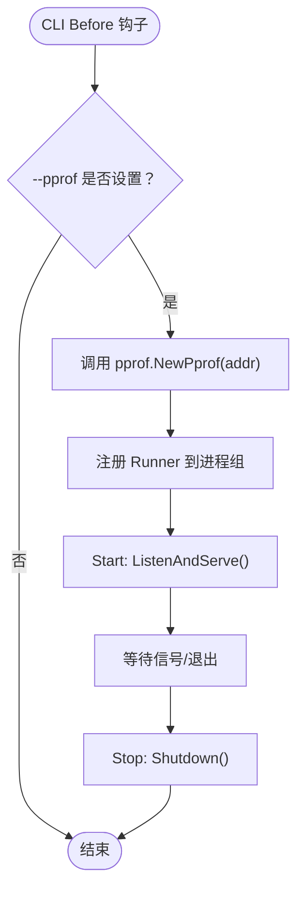
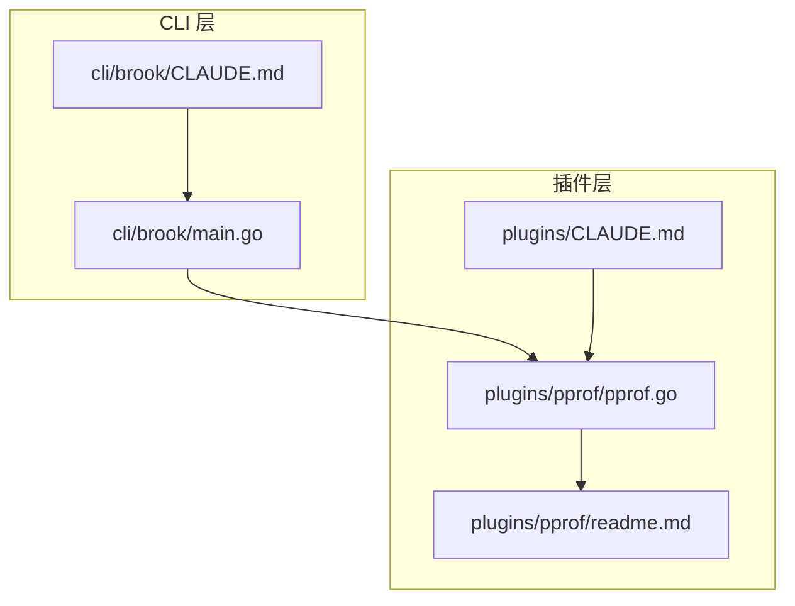

# pprof性能分析

<cite>
**本文引用的文件**
- [pprof.go](file://plugins/pprof/pprof.go)
- [readme.md](file://plugins/pprof/readme.md)
- [main.go](file://cli/brook/main.go)
- [CLAUDE.md](file://cli/brook/CLAUDE.md)
- [plugins/CLAUDE.md](file://plugins/CLAUDE.md)
</cite>

## 目录
1. [简介](#简介)
2. [项目结构](#项目结构)
3. [核心组件](#核心组件)
4. [架构总览](#架构总览)
5. [详细组件分析](#详细组件分析)
6. [依赖分析](#依赖分析)
7. [性能考量](#性能考量)
8. [故障排查指南](#故障排查指南)
9. [结论](#结论)
10. [附录](#附录)

## 简介
本文件围绕 Brook 项目中的 pprof 性能分析功能展开，目标是帮助读者理解如何通过命令行参数启用 Go 的 pprof HTTP 服务，掌握 pprof.NewPprof 的实现机制（HTTP 服务启动、监控端点暴露、性能数据收集），并提供实际使用示例（CPU 分析、内存分配追踪、goroutine 状态监控）。同时给出安全注意事项与最佳实践建议，例如避免在生产环境直接暴露 pprof 服务，以及定期进行性能基准测试。

## 项目结构
pprof 功能由两部分组成：
- CLI 层：在命令行中通过 --pprof 参数启用性能分析服务，并将其作为 Runner 加入进程组统一管理。
- 插件层：pprof 插件负责创建一个基于 net/http 的 HTTP 服务器，借助 Go 标准库的 net/http/pprof 包自动注册 pprof 监控端点。

图表来源
- [main.go](file://cli/brook/main.go#L66-L70)
- [pprof.go](file://plugins/pprof/pprof.go#L17-L21)

章节来源
- [main.go](file://cli/brook/main.go#L66-L70)
- [pprof.go](file://plugins/pprof/pprof.go#L17-L21)

## 核心组件
- pprof 插件：提供 NewPprof(addr) 构造函数，返回一个封装了 http.Server 的 Pprof 对象；提供 ListenAndServe() 和 Shutdown() 方法，用于启动与优雅关闭 HTTP 服务。
- CLI 集成：在 CLI 的 Before 钩子中解析 --pprof 参数，若提供则创建 Pprof 实例并加入 runnergroup，随应用一起启动与停止。

章节来源
- [pprof.go](file://plugins/pprof/pprof.go#L23-L42)
- [main.go](file://cli/brook/main.go#L175-L188)

## 架构总览
pprof 在 Brook 中的运行流程如下：
- CLI 解析 --pprof 参数，若非空则调用 pprof.NewPprof(addr) 创建服务对象。
- 将该服务以 Runner 形式加入进程组，启动时执行 ListenAndServe()，停止时执行 Shutdown()。
- 由于插件导入了 net/http/pprof，pprof 监控端点会自动注册到默认的 http.DefaultServeMux 上，从而在指定监听地址上提供分析页面与数据接口。

图表来源
- [main.go](file://cli/brook/main.go#L175-L188)
- [pprof.go](file://plugins/pprof/pprof.go#L23-L42)

## 详细组件分析

### 组件 A：pprof 插件（Pprof 结构与方法）
- 结构体字段：包含一个 http.Server 实例，用于承载 HTTP 服务。
- 构造函数：NewPprof(addr) 接收监听地址，创建 http.Server 并返回 Pprof 实例。
- 方法：
  - ListenAndServe()：启动 HTTP 服务，阻塞直到出错或关闭。
  - Shutdown()：优雅关闭，使用 context.Background() 触发关闭。

图表来源
- [pprof.go](file://plugins/pprof/pprof.go#L23-L42)

章节来源
- [pprof.go](file://plugins/pprof/pprof.go#L23-L42)

### 组件 B：CLI 集成（--pprof 参数与 Runner 管理）
- 命令行参数：--pprof 用于指定 pprof 监听地址，例如 :6060。
- Before 钩子逻辑：
  - 若 --pprof 非空，调用 pprof.NewPprof(addr) 创建实例；
  - 将其包装为 Runner，Start 执行 ListenAndServe()，Stop 执行 Shutdown()；
  - 通过 runnergroup 统一生命周期管理，确保优雅退出。

图表来源
- [main.go](file://cli/brook/main.go#L175-L188)

章节来源
- [main.go](file://cli/brook/main.go#L66-L70)
- [main.go](file://cli/brook/main.go#L175-L188)

### 组件 C：pprof 端点与数据收集机制
- 端点注册：插件导入 net/http/pprof，会自动向 http.DefaultServeMux 注册 pprof 监控端点。
- 监控端点：通常包括 /debug/pprof、/debug/pprof/profile、/debug/pprof/heap、/debug/pprof/goroutine 等。
- 数据收集方式：pprof 通过 Go 运行时统计器采集 CPU、内存、goroutine 等指标，支持以文本或二进制格式导出。

图表来源
- [pprof.go](file://plugins/pprof/pprof.go#L17-L21)

章节来源
- [pprof.go](file://plugins/pprof/pprof.go#L17-L21)

## 依赖分析
- pprof 插件依赖：
  - net/http：提供 HTTP 服务器能力。
  - net/http/pprof：自动注册 pprof 监控端点。
- CLI 依赖：
  - urfave/cli/v2：命令行参数解析。
  - txthinking/runnergroup：进程组与 Runner 生命周期管理。
- 插件注册与文档：
  - plugins/CLAUDE.md 明确列出 pprof 插件及其参数 --pprof。
  - cli/brook/CLAUDE.md 在全局参数中说明 --pprof 的作用。

图表来源
- [main.go](file://cli/brook/main.go#L40-L46)
- [CLAUDE.md](file://cli/brook/CLAUDE.md#L30-L39)
- [plugins/CLAUDE.md](file://plugins/CLAUDE.md#L23-L29)
- [pprof.go](file://plugins/pprof/pprof.go#L17-L21)
- [readme.md](file://plugins/pprof/readme.md#L1-L2)

章节来源
- [main.go](file://cli/brook/main.go#L40-L46)
- [CLAUDE.md](file://cli/brook/CLAUDE.md#L30-L39)
- [plugins/CLAUDE.md](file://plugins/CLAUDE.md#L23-L29)
- [pprof.go](file://plugins/pprof/pprof.go#L17-L21)
- [readme.md](file://plugins/pprof/readme.md#L1-L2)

## 性能考量
- 启动成本：pprof 仅在导入 net/http/pprof 时注册端点，不会对业务逻辑产生额外开销，除非主动发起分析请求。
- 端点访问：pprof 端点会消耗少量 CPU 与内存，建议仅在开发与测试环境启用，或限制访问范围。
- 数据导出：profile/heap 等数据导出可能产生较大负载，应按需使用并控制采样时间长度。
- 安全性：pprof 默认无鉴权，不应直接暴露到公网；建议仅在内网或受控网络中启用。

## 故障排查指南
- 无法访问 /debug/pprof
  - 检查是否正确传入 --pprof 地址，确认监听端口未被占用。
  - 确认 CLI Before 钩子已成功创建并启动 Pprof Runner。
- 端口冲突
  - 更换 --pprof 监听地址，避免与已有服务冲突。
- 优雅关闭失败
  - 确保 Shutdown() 被调用，检查进程组 Runner 的 Stop 逻辑是否执行。
- 生产环境暴露风险
  - pprof 无内置鉴权，请勿在公网暴露；必要时通过反向代理、防火墙或 VPN 限制访问。

章节来源
- [main.go](file://cli/brook/main.go#L175-L188)
- [pprof.go](file://plugins/pprof/pprof.go#L36-L42)

## 结论
Brook 的 pprof 集成通过最小化代码实现了对 Go 运行时性能的可观测性：CLI 侧负责参数解析与生命周期管理，插件侧负责 HTTP 服务与端点注册。结合浏览器与 go tool pprof 工具，可以快速完成 CPU、内存与 goroutine 的分析。为保障安全与稳定性，建议仅在受控环境中启用，并配合定期性能基准测试与回归分析。

## 附录

### 使用示例与操作步骤
- 启用 pprof
  - 在启动命令中添加 --pprof :6060，使 pprof 服务监听在本地 6060 端口。
- 浏览器访问
  - 打开浏览器访问 http://localhost:6060/debug/pprof，查看可用端点与概览。
- CPU 性能分析
  - 在浏览器中访问 /debug/pprof/profile，下载 CPU profile 数据，使用 go tool pprof 分析热点函数。
- 内存分配追踪
  - 访问 /debug/pprof/heap，下载 heap profile，分析内存分配与泄漏。
- goroutine 状态监控
  - 访问 /debug/pprof/goroutine，查看当前 goroutine 数量与阻塞情况。
- go tool pprof
  - 使用 go tool pprof 本地打开下载的数据文件，查看火焰图、Top N 函数等。

章节来源
- [main.go](file://cli/brook/main.go#L66-L70)
- [pprof.go](file://plugins/pprof/pprof.go#L17-L21)

### 安全与最佳实践
- 安全
  - 不要在生产环境直接暴露 pprof 端口；如需远程分析，通过受控网络或反向代理访问。
  - 限制访问来源，仅允许可信 IP 或内部网络访问。
- 最佳实践
  - 开发与测试阶段开启 --pprof，配合定期性能基准测试，建立性能基线。
  - 在问题复现期间临时开启，问题解决后及时关闭，降低运行时开销。
  - 对于高并发场景，合理设置采样时长与频率，避免对线上性能造成影响。

章节来源
- [plugins/CLAUDE.md](file://plugins/CLAUDE.md#L54-L58)
- [CLAUDE.md](file://cli/brook/CLAUDE.md#L30-L39)