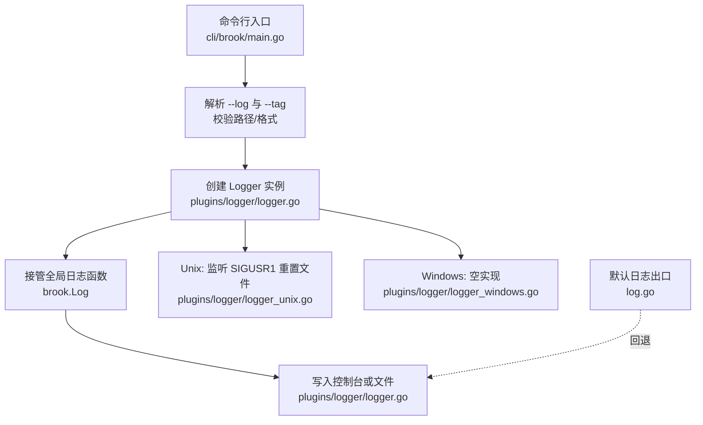
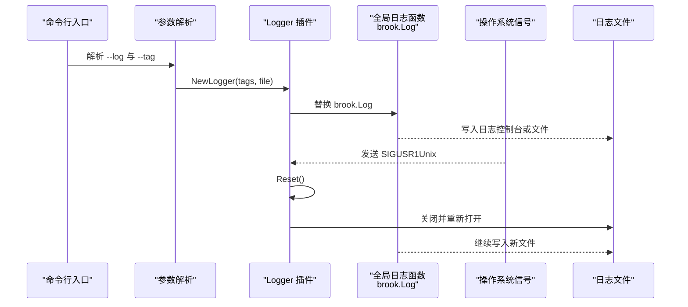
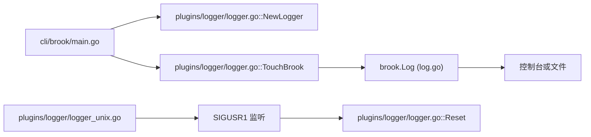

# 日志管理

<cite>
**本文引用的文件**
- [cli/brook/main.go](file://cli/brook/main.go)
- [log.go](file://log.go)
- [plugins/logger/logger.go](file://plugins/logger/logger.go)
- [plugins/logger/logger_unix.go](file://plugins/logger/logger_unix.go)
- [plugins/logger/logger_windows.go](file://plugins/logger/logger_windows.go)
- [plugins/logger/readme.md](file://plugins/logger/readme.md)
</cite>

## 目录
1. [简介](#简介)
2. [项目结构](#项目结构)
3. [核心组件](#核心组件)
4. [架构总览](#架构总览)
5. [详细组件分析](#详细组件分析)
6. [依赖关系分析](#依赖关系分析)
7. [性能与并发特性](#性能与并发特性)
8. [使用示例与最佳实践](#使用示例与最佳实践)
9. [故障排查](#故障排查)
10. [结论](#结论)

## 简介
本文件围绕 Brook 的日志管理功能展开，重点说明如何通过命令行参数 --log 配置日志输出，解释 NewLogger 的实现机制（日志文件创建、写入、跨平台 SIGUSR1 重置），阐述日志格式、内容及标签（tag）的应用方式，并提供在不同操作系统下的日志管理差异、安全注意事项与最佳实践（如敏感信息过滤）。文档同时给出常见使用场景与排障建议，帮助开发者与运维人员高效地进行日志采集、分析与维护。

## 项目结构
日志功能由 CLI 入口负责解析参数并初始化插件 logger，核心日志接口由全局变量 brook.Log 提供，logger 插件负责将统一格式的日志写入控制台或文件，并在 Unix 系统上通过 SIGUSR1 实现日志文件重置。

图表来源
- [cli/brook/main.go](file://cli/brook/main.go#L66-L110)
- [plugins/logger/logger.go](file://plugins/logger/logger.go#L39-L134)
- [plugins/logger/logger_unix.go](file://plugins/logger/logger_unix.go#L12-L21)
- [plugins/logger/logger_windows.go](file://plugins/logger/logger_windows.go#L1-L5)
- [log.go](file://log.go#L15-L22)

章节来源
- [cli/brook/main.go](file://cli/brook/main.go#L66-L110)
- [plugins/logger/logger.go](file://plugins/logger/logger.go#L39-L134)
- [plugins/logger/logger_unix.go](file://plugins/logger/logger_unix.go#L12-L21)
- [plugins/logger/logger_windows.go](file://plugins/logger/logger_windows.go#L1-L5)
- [log.go](file://log.go#L15-L22)

## 核心组件
- CLI 参数与初始化
  - --log：启用日志，值为绝对路径或“console”。Unix 下可通过发送 SIGUSR1 触发日志文件重置。
  - --tag：键值对形式附加到日志中，多个以逗号分隔，最终作为查询参数拼接到用户 API。
- Logger 插件
  - NewLogger：根据传入的标签映射与目标文件路径创建 Logger；当文件为“console”时仅写控制台。
  - TouchBrook：替换全局日志函数 brook.Log，并在多个网关处注入统一日志结构。
  - Reset：关闭并重新打开日志文件，实现日志轮转。
  - WatchReset：Unix 上监听 SIGUSR1 并调用 Reset；Windows 上为空实现。
- 默认日志出口
  - 若未启用 logger 插件，brook.Log 默认回退到标准库日志输出。

章节来源
- [cli/brook/main.go](file://cli/brook/main.go#L66-L110)
- [cli/brook/main.go](file://cli/brook/main.go#L189-L214)
- [plugins/logger/logger.go](file://plugins/logger/logger.go#L39-L134)
- [plugins/logger/logger_unix.go](file://plugins/logger/logger_unix.go#L12-L21)
- [plugins/logger/logger_windows.go](file://plugins/logger/logger_windows.go#L1-L5)
- [log.go](file://log.go#L15-L22)

## 架构总览
下图展示从 CLI 到日志落盘的整体流程，以及 Unix/Windows 在信号处理上的差异。

图表来源
- [cli/brook/main.go](file://cli/brook/main.go#L189-L214)
- [plugins/logger/logger.go](file://plugins/logger/logger.go#L39-L134)
- [plugins/logger/logger_unix.go](file://plugins/logger/logger_unix.go#L12-L21)
- [plugins/logger/logger_windows.go](file://plugins/logger/logger_windows.go#L1-L5)

## 详细组件分析

### CLI 参数与初始化流程
- --log
  - 必须是绝对路径或“console”，否则报错。
  - 解析 --tag，按“key:value”拆分并构造标签映射。
  - 调用 logger.NewLogger 创建 Logger，并调用 TouchBrook 接管全局日志。
  - 在退出钩子中调用 p.Close() 保证资源释放。
- --tag
  - 多个键值对以逗号分隔，每个必须为“key:value”的形式。
  - 标签会附加到日志条目中，并作为查询参数拼接到用户 API。

章节来源
- [cli/brook/main.go](file://cli/brook/main.go#L66-L110)
- [cli/brook/main.go](file://cli/brook/main.go#L189-L214)

### Logger 类与方法
- 结构体字段
  - F：日志文件句柄
  - File：日志文件路径
  - Lock：互斥锁，保证并发写入安全
  - Tags：标签映射
- 关键方法
  - NewLogger(tags, file)：创建 Logger；file 为“console”时仅写控制台；否则以截断+创建+只写模式打开文件。
  - Close()：关闭文件句柄。
  - Reset()：关闭并重新打开文件，实现重置。
  - TouchBrook()：替换全局日志函数 brook.Log，并在多个网关处注入统一日志结构（见下一节）。
  - WatchReset()：Unix 上监听 SIGUSR1 并调用 Reset；Windows 上为空实现。

章节来源
- [plugins/logger/logger.go](file://plugins/logger/logger.go#L32-L48)
- [plugins/logger/logger.go](file://plugins/logger/logger.go#L50-L74)
- [plugins/logger/logger.go](file://plugins/logger/logger.go#L76-L134)
- [plugins/logger/logger_unix.go](file://plugins/logger/logger_unix.go#L12-L21)
- [plugins/logger/logger_windows.go](file://plugins/logger/logger_windows.go#L1-L5)

### 日志格式与内容
- 统一日志结构
  - 错误类事件：自动添加时间戳字段，附加标签映射。
  - 网络连接事件：包含网络类型、源地址、目的地址等。
  - DNS 请求事件：包含来源地址、DNS 查询类型、域名等。
  - DHCP 事件：包含输入/输出消息类型、客户端 MAC、分配 IP 或错误信息。
- 写入策略
  - 控制台：直接打印。
  - 文件：加锁后写入一行文本，失败时回退到标准库日志输出。

章节来源
- [plugins/logger/logger.go](file://plugins/logger/logger.go#L76-L134)

### 跨平台信号重置（SIGUSR1）
- Unix：启动后台 goroutine 监听 SIGUSR1，收到信号后调用 Reset，从而实现日志文件重置。
- Windows：WatchReset 为空实现，不支持该信号。

章节来源
- [plugins/logger/logger_unix.go](file://plugins/logger/logger_unix.go#L12-L21)
- [plugins/logger/logger_windows.go](file://plugins/logger/logger_windows.go#L1-L5)

### 默认日志出口（brook.Log）
- 若未启用 logger 插件，brook.Log 默认回退到标准库日志输出，确保系统在任何情况下都有日志出口。

章节来源
- [log.go](file://log.go#L15-L22)

## 依赖关系分析
- CLI 依赖 logger.NewLogger 与 logger.TouchBrook 初始化日志系统。
- logger 插件依赖全局日志函数 brook.Log，将统一格式写入控制台或文件。
- Unix 依赖 os/signal 与 syscall 处理 SIGUSR1；Windows 不处理。

图表来源
- [cli/brook/main.go](file://cli/brook/main.go#L189-L214)
- [plugins/logger/logger.go](file://plugins/logger/logger.go#L39-L134)
- [log.go](file://log.go#L15-L22)
- [plugins/logger/logger_unix.go](file://plugins/logger/logger_unix.go#L12-L21)

章节来源
- [cli/brook/main.go](file://cli/brook/main.go#L189-L214)
- [plugins/logger/logger.go](file://plugins/logger/logger.go#L39-L134)
- [log.go](file://log.go#L15-L22)
- [plugins/logger/logger_unix.go](file://plugins/logger/logger_unix.go#L12-L21)

## 性能与并发特性
- 并发安全：Logger 使用互斥锁保护文件写入，避免多 goroutine 写入竞争。
- 异步重置：WatchReset 在独立 goroutine 中等待信号，不影响主业务逻辑。
- I/O 行为：文件写入为逐条追加，Reset 时关闭并重新打开文件，适合配合外部轮转工具（如 logrotate）使用。

章节来源
- [plugins/logger/logger.go](file://plugins/logger/logger.go#L32-L48)
- [plugins/logger/logger.go](file://plugins/logger/logger.go#L50-L74)
- [plugins/logger/logger_unix.go](file://plugins/logger/logger_unix.go#L12-L21)

## 使用示例与最佳实践

### 基础配置
- 启用控制台日志：使用 --log console。
- 启用文件日志：使用 --log /绝对/路径/到/日志文件。
- 添加标签：--tag key1:value1 --tag key2:value2，这些标签会附加到日志条目中，并作为查询参数拼接到用户 API。

章节来源
- [cli/brook/main.go](file://cli/brook/main.go#L66-L110)
- [cli/brook/main.go](file://cli/brook/main.go#L189-L214)

### 日志轮转与重置
- Unix 系统：发送 SIGUSR1 信号触发日志文件重置，适用于与 logrotate 配合的场景。
- Windows 系统：不支持该信号，需结合其他轮转方案（例如外部工具或应用层轮转）。

章节来源
- [plugins/logger/logger_unix.go](file://plugins/logger/logger_unix.go#L12-L21)
- [plugins/logger/logger_windows.go](file://plugins/logger/logger_windows.go#L1-L5)

### 日志内容与分析要点
- 连接信息：包含网络类型、源地址、目的地址，便于定位连接来源与目标。
- DNS 请求：包含来源地址、查询类型、域名，便于分析 DNS 泄漏与请求模式。
- DHCP 事件：包含消息类型、客户端 MAC、分配 IP 或错误信息，便于排查 DHCP 问题。
- 时间戳：每条错误类日志自动附加时间戳，便于排序与关联分析。

章节来源
- [plugins/logger/logger.go](file://plugins/logger/logger.go#L76-L134)

### 安全与合规建议
- 文件权限：建议将日志文件权限设置为仅运行用户可读写，避免泄露敏感信息。
- 敏感信息过滤：避免在日志中记录密码、令牌、用户隐私等敏感字段；必要时在上游组件中脱敏后再进入日志系统。
- 路径校验：--log 必须为绝对路径（除“console”外），防止相对路径导致的意外写入。

章节来源
- [cli/brook/main.go](file://cli/brook/main.go#L189-L192)

## 故障排查
- 启动失败：--log 非绝对路径或 --tag 格式不正确会返回错误，请检查路径与键值对格式。
- 日志不落盘：确认是否选择了“console”，或文件路径是否存在且具备写权限。
- 重置无效：Windows 系统不支持 SIGUSR1；若期望重置，请在 Unix 系统发送该信号。
- 写入冲突：若出现并发写入异常，检查是否多进程共享同一日志文件；建议使用独立实例或外部轮转工具。

章节来源
- [cli/brook/main.go](file://cli/brook/main.go#L189-L214)
- [plugins/logger/logger.go](file://plugins/logger/logger.go#L76-L134)
- [plugins/logger/logger_unix.go](file://plugins/logger/logger_unix.go#L12-L21)
- [plugins/logger/logger_windows.go](file://plugins/logger/logger_windows.go#L1-L5)

## 结论
通过 --log 与 --tag 参数，Brook 提供了灵活且统一的日志管理能力。Logger 插件以最小侵入的方式接管全局日志，覆盖连接、DNS、DHCP 等关键事件，形成一致的日志格式。Unix 系统通过 SIGUSR1 实现日志重置，Windows 则需依赖外部轮转方案。结合合理的文件权限与敏感信息过滤策略，可满足生产环境对可观测性与安全性的双重需求。