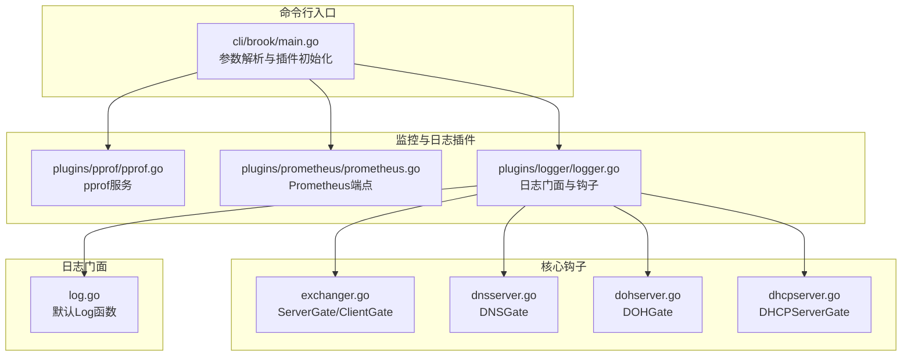
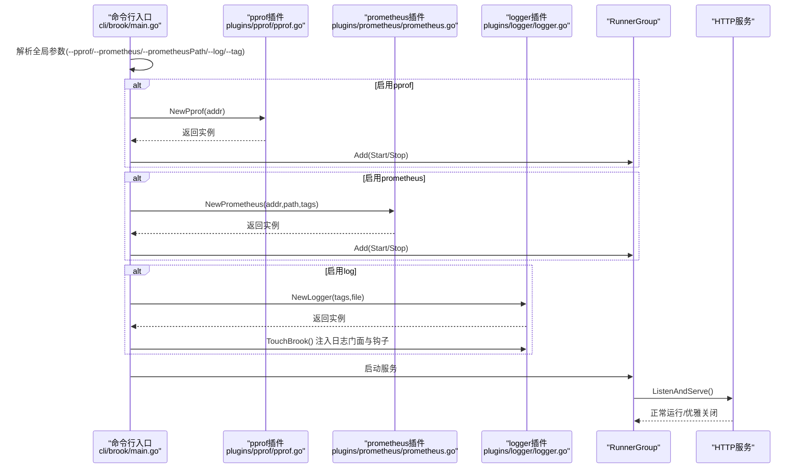
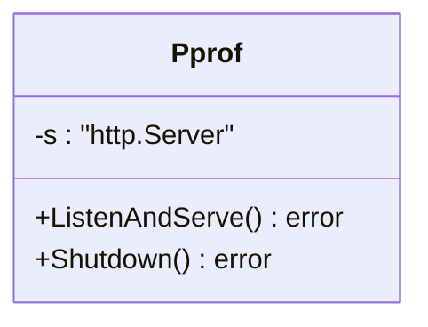
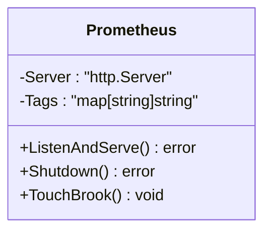
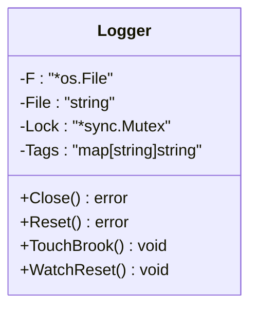
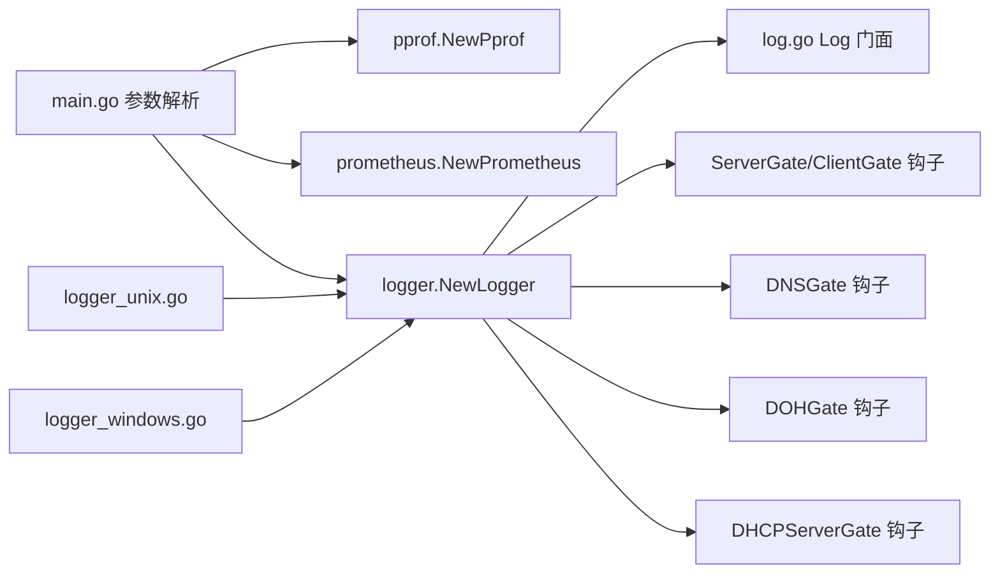

# 监控与日志

<cite>
**本文引用的文件**
- [cli/brook/main.go](file://cli/brook/main.go)
- [plugins/pprof/pprof.go](file://plugins/pprof/pprof.go)
- [plugins/prometheus/prometheus.go](file://plugins/prometheus/prometheus.go)
- [plugins/logger/logger.go](file://plugins/logger/logger.go)
- [plugins/logger/logger_unix.go](file://plugins/logger/logger_unix.go)
- [plugins/logger/logger_windows.go](file://plugins/logger/logger_windows.go)
- [log.go](file://log.go)
- [exchanger.go](file://exchanger.go)
- [dnsserver.go](file://dnsserver.go)
- [dohserver.go](file://dohserver.go)
- [dhcpserver.go](file://dhcpserver.go)
</cite>

## 目录
1. [简介](#简介)
2. [项目结构](#项目结构)
3. [核心组件](#核心组件)
4. [架构总览](#架构总览)
5. [详细组件分析](#详细组件分析)
6. [依赖关系分析](#依赖关系分析)
7. [性能考量](#性能考量)
8. [故障排查指南](#故障排查指南)
9. [结论](#结论)
10. [附录](#附录)

## 简介
本文件面向使用 Brook 的运维与开发人员，系统化梳理全局监控与日志参数，重点说明以下三类能力在命令行入口中的启用与配置方式：
- pprof：基于 Go 标准库的性能分析服务，用于 CPU/内存/阻塞等剖析。
- prometheus：内置 HTTP 端点暴露指标，便于 Prometheus 抓取。
- log：统一日志输出（控制台或文件），并支持运行期日志文件轮转。

文档将结合 main.go 中的参数解析与插件初始化逻辑，解释各参数如何生效，给出典型使用场景（性能瓶颈分析、监控系统集成、日志轮转）与安全建议、最佳实践。

## 项目结构
围绕监控与日志的关键文件分布如下：
- 命令行入口与参数解析：cli/brook/main.go
- pprof 插件：plugins/pprof/pprof.go
- prometheus 插件：plugins/prometheus/prometheus.go
- 日志插件：plugins/logger/logger.go 及平台特定实现
- 日志门面：log.go
- 业务钩子：exchanger.go（ServerGate/ClientGate）、dnsserver.go（DNSGate）、dohserver.go（DOHGate）、dhcpserver.go（DHCPServerGate）

图表来源
- [cli/brook/main.go](file://cli/brook/main.go#L66-L139)
- [plugins/pprof/pprof.go](file://plugins/pprof/pprof.go#L1-L43)
- [plugins/prometheus/prometheus.go](file://plugins/prometheus/prometheus.go#L1-L93)
- [plugins/logger/logger.go](file://plugins/logger/logger.go#L1-L134)
- [log.go](file://log.go#L1-L22)
- [exchanger.go](file://exchanger.go#L30-L40)
- [dnsserver.go](file://dnsserver.go#L23-L49)
- [dohserver.go](file://dohserver.go#L134-L202)
- [dhcpserver.go](file://dhcpserver.go#L101-L153)

章节来源
- [cli/brook/main.go](file://cli/brook/main.go#L66-L139)

## 核心组件
- pprof 参数
  - 参数名：pprof
  - 作用：启用 Go pprof HTTP 服务，监听指定地址（如 :6060）
  - 启动时机：Before 钩子阶段，若参数非空则创建 Pprof 实例并加入 RunnerGroup，随进程启动与停止
  - 关闭方式：通过 RunnerGroup 的 Stop 回调触发优雅关闭
- prometheus 参数
  - 参数名：prometheus、prometheusPath
  - 作用：启用 Prometheus HTTP 端点，路径由 prometheusPath 指定；需同时提供 prometheusPath
  - 指标：内置计数器 dst_counter，按 network/from/dst 以及标签聚合
  - 启动时机：Before 钩子阶段，若参数非空且路径有效，则创建 Prometheus 实例并注册到 RunnerGroup
  - 关闭方式：通过 RunnerGroup 的 Stop 回调优雅关闭
- log 参数
  - 参数名：log、tag
  - 作用：启用日志记录；值为 console 或绝对路径；支持通过 tag 注入键值对标签
  - 启动时机：Before 钩子阶段，若参数非空则创建 Logger 实例并注入到 Brook 的日志门面
  - 运行期轮转：Unix 平台通过 SIGUSR1 触发日志文件重开；Windows 平台无信号处理
  - 关闭方式：Before 钩子结束前注册的关闭回调负责关闭文件句柄

章节来源
- [cli/brook/main.go](file://cli/brook/main.go#L164-L265)
- [plugins/pprof/pprof.go](file://plugins/pprof/pprof.go#L1-L43)
- [plugins/prometheus/prometheus.go](file://plugins/prometheus/prometheus.go#L1-L93)
- [plugins/logger/logger.go](file://plugins/logger/logger.go#L1-L134)
- [plugins/logger/logger_unix.go](file://plugins/logger/logger_unix.go#L1-L22)
- [plugins/logger/logger_windows.go](file://plugins/logger/logger_windows.go#L1-L5)
- [log.go](file://log.go#L1-L22)

## 架构总览
下面以序列图展示参数生效与服务启动的主流程。

图表来源
- [cli/brook/main.go](file://cli/brook/main.go#L164-L265)
- [plugins/pprof/pprof.go](file://plugins/pprof/pprof.go#L23-L43)
- [plugins/prometheus/prometheus.go](file://plugins/prometheus/prometheus.go#L32-L48)
- [plugins/logger/logger.go](file://plugins/logger/logger.go#L76-L133)

## 详细组件分析

### pprof 组件分析
- 启用方式
  - 在命令行传入 --pprof 地址（如 :6060），main.go Before 钩子会创建 Pprof 实例并加入 RunnerGroup，随进程启动与停止。
- 服务行为
  - 使用标准库 net/http/pprof，无需额外路由注册即可暴露 pprof 页面。
  - 提供 ListenAndServe 与 Shutdown 方法，便于优雅关闭。
- 典型用途
  - CPU/内存/阻塞分析、Goroutine/互斥锁分析、阻塞追踪等。
- 安全建议
  - 默认监听在本地端口，避免直接暴露公网；如需公网访问，务必配合鉴权或反向代理。
  - 结合 --prometheusPath 的思路，建议仅在内网或受控环境启用。

图表来源
- [plugins/pprof/pprof.go](file://plugins/pprof/pprof.go#L23-L43)

章节来源
- [cli/brook/main.go](file://cli/brook/main.go#L175-L188)
- [plugins/pprof/pprof.go](file://plugins/pprof/pprof.go#L23-L43)

### prometheus 组件分析
- 启用方式
  - 传入 --prometheus 与 --prometheusPath；前者为监听地址，后者为指标路径（必须提供）。
  - main.go Before 钩子创建 Prometheus 实例并加入 RunnerGroup。
- 指标说明
  - 内置计数器：dst_counter，维度包含 network、from、dst，以及通过 --tag 注入的自定义标签。
- 指标采集
  - 通过 Prometheus 实例的 Handler 将路径映射到标准的 promhttp 处理器。
- 关闭方式
  - 通过 RunnerGroup 的 Stop 回调优雅关闭 HTTP 服务。

图表来源
- [plugins/prometheus/prometheus.go](file://plugins/prometheus/prometheus.go#L27-L48)

章节来源
- [cli/brook/main.go](file://cli/brook/main.go#L240-L265)
- [plugins/prometheus/prometheus.go](file://plugins/prometheus/prometheus.go#L32-L93)

### 日志组件分析
- 启用方式
  - 传入 --log；值为 console 或绝对路径文件；--tag 可多次传入，格式为 key:value。
  - main.go Before 钩子创建 Logger 实例并调用 TouchBrook，注入日志门面与各类钩子。
- 日志门面
  - 默认日志门面为 log.go 中的 Log 函数；Logger 通过覆盖该函数实现统一输出。
- 钩子覆盖
  - Logger 在 TouchBrook 中覆盖以下钩子，以便在关键路径记录事件：
    - ServerGate/ClientGate：记录网络类型、来源、目标
    - DNSGate：记录 DNS 查询类型与域名
    - DOHGate：记录 HTTPS/SVCB 类型查询与来源（支持 X-Forwarded-For）
    - DHCPServerGate：记录 DHCP 报文类型、客户端 MAC、分配 IP 或错误
- 运行期轮转
  - Unix 平台：监听 SIGUSR1，收到后重开日志文件句柄，实现日志切割与归档。
  - Windows 平台：无信号处理，需自行管理日志轮转。
- 关闭方式
  - Before 钩子结束前注册的关闭回调负责关闭文件句柄。

图表来源
- [plugins/logger/logger.go](file://plugins/logger/logger.go#L32-L133)
- [plugins/logger/logger_unix.go](file://plugins/logger/logger_unix.go#L12-L21)
- [plugins/logger/logger_windows.go](file://plugins/logger/logger_windows.go#L1-L5)
- [log.go](file://log.go#L19-L21)
- [exchanger.go](file://exchanger.go#L32-L40)
- [dnsserver.go](file://dnsserver.go#L23-L49)
- [dohserver.go](file://dohserver.go#L134-L202)
- [dhcpserver.go](file://dhcpserver.go#L101-L153)

章节来源
- [cli/brook/main.go](file://cli/brook/main.go#L189-L214)
- [plugins/logger/logger.go](file://plugins/logger/logger.go#L39-L133)
- [plugins/logger/logger_unix.go](file://plugins/logger/logger_unix.go#L12-L21)
- [plugins/logger/logger_windows.go](file://plugins/logger/logger_windows.go#L1-L5)
- [log.go](file://log.go#L19-L21)
- [exchanger.go](file://exchanger.go#L32-L40)
- [dnsserver.go](file://dnsserver.go#L23-L49)
- [dohserver.go](file://dohserver.go#L134-L202)
- [dhcpserver.go](file://dhcpserver.go#L101-L153)

## 依赖关系分析
- 参数到插件的依赖
  - --pprof -> pprof.NewPprof(addr) -> http.Server
  - --prometheus + --prometheusPath -> prometheus.NewPrometheus(addr,path,tags) -> http.Server + promhttp
  - --log + --tag -> logger.NewLogger(tags,file) -> 日志门面 + 钩子覆盖
- 钩子到日志的依赖
  - Logger 通过覆盖 Brook 的 ServerGate/ClientGate/DNSGate/DOHGate/DHCPServerGate，在关键路径调用 Log 输出统一格式日志
- 平台差异
  - Unix：通过 SIGUSR1 触发日志重开
  - Windows：无信号处理，需外部轮转工具

图表来源
- [cli/brook/main.go](file://cli/brook/main.go#L164-L265)
- [plugins/pprof/pprof.go](file://plugins/pprof/pprof.go#L23-L43)
- [plugins/prometheus/prometheus.go](file://plugins/prometheus/prometheus.go#L32-L48)
- [plugins/logger/logger.go](file://plugins/logger/logger.go#L76-L133)
- [log.go](file://log.go#L19-L21)
- [exchanger.go](file://exchanger.go#L32-L40)
- [dnsserver.go](file://dnsserver.go#L23-L49)
- [dohserver.go](file://dohserver.go#L134-L202)
- [dhcpserver.go](file://dhcpserver.go#L101-L153)
- [plugins/logger/logger_unix.go](file://plugins/logger/logger_unix.go#L12-L21)
- [plugins/logger/logger_windows.go](file://plugins/logger/logger_windows.go#L1-L5)

章节来源
- [cli/brook/main.go](file://cli/brook/main.go#L164-L265)
- [plugins/logger/logger.go](file://plugins/logger/logger.go#L76-L133)
- [log.go](file://log.go#L19-L21)
- [exchanger.go](file://exchanger.go#L32-L40)
- [dnsserver.go](file://dnsserver.go#L23-L49)
- [dohserver.go](file://dohserver.go#L134-L202)
- [dhcpserver.go](file://dhcpserver.go#L101-L153)
- [plugins/logger/logger_unix.go](file://plugins/logger/logger_unix.go#L12-L21)
- [plugins/logger/logger_windows.go](file://plugins/logger/logger_windows.go#L1-L5)

## 性能考量
- pprof
  - 开启后会增加少量运行时开销，建议仅在定位问题期间启用。
  - 对高并发场景，注意 pprof 页面访问频率，避免对生产环境造成额外压力。
- prometheus
  - 指标数量与标签基数会影响内存占用；合理使用 --tag 控制标签数量。
  - 建议将指标路径设置为不易猜测的值，降低被恶意探测的风险。
- 日志
  - 文件写入为串行化操作，建议避免过高的日志量；必要时结合外部日志轮转工具。
  - Unix 平台通过信号重开文件句柄，适合与 logrotate 等工具配合使用。

[本节为通用指导，不涉及具体文件分析]

## 故障排查指南
- pprof 无法访问
  - 检查 --pprof 是否正确传入监听地址；确认端口未被占用。
  - 若在容器或受限环境中，确保网络可达。
- prometheus 404 或无指标
  - 必须同时提供 --prometheus 与 --prometheusPath；路径必须与 Prometheus 抓取配置一致。
  - 确认 RunnerGroup 已成功添加 Prometheus 服务并已启动。
- 日志文件未生成或无法轮转
  - --log 必须为绝对路径或 console；若为文件路径，需确保目录存在且有写权限。
  - Unix 平台通过发送 SIGUSR1 触发重开；Windows 平台无信号处理，需外部轮转。
- 日志内容缺失
  - 确认 Logger 已通过 TouchBrook 注入到 ServerGate/ClientGate/DNSGate/DOHGate/DHCPServerGate。
  - 检查是否覆盖了默认 Log 门面。

章节来源
- [cli/brook/main.go](file://cli/brook/main.go#L164-L265)
- [plugins/logger/logger.go](file://plugins/logger/logger.go#L76-L133)
- [plugins/logger/logger_unix.go](file://plugins/logger/logger_unix.go#L12-L21)
- [plugins/logger/logger_windows.go](file://plugins/logger/logger_windows.go#L1-L5)

## 结论
- pprof、prometheus、log 三者均通过命令行参数在启动阶段启用，并以 RunnerGroup 管理生命周期。
- pprof 用于深入剖析性能问题；prometheus 用于可观测性与告警；log 用于统一记录与审计。
- 建议在受控环境下启用 pprof 与公网 prometheus 端点，严格控制访问路径与标签基数，确保日志轮转与合规存储。

[本节为总结性内容，不涉及具体文件分析]

## 附录

### 参数清单与用法要点
- pprof
  - 参数：--pprof
  - 用法：传入监听地址，如 :6060
  - 启动与关闭：由 RunnerGroup 管理
- prometheus
  - 参数：--prometheus、--prometheusPath
  - 用法：--prometheus 为监听地址；--prometheusPath 为指标路径（必填）
  - 指标：dst_counter（network、from、dst、tags）
- log
  - 参数：--log、--tag
  - 用法：--log 为 console 或绝对路径；--tag 可多次传入 key:value
  - 轮转：Unix 平台发送 SIGUSR1；Windows 平台无信号处理

章节来源
- [cli/brook/main.go](file://cli/brook/main.go#L66-L139)
- [plugins/prometheus/prometheus.go](file://plugins/prometheus/prometheus.go#L32-L93)
- [plugins/logger/logger.go](file://plugins/logger/logger.go#L39-L133)

### 实际使用示例（步骤说明）
- 性能瓶颈分析（pprof）
  - 启动：brook server --listen :9999 --password pass --pprof :6060
  - 分析：浏览器打开 http://localhost:6060/debug/pprof/，选择相应分析项
  - 关闭：停止进程或通过 RunnerGroup 优雅关闭
- 监控系统集成（prometheus）
  - 启动：brook server --listen :9999 --password pass --prometheus :7070 --prometheusPath /metrics
  - 配置：在 Prometheus 中添加抓取任务，目标为 http://host:7070/metrics
  - 告警：基于 dst_counter 指标建立告警规则
- 日志轮转配置（log）
  - 启动：brook server --listen :9999 --password pass --log /var/log/brook.log --tag env:prod
  - Unix：使用 logrotate 管理日志文件，发送 SIGUSR1 触发重开
  - Windows：使用外部日志轮转工具管理文件滚动

[本节为使用说明，不包含具体代码片段]

### 安全与最佳实践
- pprof
  - 仅在内网或受控环境启用；如需公网，请配合反向代理与鉴权
- prometheus
  - 指标路径尽量复杂且不易猜测；限制标签基数，避免过多唯一值
  - 仅暴露必要的指标，避免泄露敏感信息
- log
  - 优先使用绝对路径；确保目录权限最小化
  - 使用 --tag 时避免注入敏感字段；必要时在上游进行脱敏
  - 结合外部日志轮转工具，定期清理历史日志

[本节为通用指导，不涉及具体文件分析]