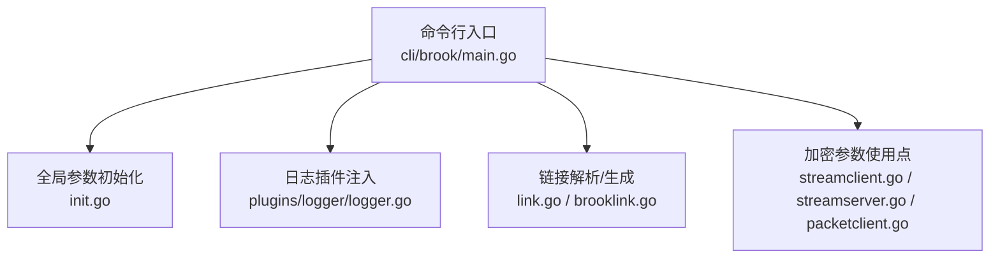
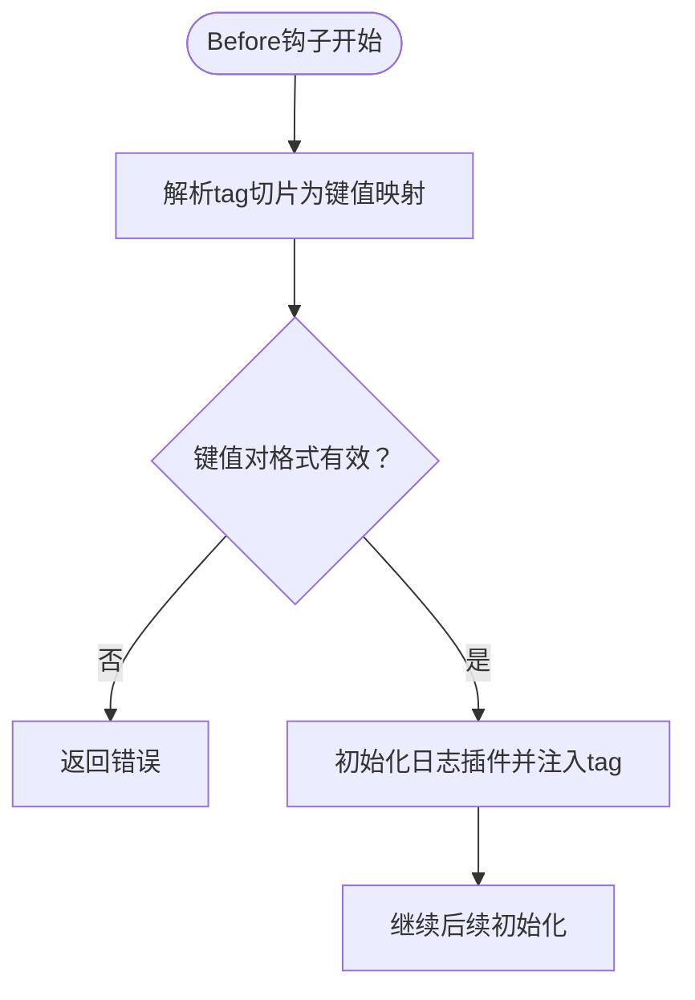
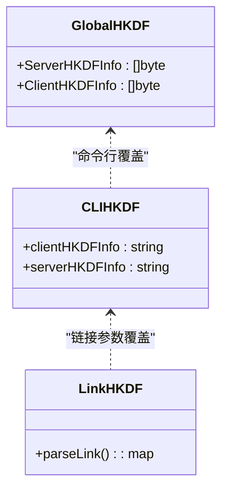
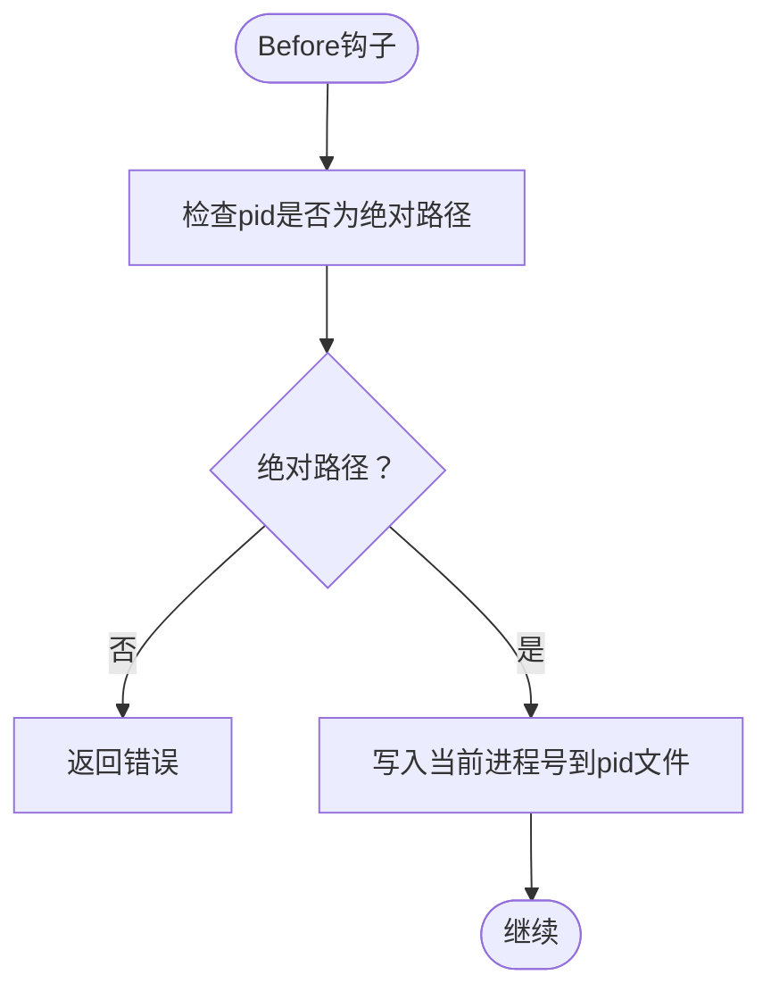
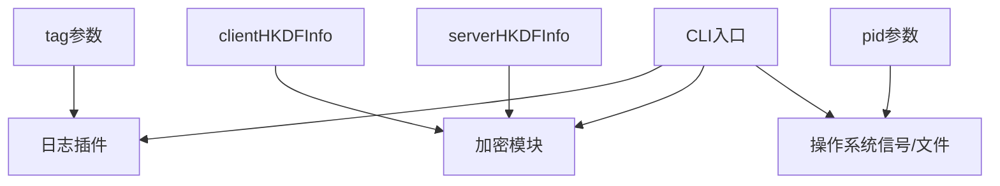

# 系统控制

<cite>
**本文引用的文件列表**
- [cli/brook/main.go](file://cli/brook/main.go)
- [init.go](file://init.go)
- [log.go](file://log.go)
- [plugins/logger/logger.go](file://plugins/logger/logger.go)
- [brooklink.go](file://brooklink.go)
- [link.go](file://link.go)
- [streamclient.go](file://streamclient.go)
- [streamserver.go](file://streamserver.go)
- [packetclient.go](file://packetclient.go)
- [protocol/brook-server-protocol.md](file://protocol/brook-server-protocol.md)
- [protocol/brook-wsserver-protocol.md](file://protocol/brook-wsserver-protocol.md)
- [protocol/user.md](file://protocol/user.md)
</cite>

## 目录
1. [简介](#简介)
2. [项目结构与入口](#项目结构与入口)
3. [核心参数总览](#核心参数总览)
4. [架构概览](#架构概览)
5. [详细参数解析](#详细参数解析)
6. [依赖关系分析](#依赖关系分析)
7. [性能与安全考量](#性能与安全考量)
8. [故障排查指南](#故障排查指南)
9. [结论](#结论)
10. [附录：使用场景与最佳实践](#附录使用场景与最佳实践)

## 简介
本文件聚焦于brook工具的系统控制参数，围绕以下全局参数展开：
- tag：用于为日志与API调用附加上下文键值对
- clientHKDFInfo：客户端侧HKDF Info，影响密钥派生
- serverHKDFInfo：服务端侧HKDF Info，影响密钥派生
- pid：进程PID文件路径，便于系统管理与信号控制

我们将从main.go的实现出发，解释这些参数如何影响系统级行为（进程标识、标签管理、密钥派生、进程ID文件管理），并结合协议文档与日志插件说明其在不同子命令中的作用与交互。

## 项目结构与入口
- 入口程序位于命令行目录，通过CLI框架定义参数与子命令
- 核心加密参数在全局包中初始化，运行时可被命令行覆盖
- 日志系统通过插件注入，将tag键值对写入错误对象字段
- 链接解析与生成逻辑支撑brook链接参数传递（含HKDFInfo）



图表来源
- [cli/brook/main.go](file://cli/brook/main.go#L66-L163)
- [init.go](file://init.go#L15-L21)
- [plugins/logger/logger.go](file://plugins/logger/logger.go#L76-L133)
- [link.go](file://link.go#L22-L37)
- [brooklink.go](file://brooklink.go#L54-L147)
- [streamclient.go](file://streamclient.go#L103-L143)
- [streamserver.go](file://streamserver.go#L100-L151)
- [packetclient.go](file://packetclient.go#L105-L154)

章节来源
- [cli/brook/main.go](file://cli/brook/main.go#L66-L163)
- [init.go](file://init.go#L15-L21)

## 核心参数总览
- tag
  - 类型：字符串切片
  - 作用：作为键值对附加到日志与服务器日志；同时作为查询参数逐一追加到用户API请求
  - 位置：命令行标志定义与Before钩子中解析
- clientHKDFInfo
  - 类型：字符串
  - 作用：覆盖默认HKDF Info，用于客户端侧密钥派生
  - 位置：命令行标志定义；在客户端连接建立前可从brook链接参数覆盖
- serverHKDFInfo
  - 类型：字符串
  - 作用：覆盖默认HKDF Info，用于服务端侧密钥派生
  - 位置：命令行标志定义；在客户端连接建立前可从brook链接参数覆盖
- pid
  - 类型：字符串
  - 作用：绝对路径的PID文件，启动时写入当前进程号；用于系统管理与信号控制
  - 位置：命令行标志定义；Before钩子中校验并写入

章节来源
- [cli/brook/main.go](file://cli/brook/main.go#L66-L163)
- [init.go](file://init.go#L15-L21)

## 架构概览
下图展示参数在启动流程中的流转与影响范围。

```mermaid
sequenceDiagram
participant CLI as "命令行入口<br/>main.go"
participant Global as "全局参数<br/>init.go"
participant Logger as "日志插件<br/>logger.go"
participant Link as "链接解析/生成<br/>link.go / brooklink.go"
participant Crypto as "加密参数使用点<br/>stream*.go / packetclient.go"
CLI->>Global : 设置clientHKDFInfo/serverHKDFInfo
CLI->>CLI : 校验pid路径为绝对路径并写入PID
CLI->>Logger : 初始化日志，注入tag映射
CLI->>Link : 解析brook链接，读取clientHKDFInfo/serverHKDFInfo
CLI->>Crypto : 后续建立连接时使用HKDF Info派生密钥
```

图表来源
- [cli/brook/main.go](file://cli/brook/main.go#L164-L214)
- [plugins/logger/logger.go](file://plugins/logger/logger.go#L76-L133)
- [link.go](file://link.go#L22-L37)
- [brooklink.go](file://brooklink.go#L54-L147)
- [streamclient.go](file://streamclient.go#L103-L143)
- [streamserver.go](file://streamserver.go#L100-L151)
- [packetclient.go](file://packetclient.go#L105-L154)

## 详细参数解析

### 参数：tag
- 定义与解析
  - 在命令行标志中定义为字符串切片，每个元素形如“key:value”
  - Before钩子中将合法的tag键值对构建为映射
- 日志与API影响
  - 日志插件将该映射注入到所有错误对象字段中，便于审计与追踪
  - 文档中明确指出：所有tag会作为查询参数逐一追加到用户API请求
- 使用建议
  - 建议使用稳定且可识别的键（如环境、实例名、集群名）
  - 避免包含敏感信息



图表来源
- [cli/brook/main.go](file://cli/brook/main.go#L193-L214)
- [plugins/logger/logger.go](file://plugins/logger/logger.go#L76-L133)

章节来源
- [cli/brook/main.go](file://cli/brook/main.go#L66-L110)
- [cli/brook/main.go](file://cli/brook/main.go#L193-L214)
- [plugins/logger/logger.go](file://plugins/logger/logger.go#L76-L133)
- [protocol/user.md](file://protocol/user.md#L25-L40)

### 参数：clientHKDFInfo 与 serverHKDFInfo
- 默认值与覆盖
  - 默认值来自全局包初始化
  - 命令行标志提供覆盖；客户端连接建立前还可从brook链接参数覆盖
- 加密影响
  - 客户端与服务端均使用HKDF派生对称密钥，Info不同会导致两端无法互通
  - 协议文档明确Info可被brook链接参数覆盖
- 使用建议
  - 所有客户端与服务端必须保持一致的HKDF Info
  - 变更后需同步更新所有相关brook链接



图表来源
- [init.go](file://init.go#L15-L21)
- [cli/brook/main.go](file://cli/brook/main.go#L130-L138)
- [link.go](file://link.go#L22-L37)
- [brooklink.go](file://brooklink.go#L54-L147)
- [protocol/brook-server-protocol.md](file://protocol/brook-server-protocol.md#L24-L32)
- [protocol/brook-wsserver-protocol.md](file://protocol/brook-wsserver-protocol.md#L24-L32)

章节来源
- [init.go](file://init.go#L15-L21)
- [cli/brook/main.go](file://cli/brook/main.go#L130-L138)
- [brooklink.go](file://brooklink.go#L54-L147)
- [streamclient.go](file://streamclient.go#L103-L143)
- [streamserver.go](file://streamserver.go#L100-L151)
- [packetclient.go](file://packetclient.go#L105-L154)
- [protocol/brook-server-protocol.md](file://protocol/brook-server-protocol.md#L24-L32)
- [protocol/brook-wsserver-protocol.md](file://protocol/brook-wsserver-protocol.md#L24-L32)

### 参数：pid
- 行为
  - 必须为绝对路径；启动时写入当前进程号
  - 支持向进程发送特定信号以触发日志重置（unix系统）
- 管理价值
  - 便于外部进程管理器定位与控制brook进程
  - 结合信号可用于滚动日志等运维操作



图表来源
- [cli/brook/main.go](file://cli/brook/main.go#L167-L173)

章节来源
- [cli/brook/main.go](file://cli/brook/main.go#L160-L163)
- [cli/brook/main.go](file://cli/brook/main.go#L167-L173)

## 依赖关系分析
- 参数耦合
  - tag与日志系统强耦合：日志插件在初始化时接收tag映射并将其注入错误对象
  - clientHKDFInfo/serverHKDFInfo与加密模块强耦合：客户端与服务端在建立连接时使用HKDF Info派生密钥
  - pid与系统信号：用于进程管理与日志重置
- 外部依赖
  - CLI框架负责参数解析与生命周期钩子
  - 日志插件负责输出与重置
  - 链接解析模块负责brook链接参数的提取与传递



图表来源
- [cli/brook/main.go](file://cli/brook/main.go#L164-L214)
- [plugins/logger/logger.go](file://plugins/logger/logger.go#L76-L133)
- [streamclient.go](file://streamclient.go#L103-L143)
- [streamserver.go](file://streamserver.go#L100-L151)
- [packetclient.go](file://packetclient.go#L105-L154)

章节来源
- [cli/brook/main.go](file://cli/brook/main.go#L164-L214)
- [plugins/logger/logger.go](file://plugins/logger/logger.go#L76-L133)
- [streamclient.go](file://streamclient.go#L103-L143)
- [streamserver.go](file://streamserver.go#L100-L151)
- [packetclient.go](file://packetclient.go#L105-L154)

## 性能与安全考量
- 性能
  - HKDF Info变更不会直接影响性能，但错误配置会导致握手失败与重试开销
  - 日志写入为顺序I/O，建议合理设置日志路径与轮转策略
- 安全
  - HKDF Info应保持稳定且与部署一致，避免跨实例混用
  - pid文件仅包含进程号，注意文件权限与路径安全
  - tag不应包含敏感信息，避免泄露

[本节为通用指导，不直接分析具体文件]

## 故障排查指南
- tag无效
  - 症状：启动时报错提示tag格式非法
  - 排查：确认每个tag为“key:value”形式
  - 参考：Before钩子对tag格式的校验
- pid路径非绝对
  - 症状：启动时报错要求pid为绝对路径
  - 排查：确保传入绝对路径
- HKDF Info不一致
  - 症状：客户端与服务端无法建立连接
  - 排查：核对clientHKDFInfo/serverHKDFInfo是否一致；检查brook链接参数是否覆盖
- 日志重置
  - 症状：需要滚动日志
  - 操作：在unix系统向进程发送指定信号以重置日志文件

章节来源
- [cli/brook/main.go](file://cli/brook/main.go#L193-L203)
- [cli/brook/main.go](file://cli/brook/main.go#L167-L173)
- [cli/brook/main.go](file://cli/brook/main.go#L160-L163)
- [plugins/logger/logger.go](file://plugins/logger/logger.go#L76-L133)

## 结论
- tag为系统提供了可追溯的上下文能力，结合日志与用户API查询参数，有助于多维度审计与监控
- clientHKDFInfo与serverHKDFInfo是加密通道一致性的关键，必须在全链路保持一致
- pid为进程管理提供了基础能力，配合信号可实现无中断的日志滚动
- 实践中应将三者纳入配置管理，确保变更可控、可追溯

[本节为总结性内容，不直接分析具体文件]

## 附录：使用场景与最佳实践

### 多实例管理
- 使用pid参数为每个实例写入独立的PID文件，便于进程管理器统一控制
- 使用tag为每个实例标注环境、集群、实例编号等信息，便于日志聚合与告警

章节来源
- [cli/brook/main.go](file://cli/brook/main.go#L160-L163)

### 监控系统集成
- 将tag键值对注入到日志字段，便于监控系统按标签进行过滤与统计
- 用户API请求会携带所有tag作为查询参数，便于后端按标签计费或限流

章节来源
- [plugins/logger/logger.go](file://plugins/logger/logger.go#L76-L133)
- [protocol/user.md](file://protocol/user.md#L25-L40)

### 安全配置
- HKDF Info应保持稳定且与部署一致，变更时需同步更新所有brook链接
- 不要在tag中包含敏感信息；必要时使用脱敏键值

章节来源
- [cli/brook/main.go](file://cli/brook/main.go#L130-L138)
- [brooklink.go](file://brooklink.go#L54-L147)
- [protocol/brook-server-protocol.md](file://protocol/brook-server-protocol.md#L24-L32)
- [protocol/brook-wsserver-protocol.md](file://protocol/brook-wsserver-protocol.md#L24-L32)