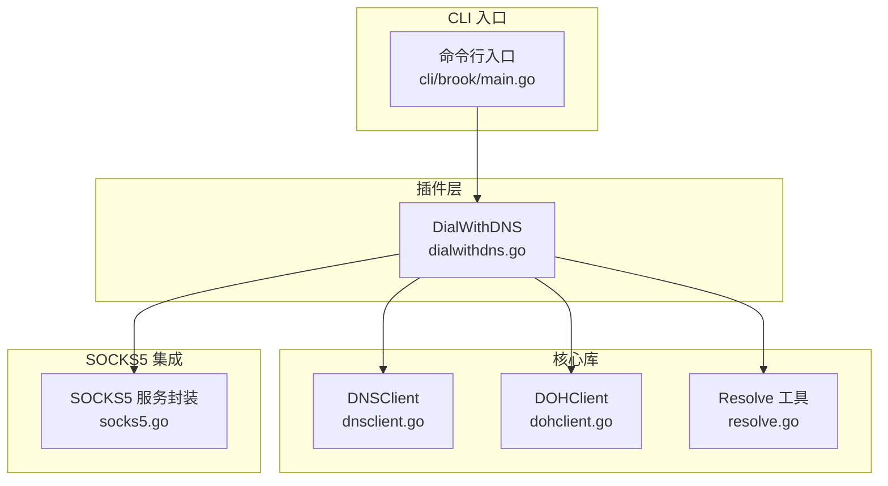
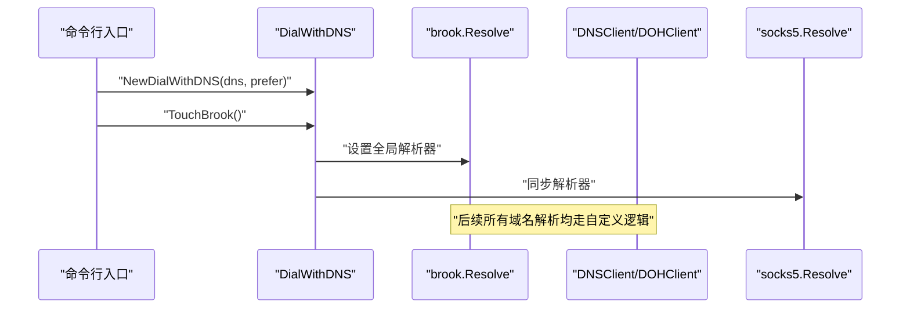
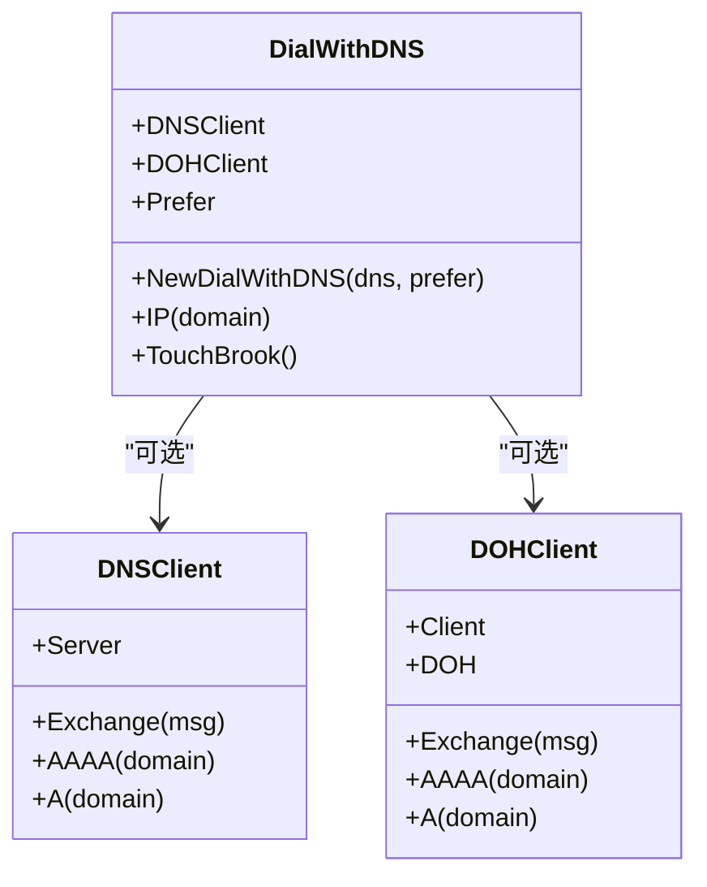
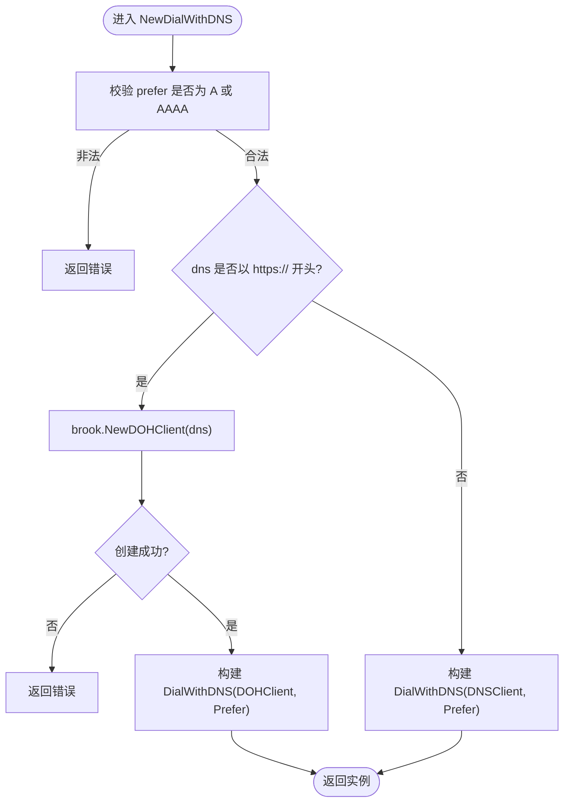
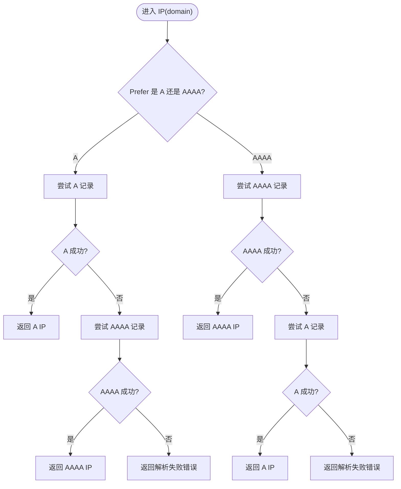
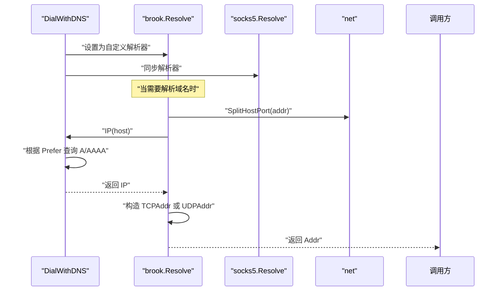
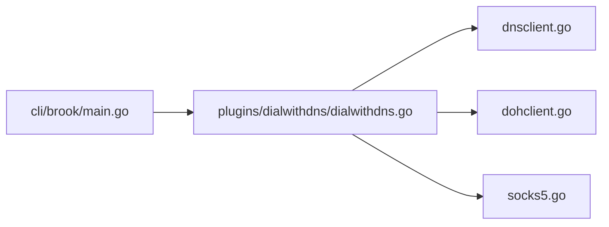

# DNS连接控制

<cite>
**本文引用的文件**
- [plugins/dialwithdns/dialwithdns.go](file://plugins/dialwithdns/dialwithdns.go)
- [dnsclient.go](file://dnsclient.go)
- [dohclient.go](file://dohclient.go)
- [resolve.go](file://resolve.go)
- [cli/brook/main.go](file://cli/brook/main.go)
- [socks5.go](file://socks5.go)
- [plugins/dialwithdns/readme.md](file://plugins/dialwithdns/readme.md)
</cite>

## 目录
1. [简介](#简介)
2. [项目结构](#项目结构)
3. [核心组件](#核心组件)
4. [架构总览](#架构总览)
5. [详细组件分析](#详细组件分析)
6. [依赖关系分析](#依赖关系分析)
7. [性能考量](#性能考量)
8. [故障排查指南](#故障排查指南)
9. [结论](#结论)
10. [附录：配置与集成示例](#附录配置与集成示例)

## 简介
本文件围绕 dialWithDNS 功能展开，系统性阐述其通过自定义 DNS 或 HTTPS DNS（DoH）解析域名的实现机制。重点包括：
- NewDialWithDNS 如何根据 DNS 地址类型（普通 DNS 或 DoH）初始化 DialWithDNS 结构体
- Prefer 参数对 A/AAAA 记录查询优先级的影响
- IP 方法中针对不同 Prefer 值的 DNS 解析逻辑
- TouchBrook 方法如何替换 brook 核心包的 Resolve 函数以实现全局 DNS 控制
- 配置示例（传统 DNS 与 HTTPS DNS），以及与 SOCKS5 协议的集成方式
- 多网络环境下 DNS 解析失败的处理策略与错误传播机制

## 项目结构
dialWithDNS 作为插件位于 plugins/dialwithdns，核心实现包含：
- DialWithDNS 结构体与构造函数 NewDialWithDNS
- IP 方法：按 Prefer 顺序解析 A/AAAA 记录
- TouchBrook 方法：重写全局 Resolve 并同步到 socks5 包

同时，底层依赖 brook 提供的 DNSClient 与 DOHClient，分别用于传统 UDP DNS 和 HTTPS DNS 查询；另有 resolve.go 提供独立的 IPv4/IPv6 解析工具函数。

图表来源
- [plugins/dialwithdns/dialwithdns.go](file://plugins/dialwithdns/dialwithdns.go#L27-L144)
- [dnsclient.go](file://dnsclient.go#L24-L87)
- [dohclient.go](file://dohclient.go#L28-L116)
- [resolve.go](file://resolve.go#L10-L51)
- [cli/brook/main.go](file://cli/brook/main.go#L214-L221)
- [socks5.go](file://socks5.go#L22-L47)

章节来源
- [plugins/dialwithdns/readme.md](file://plugins/dialwithdns/readme.md#L1-L2)
- [plugins/dialwithdns/dialwithdns.go](file://plugins/dialwithdns/dialwithdns.go#L27-L144)
- [dnsclient.go](file://dnsclient.go#L24-L87)
- [dohclient.go](file://dohclient.go#L28-L116)
- [resolve.go](file://resolve.go#L10-L51)
- [cli/brook/main.go](file://cli/brook/main.go#L79-L86)
- [cli/brook/main.go](file://cli/brook/main.go#L214-L221)
- [socks5.go](file://socks5.go#L22-L47)

## 核心组件
- DialWithDNS 结构体
  - 字段：DNSClient、DOHClient、Prefer
  - 作用：统一承载 DNS/DoH 客户端与解析偏好
- NewDialWithDNS(dns, prefer)
  - 输入：dns 可为 "host:port"（传统 DNS）或 "https://..."（DoH）
  - 输出：返回 DialWithDNS 实例，内部选择 DNSClient 或 DOHClient
  - 校验：prefer 必须为 "A" 或 "AAAA"
- IP(domain)
  - 按 Prefer 决定先查 A 还是 AAAA，若首选未命中则回退到另一条记录类型
  - 若两种类型均无法解析，则返回错误
- TouchBrook()
  - 将全局 brook.Resolve 替换为自定义解析逻辑
  - 同步更新 socks5.Resolve，使 SOCKS5 流量也受控于自定义 DNS

章节来源
- [plugins/dialwithdns/dialwithdns.go](file://plugins/dialwithdns/dialwithdns.go#L27-L45)
- [plugins/dialwithdns/dialwithdns.go](file://plugins/dialwithdns/dialwithdns.go#L47-L119)
- [plugins/dialwithdns/dialwithdns.go](file://plugins/dialwithdns/dialwithdns.go#L121-L144)

## 架构总览
dialWithDNS 的工作流分为“初始化阶段”和“运行时解析阶段”。

- 初始化阶段
  - CLI 读取 --dialWithDNS 与 --dialWithDNSPrefer
  - 调用 NewDialWithDNS 创建 DialWithDNS 实例
  - 调用 TouchBrook 注入全局解析器

- 运行时解析阶段
  - 当需要解析域名时，调用 brook.Resolve
  - 若目标为纯 IP 则直接使用；否则委托 DialWithDNS.IP
  - DialWithDNS.IP 根据 Prefer 顺序查询 A/AAAA，必要时回退
  - 最终返回 TCP/UDP 地址

图表来源
- [cli/brook/main.go](file://cli/brook/main.go#L214-L221)
- [plugins/dialwithdns/dialwithdns.go](file://plugins/dialwithdns/dialwithdns.go#L121-L144)

## 详细组件分析

### DialWithDNS 类与依赖关系
DialWithDNS 通过组合 DNSClient 或 DOHClient 实现对传统 DNS 与 DoH 的统一支持，并通过 Prefer 控制 A/AAAA 的优先级。

图表来源
- [plugins/dialwithdns/dialwithdns.go](file://plugins/dialwithdns/dialwithdns.go#L27-L45)
- [dnsclient.go](file://dnsclient.go#L24-L87)
- [dohclient.go](file://dohclient.go#L28-L116)

章节来源
- [plugins/dialwithdns/dialwithdns.go](file://plugins/dialwithdns/dialwithdns.go#L27-L45)
- [dnsclient.go](file://dnsclient.go#L24-L87)
- [dohclient.go](file://dohclient.go#L28-L116)

### NewDialWithDNS 初始化流程
- 参数校验
  - prefer 必须为 "A" 或 "AAAA"，否则返回错误
- DNS 类型判断
  - 若 dns 以 "https://" 开头，则视为 DoH，调用 brook.NewDOHClient
  - 否则视为传统 DNS，构造 brook.DNSClient(Server=dns)
- 返回 DialWithDNS 实例，保存 Prefer

图表来源
- [plugins/dialwithdns/dialwithdns.go](file://plugins/dialwithdns/dialwithdns.go#L33-L45)
- [dohclient.go](file://dohclient.go#L33-L56)
- [dnsclient.go](file://dnsclient.go#L24-L27)

章节来源
- [plugins/dialwithdns/dialwithdns.go](file://plugins/dialwithdns/dialwithdns.go#L33-L45)
- [dohclient.go](file://dohclient.go#L33-L56)
- [dnsclient.go](file://dnsclient.go#L24-L27)

### Prefer 对 A/AAAA 查询优先级的影响
Prefer 决定首选记录类型：
- Prefer = "A"
  - 先查 A，未命中再查 AAAA；若两者都失败则报错
- Prefer = "AAAA"
  - 先查 AAAA，未命中再查 A；若两者都失败则报错

图表来源
- [plugins/dialwithdns/dialwithdns.go](file://plugins/dialwithdns/dialwithdns.go#L47-L119)

章节来源
- [plugins/dialwithdns/dialwithdns.go](file://plugins/dialwithdns/dialwithdns.go#L47-L119)

### TouchBrook 全局 DNS 控制
TouchBrook 将全局解析器替换为自定义逻辑，并同步到 socks5，确保：
- 所有域名解析统一走 DialWithDNS.IP
- TCP/UDP 地址构造时使用解析结果
- SOCKS5 代理流量同样受控于自定义 DNS

图表来源
- [plugins/dialwithdns/dialwithdns.go](file://plugins/dialwithdns/dialwithdns.go#L121-L144)
- [socks5.go](file://socks5.go#L22-L47)

章节来源
- [plugins/dialwithdns/dialwithdns.go](file://plugins/dialwithdns/dialwithdns.go#L121-L144)
- [socks5.go](file://socks5.go#L22-L47)

### 底层 DNS/DoH 客户端行为
- DNSClient
  - 通过 UDP 发送 DNS 请求，设置超时，解析响应中的 A/AAAA
- DOHClient
  - 通过 HTTP POST 发送 DNS 消息，设置 Accept/Content-Type 头，解析响应中的 A/AAAA
  - NewDOHClient 会从 DoH URL 中提取 address 参数，用于强制指定出站 TCP 连接的目标地址

章节来源
- [dnsclient.go](file://dnsclient.go#L28-L54)
- [dnsclient.go](file://dnsclient.go#L56-L87)
- [dohclient.go](file://dohclient.go#L33-L56)
- [dohclient.go](file://dohclient.go#L58-L116)

## 依赖关系分析
- DialWithDNS 依赖 brook.DNSClient 或 brook.DOHClient
- CLI 在启动时读取命令行参数并调用 NewDialWithDNS，随后调用 TouchBrook
- socks5.Resolve 与 brook.Resolve 同步，保证 SOCKS5 代理也受控于自定义 DNS

图表来源
- [cli/brook/main.go](file://cli/brook/main.go#L214-L221)
- [plugins/dialwithdns/dialwithdns.go](file://plugins/dialwithdns/dialwithdns.go#L27-L45)
- [dnsclient.go](file://dnsclient.go#L24-L87)
- [dohclient.go](file://dohclient.go#L28-L116)
- [socks5.go](file://socks5.go#L22-L47)

章节来源
- [cli/brook/main.go](file://cli/brook/main.go#L214-L221)
- [plugins/dialwithdns/dialwithdns.go](file://plugins/dialwithdns/dialwithdns.go#L27-L45)
- [dnsclient.go](file://dnsclient.go#L24-L87)
- [dohclient.go](file://dohclient.go#L28-L116)
- [socks5.go](file://socks5.go#L22-L47)

## 性能考量
- 传统 DNS（DNSClient）
  - 使用 UDP，延迟低，但可能受本地 DNS 服务器影响
  - 超时控制在底层已设置，避免阻塞
- HTTPS DNS（DOHClient）
  - 通过 HTTP POST 传输 DNS 消息，具备抗污染能力
  - NewDOHClient 会基于 DoH URL 的 address 参数强制指定出站 TCP 目标，有助于绕过某些网络限制
- Prefer 顺序
  - 优先查询首选记录类型，减少一次往返；若首选失败再回退，整体成功率更高
- 全局替换
  - TouchBrook 将解析逻辑全局化，避免重复解析与分散策略

[本节为通用性能讨论，不直接分析具体文件]

## 故障排查指南
- Prefer 参数非法
  - 现象：NewDialWithDNS 返回错误
  - 排查：确认 --dialWithDNSPrefer 为 "A" 或 "AAAA"
- DoH 初始化失败
  - 现象：NewDialWithDNS 返回错误
  - 排查：检查 DoH URL 是否包含 address 参数，且格式正确
- DNS/DoH 查询失败
  - 现象：IP(domain) 返回解析失败
  - 排查：切换 Prefer，或更换 DNS/DoH 服务器；检查网络连通性
- 错误传播
  - NewDialWithDNS、IP、TouchBrook 均直接返回底层错误，便于定位问题来源

章节来源
- [plugins/dialwithdns/dialwithdns.go](file://plugins/dialwithdns/dialwithdns.go#L33-L45)
- [plugins/dialwithdns/dialwithdns.go](file://plugins/dialwithdns/dialwithdns.go#L47-L119)
- [dohclient.go](file://dohclient.go#L33-L56)

## 结论
dialWithDNS 通过统一的 DialWithDNS 结构体与 Prefer 机制，实现了对传统 DNS 与 HTTPS DNS 的一致控制，并以 TouchBrook 将解析逻辑全局化，从而在多网络环境下提供稳定可控的域名解析能力。结合 CLI 参数与 SOCKS5 集成，用户可在不同网络条件下灵活配置 DNS 解析策略。

[本节为总结性内容，不直接分析具体文件]

## 附录：配置与集成示例

### 传统 DNS 示例
- 启动参数
  - --dialWithDNS "8.8.8.8:53"
  - --dialWithDNSPrefer "A"
- 行为说明
  - 优先查询 A 记录，失败则回退 AAAA；若仍失败则报错
  - 所有域名解析统一走该 DNS 服务器

章节来源
- [cli/brook/main.go](file://cli/brook/main.go#L79-L86)
- [cli/brook/main.go](file://cli/brook/main.go#L214-L221)
- [plugins/dialwithdns/dialwithdns.go](file://plugins/dialwithdns/dialwithdns.go#L33-L45)
- [plugins/dialwithdns/dialwithdns.go](file://plugins/dialwithdns/dialwithdns.go#L47-L119)

### HTTPS DNS（DoH）示例
- 启动参数
  - --dialWithDNS "https://dns.google/dns-query?address=8.8.8.8%3A443"
  - --dialWithDNSPrefer "AAAA"
- 行为说明
  - 优先查询 AAAA 记录；NewDOHClient 会从 URL 中提取 address 参数，强制使用指定 TCP 目标进行 DoH 通信

章节来源
- [cli/brook/main.go](file://cli/brook/main.go#L79-L86)
- [cli/brook/main.go](file://cli/brook/main.go#L214-L221)
- [dohclient.go](file://dohclient.go#L33-L56)
- [plugins/dialwithdns/dialwithdns.go](file://plugins/dialwithdns/dialwithdns.go#L33-L45)
- [plugins/dialwithdns/dialwithdns.go](file://plugins/dialwithdns/dialwithdns.go#L47-L119)

### 与 SOCKS5 协议的集成
- 启动参数
  - --dialWithSocks5 "127.0.0.1:1081"
  - 可选用户名/密码与超时参数
- 行为说明
  - 通过 socks5dial 插件覆盖默认拨号，使 TCP/UDP 出站经由 SOCKS5 代理
  - 与 dialWithDNS 组合使用时，域名解析与实际连接均受控于自定义策略

章节来源
- [cli/brook/main.go](file://cli/brook/main.go#L100-L120)
- [cli/brook/main.go](file://cli/brook/main.go#L233-L239)
- [socks5.go](file://socks5.go#L22-L47)

### 多网络环境下的解析失败处理
- Prefer 回退策略
  - 若首选记录类型解析失败，自动回退到另一类型，提升成功率
- 错误传播
  - 所有底层错误（如 DNS/DoH 查询失败、参数非法）均直接返回，便于快速定位问题
- 建议
  - 在复杂网络环境中，优先尝试 DoH，并合理设置 Prefer；必要时切换 DNS/DoH 服务器

章节来源
- [plugins/dialwithdns/dialwithdns.go](file://plugins/dialwithdns/dialwithdns.go#L47-L119)
- [dohclient.go](file://dohclient.go#L58-L116)
- [dnsclient.go](file://dnsclient.go#L56-L87)