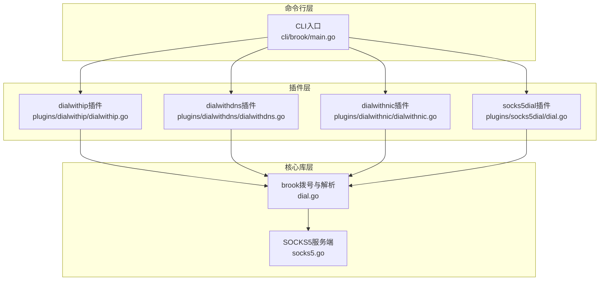
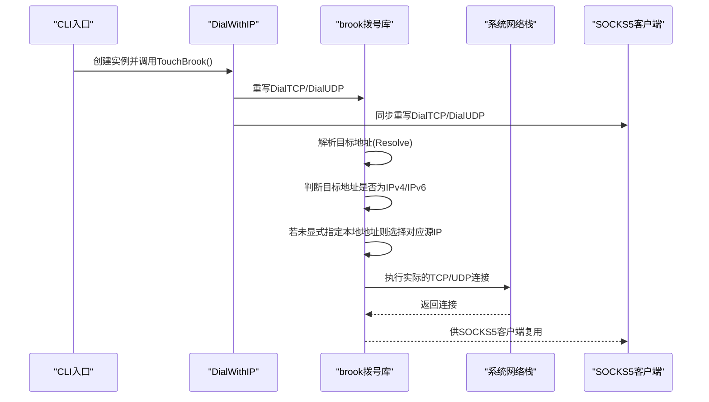
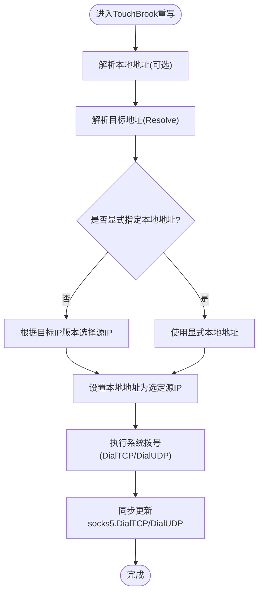
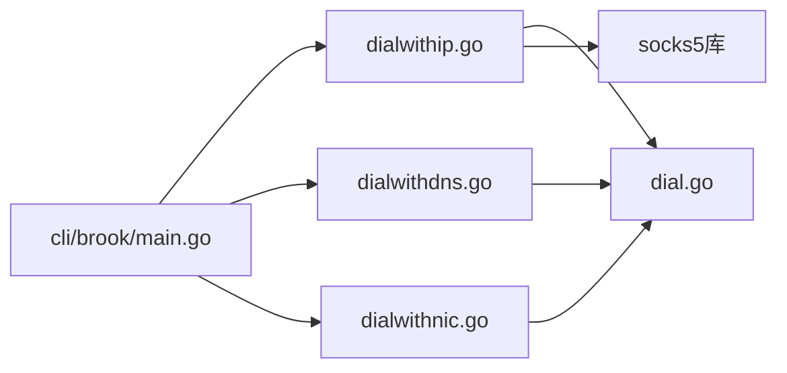

# IP地址绑定控制

<cite>
**本文引用的文件列表**
- [dialwithip.go](file://plugins/dialwithip/dialwithip.go)
- [readme.md](file://plugins/dialwithip/readme.md)
- [dial.go](file://dial.go)
- [main.go](file://cli/brook/main.go)
- [dialwithdns.go](file://plugins/dialwithdns/dialwithdns.go)
- [dialwithnic.go](file://plugins/dialwithnic/dialwithnic.go)
- [socks5.go](file://socks5.go)
- [socks5dial.go](file://plugins/socks5dial/dial.go)
</cite>

## 目录
1. [简介](#简介)
2. [项目结构](#项目结构)
3. [核心组件](#核心组件)
4. [架构总览](#架构总览)
5. [组件详解](#组件详解)
6. [依赖关系分析](#依赖关系分析)
7. [性能考量](#性能考量)
8. [故障排查指南](#故障排查指南)
9. [结论](#结论)
10. [附录](#附录)

## 简介
本文件围绕“dialWithIP”插件展开，系统性阐述其在brook中的作用与实现原理，重点覆盖：
- NewDialWithIP函数如何校验并解析IPv4/IPv6源地址参数，构建DialWithIP结构体；
- TouchBrook方法如何重写brook.DialTCP与brook.DialUDP，按目标地址IP版本自动选择预设源IP；
- 当本地地址未显式指定时，系统如何依据目标地址类型（IPv4或IPv6）匹配相应源IP；
- 多宿主主机环境下，如何通过该功能控制特定流量的出口IP；
- 与SOCKS5协议栈的集成方式及对网络连接性能的影响。

## 项目结构
dialWithIP功能位于插件目录中，核心文件包括：
- 插件实现：plugins/dialwithip/dialwithip.go
- 命令行入口：cli/brook/main.go（解析命令行参数并调用插件）
- 默认拨号与解析：brook包的dial.go（定义默认的Resolve/DialTCP/DialUDP）
- 其他对比参考插件：dialwithdns.go、dialwithnic.go（用于理解不同源地址策略）
- SOCKS5服务端：socks5.go（服务端初始化）
- SOCKS5拨号插件：plugins/socks5dial/dial.go（将拨号委托给SOCKS5客户端）

图表来源
- [main.go](file://cli/brook/main.go#L215-L239)
- [dialwithip.go](file://plugins/dialwithip/dialwithip.go#L30-L98)
- [dial.go](file://dial.go#L21-L63)
- [socks5.go](file://socks5.go#L22-L47)

章节来源
- [main.go](file://cli/brook/main.go#L80-L121)
- [dialwithip.go](file://plugins/dialwithip/dialwithip.go#L30-L98)
- [dial.go](file://dial.go#L21-L63)

## 核心组件
- DialWithIP结构体：保存预设的IPv4与IPv6源地址字段。
- NewDialWithIP函数：校验输入字符串是否为合法IP地址，并分别转换为IPv4/IPv6格式，返回DialWithIP实例。
- TouchBrook方法：重写brook.DialTCP与brook.DialUDP；在未显式指定本地地址时，依据目标地址的IP版本（IPv4/IPv6）自动选择对应源IP；同时同步更新socks5.DialTCP与socks5.DialUDP，确保SOCKS5客户端也遵循同样的规则。

章节来源
- [dialwithip.go](file://plugins/dialwithip/dialwithip.go#L25-L45)
- [dialwithip.go](file://plugins/dialwithip/dialwithip.go#L47-L98)

## 架构总览
dialWithIP通过“重写拨号函数”的方式，将默认的网络连接行为替换为带源地址约束的行为。其工作流如下：
- CLI解析命令行参数，创建DialWithIP实例；
- 调用TouchBrook后，brook.DialTCP/DialUDP被替换为带源地址选择逻辑的函数；
- 对于TCP/UDP连接，若未显式指定本地地址，则根据目标地址是IPv4还是IPv6，自动选择预设的IPv4或IPv6作为本地绑定地址；
- 同步更新socks5.DialTCP/DialUDP，使SOCKS5客户端也受控于同一源地址策略。

图表来源
- [main.go](file://cli/brook/main.go#L222-L228)
- [dialwithip.go](file://plugins/dialwithip/dialwithip.go#L47-L98)
- [dial.go](file://dial.go#L21-L63)

## 组件详解

### DialWithIP结构体与NewDialWithIP函数
- 结构体字段：IP4与IP6分别存储预设的IPv4与IPv6地址。
- 参数校验：
  - IPv4参数必须非空且能解析为有效的IPv4地址；
  - IPv6参数必须非空且能解析为有效的IPv6地址；
  - 任一参数非法时返回错误。
- 构建过程：将输入字符串解析为标准IP格式，并分别转为IPv4/IPv6形式存入结构体字段。

章节来源
- [dialwithip.go](file://plugins/dialwithip/dialwithip.go#L25-L45)

### TouchBrook方法：重写brook.DialTCP与brook.DialUDP
- 本地地址解析：若调用方传入了本地地址字符串，则先解析为具体地址对象；否则保持nil以触发后续自动选择逻辑。
- 目标地址解析：通过brook.Resolve解析目标地址，得到TCP/UDP地址对象。
- 自动选择源地址：
  - 若目标地址为IPv4且存在预设IPv4源地址，则将本地地址设置为该IPv4；
  - 若目标地址为IPv6且存在预设IPv6源地址，则将本地地址设置为该IPv6；
  - 若未显式指定本地地址且目标地址类型与预设源地址类型不匹配，则不会强制绑定，仍使用系统默认路由。
- 最终拨号：调用系统net.DialTCP/net.DialUDP完成实际连接。
- 同步更新：将brook.DialTCP/DialUDP赋值给socks5.DialTCP/DialUDP，确保SOCKS5客户端也遵循相同的源地址策略。

图表来源
- [dialwithip.go](file://plugins/dialwithip/dialwithip.go#L47-L98)
- [dial.go](file://dial.go#L21-L63)

章节来源
- [dialwithip.go](file://plugins/dialwithip/dialwithip.go#L47-L98)

### 与默认brook拨号库的关系
- 默认brook.DialTCP/DialUDP会先解析本地与目标地址，再调用系统拨号；
- dialWithIP通过重写brook.DialTCP/DialUDP，在解析阶段插入“按目标IP版本选择源地址”的逻辑；
- 这种设计使得dialWithIP与其他插件（如dialwithdns、dialwithnic）可以叠加使用：先由dialwithdns决定目标IP，再由dialWithIP决定本地绑定IP。

章节来源
- [dial.go](file://dial.go#L21-L63)
- [dialwithdns.go](file://plugins/dialwithdns/dialwithdns.go#L121-L144)

### 与SOCKS5协议栈的集成
- dialWithIP在TouchBrook中将brook.DialTCP/DialUDP赋值给socks5.DialTCP/DialUDP，从而让SOCKS5客户端在发起连接时也遵循相同的源地址策略；
- 在命令行入口中，当启用dialWithIP时，会先创建实例并调用TouchBrook，随后启动SOCKS5服务端或客户端，确保两者共享同一拨号策略；
- 该集成方式对性能影响主要体现在：
  - 每次连接前需要进行一次目标地址解析与IP版本判断；
  - 若目标地址为IPv4/IPv6且有对应源IP预设，将减少系统路由选择的不确定性，可能提升稳定性与可预测性；
  - 对于SOCKS5客户端，拨号路径会经过代理服务器，dialWithIP仅控制本地出站绑定，不改变代理链路本身。

章节来源
- [dialwithip.go](file://plugins/dialwithip/dialwithip.go#L96-L98)
- [main.go](file://cli/brook/main.go#L222-L228)
- [socks5.go](file://socks5.go#L22-L47)
- [socks5dial.go](file://plugins/socks5dial/dial.go#L38-L59)

### 多宿主主机环境下的配置示例
以下示例基于命令行参数，展示如何在多宿主主机上控制特定流量的出口IP：
- 仅指定IPv4源地址：通过命令行参数设置dialWithIP4，使所有IPv4目标的TCP/UDP连接均从该IPv4出站；
- 仅指定IPv6源地址：通过命令行参数设置dialWithIP6，使所有IPv6目标的TCP/UDP连接均从该IPv6出站；
- 同时指定IPv4与IPv6源地址：系统将根据目标地址的IP版本自动选择对应源IP，实现双栈分流；
- 未指定任何源地址：系统将使用默认路由，不强制绑定特定源IP。

章节来源
- [main.go](file://cli/brook/main.go#L88-L94)
- [main.go](file://cli/brook/main.go#L222-L228)
- [dialwithip.go](file://plugins/dialwithip/dialwithip.go#L47-L98)

## 依赖关系分析
- dialWithIP依赖brook的默认拨号与解析函数（brook.DialTCP/DialUDP、brook.Resolve），通过重写这些变量实现行为变更；
- 与dialwithdns/dialwithnic的协作：dialwithdns负责目标IP解析策略，dialwithnic负责从网卡选择源IP，dialWithIP负责在已知目标IP的情况下绑定本地源IP；
- 与SOCKS5的耦合：通过将brook.DialTCP/DialUDP赋值给socks5.DialTCP/DialUDP，确保SOCKS5客户端也受控于同一源地址策略。

图表来源
- [dialwithip.go](file://plugins/dialwithip/dialwithip.go#L47-L98)
- [dial.go](file://dial.go#L21-L63)
- [dialwithdns.go](file://plugins/dialwithdns/dialwithdns.go#L121-L144)
- [dialwithnic.go](file://plugins/dialwithnic/dialwithnic.go#L67-L124)
- [main.go](file://cli/brook/main.go#L215-L239)

章节来源
- [dialwithip.go](file://plugins/dialwithip/dialwithip.go#L47-L98)
- [dialwithdns.go](file://plugins/dialwithdns/dialwithdns.go#L121-L144)
- [dialwithnic.go](file://plugins/dialwithnic/dialwithnic.go#L67-L124)
- [main.go](file://cli/brook/main.go#L215-L239)

## 性能考量
- 额外开销：每次连接前需进行目标地址解析与IP版本判断，通常为常数级开销，对整体性能影响较小；
- 可预测性提升：在多宿主环境中，强制绑定源IP可减少路由不确定性，提高连接稳定性；
- 与SOCKS5结合：SOCKS5客户端的拨号路径会经过代理服务器，dialWithIP仅控制本地出站绑定，不改变代理链路本身，因此对代理端性能无直接影响；
- 并发场景：dialWithIP的重写函数为全局变量替换，适用于并发场景；但需注意避免与其他插件对同一变量的多次重写导致冲突。

[本节为通用性能讨论，无需列出具体文件来源]

## 故障排查指南
- 输入参数无效：
  - IPv4参数不是有效IPv4地址或为空；
  - IPv6参数不是有效IPv6地址或为空；
  - NewDialWithIP会返回错误，请检查输入格式。
- 目标地址解析失败：
  - 若brook.Resolve无法解析目标地址，将直接返回错误；
  - 请确认目标地址可解析，或考虑使用dialwithdns插件调整解析策略。
- 未绑定到期望源IP：
  - 若显式指定了本地地址，则优先使用显式地址；
  - 若目标地址与预设源IP类型不匹配（例如目标为IPv6但未设置IPv6源IP），则不会强制绑定；
  - 请检查命令行参数与目标地址类型是否一致。
- 与SOCKS5集成问题：
  - 确认TouchBrook已在启动流程中调用；
  - 确认socks5.DialTCP/DialUDP已被正确赋值；
  - 若通过SOCKS5客户端访问，注意拨号路径会经过代理服务器，dialWithIP仅控制本地出站绑定。

章节来源
- [dialwithip.go](file://plugins/dialwithip/dialwithip.go#L30-L45)
- [dialwithip.go](file://plugins/dialwithip/dialwithip.go#L47-L98)
- [dial.go](file://dial.go#L21-L63)
- [main.go](file://cli/brook/main.go#L222-L228)

## 结论
dialWithIP通过“重写拨号函数”的方式，实现了对IPv4与IPv6源地址的精确控制。其优势在于：
- 明确的输入校验与构建流程，保证源地址合法性；
- 在未显式指定本地地址时，按目标地址类型自动选择对应源IP，简化配置；
- 与SOCKS5协议栈无缝集成，统一控制本地出站绑定；
- 在多宿主环境下，能够稳定地将特定流量引导至指定出口IP，提升网络行为的可预测性与可控性。

[本节为总结性内容，无需列出具体文件来源]

## 附录
- 插件说明：dialwithip插件的作用是“以指定IP拨号”，便于在多宿主环境中控制特定流量的出口IP。

章节来源
- [readme.md](file://plugins/dialwithip/readme.md#L1-L2)