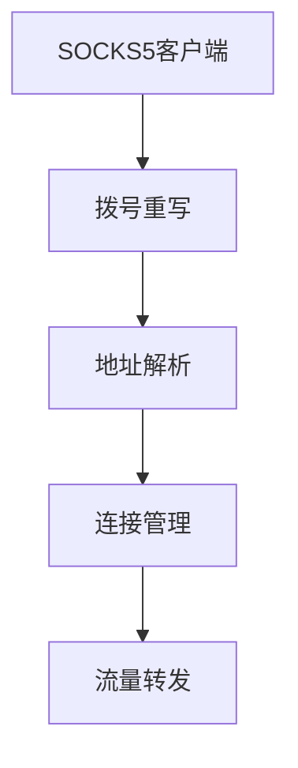
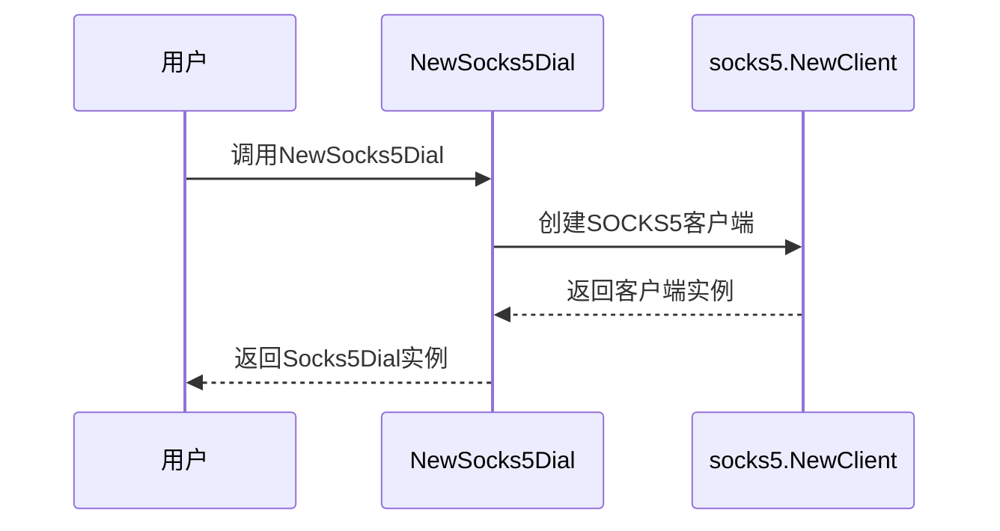
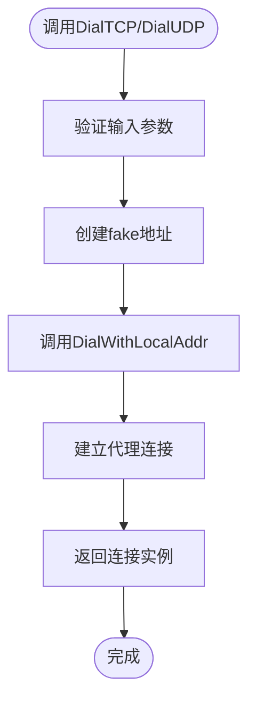
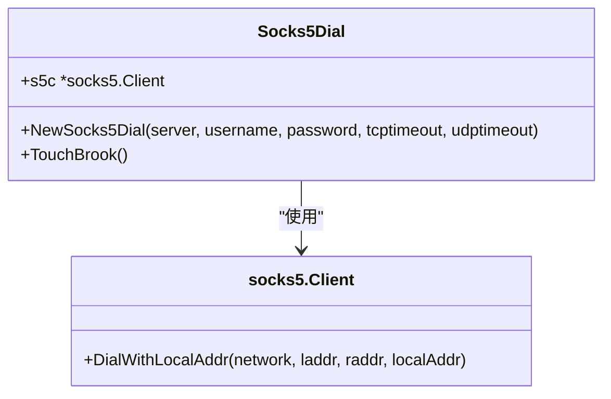
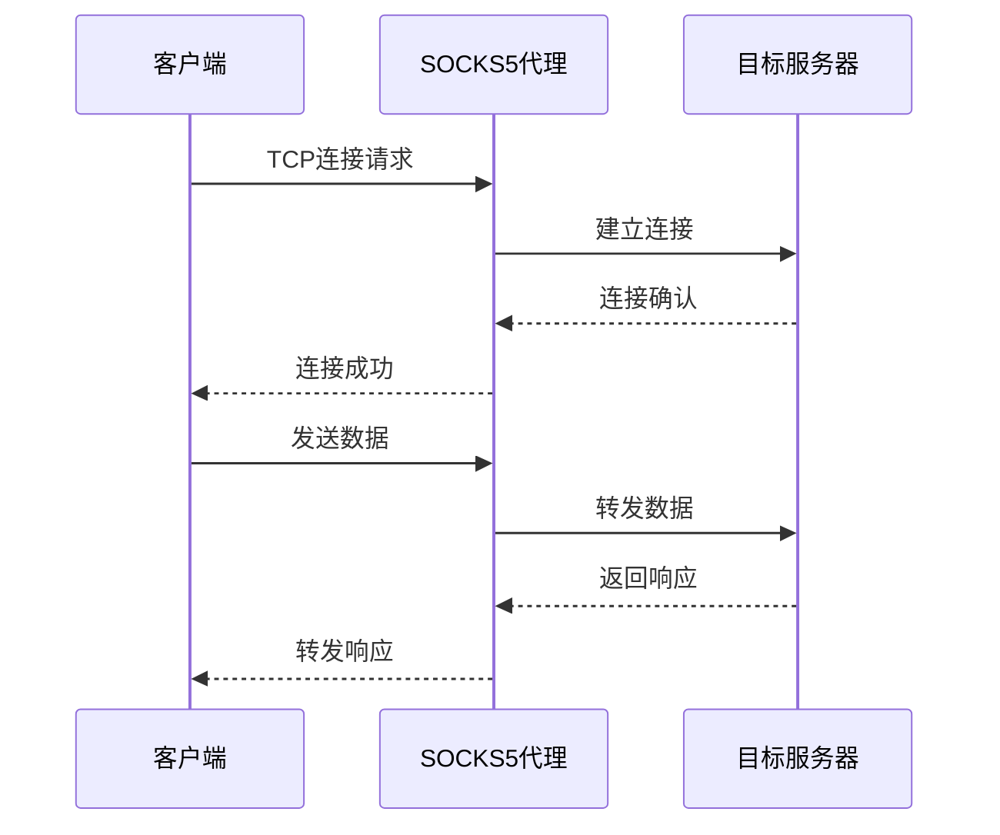
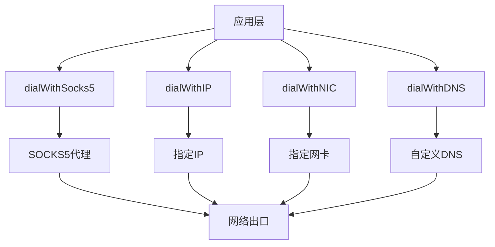
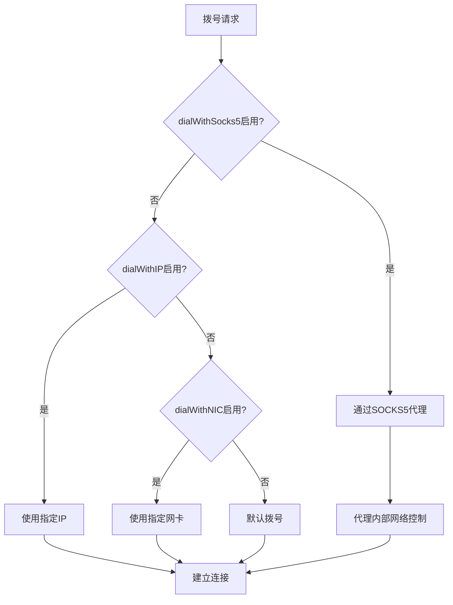

# SOCKS5代理链式连接

<cite>
**本文档引用文件**  
- [dial.go](file://dial.go#L21-L63)
- [socks5.go](file://socks5.go#L1-L47)
- [plugins/socks5dial/dial.go](file://plugins/socks5dial/dial.go#L1-L59)
- [plugins/dialwithip/dialwithip.go](file://plugins/dialwithip/dialwithip.go#L1-L98)
- [plugins/dialwithnic/dialwithnic.go](file://plugins/dialwithnic/dialwithnic.go#L1-L124)
- [plugins/dialwithdns/dialwithdns.go](file://plugins/dialwithdns/dialwithdns.go#L1-L145)
- [cli/brook/main.go](file://cli/brook/main.go#L1-L800)
- [init.go](file://init.go#L1-L22)
</cite>

## 目录
1. [简介](#简介)
2. [核心组件](#核心组件)
3. [NewSocks5Dial函数实现](#newsocks5dial函数实现)
4. [TouchBrook方法详解](#touchbrook方法详解)
5. [DialWithLocalAddr与fake地址机制](#dialwithlocaladdr与fake地址机制)
6. [TCP/UDP流量封装过程](#tcpudp流量封装过程)
7. [级联代理配置示例](#级联代理配置示例)
8. [与其他网络控制功能的兼容性](#与其他网络控制功能的兼容性)
9. [功能优先级关系](#功能优先级关系)
10. [结论](#结论)

## 简介
本文档详细介绍了Brook网络工具中dialWithSocks5功能的实现机制，重点阐述了如何通过上游SOCKS5代理建立链式连接。该功能允许将所有出站TCP/UDP连接通过指定的SOCKS5代理进行转发，实现了网络流量的多层代理穿透。文档深入分析了NewSocks5Dial函数如何创建SOCKS5客户端实例，支持认证信息和超时配置，以及TouchBrook方法如何重写brook.DialTCP和brook.DialUDP函数。同时，文档还解释了DialWithLocalAddr调用中fake地址的作用机制，以及TCP/UDP流量在代理链中的封装过程。

**Section sources**
- [plugins/socks5dial/dial.go](file://plugins/socks5dial/dial.go#L1-L59)
- [cli/brook/main.go](file://cli/brook/main.go#L1-L800)

## 核心组件
Brook的代理链式连接功能由多个核心组件协同工作实现。主要包括SOCKS5客户端、拨号重写机制、地址解析模块和网络连接管理器。这些组件共同构成了一个灵活的网络代理框架，支持多种网络控制功能的组合使用。



**Diagram sources**
- [plugins/socks5dial/dial.go](file://plugins/socks5dial/dial.go#L1-L59)
- [dial.go](file://dial.go#L21-L63)

**Section sources**
- [dial.go](file://dial.go#L21-L63)
- [socks5.go](file://socks5.go#L1-L47)

## NewSocks5Dial函数实现
NewSocks5Dial函数是创建SOCKS5代理客户端实例的核心函数。该函数接收服务器地址、用户名、密码以及TCP/UDP超时配置作为参数，返回一个Socks5Dial实例。函数内部调用socks5.NewClient创建底层SOCKS5客户端，并将其封装在Socks5Dial结构体中。



**Diagram sources**
- [plugins/socks5dial/dial.go](file://plugins/socks5dial/dial.go#L28-L36)

**Section sources**
- [plugins/socks5dial/dial.go](file://plugins/socks5dial/dial.go#L28-L36)

## TouchBrook方法详解
TouchBrook方法是实现代理链式连接的关键。该方法通过重写brook.DialTCP和brook.DialUDP函数，将所有出站连接重定向到指定的SOCKS5代理。当调用DialTCP或DialUDP时，实际执行的是通过SOCKS5代理的连接建立过程。



**Diagram sources**
- [plugins/socks5dial/dial.go](file://plugins/socks5dial/dial.go#L38-L59)

**Section sources**
- [plugins/socks5dial/dial.go](file://plugins/socks5dial/dial.go#L38-L59)

## DialWithLocalAddr与fake地址机制
DialWithLocalAddr是SOCKS5客户端提供的关键方法，用于指定本地地址进行连接。在dialWithSocks5实现中，使用了一个特殊的fake地址机制。对于TCP连接，fake地址为IPv4零地址；对于UDP连接，同样使用IPv4零地址。这种设计允许SOCKS5代理在不知道真实本地地址的情况下建立连接。



**Diagram sources**
- [plugins/socks5dial/dial.go](file://plugins/socks5dial/dial.go#L40-L47)
- [plugins/socks5dial/dial.go](file://plugins/socks5dial/dial.go#L50-L57)

**Section sources**
- [plugins/socks5dial/dial.go](file://plugins/socks5dial/dial.go#L40-L58)

## TCP/UDP流量封装过程
TCP和UDP流量在代理链中的封装过程遵循SOCKS5协议规范。对于TCP连接，流量直接通过SOCKS5代理隧道传输；对于UDP连接，首先建立UDP关联，然后通过UDP转发数据包。整个过程保持了原始连接的语义，同时实现了流量的加密和转发。



**Diagram sources**
- [plugins/socks5dial/dial.go](file://plugins/socks5dial/dial.go#L47-L58)

**Section sources**
- [plugins/socks5dial/dial.go](file://plugins/socks5dial/dial.go#L47-L58)

## 级联代理配置示例
级联代理场景的配置可以通过命令行参数实现。以下是一个典型的配置示例：

```bash
brook client \
  --server 1.2.3.4:9999 \
  --password hello \
  --socks5 127.0.0.1:1080 \
  --dialWithSocks5 10.0.0.1:1081 \
  --dialWithSocks5Username user \
  --dialWithSocks5Password pass \
  --dialWithSocks5TCPTimeout 30 \
  --dialWithSocks5UDPTimeout 60
```

此配置将创建一个客户端，其出站连接首先通过本地SOCKS5代理(10.0.0.1:1081)转发，然后再连接到主Brook服务器(1.2.3.4:9999)。

**Section sources**
- [cli/brook/main.go](file://cli/brook/main.go#L100-L119)
- [plugins/socks5dial/dial.go](file://plugins/socks5dial/dial.go#L28-L36)

## 与其他网络控制功能的兼容性
dialWithSocks5功能与其他网络控制功能具有良好的兼容性。可以与dialWithIP、dialWithNIC、dialWithDNS等功能组合使用，实现复杂的网络控制策略。例如，可以同时指定通过特定SOCKS5代理连接，并使用自定义DNS解析。



**Diagram sources**
- [cli/brook/main.go](file://cli/brook/main.go#L80-L120)
- [plugins/dialwithip/dialwithip.go](file://plugins/dialwithip/dialwithip.go#L47-L98)
- [plugins/dialwithnic/dialwithnic.go](file://plugins/dialwithnic/dialwithnic.go#L67-L124)
- [plugins/dialwithdns/dialwithdns.go](file://plugins/dialwithdns/dialwithdns.go#L121-L145)

**Section sources**
- [cli/brook/main.go](file://cli/brook/main.go#L80-L120)
- [plugins/dialwithip/dialwithip.go](file://plugins/dialwithip/dialwithip.go#L47-L98)
- [plugins/dialwithnic/dialwithnic.go](file://plugins/dialwithnic/dialwithnic.go#L67-L124)
- [plugins/dialwithdns/dialwithdns.go](file://plugins/dialwithdns/dialwithdns.go#L121-L145)

## 功能优先级关系
当多个网络控制功能同时启用时，存在明确的优先级关系。dialWithSocks5功能具有较高的优先级，会覆盖默认的拨号行为。其他功能如dialWithIP、dialWithNIC等可以在SOCKS5代理内部生效，实现更精细的网络控制。



**Diagram sources**
- [cli/brook/main.go](file://cli/brook/main.go#L233-L238)
- [plugins/socks5dial/dial.go](file://plugins/socks5dial/dial.go#L38-L59)

**Section sources**
- [cli/brook/main.go](file://cli/brook/main.go#L233-L238)
- [plugins/socks5dial/dial.go](file://plugins/socks5dial/dial.go#L38-L59)

## 结论
dialWithSocks5功能为Brook网络工具提供了强大的代理链式连接能力。通过NewSocks5Dial函数创建SOCKS5客户端实例，结合TouchBrook方法重写拨号函数，实现了将所有出站连接通过指定SOCKS5代理转发的机制。fake地址的设计巧妙地解决了本地地址绑定的问题，而DialWithLocalAddr方法则确保了连接的正确建立。该功能不仅支持基本的代理转发，还能与其他网络控制功能组合使用，实现复杂的网络架构和安全策略。

**Section sources**
- [plugins/socks5dial/dial.go](file://plugins/socks5dial/dial.go#L1-L59)
- [cli/brook/main.go](file://cli/brook/main.go#L1-L800)