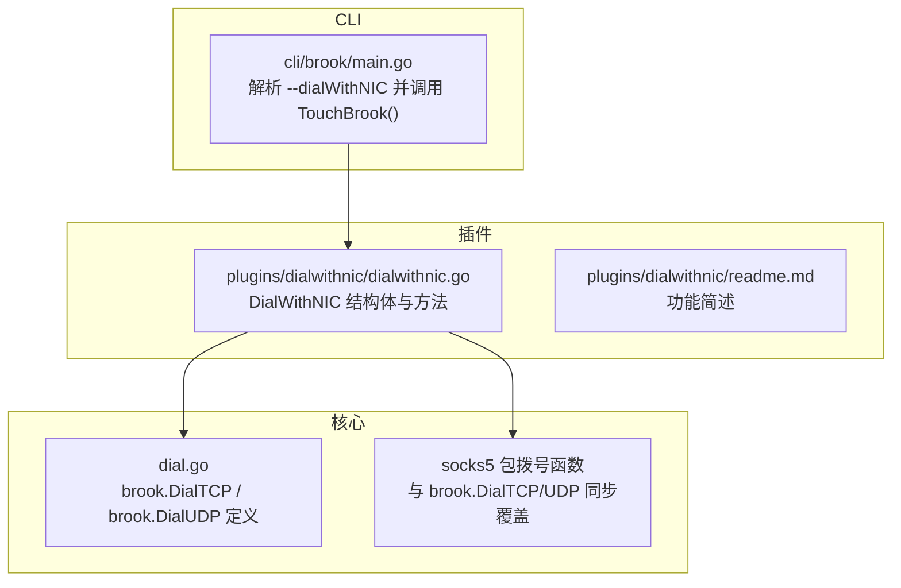
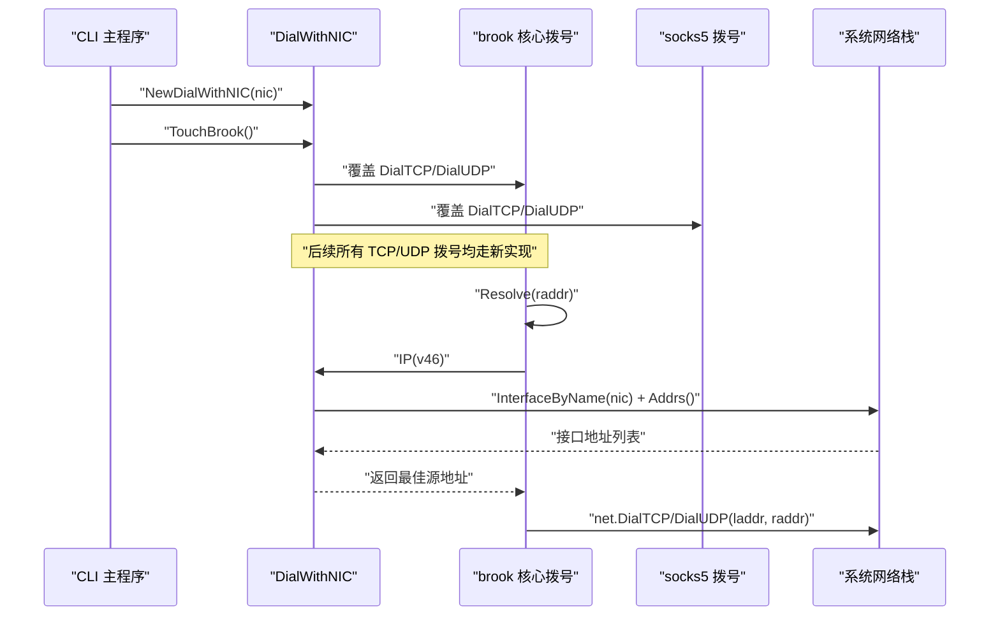
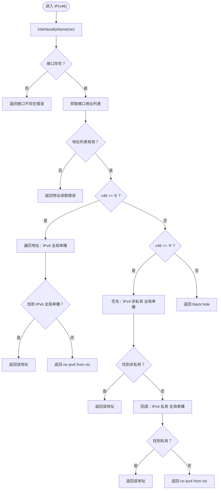
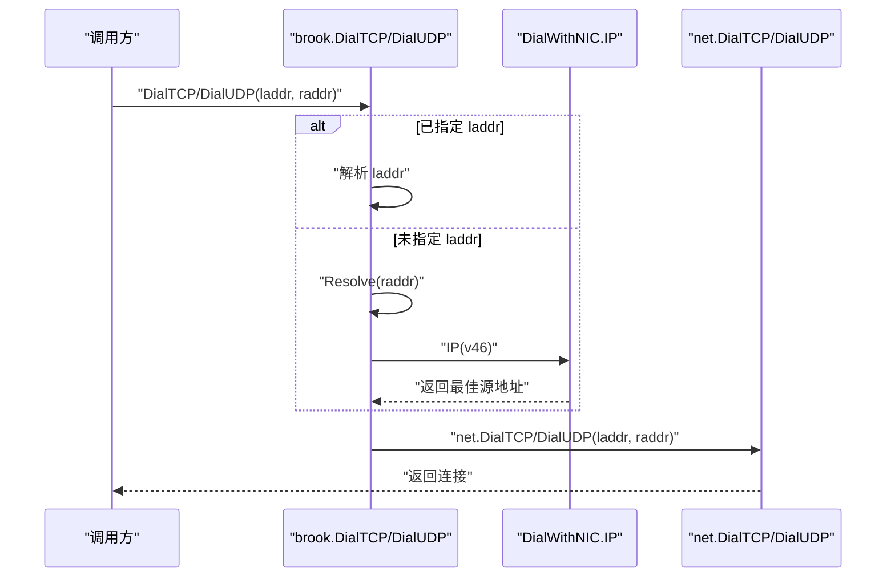
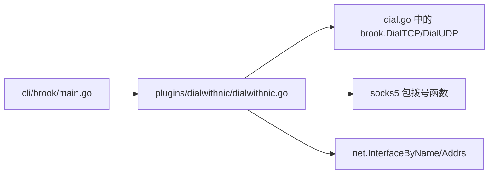

# 网络接口控制

<cite>
**本文引用的文件**
- [plugins/dialwithnic/dialwithnic.go](file://plugins/dialwithnic/dialwithnic.go)
- [plugins/dialwithnic/readme.md](file://plugins/dialwithnic/readme.md)
- [dial.go](file://dial.go)
- [cli/brook/main.go](file://cli/brook/main.go)
- [plugins/CLAUDE.md](file://plugins/CLAUDE.md)
</cite>

## 目录
1. [简介](#简介)
2. [项目结构](#项目结构)
3. [核心组件](#核心组件)
4. [架构总览](#架构总览)
5. [详细组件分析](#详细组件分析)
6. [依赖关系分析](#依赖关系分析)
7. [性能考量](#性能考量)
8. [故障排查指南](#故障排查指南)
9. [结论](#结论)
10. [附录](#附录)

## 简介
本文件围绕“基于网络接口名称的源地址自动选择”能力进行深入技术文档化，聚焦于 dialWithNIC 插件。该插件通过命令行参数指定网络接口名称，使 Brook 在建立外向连接时自动选择该接口上的最佳可用源地址（优先非私有全局单播地址），从而在多网卡或多出口场景下实现可控的流量出站路径。文档将详细解释 NewDialWithNIC 如何初始化结构体、IP 方法如何按 IPv4/IPv6 需求从接口地址列表中筛选合适地址、以及 TouchBrook 如何重写核心拨号函数以实现自动绑定。同时给出多网卡使用案例、错误处理机制与排障建议。

## 项目结构
dialWithNIC 插件位于 plugins/dialwithnic 目录，核心实现为一个结构体与两个关键方法；其与核心拨号逻辑的耦合点在于对 brook 包内 DialTCP/DialUDP 的覆盖，以及对 socks5 包拨号函数的同步覆盖。命令行入口在 CLI 主程序中解析 --dialWithNIC 参数后实例化并激活插件。

图表来源
- [cli/brook/main.go](file://cli/brook/main.go#L229-L232)
- [plugins/dialwithnic/dialwithnic.go](file://plugins/dialwithnic/dialwithnic.go#L25-L65)
- [dial.go](file://dial.go#L21-L63)

章节来源
- [plugins/dialwithnic/dialwithnic.go](file://plugins/dialwithnic/dialwithnic.go#L1-L125)
- [plugins/dialwithnic/readme.md](file://plugins/dialwithnic/readme.md#L1-L2)
- [dial.go](file://dial.go#L15-L63)
- [cli/brook/main.go](file://cli/brook/main.go#L229-L232)
- [plugins/CLAUDE.md](file://plugins/CLAUDE.md#L23-L33)

## 核心组件
- DialWithNIC 结构体：保存传入的网络接口名称 NIC。
- NewDialWithNIC：构造并返回 DialWithNIC 实例。
- IP(v46)：根据 IPv4/IPv6 需求，从指定接口的地址列表中选择合适的全局单播地址；优先非私有地址，若无则回退私有地址。
- TouchBrook()：重写 brook.DialTCP、brook.DialUDP，并同步覆盖 socks5 的拨号函数，使后续所有 TCP/UDP 拨号自动绑定到目标接口的最佳源地址。

章节来源
- [plugins/dialwithnic/dialwithnic.go](file://plugins/dialwithnic/dialwithnic.go#L25-L65)
- [plugins/dialwithnic/dialwithnic.go](file://plugins/dialwithnic/dialwithnic.go#L66-L125)

## 架构总览
dialWithNIC 通过“函数覆盖”的方式接入核心拨号流程。当用户在 CLI 中设置 --dialWithNIC 时，主程序会创建 DialWithNIC 实例并调用 TouchBrook，后者将 brook.DialTCP/DialUDP 替换为带源地址选择的新实现；同时同步覆盖 socks5 的拨号函数，确保通过 SOCKS5 通道发起的连接也遵循同一规则。

图表来源
- [cli/brook/main.go](file://cli/brook/main.go#L229-L232)
- [plugins/dialwithnic/dialwithnic.go](file://plugins/dialwithnic/dialwithnic.go#L66-L125)
- [dial.go](file://dial.go#L21-L63)

## 详细组件分析

### DialWithNIC 结构体与初始化
- 字段：NIC 保存网络接口名称（例如 eth0、wlan0、en0 等）。
- 初始化：NewDialWithNIC 接收 NIC 名称并返回结构体指针，用于后续 IP 选择与拨号覆盖。

章节来源
- [plugins/dialwithnic/dialwithnic.go](file://plugins/dialwithnic/dialwithnic.go#L25-L32)

### IP 方法：按 IPv4/IPv6 需求选择最佳源地址
- 输入：v46 字符串，"4" 表示 IPv4，"6" 表示 IPv6。
- 步骤：
  1) 通过 net.InterfaceByName 获取接口对象；
  2) 读取接口地址列表；
  3) 若 v46 为 "6"：遍历地址，优先返回 IPv6 全局单播地址；若无则报错；
  4) 若 v46 为 "4"：优先返回 IPv4 非私有全局单播地址；若无，则回退到 IPv4 私有全局单播地址；若仍无则报错；
  5) 其他情况返回“黑洞”错误。
- 选择策略：
  - IPv6 仅选全局单播且为 IPv6；
  - IPv4 优先非私有地址，其次私有地址，均满足全局单播且为 IPv4。

图表来源
- [plugins/dialwithnic/dialwithnic.go](file://plugins/dialwithnic/dialwithnic.go#L34-L65)

章节来源
- [plugins/dialwithnic/dialwithnic.go](file://plugins/dialwithnic/dialwithnic.go#L34-L65)

### TouchBrook：重写核心拨号函数
- 作用：将 brook.DialTCP、brook.DialUDP 替换为带源地址选择的新实现；同时覆盖 socks5.DialTCP、socks5.DialUDP，确保通过 SOCKS5 通道发起的连接同样受控。
- 关键逻辑：
  - 若显式设置了 laddr，则先解析为具体地址；
  - 使用 brook.Resolve 解析 raddr；
  - 若未显式设置 laddr，则根据 raddr 的 IP 版本（IPv4/IPv6）决定 v46，并调用 IP(v46) 获取最佳源地址；
  - 最终调用 net.DialTCP/UDP 完成连接。

图表来源
- [plugins/dialwithnic/dialwithnic.go](file://plugins/dialwithnic/dialwithnic.go#L66-L125)
- [dial.go](file://dial.go#L21-L63)

章节来源
- [plugins/dialwithnic/dialwithnic.go](file://plugins/dialwithnic/dialwithnic.go#L66-L125)
- [dial.go](file://dial.go#L21-L63)

### 命令行集成与使用
- CLI 主程序在解析到 --dialWithNIC 参数时，创建 DialWithNIC 实例并调用 TouchBrook，从而在整个进程生命周期内生效。
- 插件文档明确指出该插件用于“指定网络接口”。

章节来源
- [cli/brook/main.go](file://cli/brook/main.go#L95-L98)
- [cli/brook/main.go](file://cli/brook/main.go#L229-L232)
- [plugins/CLAUDE.md](file://plugins/CLAUDE.md#L23-L33)
- [plugins/dialwithnic/readme.md](file://plugins/dialwithnic/readme.md#L1-L2)

## 依赖关系分析
- 对核心拨号函数的依赖：dialWithNIC 依赖 brook 包内的 DialTCP/DialUDP 变量，通过覆盖实现“函数注入”式的插件化。
- 对网络接口 API 的依赖：通过 net.InterfaceByName 与接口 Addrs 获取地址列表。
- 对 socks5 的依赖：由于 socks5 的拨号默认使用 brook 的拨号函数，因此覆盖后 socks5 通道也会自动遵循同一规则。
- 对 CLI 的依赖：CLI 主程序负责解析命令行参数并触发插件初始化。

图表来源
- [cli/brook/main.go](file://cli/brook/main.go#L229-L232)
- [plugins/dialwithnic/dialwithnic.go](file://plugins/dialwithnic/dialwithnic.go#L66-L125)
- [dial.go](file://dial.go#L21-L63)

章节来源
- [cli/brook/main.go](file://cli/brook/main.go#L229-L232)
- [plugins/dialwithnic/dialwithnic.go](file://plugins/dialwithnic/dialwithnic.go#L66-L125)
- [dial.go](file://dial.go#L21-L63)

## 性能考量
- 接口查询与地址遍历：IP 方法在每次拨号前都会执行一次接口查询与地址遍历，属于 O(n) 操作（n 为接口地址数量）。在高并发场景下，建议尽量减少不必要的拨号次数，或在应用层复用连接。
- 选择策略开销：IPv4 优先非私有地址再回退私有地址，额外增加一次遍历；IPv6 仅需一次遍历。整体开销较小，但应避免在热路径上频繁切换 NIC。
- 缓存建议：若业务场景允许，可在应用层缓存接口地址映射，降低重复查询成本（需注意接口地址变化与刷新策略）。

## 故障排查指南
- 接口不存在
  - 现象：IP 方法返回“接口不存在”类错误。
  - 排查：确认 --dialWithNIC 传入的 NIC 名称是否正确；在目标平台列出可用接口名称进行核对。
  - 参考路径：[plugins/dialwithnic/dialwithnic.go](file://plugins/dialwithnic/dialwithnic.go#L34-L42)
- 接口无有效 IP 地址
  - 现象：IPv6 情况返回“no ipv6 from nic”，IPv4 情况返回“no ipv4 from nic”。
  - 排查：检查接口是否已配置 IPv4/IPv6 地址；确认地址类型为全局单播；若仅存在私有地址，IPv4 将回退到私有地址，但 IPv6 不会回退。
  - 参考路径：[plugins/dialwithnic/dialwithnic.go](file://plugins/dialwithnic/dialwithnic.go#L43-L65)
- 拨号失败
  - 现象：Resolve 或 net.Dial 报错。
  - 排查：确认远端地址可解析；检查网络连通性；确认目标端口可达；若通过 SOCKS5，检查代理链路。
  - 参考路径：[dial.go](file://dial.go#L21-L63)
- 多网卡场景
  - 现象：期望流量经由特定物理或虚拟接口出站。
  - 处理：使用 --dialWithNIC 指定对应接口名称；若接口同时具备 IPv4 和 IPv6 地址，将按目标地址版本自动选择相应协议的地址。
  - 参考路径：[cli/brook/main.go](file://cli/brook/main.go#L95-L98)

章节来源
- [plugins/dialwithnic/dialwithnic.go](file://plugins/dialwithnic/dialwithnic.go#L34-L65)
- [dial.go](file://dial.go#L21-L63)
- [cli/brook/main.go](file://cli/brook/main.go#L95-L98)

## 结论
dialWithNIC 插件通过“函数覆盖+接口地址选择”的方式，实现了基于网络接口名称的源地址自动选择。其设计简洁、可组合性强，既适用于单网卡场景，也能在多网卡环境下精确控制流量出站路径。结合 CLI 的参数化接入，用户可以在不修改业务代码的前提下，灵活地将流量绑定到指定接口的最佳可用地址，满足复杂网络拓扑下的差异化需求。

## 附录
- 使用建议
  - 在多网卡环境中，优先选择具备公网地址的接口作为出站 NIC，以减少 NAT 回环带来的复杂性。
  - 对于 IPv6 仅存在的网络环境，确保接口具备 IPv6 全局单播地址，否则将无法选择 IPv6 源地址。
  - 若业务需要强制 IPv4/IPv6 出站，可通过目标地址版本判断，配合插件实现精准控制。
- 相关参考
  - 插件系统与注册机制说明：[plugins/CLAUDE.md](file://plugins/CLAUDE.md#L11-L20)
  - dialWithNIC 功能定位与参数：[plugins/CLAUDE.md](file://plugins/CLAUDE.md#L23-L33)，[cli/brook/main.go](file://cli/brook/main.go#L95-L98)