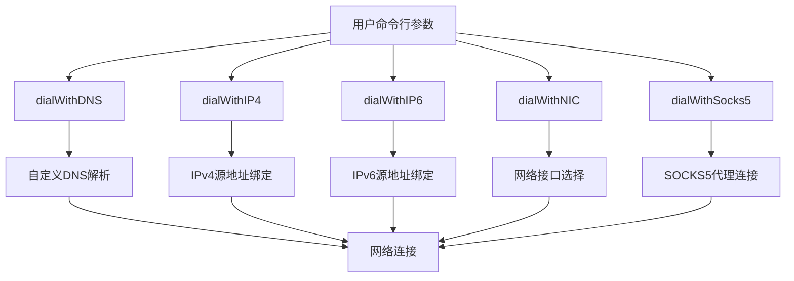
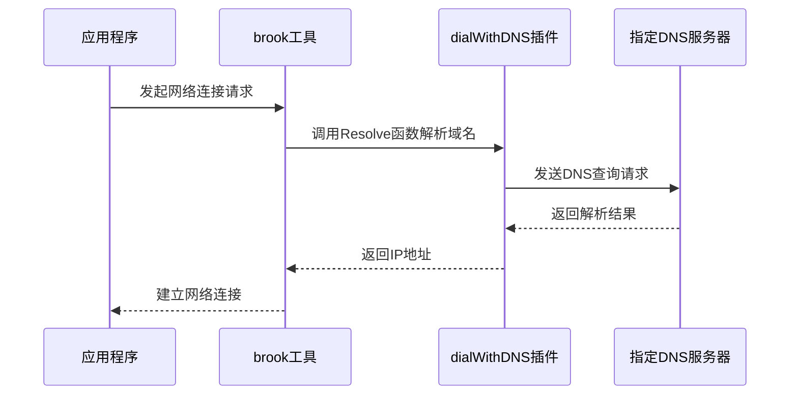
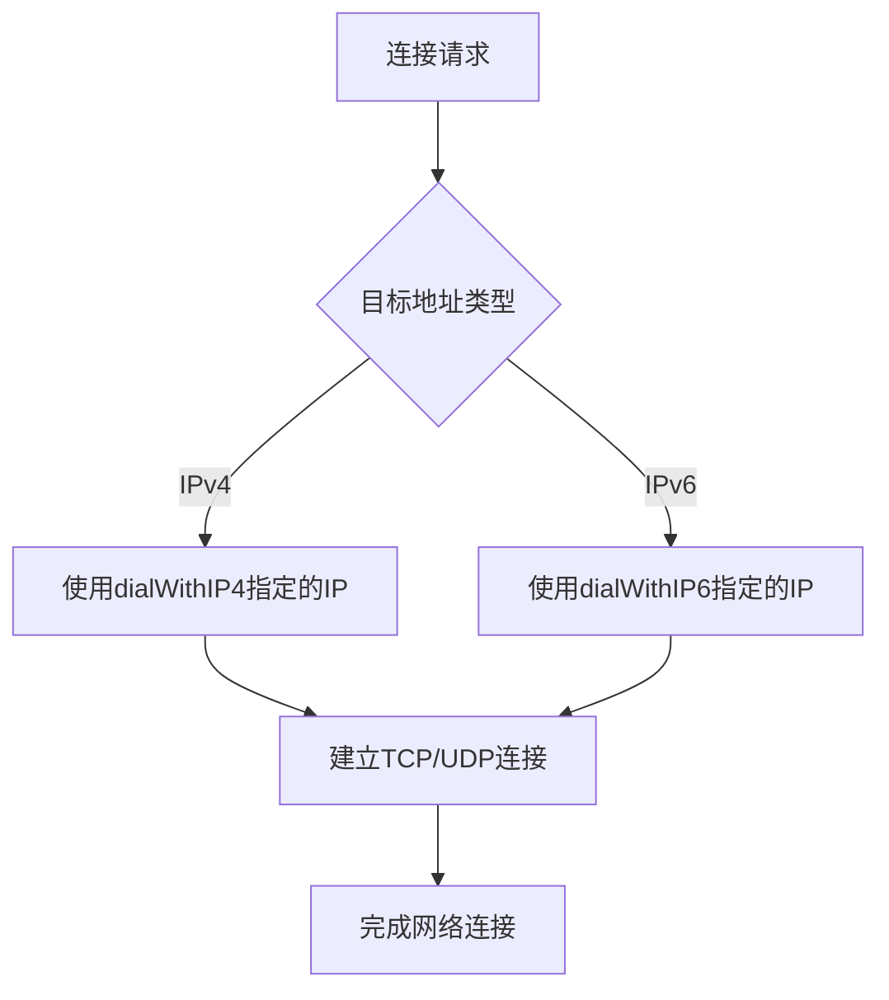
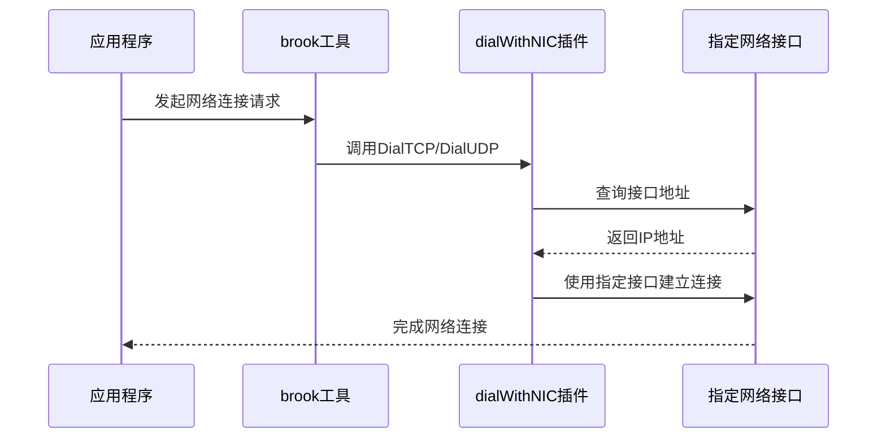
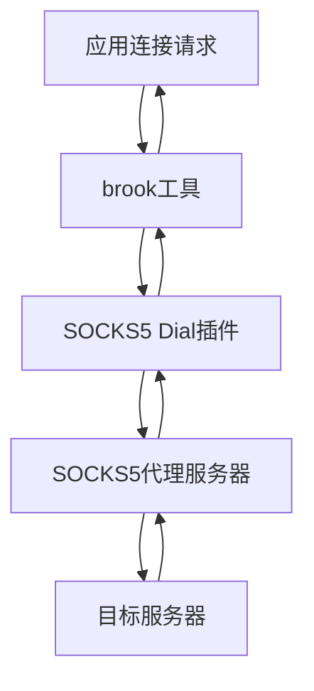
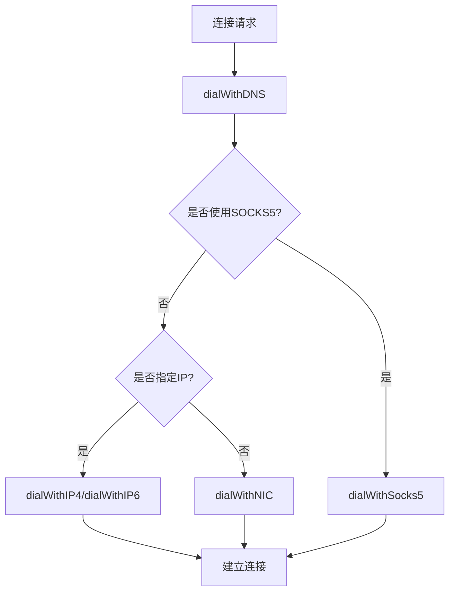
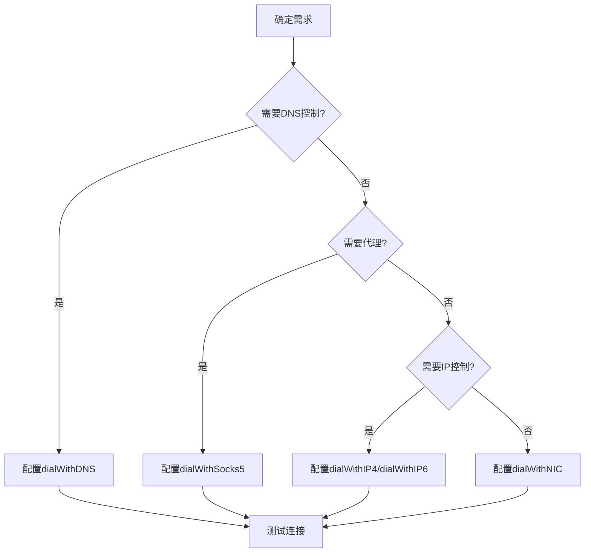

# 网络连接控制

<cite>
**本文档引用的文件**
- [main.go](file://cli/brook/main.go)
- [dialwithdns.go](file://plugins/dialwithdns/dialwithdns.go)
- [dialwithip.go](file://plugins/dialwithip/dialwithip.go)
- [dialwithnic.go](file://plugins/dialwithnic/dialwithnic.go)
- [dial.go](file://dial.go)
- [resolve.go](file://resolve.go)
- [dnsclient.go](file://dnsclient.go)
- [dohclient.go](file://dohclient.go)
- [socks5dial/dial.go](file://plugins/socks5dial/dial.go)
</cite>

## 目录
1. [引言](#引言)
2. [核心连接控制参数](#核心连接控制参数)
3. [dialWithDNS参数详解](#dialwithdns参数详解)
4. [dialWithIP4和dialWithIP6参数详解](#dialwithip4和dialwithip6参数详解)
5. [dialWithNIC参数详解](#dialwithnic参数详解)
6. [dialWithSocks5参数详解](#dialwithsocks5参数详解)
7. [参数交互与优先级](#参数交互与优先级)
8. [实际应用场景](#实际应用场景)
9. [配置最佳实践](#配置最佳实践)
10. [常见问题与解决方案](#常见问题与解决方案)

## 引言
brook工具提供了一套强大的网络连接控制参数，允许用户精细地控制网络连接行为。这些参数通过插件机制实现，可以在全局范围内影响brook的网络连接行为，包括DNS解析、IP地址绑定、网络接口选择以及通过代理建立连接等。本文档将深入分析这些核心参数的实现原理、使用方法和实际应用场景。

**Section sources**
- [main.go](file://cli/brook/main.go#L66-L124)

## 核心连接控制参数
brook提供了多个全局参数来控制网络连接行为，这些参数主要通过插件机制实现。核心参数包括：

- **dialWithDNS**: 指定域名解析时使用的DNS服务器
- **dialWithIP4**: 指定IPv4连接时使用的源IP地址
- **dialWithIP6**: 指定IPv6连接时使用的源IP地址
- **dialWithNIC**: 指定网络连接时使用的网络接口
- **dialWithSocks5**: 指定通过SOCKS5代理建立外部连接

这些参数在`main.go`文件中定义为CLI标志，并在程序启动时通过`TouchBrook()`方法激活相应的插件功能。



**Diagram sources**
- [main.go](file://cli/brook/main.go#L80-L124)

**Section sources**
- [main.go](file://cli/brook/main.go#L80-L124)

## dialWithDNS参数详解
`dialWithDNS`参数允许用户指定域名解析时使用的DNS服务器，替代系统默认的DNS解析。该参数支持两种格式：

1. 传统DNS服务器：如`8.8.8.8:53`
2. DNS over HTTPS (DoH) 服务器：如`https://dns.google/dns-query?address=8.8.8.8%3A443`

该功能通过`plugins/dialwithdns`插件实现，其核心是重写`brook.Resolve`函数，使用指定的DNS服务器进行域名解析。



**Diagram sources**
- [dialwithdns.go](file://plugins/dialwithdns/dialwithdns.go#L121-L144)
- [dnsclient.go](file://dnsclient.go)
- [dohclient.go](file://dohclient.go)

**Section sources**
- [dialwithdns.go](file://plugins/dialwithdns/dialwithdns.go)
- [main.go](file://cli/brook/main.go#L80-L86)

## dialWithIP4和dialWithIP6参数详解
`dialWithIP4`和`dialWithIP6`参数允许用户指定网络连接时使用的源IP地址。当应用程序建立外部连接时，这些参数会绑定到指定的IPv4或IPv6地址。

该功能通过`plugins/dialwithip`插件实现，其核心是重写`brook.DialTCP`和`brook.DialUDP`函数，在建立连接时指定本地地址。



**Diagram sources**
- [dialwithip.go](file://plugins/dialwithip/dialwithip.go#L47-L98)

**Section sources**
- [dialwithip.go](file://plugins/dialwithip/dialwithip.go)
- [main.go](file://cli/brook/main.go#L88-L93)

## dialWithNIC参数详解
`dialWithNIC`参数允许用户指定网络连接时使用的网络接口。该参数会自动从指定的网络接口获取合适的IP地址（IPv4或IPv6）用于建立连接。

该功能通过`plugins/dialwithnic`插件实现，其核心是重写`brook.DialTCP`和`brook.DialUDP`函数，并从指定网络接口获取IP地址。



**Diagram sources**
- [dialwithnic.go](file://plugins/dialwithnic/dialwithnic.go#L67-L124)

**Section sources**
- [dialwithnic.go](file://plugins/dialwithnic/dialwithnic.go)
- [main.go](file://cli/brook/main.go#L96-L97)

## dialWithSocks5参数详解
`dialWithSocks5`参数允许用户通过SOCKS5代理建立外部连接。该参数会重写默认的连接方式，所有外部连接都将通过指定的SOCKS5代理进行。

该功能通过`plugins/socks5dial`插件实现，其核心是重写`brook.DialTCP`和`brook.DialUDP`函数，使用SOCKS5客户端建立连接。



**Diagram sources**
- [dial.go](file://plugins/socks5dial/dial.go#L38-L59)

**Section sources**
- [dial.go](file://plugins/socks5dial/dial.go)
- [main.go](file://cli/brook/main.go#L100-L119)

## 参数交互与优先级
这些网络连接控制参数之间存在一定的交互关系和优先级。当多个参数同时使用时，它们的执行顺序和优先级如下：

1. **dialWithDNS** 优先于其他参数，因为它在连接建立前就完成了域名解析
2. **dialWithSocks5** 通常具有最高优先级，因为它会完全接管连接建立过程
3. **dialWithIP4/dialWithIP6** 和 **dialWithNIC** 互斥，通常只能使用其中一个
4. 当 **dialWithNIC** 被使用时，它会自动选择合适的IP地址，可能会影响 **dialWithIP4/dialWithIP6** 的效果



**Diagram sources**
- [main.go](file://cli/brook/main.go#L215-L239)

**Section sources**
- [main.go](file://cli/brook/main.go#L215-L239)

## 实际应用场景
### 多网卡环境下的流量控制
在具有多个网络接口的系统中，可以使用`dialWithNIC`参数将特定流量引导到指定的网络接口。

```bash
brook client --server 1.2.3.4:9999 --password hello --socks5 127.0.0.1:1080 --dialWithNIC "eth0"
```

### 通过代理访问外部网络
当需要通过SOCKS5代理访问外部网络时，可以使用`dialWithSocks5`参数。

```bash
brook client --server 1.2.3.4:9999 --password hello --socks5 127.0.0.1:1080 --dialWithSocks5 127.0.0.1:1081
```

### 特定DNS解析需求
当需要使用特定DNS服务器解析域名时，可以使用`dialWithDNS`参数。

```bash
brook client --server 1.2.3.4:9999 --password hello --socks5 127.0.0.1:1080 --dialWithDNS "8.8.8.8:53"
```

**Section sources**
- [main.go](file://cli/brook/main.go#L80-L124)

## 配置最佳实践
1. **单一用途原则**: 避免同时使用多个相互冲突的参数
2. **参数验证**: 在使用前验证参数值的有效性
3. **错误处理**: 注意处理参数配置错误时的异常情况
4. **性能考虑**: 考虑DNS解析和代理连接对性能的影响



**Diagram sources**
- [main.go](file://cli/brook/main.go#L215-L239)

**Section sources**
- [main.go](file://cli/brook/main.go#L215-L239)

## 常见问题与解决方案
### DNS解析失败
**问题**: 使用`dialWithDNS`时无法解析域名
**解决方案**: 
1. 检查指定的DNS服务器是否可达
2. 验证DNS服务器地址格式是否正确
3. 尝试使用不同的DNS服务器

### 网络接口不可用
**问题**: 使用`dialWithNIC`时指定的网络接口不存在
**解决方案**:
1. 使用`ifconfig`或`ip addr`命令确认网络接口名称
2. 检查网络接口是否处于活动状态
3. 确认是否有足够的权限访问该接口

### SOCKS5连接失败
**问题**: 使用`dialWithSocks5`时无法建立代理连接
**解决方案**:
1. 检查SOCKS5服务器地址和端口是否正确
2. 验证认证信息（用户名/密码）是否正确
3. 确认SOCKS5服务器是否正常运行

**Section sources**
- [dialwithdns.go](file://plugins/dialwithdns/dialwithdns.go)
- [dialwithip.go](file://plugins/dialwithip/dialwithip.go)
- [dialwithnic.go](file://plugins/dialwithnic/dialwithnic.go)
- [dial.go](file://plugins/socks5dial/dial.go)