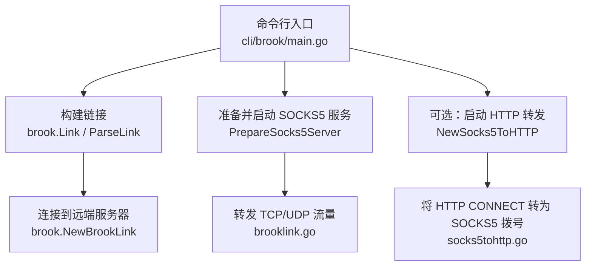
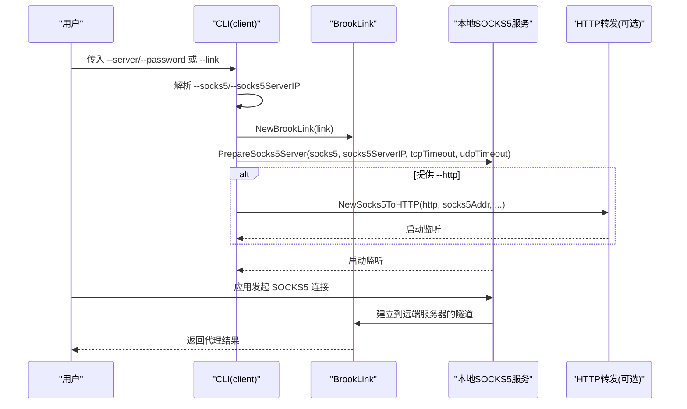
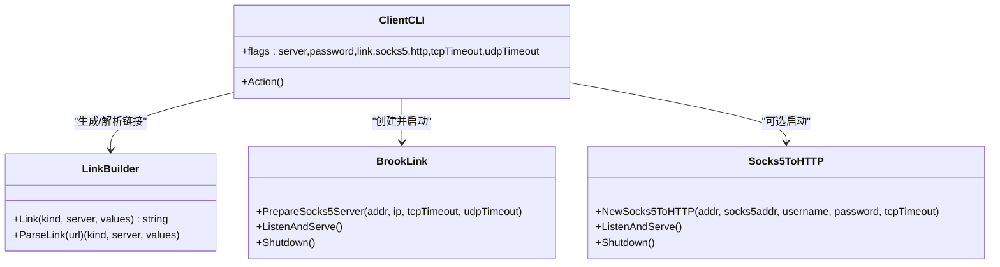

# client命令参数

<cite>
**本文引用的文件**
- [cli/brook/main.go](file://cli/brook/main.go)
- [brooklink.go](file://brooklink.go)
- [socks5tohttp.go](file://socks5tohttp.go)
- [link.go](file://link.go)
- [protocol/brook-link-protocol.md](file://protocol/brook-link-protocol.md)
- [README.md](file://README.md)
</cite>

## 目录
1. [简介](#简介)
2. [项目结构与入口](#项目结构与入口)
3. [核心组件与参数总览](#核心组件与参数总览)
4. [架构概览](#架构概览)
5. [详细参数解析](#详细参数解析)
6. [依赖关系分析](#依赖关系分析)
7. [性能与超时配置建议](#性能与超时配置建议)
8. [故障排查指南](#故障排查指南)
9. [结论](#结论)

## 简介
本文件面向使用 Brook 客户端（命令行）的用户，系统化梳理 client 子命令的参数，重点围绕以下关键参数展开：
- --server：指定 Brook 服务器地址（支持多种协议后端）
- --password：服务器密码
- --link：brook 链接字符串，可替代 --server 与 --password
- --socks5：本地 SOCKS5 代理监听地址
- --http：本地 HTTP 代理监听地址（可选）

文档将解释这些参数如何协同工作，帮助你完成从服务器连接配置到本地代理监听的完整链路搭建，并给出常见配置模式与最佳实践。

## 项目结构与入口
- client 命令在命令行入口中定义，包含参数声明与 Action 执行逻辑
- 连接建立与代理监听由 brook 包中的链接构造、SOCKS5 服务与 HTTP 转发组件共同完成
- 链接协议遵循 brook link 协议，支持多种 KIND（server、wsserver、wssserver、socks5、quicserver）

图表来源
- [cli/brook/main.go](file://cli/brook/main.go#L403-L526)
- [brooklink.go](file://brooklink.go#L54-L106)
- [socks5tohttp.go](file://socks5tohttp.go#L41-L61)

章节来源
- [cli/brook/main.go](file://cli/brook/main.go#L403-L526)

## 核心组件与参数总览
- 参数定义位置：client 子命令的 Flags 列表
- 关键参数：
  - --server/-s：目标服务器地址（如 1.2.3.4:9999）
  - --password/-p：服务器密码
  - --link：brook 链接字符串（优先于 --server/--password）
  - --socks5：本地 SOCKS5 监听地址，默认 127.0.0.1:1080
  - --socks5ServerIP：当本地监听 IP 与 SOCKS5 服务器对外可见 IP 不一致时指定
  - --http：本地 HTTP 代理监听地址（可选）
  - --tcpTimeout/--udpTimeout：TCP/UDP 超时秒数
  - --example：打印最小用法示例

章节来源
- [cli/brook/main.go](file://cli/brook/main.go#L412-L454)

## 架构概览
client 的执行流程如下：
- 若提供 --link，则直接使用；否则根据 --server 与 --password 组装链接
- 解析链接，提取 KIND 与参数，必要时更新 HKDF 信息
- 准备本地 SOCKS5 服务（含 TCP/UDP 处理）
- 可选地启动 HTTP 转发服务，将 HTTP CONNECT 请求转为 SOCKS5 拨号
- 启动主循环，接收来自本地应用的流量并通过远端服务器转发

图表来源
- [cli/brook/main.go](file://cli/brook/main.go#L455-L526)
- [brooklink.go](file://brooklink.go#L279-L312)
- [socks5tohttp.go](file://socks5tohttp.go#L41-L61)

## 详细参数解析

### --server/-s
- 作用：指定 Brook 服务器地址，格式形如 1.2.3.4:9999
- 与 --password 配合使用，用于生成内部链接
- 当同时提供 --link 时，--server 会被忽略

章节来源
- [cli/brook/main.go](file://cli/brook/main.go#L412-L454)
- [cli/brook/main.go](file://cli/brook/main.go#L460-L471)

### --password/-p
- 作用：服务器密码
- 与 --server 共同用于生成内部链接
- 当同时提供 --link 时，--password 会被忽略

章节来源
- [cli/brook/main.go](file://cli/brook/main.go#L412-L454)
- [cli/brook/main.go](file://cli/brook/main.go#L460-L471)

### --link
- 作用：brook 链接字符串，可包含 KIND（server/wsserver/wssserver/socks5/quicserver）与参数
- 优先级高于 --server/--password
- 支持通过 brook link 工具生成复杂链接，包含密码、用户名、TLS指纹、CA、UDPOverTCP/UDPOverStream 等高级选项

章节来源
- [cli/brook/main.go](file://cli/brook/main.go#L412-L454)
- [cli/brook/main.go](file://cli/brook/main.go#L460-L471)
- [link.go](file://link.go#L22-L37)
- [protocol/brook-link-protocol.md](file://protocol/brook-link-protocol.md#L1-L17)

### --socks5
- 作用：本地 SOCKS5 代理监听地址，例如 127.0.0.1:1080
- 默认值：127.0.0.1:1080
- 必须包含 IP 与端口；若仅提供端口，将触发错误提示（UDP 需要明确 IP）

章节来源
- [cli/brook/main.go](file://cli/brook/main.go#L412-L454)
- [cli/brook/main.go](file://cli/brook/main.go#L472-L481)

### --socks5ServerIP
- 作用：当本地监听 IP 与 SOCKS5 服务器对外可见 IP 不一致时，显式指定对外可见 IP
- 对 UDP 场景尤为重要（需要明确 IP）

章节来源
- [cli/brook/main.go](file://cli/brook/main.go#L412-L454)
- [cli/brook/main.go](file://cli/brook/main.go#L472-L481)

### --http
- 作用：本地 HTTP 代理监听地址（可选），将 HTTP CONNECT 请求转为 SOCKS5 拨号
- 与 --socks5 并行存在时，会额外启动一个 HTTP 转发服务

章节来源
- [cli/brook/main.go](file://cli/brook/main.go#L412-L454)
- [cli/brook/main.go](file://cli/brook/main.go#L511-L524)
- [socks5tohttp.go](file://socks5tohttp.go#L41-L61)

### --tcpTimeout/--udpTimeout
- 作用：设置 TCP/UDP 超时时间（秒）
- 0 表示不设置超时；非 0 将在连接与数据读写上设置截止时间

章节来源
- [cli/brook/main.go](file://cli/brook/main.go#L412-L454)
- [cli/brook/main.go](file://cli/brook/main.go#L499-L502)
- [socks5tohttp.go](file://socks5tohttp.go#L83-L90)

### --example
- 作用：打印最小用法示例，便于快速上手

章节来源
- [cli/brook/main.go](file://cli/brook/main.go#L412-L454)
- [cli/brook/main.go](file://cli/brook/main.go#L456-L459)

## 依赖关系分析

图表来源
- [cli/brook/main.go](file://cli/brook/main.go#L455-L526)
- [link.go](file://link.go#L22-L37)
- [brooklink.go](file://brooklink.go#L279-L312)
- [socks5tohttp.go](file://socks5tohttp.go#L41-L61)

章节来源
- [cli/brook/main.go](file://cli/brook/main.go#L455-L526)
- [link.go](file://link.go#L22-L37)
- [brooklink.go](file://brooklink.go#L279-L312)
- [socks5tohttp.go](file://socks5tohttp.go#L41-L61)

## 性能与超时配置建议
- 超时设置
  - --tcpTimeout：对 HTTP/HTTPS 等长连接场景建议设置合理超时，避免资源占用
  - --udpTimeout：UDP 场景建议适当增大，以适应网络抖动
- UDP 优化
  - 在某些平台（如 Linux/Darwin）启动 QUIC 服务器时会尝试提升 UDP 接收缓冲区大小，有助于降低丢包
- 监听地址
  - --socks5ServerIP 用于 NAT/容器等场景，确保 SOCKS5 服务器对外可见 IP 正确
- 链接参数
  - 使用 --link 可携带 UDPOverTCP/UDPOverStream 等参数，按需选择以适配不同网络环境

章节来源
- [cli/brook/main.go](file://cli/brook/main.go#L499-L502)
- [brooklink.go](file://brooklink.go#L283-L298)

## 故障排查指南
- “仅提供端口，缺少 IP”
  - 现象：启动 SOCKS5 时提示仅端口不满足 UDP 需求
  - 处理：提供完整 IP:PORT，或使用 --socks5ServerIP 指定对外可见 IP
- “重复创建 SOCKS5”
  - 现象：链接类型为 socks5 时提示不要从 socks5 再创建 socks5
  - 处理：改用 brook socks5tohttp 或直接使用现有 socks5
- “未提供 --server 或 --link”
  - 现象：缺少必要参数，显示子命令帮助
  - 处理：提供 --server 与 --password，或提供 --link
- “HTTP 头过长/无效请求”
  - 现象：HTTP 转发阶段出现请求解析错误
  - 处理：检查上游代理是否正确发送 CONNECT/GET 请求头

章节来源
- [cli/brook/main.go](file://cli/brook/main.go#L472-L481)
- [cli/brook/main.go](file://cli/brook/main.go#L492-L494)
- [cli/brook/main.go](file://cli/brook/main.go#L460-L462)
- [socks5tohttp.go](file://socks5tohttp.go#L95-L110)

## 结论
- --server 与 --password 用于传统方式构建链接；--link 提供更灵活的参数组合
- --socks5 是核心监听点，--socks5ServerIP 用于复杂网络拓扑
- --http 作为可选增强，将 HTTP CONNECT 转为 SOCKS5 拨号
- 合理设置 --tcpTimeout/--udpTimeout，结合 --link 的高级参数，可显著提升稳定性与兼容性