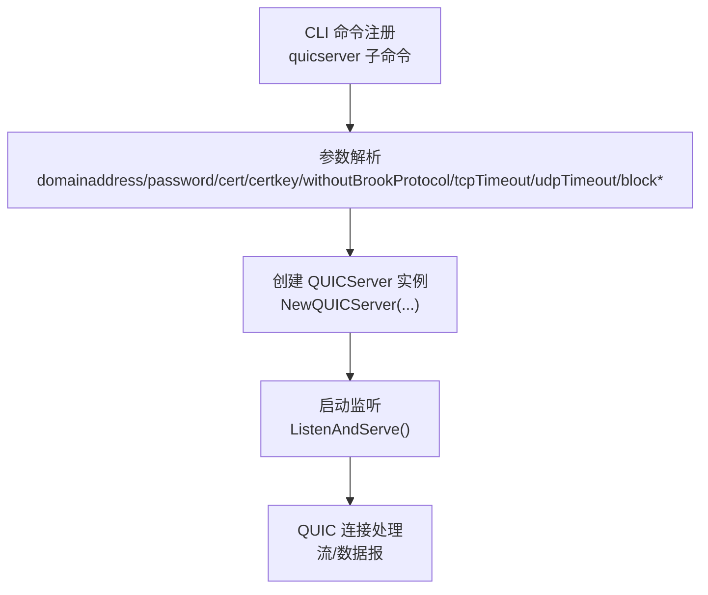
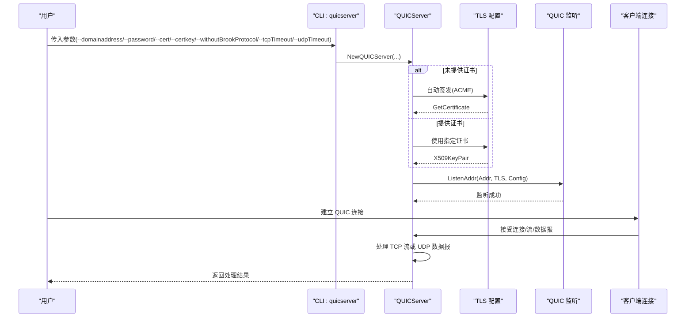
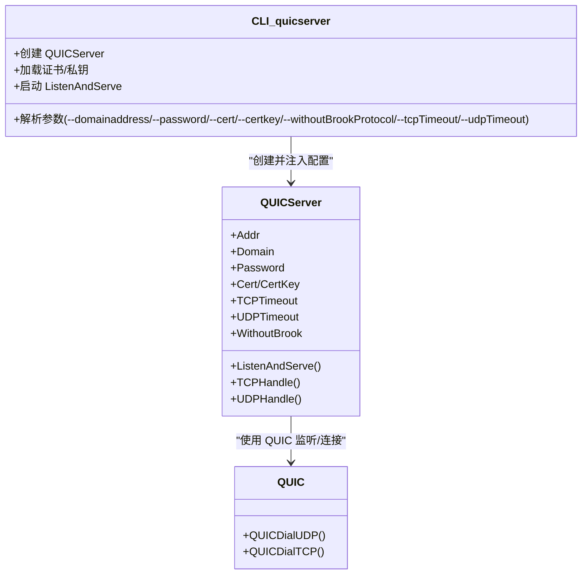

# quicserver命令参数

<cite>
**本文引用的文件**
- [cli/brook/main.go](file://cli/brook/main.go)
- [quicserver.go](file://quicserver.go)
- [quic.go](file://quic.go)
- [brook-quicserver-protocol.md](file://protocol/brook-quicserver-protocol.md)
</cite>

## 目录
1. [简介](#简介)
2. [项目结构与定位](#项目结构与定位)
3. [核心组件与职责](#核心组件与职责)
4. [架构总览](#架构总览)
5. [详细参数说明](#详细参数说明)
6. [依赖关系分析](#依赖关系分析)
7. [性能与优化建议](#性能与优化建议)
8. [故障排查指南](#故障排查指南)
9. [结论](#结论)

## 简介
本文件面向使用 Brook 的 QUIC 协议服务器（quicserver）的用户与运维人员，系统化梳理并解释该子命令的所有可用参数及其在 QUIC 服务器中的作用。内容涵盖监听地址、密码认证、TLS 证书、连接超时、无 Brook 协议模式、阻断列表等配置，并结合代码实现给出实际配置示例与最佳实践，帮助读者在不同网络环境下稳定部署与优化 QUIC 服务器。

## 项目结构与定位
- quicserver 子命令由 CLI 层负责解析参数与启动服务；具体的服务逻辑由核心模块实现。
- CLI 参数解析与服务启动位于命令注册处，服务内部通过 QUICServer 类型承载配置与运行时行为。

图表来源
- [cli/brook/main.go](file://cli/brook/main.go#L1044-L1184)
- [quicserver.go](file://quicserver.go#L47-L90)
- [quicserver.go](file://quicserver.go#L92-L139)

章节来源
- [cli/brook/main.go](file://cli/brook/main.go#L1044-L1184)

## 核心组件与职责
- QUICServer：封装 QUIC 服务器的配置与生命周期管理，负责 TLS 配置、QUIC 监听、连接接受与数据转发。
- QUIC 客户端侧相关能力：QUICDialUDP/QUICDialTCP 提供 QUIC 连接建立与读写封装，体现 QUIC 在 TCP/UDP 上的传输语义。

章节来源
- [quicserver.go](file://quicserver.go#L33-L45)
- [quicserver.go](file://quicserver.go#L47-L90)
- [quic.go](file://quic.go#L26-L99)

## 架构总览
下图展示 quicserver 启动流程与关键交互点，包括参数解析、证书加载、QUIC 监听、连接接受与数据处理。

图表来源
- [cli/brook/main.go](file://cli/brook/main.go#L1152-L1173)
- [quicserver.go](file://quicserver.go#L92-L139)
- [quicserver.go](file://quicserver.go#L119-L139)

## 详细参数说明

### 通用参数
- --example
  - 用途：打印最小用法示例后退出。
  - 典型场景：首次上手快速参考。
  - 参考路径：[示例输出逻辑](file://cli/brook/main.go#L1111-L1114)

章节来源
- [cli/brook/main.go](file://cli/brook/main.go#L1111-L1114)

### 监听与认证
- --domainaddress
  - 用途：指定域名与端口，格式如 domain.com:9999。用于自动签发证书时的域名解析验证，以及 TLS ServerName。
  - 必填性：与 --password 同时缺失将触发帮助提示。
  - 参考路径：
    - [参数校验与拆分](file://cli/brook/main.go#L1152-L1155)
    - [构造 QUICServer](file://cli/brook/main.go#L1156-L1156)
    - [TLS ServerName 使用](file://quicserver.go#L110-L118)
- --password
  - 用途：服务器密码，用于认证与派生密钥。
  - 必填性：与 --domainaddress 同时缺失将触发帮助提示。
  - 参考路径：
    - [参数校验](file://cli/brook/main.go#L1115-L1117)
    - [构造 QUICServer](file://cli/brook/main.go#L1156-L1156)
    - [WithoutBrook 模式下的密码处理](file://quicserver.go#L71-L77)

章节来源
- [cli/brook/main.go](file://cli/brook/main.go#L1115-L1117)
- [cli/brook/main.go](file://cli/brook/main.go#L1152-L1156)
- [quicserver.go](file://quicserver.go#L71-L77)
- [quicserver.go](file://quicserver.go#L110-L118)

### TLS 证书
- --cert
  - 用途：指定证书文件绝对路径。若与 --certkey 同时为空，则启用自动签发。
  - 路径要求：必须为绝对路径。
  - 参考路径：
    - [参数合法性检查](file://cli/brook/main.go#L1127-L1132)
    - [读取证书并注入到 QUICServer](file://cli/brook/main.go#L1160-L1166)
    - [TLS 配置优先级](file://quicserver.go#L112-L118)
- --certkey
  - 用途：指定私钥文件绝对路径。若与 --cert 同时为空，则启用自动签发。
  - 路径要求：必须为绝对路径。
  - 参考路径：
    - [参数合法性检查](file://cli/brook/main.go#L1127-L1132)
    - [读取私钥并注入到 QUICServer](file://cli/brook/main.go#L1167-L1173)
    - [TLS 配置优先级](file://quicserver.go#L112-L118)

章节来源
- [cli/brook/main.go](file://cli/brook/main.go#L1127-L1132)
- [cli/brook/main.go](file://cli/brook/main.go#L1160-L1173)
- [quicserver.go](file://quicserver.go#L112-L118)

### 协议模式
- --withoutBrookProtocol
  - 用途：关闭 Brook 协议加密层，直接以 QUIC 数据报承载原始流量。
  - 影响：密码将被 SHA256 处理；UDP 数据报最大长度限制为 1197 字节。
  - 参考路径：
    - [构造 QUICServer 时的 WithoutBrook 标记](file://cli/brook/main.go#L1156-L1156)
    - [WithoutBrook 模式下的密码处理](file://quicserver.go#L71-L77)
    - [数据报最大长度限制](file://protocol/brook-quicserver-protocol.md#L18-L25)

章节来源
- [cli/brook/main.go](file://cli/brook/main.go#L1156-L1156)
- [quicserver.go](file://quicserver.go#L71-L77)
- [protocol/brook-quicserver-protocol.md](file://protocol/brook-quicserver-protocol.md#L18-L25)

### 超时控制
- --tcpTimeout
  - 用途：TCP 流超时时间（秒），0 表示不设置。
  - 参考路径：
    - [参数定义](file://cli/brook/main.go#L1076-L1079)
    - [构造 QUICServer](file://cli/brook/main.go#L1156-L1156)
    - [QUIC 监听配置中的 MaxIdleTimeout](file://quicserver.go#L119-L119)
- --udpTimeout
  - 用途：UDP 数据报超时时间（秒），默认 60；用于 QUIC 连接空闲超时。
  - 参考路径：
    - [参数定义](file://cli/brook/main.go#L1080-L1084)
    - [构造 QUICServer](file://cli/brook/main.go#L1156-L1156)
    - [QUIC 监听配置中的 MaxIdleTimeout](file://quicserver.go#L119-L119)
    - [数据报写入时的最大长度限制](file://quicserver.go#L186-L190)

章节来源
- [cli/brook/main.go](file://cli/brook/main.go#L1076-L1084)
- [cli/brook/main.go](file://cli/brook/main.go#L1156-L1156)
- [quicserver.go](file://quicserver.go#L119-L119)
- [quicserver.go](file://quicserver.go#L186-L190)

### 阻断列表（全局/子命令兼容）
- --blockDomainList / --blockCIDR4List / --blockCIDR6List / --blockGeoIP / --updateListInterval
  - 用途：按域名、IPv4/IPv6 CIDR 或地理国家码阻断访问；支持定时更新。
  - 注意：这些选项在 quicserver 子命令中仍可使用，但推荐迁移到全局选项以统一管理。
  - 参考路径：
    - [参数定义（子命令）](file://cli/brook/main.go#L1085-L1104)
    - [参数合法性检查（子命令）](file://cli/brook/main.go#L1118-L1132)
    - [阻断模块初始化与周期更新](file://cli/brook/main.go#L1133-L1150)

章节来源
- [cli/brook/main.go](file://cli/brook/main.go#L1085-L1104)
- [cli/brook/main.go](file://cli/brook/main.go#L1118-L1132)
- [cli/brook/main.go](file://cli/brook/main.go#L1133-L1150)

## 依赖关系分析
- CLI 层负责参数解析与服务实例创建，随后将证书、超时、模式等配置注入 QUICServer。
- QUICServer 内部根据是否提供证书选择 ACME 自动签发或使用指定证书；同时依据 WithoutBrook 模式决定密码处理方式与数据承载形态。
- QUIC 监听配置将 udpTimeout 映射为 MaxIdleTimeout，影响连接空闲回收策略。

图表来源
- [cli/brook/main.go](file://cli/brook/main.go#L1044-L1184)
- [quicserver.go](file://quicserver.go#L33-L45)
- [quicserver.go](file://quicserver.go#L92-L139)
- [quic.go](file://quic.go#L26-L99)

章节来源
- [cli/brook/main.go](file://cli/brook/main.go#L1044-L1184)
- [quicserver.go](file://quicserver.go#L33-L45)
- [quicserver.go](file://quicserver.go#L92-L139)
- [quic.go](file://quic.go#L26-L99)

## 性能与优化建议
- UDP 最大数据报长度
  - QUIC 数据报最大长度为 1197 字节，超出将被拒绝。建议客户端/应用侧避免发送超过该阈值的数据报。
  - 参考路径：[协议说明](file://protocol/brook-quicserver-protocol.md#L18-L25)，[服务端写入限制](file://quicserver.go#L186-L190)
- 连接空闲超时
  - 将 --udpTimeout 设置为合理的秒数，确保长时间无活动的连接能及时释放资源。
  - 参考路径：[QUIC 监听配置](file://quicserver.go#L119-L119)
- 系统缓冲区与平台优化
  - 启动时会尝试提升 UDP 接收缓冲区大小，改善高并发 UDP 场景下的稳定性。
  - 参考路径：[系统限制提升](file://quicserver.go#L48-L64)
- WithoutBrook 模式
  - 关闭协议加密层可减少 CPU 开销，但需注意仅适用于可信网络环境。
  - 参考路径：[WithoutBrook 密钥处理](file://quicserver.go#L71-L77)

章节来源
- [protocol/brook-quicserver-protocol.md](file://protocol/brook-quicserver-protocol.md#L18-L25)
- [quicserver.go](file://quicserver.go#L48-L64)
- [quicserver.go](file://quicserver.go#L119-L119)
- [quicserver.go](file://quicserver.go#L186-L190)
- [quicserver.go](file://quicserver.go#L71-L77)

## 故障排查指南
- 参数缺失
  - --domainaddress 或 --password 缺失时，命令将显示帮助信息。请补齐必要参数后再启动。
  - 参考路径：[参数校验](file://cli/brook/main.go#L1115-L1117)
- 证书路径非法
  - --cert 与 --certkey 必须为绝对路径，否则会返回错误。
  - 参考路径：[路径校验](file://cli/brook/main.go#L1127-L1132)
- 证书加载失败
  - 若提供自签名证书/私钥，需确保文件可读且匹配；否则 TLS 握手会失败。
  - 参考路径：[证书加载与 TLS 配置](file://cli/brook/main.go#L1160-L1173)，[TLS 配置](file://quicserver.go#L112-L118)
- 自动签发前置条件
  - 使用自动签发时，域名需已解析到服务器 IP，且 80 端口可被 ACME 访问。
  - 参考路径：[ACME 管理器配置](file://quicserver.go#L92-L111)
- UDP 数据报过大
  - 发送超过 1197 字节的数据报会被拒绝；请分片或调整应用层负载。
  - 参考路径：[长度限制与日志](file://quicserver.go#L186-L190)，[协议说明](file://protocol/brook-quicserver-protocol.md#L18-L25)
- 连接无法建立
  - 检查防火墙/安全组放行 QUIC 端口；确认 --domainaddress 与实际监听端口一致；若使用 WithoutBrook，需保证客户端/链接同样开启相应模式。
  - 参考路径：[监听与握手](file://quicserver.go#L119-L139)

章节来源
- [cli/brook/main.go](file://cli/brook/main.go#L1115-L1117)
- [cli/brook/main.go](file://cli/brook/main.go#L1127-L1132)
- [cli/brook/main.go](file://cli/brook/main.go#L1160-L1173)
- [quicserver.go](file://quicserver.go#L92-L111)
- [quicserver.go](file://quicserver.go#L186-L190)
- [protocol/brook-quicserver-protocol.md](file://protocol/brook-quicserver-protocol.md#L18-L25)
- [quicserver.go](file://quicserver.go#L119-L139)

## 结论
- quicserver 命令提供了完整的 QUIC 服务器配置入口，覆盖监听、认证、TLS 证书、协议模式与超时控制等关键维度。
- 在生产环境中，建议明确指定证书路径或启用自动签发，并合理设置 udpTimeout 以平衡资源占用与连接稳定性。
- 对于高并发 UDP 场景，关注 1197 字节的数据报上限与系统缓冲区调优，有助于获得更佳性能与可靠性。