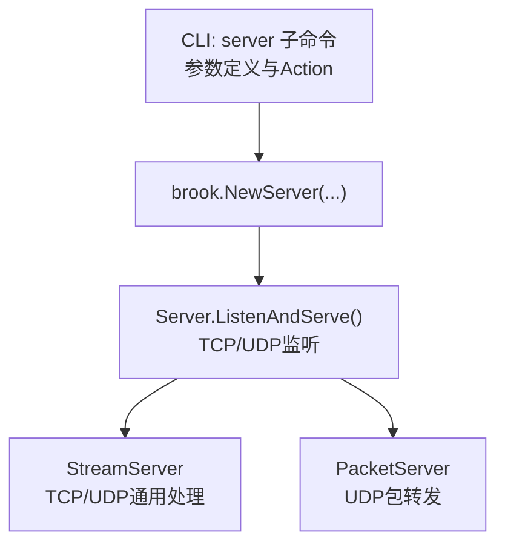
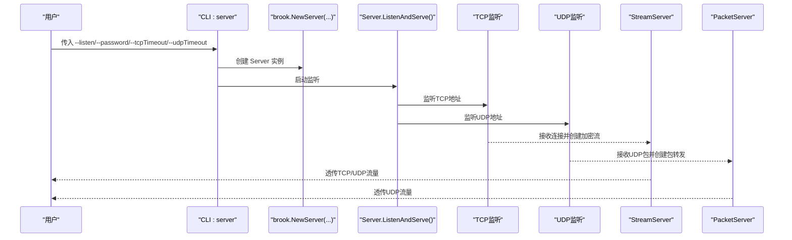
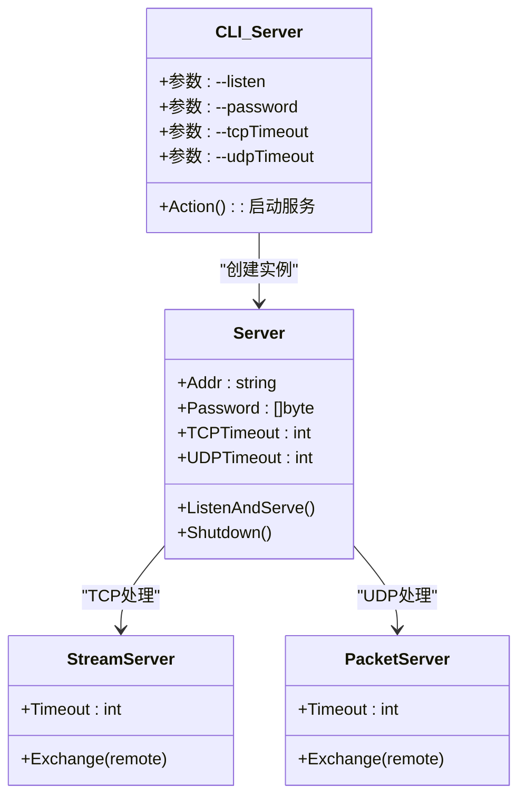

# server命令参数

<cite>
**本文引用的文件**
- [cli/brook/main.go](file://cli/brook/main.go)
- [server.go](file://server.go)
- [streamserver.go](file://streamserver.go)
- [packetserver.go](file://packetserver.go)
</cite>

## 目录
1. [简介](#简介)
2. [项目结构与入口](#项目结构与入口)
3. [核心组件与参数总览](#核心组件与参数总览)
4. [架构概览](#架构概览)
5. [详细参数解析](#详细参数解析)
6. [依赖关系分析](#依赖关系分析)
7. [性能与超时特性](#性能与超时特性)
8. [配置示例与最佳实践](#配置示例与最佳实践)
9. [故障排查指南](#故障排查指南)
10. [结论](#结论)

## 简介
本文件面向使用 Brook 的用户与运维人员，围绕 CLI 子命令“server”的参数进行系统化说明，重点覆盖以下参数：
- --listen（或 -l）：服务监听地址
- --password（或 -p）：服务端密码（用于认证与密钥派生）
- --tcpTimeout：TCP 超时控制（秒）
- --udpTimeout：UDP 超时控制（秒）

文档将解释这些参数如何共同配置一个支持 TCP/UDP 的 Brook 标准代理服务器，包括监听地址设置、密码认证、TCP/UDP 超时控制等，并给出常见配置模式与最佳实践。

## 项目结构与入口
- server 子命令定义位于 CLI 入口文件中，包含参数声明与 Action 执行逻辑。
- 实际的服务启动与协议处理由核心模块完成，包括 TCP 监听、UDP 监听、加密流与 UDP 包转发等。

图表来源
- [cli/brook/main.go](file://cli/brook/main.go#L306-L401)
- [server.go](file://server.go#L33-L138)
- [streamserver.go](file://streamserver.go#L47-L151)
- [packetserver.go](file://packetserver.go#L41-L106)

章节来源
- [cli/brook/main.go](file://cli/brook/main.go#L306-L401)

## 核心组件与参数总览
- 参数定义位置：server 子命令的 Flags 列表中，包含 --listen、--password、--tcpTimeout、--udpTimeout 等。
- 参数传递路径：CLI 解析后调用 brook.NewServer(...) 创建服务实例；随后通过 RunnerGroup 启动 TCP/UDP 监听循环。
- 关键行为：
  - --listen：决定服务监听的地址与端口。
  - --password：作为密钥材料参与 HKDF 密钥派生，用于加密通道。
  - --tcpTimeout：影响 TCP 流处理过程中的读写超时。
  - --udpTimeout：影响 UDP 处理过程中的读写超时。

章节来源
- [cli/brook/main.go](file://cli/brook/main.go#L306-L401)
- [server.go](file://server.go#L33-L138)

## 架构概览
下图展示 server 命令从参数到实际服务启动的关键流程：

图表来源
- [cli/brook/main.go](file://cli/brook/main.go#L388-L401)
- [server.go](file://server.go#L47-L138)
- [streamserver.go](file://streamserver.go#L47-L151)
- [packetserver.go](file://packetserver.go#L41-L106)

## 详细参数解析

### --listen（或 -l）
- 类型：字符串
- 作用：指定服务监听的地址与端口，例如 ":9999" 或 "0.0.0.0:9999"。
- 行为细节：
  - CLI 层面仅做参数校验与传递。
  - 服务启动时分别解析为 TCP 与 UDP 地址，分别创建监听套接字。
- 注意事项：
  - 若未设置，server 子命令会提示帮助信息。
  - 监听地址需确保系统权限允许绑定该端口。

章节来源
- [cli/brook/main.go](file://cli/brook/main.go#L306-L316)
- [server.go](file://server.go#L47-L102)

### --password（或 -p）
- 类型：字符串
- 作用：服务端密码，用于后续密钥派生与加密通道建立。
- 行为细节：
  - CLI 层面仅做参数校验与传递。
  - 服务内部将密码作为 HKDF 的输入之一，派生出客户端与服务端的会话密钥。
  - 客户端与服务端必须使用相同的密码，否则无法建立加密通道。
- 注意事项：
  - 若未设置，server 子命令会提示帮助信息。
  - 建议使用足够强度的密码以提升安全性。

章节来源
- [cli/brook/main.go](file://cli/brook/main.go#L312-L316)
- [server.go](file://server.go#L33-L45)
- [streamserver.go](file://streamserver.go#L47-L121)

### --tcpTimeout
- 类型：整数（秒），默认值 0
- 作用：控制 TCP 流处理过程中的读写超时。
- 行为细节：
  - 当设置为非 0 值时，服务在处理 TCP 连接时会为远端连接与本地连接设置截止时间。
  - 0 表示不设置超时，可能在异常情况下导致资源占用。
- 适用场景：
  - 需要限制长时间空闲连接占用资源时，建议设置合理的超时值。

章节来源
- [cli/brook/main.go](file://cli/brook/main.go#L317-L321)
- [server.go](file://server.go#L63-L81)
- [streamserver.go](file://streamserver.go#L153-L185)

### --udpTimeout
- 类型：整数（秒），默认值 60
- 作用：控制 UDP 处理过程中的读写超时。
- 行为细节：
  - 对于 UDP 流，服务会在初始化阶段将 UDP 超时赋给会话对象，后续读写均受该超时约束。
  - 默认值为 60 秒，适合大多数 UDP 应用（如 DNS、游戏等）。
- 适用场景：
  - 长连接或低频 UDP 业务可适当增大超时。
  - 高并发短连接场景可适当减小超时以释放资源。

章节来源
- [cli/brook/main.go](file://cli/brook/main.go#L322-L326)
- [server.go](file://server.go#L108-L130)
- [streamserver.go](file://streamserver.go#L92-L100)
- [packetserver.go](file://packetserver.go#L49-L105)

## 依赖关系分析
- CLI 参数 -> NewServer -> Server.ListenAndServe -> StreamServer/PacketServer
- 参数之间耦合度低，但共同影响服务行为：
  - --listen 决定监听端口，--password 决定加密通道可用性。
  - --tcpTimeout 与 --udpTimeout 分别影响 TCP/UDP 的生命周期与资源占用。

图表来源
- [cli/brook/main.go](file://cli/brook/main.go#L306-L401)
- [server.go](file://server.go#L25-L45)
- [streamserver.go](file://streamserver.go#L33-L46)
- [packetserver.go](file://packetserver.go#L31-L40)

章节来源
- [cli/brook/main.go](file://cli/brook/main.go#L306-L401)
- [server.go](file://server.go#L25-L45)

## 性能与超时特性
- 超时策略：
  - TCP：当设置 --tcpTimeout 时，服务在处理 TCP 连接时对远端与本地连接设置截止时间，避免长时间阻塞。
  - UDP：当设置 --udpTimeout 时，服务在处理 UDP 会话时对读写设置截止时间，防止僵尸会话长期占用资源。
- 默认行为：
  - --udpTimeout 默认 60 秒，适合多数 UDP 应用。
  - --tcpTimeout 默认 0，表示不强制超时，可根据部署环境调整。
- 资源管理：
  - 服务在启动时会尝试提高系统资源限制，有助于稳定高并发场景。
  - 会话结束后统一清理缓冲区与临时资源，降低内存压力。

章节来源
- [server.go](file://server.go#L33-L45)
- [server.go](file://server.go#L47-L138)
- [streamserver.go](file://streamserver.go#L153-L185)
- [packetserver.go](file://packetserver.go#L49-L105)

## 配置示例与最佳实践

- 最简示例
  - 使用默认 UDP 超时（60 秒），设置监听地址与密码即可快速启动。
  - 示例命令路径参考：[示例输出](file://cli/brook/main.go#L353-L356)

- 常见配置模式
  - 仅监听本机回环地址：适用于本地代理或测试环境。
  - 监听所有接口：适用于对外提供服务，需配合防火墙与安全策略。
  - 设置 TCP/UDP 超时：根据业务特点调整，平衡稳定性与资源占用。

- 参数组合建议
  - 低延迟短连接（如 DNS 查询）：--udpTimeout 可设为较小值（如 10-30 秒）。
  - 长连接应用（如视频通话）：--tcpTimeout 与 --udpTimeout 可适当增大。
  - 高并发短连接：建议设置 --tcpTimeout 与 --udpTimeout，避免资源泄漏。

- 安全与合规
  - 密码应足够复杂且保密，避免泄露。
  - 监听地址与端口应遵循最小暴露原则，必要时结合防火墙策略。

章节来源
- [cli/brook/main.go](file://cli/brook/main.go#L353-L356)
- [cli/brook/main.go](file://cli/brook/main.go#L317-L326)

## 故障排查指南
- 常见错误与定位
  - 未设置 --listen 或 --password：server 子命令会显示帮助信息，检查参数是否完整。
  - 监听失败（端口被占用/权限不足）：确认监听地址与系统权限，更换端口或使用更高权限运行。
  - UDP 超时导致连接中断：适当增大 --udpTimeout，或检查客户端侧网络状况。
  - TCP 超时导致连接断开：适当增大 --tcpTimeout，或检查客户端侧网络质量。
- 日志与调试
  - 可通过全局日志选项查看服务运行日志，辅助定位问题。
  - 对于 SOCKS5 相关问题，可参考相关子命令的调试方式。

章节来源
- [cli/brook/main.go](file://cli/brook/main.go#L357-L359)
- [server.go](file://server.go#L47-L138)

## 结论
- server 命令通过 --listen、--password、--tcpTimeout、--udpTimeout 四个关键参数，即可快速搭建一个支持 TCP/UDP 的 Brook 标准代理服务器。
- 参数之间相互独立但共同影响服务稳定性与资源占用，建议结合业务场景合理配置。
- 在生产环境中，建议明确监听范围、设置合适的超时值、妥善保护密码，并配合日志与监控工具进行运维。