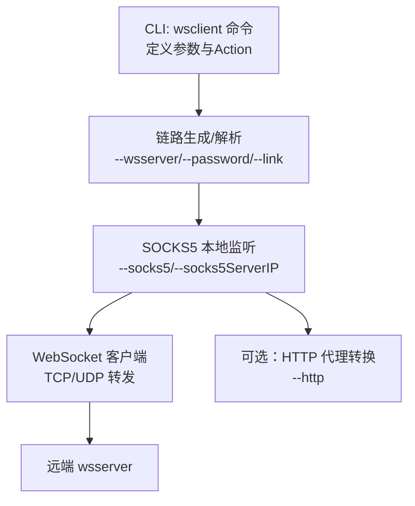
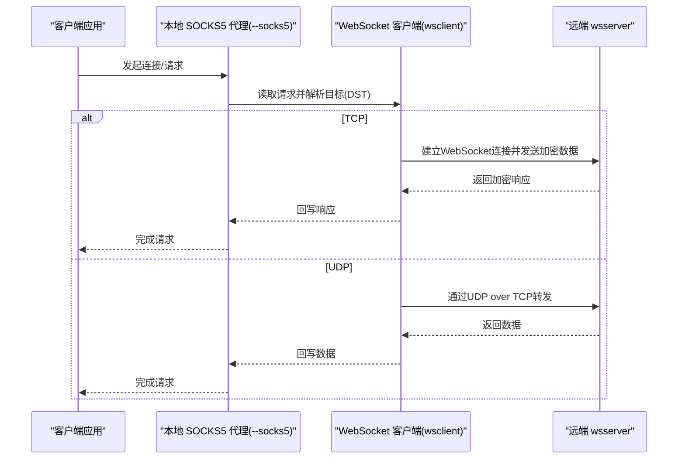
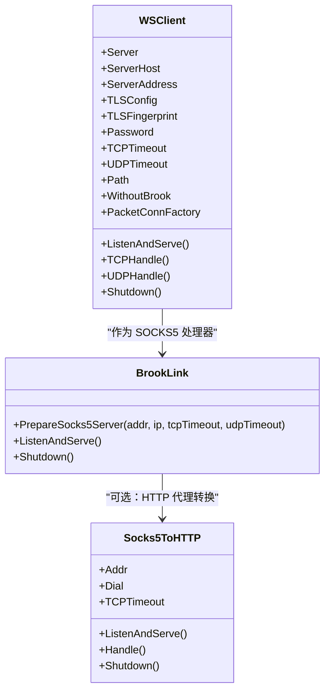

# wsclient命令参数

<cite>
**本文引用的文件**
- [cli/brook/main.go](file://cli/brook/main.go)
- [wsclient.go](file://wsclient.go)
- [brooklink.go](file://brooklink.go)
- [socks5tohttp.go](file://socks5tohttp.go)
- [protocol/brook-wsserver-protocol.md](file://protocol/brook-wsserver-protocol.md)
</cite>

## 目录
1. [简介](#简介)
2. [项目结构与入口](#项目结构与入口)
3. [核心组件与参数总览](#核心组件与参数总览)
4. [架构概览](#架构概览)
5. [详细参数说明与用法](#详细参数说明与用法)
6. [依赖关系分析](#依赖关系分析)
7. [性能与超时建议](#性能与超时建议)
8. [故障排查指南](#故障排查指南)
9. [结论](#结论)

## 简介
本文件面向使用 Brook 的 wsclient 命令的用户，系统化梳理并解释 --wsserver、--password、--link、--socks5、--http 等关键参数的作用、取值范围、默认行为以及它们在建立 WebSocket 客户端（SOCKS5 代理）过程中的协作方式。同时结合协议文档与实现代码，给出典型配置模式、最佳实践与常见问题定位思路。

## 项目结构与入口
- wsclient 子命令在 CLI 层定义了参数与 Action；其核心运行时由 Brook 链路与 WebSocket 客户端实现支撑。
- 关键位置：
  - CLI 参数与 Action：[cli/brook/main.go](file://cli/brook/main.go#L648-L771)
  - WebSocket 客户端实现：[wsclient.go](file://wsclient.go#L1-L179)
  - 链路与 SOCKS5 服务准备：[brooklink.go](file://brooklink.go#L278-L307)
  - HTTP 代理转换（可选）：[socks5tohttp.go](file://socks5tohttp.go#L1-L191)
  - 协议细节参考：[protocol/brook-wsserver-protocol.md](file://protocol/brook-wsserver-protocol.md#L1-L96)

图表来源
- [cli/brook/main.go](file://cli/brook/main.go#L648-L771)
- [wsclient.go](file://wsclient.go#L1-L179)
- [socks5tohttp.go](file://socks5tohttp.go#L1-L191)

章节来源
- [cli/brook/main.go](file://cli/brook/main.go#L648-L771)

## 核心组件与参数总览
- wsclient 子命令负责：
  - 解析 --wsserver 或 --link，构造或解析 Brook 链路；
  - 准备本地 SOCKS5 代理监听；
  - 可选地开启 HTTP 代理监听；
  - 通过 WebSocket 连接远端 wsserver，完成 TCP/UDP 流量转发。

- 关键参数（来自 CLI 定义）：
  - --wsserver/-s：目标 wsserver 地址（ws:// 或 wss://），若未指定路径则默认使用 /ws；
  - --password/-p：wsserver 密码；
  - --link：brook 链接字符串，优先级高于 --wsserver/--password；
  - --socks5：本地 SOCKS5 监听地址，默认 127.0.0.1:1080；
  - --socks5ServerIP：当本地监听 IP 与 SOCKS5 服务器对外暴露 IP 不一致时指定；
  - --http：本地 HTTP 代理监听地址（可选）；
  - --tcpTimeout：TCP 超时秒数；
  - --udpTimeout：UDP 超时秒数；
  - --example：输出最小使用示例。

章节来源
- [cli/brook/main.go](file://cli/brook/main.go#L648-L771)

## 架构概览
wsclient 的工作流包含“本地 SOCKS5 代理”、“WebSocket 客户端”和“远端 wsserver”。TCP 连接通过 WebSocket 加密通道直连，UDP 通过“UDP over TCP”机制转发。可选地将本地 SOCKS5 暴露为 HTTP 代理。

图表来源
- [wsclient.go](file://wsclient.go#L88-L174)
- [protocol/brook-wsserver-protocol.md](file://protocol/brook-wsserver-protocol.md#L34-L96)

## 详细参数说明与用法

### --wsserver/-s
- 作用：指定远端 wsserver 的地址，支持 ws:// 和 wss://。
- 默认路径：若未显式指定 URL 路径，则默认使用 /ws。
- 端口要求：不可省略端口，必须显式提供。
- 示例：
  - ws://1.2.3.4:80
  - wss://secure.example.com:443/path

章节来源
- [cli/brook/main.go](file://cli/brook/main.go#L658-L667)
- [wsclient.go](file://wsclient.go#L41-L82)

### --password/-p
- 作用：与 --wsserver 配合使用的密码，用于链路认证与加密派生。
- 注意：当使用 --link 时，该参数会被忽略。

章节来源
- [cli/brook/main.go](file://cli/brook/main.go#L663-L667)

### --link
- 作用：直接传入完整的 Brook 链接字符串，优先于 --wsserver 与 --password。
- 优势：便于一次性携带所有必要信息（含可能的 HKDF Info 等）。
- 注意：当提供 --link 时，--wsserver 与 --password 将被忽略。

章节来源
- [cli/brook/main.go](file://cli/brook/main.go#L668-L671)

### --socks5
- 作用：本地 SOCKS5 代理监听地址，供上游应用连接。
- 默认值：127.0.0.1:1080。
- 影响：决定本地代理可用性与可达性。

章节来源
- [cli/brook/main.go](file://cli/brook/main.go#L672-L676)

### --socks5ServerIP
- 作用：当本地监听 IP 与 SOCKS5 对外暴露 IP 不一致时，显式指定对外 IP。
- 必要性：UDP 会要求明确的 IP，仅端口不足够，否则会报错。

章节来源
- [cli/brook/main.go](file://cli/brook/main.go#L677-L680)
- [cli/brook/main.go](file://cli/brook/main.go#L717-L726)

### --http
- 作用：可选地开启本地 HTTP 代理监听，将本地 SOCKS5 转换为 HTTP 代理。
- 实现：内部通过 socks5tohttp 组件完成 CONNECT 与非 CONNECT 请求的双向转发。

章节来源
- [cli/brook/main.go](file://cli/brook/main.go#L682-L684)
- [socks5tohttp.go](file://socks5tohttp.go#L1-L191)

### --tcpTimeout / --udpTimeout
- 作用：控制 TCP/UDP 超时时间（秒）。0 表示不设置超时。
- 影响：影响 WebSocket 握手、数据往返与空闲连接回收。

章节来源
- [cli/brook/main.go](file://cli/brook/main.go#L685-L694)
- [wsclient.go](file://wsclient.go#L88-L174)

### --example
- 作用：打印最小使用示例，便于快速上手。

章节来源
- [cli/brook/main.go](file://cli/brook/main.go#L695-L698)

## 参数交互与典型配置模式

### 模式一：使用 --wsserver 与 --password
- 适用场景：从零构建链路，明确 wsserver 地址与密码。
- 步骤要点：
  - 提供 --wsserver（含 ws:// 或 wss://，且显式端口）；
  - 提供 --password；
  - 可选 --socks5/--socks5ServerIP/--http/--tcpTimeout/--udpTimeout。

章节来源
- [cli/brook/main.go](file://cli/brook/main.go#L700-L771)

### 模式二：使用 --link
- 适用场景：已有完整链路字符串，避免重复输入地址与密码。
- 步骤要点：
  - 提供 --link；
  - 若链路中包含 HKDF Info，将自动生效；
  - 可选 --socks5/--socks5ServerIP/--http/--tcpTimeout/--udpTimeout。

章节来源
- [cli/brook/main.go](file://cli/brook/main.go#L700-L771)

### 模式三：本地 SOCKS5 + HTTP 代理
- 适用场景：需要将 SOCKS5 暴露为 HTTP 代理给其他工具或浏览器使用。
- 步骤要点：
  - 启动 wsclient 并监听 --socks5；
  - 同时提供 --http，内部启用 socks5tohttp；
  - 通过 --socks5ServerIP 确保 UDP 场景下的正确对外 IP。

章节来源
- [cli/brook/main.go](file://cli/brook/main.go#L748-L771)
- [socks5tohttp.go](file://socks5tohttp.go#L1-L191)

### 参数相互关系与约束
- --wsserver 与 --link 互斥：提供 --link 时，--wsserver 与 --password 被忽略。
- --socks5ServerIP 与 UDP：UDP 需要明确 IP，仅端口会导致错误。
- --http 依赖 --socks5：只有先准备好 SOCKS5 监听，才能进行 HTTP 转换。

章节来源
- [cli/brook/main.go](file://cli/brook/main.go#L700-L771)
- [cli/brook/main.go](file://cli/brook/main.go#L717-L726)
- [socks5tohttp.go](file://socks5tohttp.go#L1-L191)

## 依赖关系分析

图表来源
- [wsclient.go](file://wsclient.go#L1-L179)
- [brooklink.go](file://brooklink.go#L278-L307)
- [socks5tohttp.go](file://socks5tohttp.go#L1-L191)

章节来源
- [wsclient.go](file://wsclient.go#L1-L179)
- [brooklink.go](file://brooklink.go#L278-L307)
- [socks5tohttp.go](file://socks5tohttp.go#L1-L191)

## 性能与超时建议
- 超时设置：
  - --tcpTimeout 与 --udpTimeout 控制连接与空闲回收，建议根据网络环境适当增大，避免频繁断开。
- UDP 优化：
  - 在 UDP over TCP 模式下，单包最大长度受协议限制；合理设置超时与缓冲有助于稳定性。
- TLS 与握手：
  - wss:// 会触发 TLS 握手，建议确保系统时间准确与证书链可用，避免握手失败。

章节来源
- [wsclient.go](file://wsclient.go#L88-L174)
- [protocol/brook-wsserver-protocol.md](file://protocol/brook-wsserver-protocol.md#L34-L96)

## 故障排查指南
- 报错“仅端口不足够，需要明确 IP”
  - 原因：UDP 需要明确的本地 IP。
  - 处理：使用 --socks5ServerIP 显式指定对外 IP。
- 报错“Looks like you want create socks5 from a socks5”
  - 原因：链路类型为 socks5，无法再套一层 socks5。
  - 处理：检查 --link 是否指向 socks5 类型，或改用 --wsserver/--password。
- WebSocket 握手失败（wss://）
  - 原因：证书、域名、时间或中间设备拦截。
  - 处理：确认 wss:// 域名解析、证书有效、系统时间准确；必要时更换 ws://（不推荐生产环境）。
- HTTP 代理无法访问
  - 原因：未启动 --http 或 --socks5 未就绪。
  - 处理：先确保 --socks5 成功监听，再启动 --http。

章节来源
- [cli/brook/main.go](file://cli/brook/main.go#L717-L726)
- [cli/brook/main.go](file://cli/brook/main.go#L737-L739)
- [socks5tohttp.go](file://socks5tohttp.go#L1-L191)

## 结论
wsclient 命令通过 --wsserver/--password 或 --link 快速建立到 wsserver 的 WebSocket 通道，并在本地提供 SOCKS5 代理；可选的 --http 将 SOCKS5 转换为 HTTP 代理，满足不同工具的接入需求。正确理解各参数的职责与相互关系，有助于构建稳定、可维护的代理链路。建议在生产环境中优先使用 --link 以简化配置，并结合合理的超时与日志策略提升可观测性与稳定性。